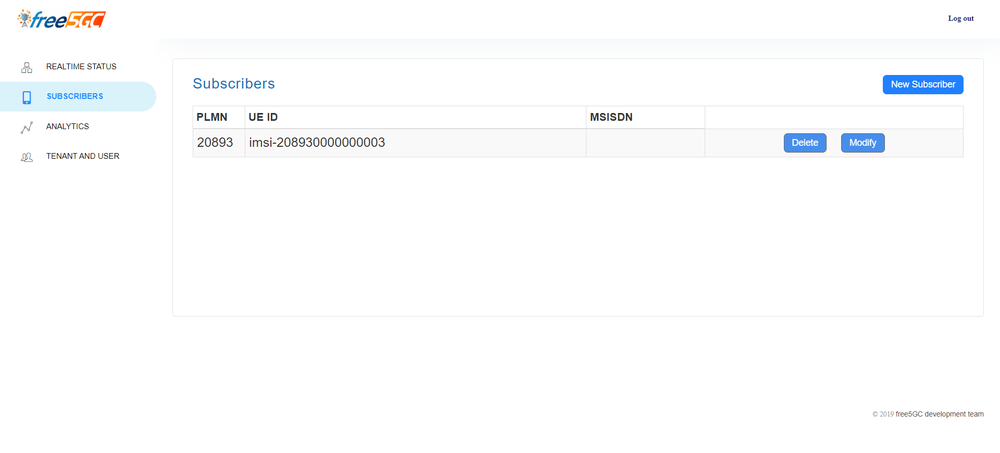

# 5G Core - The Installation of 5G Core (free5GC)

- [5G Core - The Installation of 5G Core (free5GC)](#5g-core---the-installation-of-5g-core-free5gc)
  - [1. free5GC](#1-free5gc)
    - [1.1. What is free5GC?](#11-what-is-free5gc)
    - [1.2. Installation free5GC](#12-installation-free5gc)
      - [1. Preparing Virtual Machine](#1-preparing-virtual-machine)
      - [2. Clone the VM for free5GC](#2-clone-the-vm-for-free5gc)
      - [3. Installing Tools](#3-installing-tools)
      - [4. Installing free5GC](#4-installing-free5gc)
      - [5. Installing webconsole](#5-installing-webconsole)
      - [6. Testing free5GC](#6-testing-free5gc)
      - [7. Cloning VM for UERANSIM.](#7-cloning-vm-for-ueransim)
      - [8. Installing UERANSIM](#8-installing-ueransim)
      - [9. Use WebConsole to Add an UE](#9-use-webconsole-to-add-an-ue)
      - [10. Configuring free5GC and UERANSIM](#10-configuring-free5gc-and-ueransim)
      - [11. Testing UERANSIM against free5GC](#11-testing-ueransim-against-free5gc)


## 1. free5GC


### 1.1. What is free5GC?
    
<div class="text-justify">
    
Free5GC is an open-source project for 5th generation (5G) mobile core networks that aims to implement the 5G core network (5GC) based on 3GPP R15. It is the first open-source 5G core network in the world to conform to the 3GPP Release 15 (R15). Free5GC adopts a service-based architecture (SBA) that consists of network functions (NFs) that can be categorized into control plane NFs and user plane NFs. The control plane NFs are responsible for managing the signaling and control functions of the 5GC, such as authentication, authorization, session management, policy control, mobility management, etc. The user plane NFs are responsible for handling the data forwarding functions of the 5GC, such as packet routing, forwarding, and traffic management. Free5GC has been tested with some commercial eNBs successfully, including Alpha, Compal, Nokia, Ericsson, WNC, and ITRI. It has also been tested with Spirent Landslide, which is a 5G emulator.

</div>

### 1.2. Installation free5GC
These steps can be refered in free5GC Youtube [playlist](https://www.youtube.com/playlist?list=PLeDUIabcS2_rQd3yVJrBAYb-MbcqNgjC9).
#### 1. Preparing Virtual Machine
1. In this part, we need at least 2 devices with each OS running. Here I am using 2 virtual machines (VMware) and each running Linux Ubuntu 20.04 LTS. For the installation you can search for tutorials in the internet.
2. In this example I am going to use Linux Ubuntu Server 20.04 LTS for lower end resource. You can also use multiple virtual Ubuntu Desktop if you want. Note that I use the version specifically 20.04 to avoid errors that might occur because the [documentation](https://free5gc.org/guide/1-vm-en/#31-start-installing-ubuntu) in the first step of installing free5GC, it has successfully tested in Linux Ubuntu 20.04.
3. After I have my virtual machine ongoing, we simply need to check whether we are connected to the internet or not and also whether we can check our network IP addresses. The command to check IP addresses is:
    ```bash
    sudo apt install net-tools
    ```
    and then,
    ```bash
    ifconfig
    ```
    the output will be like this:
    ```bash
    dvnezkl03-server@free5GC:~$ ifconfig
    ens33: flags=4163<UP,BROADCAST,RUNNING,MULTICAST>  mtu 1500
            inet 192.168.137.136  netmask 255.255.255.0  broadcast 192.168.137.255
            inet6 fe80::20c:29ff:fe8a:d494  prefixlen 64  scopeid 0x20<link>
            ether 00:0c:29:8a:d4:94  txqueuelen 1000  (Ethernet)
            RX packets 762  bytes 353573 (353.5 KB)
            RX errors 0  dropped 0  overruns 0  frame 0
            TX packets 151  bytes 18580 (18.5 KB)
            TX errors 0  dropped 0 overruns 0  carrier 0  collisions 0

    ens34: flags=4163<UP,BROADCAST,RUNNING,MULTICAST>  mtu 1500
            inet 192.168.65.127  netmask 255.255.255.0  broadcast 192.168.65.255
            inet6 fe80::20c:29ff:fe8a:d49e  prefixlen 64  scopeid 0x20<link>
            ether 00:0c:29:8a:d4:9e  txqueuelen 1000  (Ethernet)
            RX packets 142  bytes 13920 (13.9 KB)
            RX errors 0  dropped 0  overruns 0  frame 0
            TX packets 50  bytes 7190 (7.1 KB)
            TX errors 0  dropped 0 overruns 0  carrier 0  collisions 0

    lo: flags=73<UP,LOOPBACK,RUNNING>  mtu 65536
            inet 127.0.0.1  netmask 255.0.0.0
            inet6 ::1  prefixlen 128  scopeid 0x10<host>
            loop  txqueuelen 1000  (Local Loopback)
            RX packets 100  bytes 7852 (7.8 KB)
            RX errors 0  dropped 0  overruns 0  frame 0
            TX packets 100  bytes 7852 (7.8 KB)
            TX errors 0  dropped 0 overruns 0  carrier 0  collisions 0
    ```
    then try to check the internet connection by with the command:
    ```bash
    ping google.com
    ```
    the output will be like this:
    ```bash
    dvnezkl03-server@free5GC:~$ ping google.com
    PING google.com (142.251.10.139) 56(84) bytes of data.
    64 bytes from sd-in-f139.1e100.net (142.251.10.139): icmp_seq=1 ttl=128 time=17.1 ms
    64 bytes from sd-in-f139.1e100.net (142.251.10.139): icmp_seq=2 ttl=128 time=31.2 ms
    64 bytes from sd-in-f139.1e100.net (142.251.10.139): icmp_seq=3 ttl=128 time=22.1 ms
    64 bytes from sd-in-f139.1e100.net (142.251.10.139): icmp_seq=4 ttl=128 time=18.7 ms
    ^C
    --- google.com ping statistics ---
    4 packets transmitted, 4 received, 0% packet loss, time 3005ms
    rtt min/avg/max/mdev = 17.061/22.276/31.239/5.487 ms
    ```
    We can see that there is internet connection, after that we can also try to remote control Linux server from Windows cmd with the IP address we obtain from the Host-Only network adapter (ens34 in my case) from the output `ifconfig` command which is `192.168.65.129` and use the command:
    ```powershell
    ssh 192.168.65.129 -l dvnezkl03-server
    ```
    Output:
    ```powershell
    C:\Users\Acer>ssh 192.168.65.129 -l dvnezkl03-server
    dvnezkl03-server@192.168.65.129's password:
    Welcome to Ubuntu 20.04.6 LTS (GNU/Linux 5.4.0-169-generic x86_64)

    * Documentation:  https://help.ubuntu.com
    * Management:     https://landscape.canonical.com
    * Support:        https://ubuntu.com/pro

    System information as of Thu 25 Jan 2024 01:18:04 AM UTC

    System load:  0.19               Processes:              218
    Usage of /:   33.7% of 19.51GB   Users logged in:        1
    Memory usage: 19%                IPv4 address for ens33: 192.168.137.134
    Swap usage:   0%                 IPv4 address for ens34: 192.168.65.129


    Expanded Security Maintenance for Applications is not enabled.

    0 updates can be applied immediately.

    Enable ESM Apps to receive additional future security updates.
    See https://ubuntu.com/esm or run: sudo pro status

    New release '22.04.3 LTS' available.
    Run 'do-release-upgrade' to upgrade to it.


    Last login: Thu Jan 25 01:16:49 2024
    dvnezkl03-server@free5GC:~$
    ```
    then we can login as usual to the Linux server from windows cmd and start working from there. This also to make so that we can copy paste long commands to the terminal because in the Linux Server VM I can't copy paste from outside the VM.

    Before starting, make sure to update/upgrade applications that needed with this command:
    ```bash
    sudo apt update
    ```
    then
    ```bash
    sudo apt upgrade
    ```
4. After we done the pre-requirement, we can start installing by checking our Linux kernel version with the command:
    ```bash
    dvnezkl03-server@free5GC:~$ uname -r
    5.4.0-169-generic
    ```
#### 2. Clone the VM for free5GC
1. Clone the VM, the VM that I make in this case have 2 network adapter, one NAT (ens33) for internet connection and the other is Host-Only (ens34). Then I clone the VM with same setting. You can search how to clone an existing VM in the internet in VMware. After I cloned it, the steps to setup the VM are the same and I named it free5GC. Note that the step before I already use my cloned VM named free5GC. 
2. Change IP, in this step we need to change the IP by following these steps:
    1. Use the command:
        ```bash
        sudo nano /etc/hostname
        ```
        
        We need to change the name to free5GC (before it is dvnezkl03-server). Then ctrl+o and enter to save and then ctrl+x to exit.

    2. Use the command:
        ```bash
        sudo nano /etc/hosts
        ```
        
        Same, we need to change the name from dvnezkl03-server to free5GC.
    3. Use the command:
        ```bash
        dvnezkl03-server@free5GC:~$ cd /etc/netplan
        dvnezkl03-server@free5GC:/etc/netplan$ ls
        00-installer-config.yaml
        ```
        Then use:
        ```bash
        dvnezkl03-server@free5GC:/etc/netplan$ sudo nano 00-installer-config.yaml
        ```
        
        Change into this settings. The ens33 and ens34 might be different but if you have 2 network adapter in your VM, it should also have two parts like in the image above. Change dhcp4 in the second one to false and put ur IP address with subnet 24 like the format in the image.
        Then use the command:
        ```bash
        sudo netplan try
        sudo netplan apply
        route -n
        ```
        The settings has been applied. Restart the Linux system using:
        ```
        sudo shutdown -r now
        ```
        You should see your name in the terminal to be free5GC (mine is already free5GC in the steps above because I have already done it).
#### 3. Installing Tools
1. First, install Golang in this [website](https://go.dev/dl/) copy link address of the Linux OS installer, then paste it in this command:
```bash
cd
wget https://dl.google.com/go/go1.18.10.linux-amd64.tar.gz
ls
sudo tar -C /usr/local -zxvf go1.18.10.linux-amd64.tar.gz
```
then use the command:
```bash
mkdir -p ~/go/{bin,pkg,src}
```
then:
```bash
echo 'export GOPATH=$HOME/go' >> ~/.bashrc
echo 'export GOROOT=/usr/local/go' >> ~/.bashrc
echo 'export PATH=$PATH:$GOPATH/bin:$GOROOT/bin' >> ~/.bashrc
echo 'export GO111MODULE=auto' >> ~/.bashrc
source ~/.bashrc
```
and then check the golang version:
```bash
dvnezkl03-server@free5GC:~$ go version
go version go1.18.10 linux/amd64
```
just in case, you can update/upgrade before continue.
2. Second, install mongodb for control plane support package using this command:
```bash
sudo apt -y install mongodb wget git
```
then start to test mongodb:
```
sudo systemctl start mongodb
mongo
```
Output then exit:
```bash
MongoDB shell version v3.6.8
connecting to: mongodb://127.0.0.1:27017
Implicit session: session { "id" : UUID("5691c143-e9b7-4254-8f5a-5805f97621b3") }
MongoDB server version: 3.6.8
Server has startup warnings:
2024-01-25T00:43:36.760+0000 I STORAGE  [initandlisten]
2024-01-25T00:43:36.760+0000 I STORAGE  [initandlisten] ** WARNING: Using the XFS filesystem is strongly recommended with the WiredTiger storage engine
2024-01-25T00:43:36.760+0000 I STORAGE  [initandlisten] **          See http://dochub.mongodb.org/core/prodnotes-filesystem
2024-01-25T00:43:40.624+0000 I CONTROL  [initandlisten]
2024-01-25T00:43:40.624+0000 I CONTROL  [initandlisten] ** WARNING: Access control is not enabled for the database.
2024-01-25T00:43:40.624+0000 I CONTROL  [initandlisten] **          Read and write access to data and configuration is unrestricted.
2024-01-25T00:43:40.624+0000 I CONTROL  [initandlisten]
> exit
bye
```
3. Then install UPF using this command:
```bash
sudo apt -y install git gcc g++ cmake autoconf libtool pkg-config libmnl-dev libyaml-dev
```
4. Setup Routing

Check with command:
```bash
dvnezkl03-server@free5GC:~$ ip a
1: lo: <LOOPBACK,UP,LOWER_UP> mtu 65536 qdisc noqueue state UNKNOWN group default qlen 1000
link/loopback 00:00:00:00:00:00 brd 00:00:00:00:00:00
inet 127.0.0.1/8 scope host lo
valid_lft forever preferred_lft forever
inet6 ::1/128 scope host
valid_lft forever preferred_lft forever
2: ens33: <BROADCAST,MULTICAST,UP,LOWER_UP> mtu 1500 qdisc fq_codel state UP group default qlen 1000
link/ether 00:0c:29:4e:0f:27 brd ff:ff:ff:ff:ff:ff
inet 192.168.137.134/24 brd 192.168.137.255 scope global dynamic ens33
valid_lft 1090sec preferred_lft 1090sec
inet6 fe80::20c:29ff:fe4e:f27/64 scope link
valid_lft forever preferred_lft forever
3: ens34: <BROADCAST,MULTICAST,UP,LOWER_UP> mtu 1500 qdisc fq_codel state UP group default qlen 1000
link/ether 00:0c:29:4e:0f:31 brd ff:ff:ff:ff:ff:ff
inet 192.168.65.127/24 brd 192.168.65.255 scope global ens34
valid_lft forever preferred_lft forever
inet6 fe80::20c:29ff:fe4e:f31/64 scope link
valid_lft forever preferred_lft forever
```
Use the command:
```bash
sudo sysctl -w net.ipv4.ip_forward=1
sudo iptables -t nat -A POSTROUTING -o ens33 -j MASQUERADE
sudo iptables -A FORWARD -p tcp -m tcp --tcp-flags SYN,RST SYN -j TCPMSS --set-mss 1400
sudo systemctl stop ufw
sudo systemctl disable ufw 
```
Output:
```bash
dvnezkl03-server@free5GC:~$ sudo sysctl -w net.ipv4.ip_forward=1
[sudo] password for dvnezkl03-server:
net.ipv4.ip_forward = 1
dvnezkl03-server@free5GC:~$ sudo iptables -t nat -A POSTROUTING -o ens33 -j MASQUERADE
dvnezkl03-server@free5GC:~$ sudo iptables -A FORWARD -p tcp -m tcp --tcp-flags SYN,RST SYN -j TCPMSS --set-mss 1400
dvnezkl03-server@free5GC:~$ sudo systemctl stop ufw
dvnezkl03-server@free5GC:~$ sudo systemctl disable ufw
Synchronizing state of ufw.service with SysV service script with /lib/systemd/systemd-sysv-install.
Executing: /lib/systemd/systemd-sysv-install disable ufw
Removed /etc/systemd/system/multi-user.target.wants/ufw.service.
```
Make sure that we use the NAT network adapter which is ens33 in this case.

#### 4. Installing free5GC
1. To install Install free5GC (Control Plane Elements) latest stable build (v3.3.0), use the command:
```bash
cd ~
git clone --recursive -b v3.3.0 -j `nproc` https://github.com/free5gc/free5gc.git
```
after the installation is done, go into the directory:
```bash
cd free5gc
```
and then do this command inside the directory:
```bash
dvnezkl03-server@free5GC:~/free5gc$ make
``` 
2. Install User Plane Function (UPF) by retrieving the 5G GTP-U kernel module using git and build it
```bash
git clone -b v0.8.3 https://github.com/free5gc/gtp5g.git
cd gtp5g
make
sudo make install
```

Output will be:
```bash
dvnezkl03-server@free5GC:~$ git clone -b v0.8.3 https://github.com/free5gc/gtp5g.git
Cloning into 'gtp5g'...
remote: Enumerating objects: 753, done.
remote: Counting objects: 100% (273/273), done.
remote: Compressing objects: 100% (100/100), done.
remote: Total 753 (delta 225), reused 174 (delta 173), pack-reused 480
Receiving objects: 100% (753/753), 285.43 KiB | 5.29 MiB/s, done.
Resolving deltas: 100% (471/471), done.
Note: switching to '76665a884f61feaddd3023228f0a503ad3921779'.

You are in 'detached HEAD' state. You can look around, make experimental
changes and commit them, and you can discard any commits you make in this
state without impacting any branches by switching back to a branch.

If you want to create a new branch to retain commits you create, you may
do so (now or later) by using -c with the switch command. Example:

git switch -c <new-branch-name>

Or undo this operation with:

git switch -

Turn off this advice by setting config variable advice.detachedHead to false

dvnezkl03-server@free5GC:~/free5gc/gtp5g$ make
make -C /lib/modules/5.4.0-170-generic/build M=/home/dvnezkl03-server/free5gc/gtp5g modules
make[1]: Entering directory '/usr/src/linux-headers-5.4.0-170-generic'
CC [M]  /home/dvnezkl03-server/free5gc/gtp5g/src/gtp5g.o
CC [M]  /home/dvnezkl03-server/free5gc/gtp5g/src/log.o
CC [M]  /home/dvnezkl03-server/free5gc/gtp5g/src/util.o
CC [M]  /home/dvnezkl03-server/free5gc/gtp5g/src/gtpu/dev.o
CC [M]  /home/dvnezkl03-server/free5gc/gtp5g/src/gtpu/encap.o
CC [M]  /home/dvnezkl03-server/free5gc/gtp5g/src/gtpu/hash.o
CC [M]  /home/dvnezkl03-server/free5gc/gtp5g/src/gtpu/link.o
CC [M]  /home/dvnezkl03-server/free5gc/gtp5g/src/gtpu/net.o
CC [M]  /home/dvnezkl03-server/free5gc/gtp5g/src/gtpu/pktinfo.o
CC [M]  /home/dvnezkl03-server/free5gc/gtp5g/src/genl/genl.o
CC [M]  /home/dvnezkl03-server/free5gc/gtp5g/src/genl/genl_version.o
CC [M]  /home/dvnezkl03-server/free5gc/gtp5g/src/genl/genl_pdr.o
CC [M]  /home/dvnezkl03-server/free5gc/gtp5g/src/genl/genl_far.o
CC [M]  /home/dvnezkl03-server/free5gc/gtp5g/src/genl/genl_qer.o
CC [M]  /home/dvnezkl03-server/free5gc/gtp5g/src/genl/genl_urr.o
CC [M]  /home/dvnezkl03-server/free5gc/gtp5g/src/genl/genl_report.o
CC [M]  /home/dvnezkl03-server/free5gc/gtp5g/src/genl/genl_bar.o
CC [M]  /home/dvnezkl03-server/free5gc/gtp5g/src/pfcp/api_version.o
CC [M]  /home/dvnezkl03-server/free5gc/gtp5g/src/pfcp/pdr.o
CC [M]  /home/dvnezkl03-server/free5gc/gtp5g/src/pfcp/far.o
CC [M]  /home/dvnezkl03-server/free5gc/gtp5g/src/pfcp/qer.o
CC [M]  /home/dvnezkl03-server/free5gc/gtp5g/src/pfcp/urr.o
CC [M]  /home/dvnezkl03-server/free5gc/gtp5g/src/pfcp/bar.o
CC [M]  /home/dvnezkl03-server/free5gc/gtp5g/src/pfcp/seid.o
CC [M]  /home/dvnezkl03-server/free5gc/gtp5g/src/proc.o
LD [M]  /home/dvnezkl03-server/free5gc/gtp5g/gtp5g.o
Building modules, stage 2.
MODPOST 1 modules
CC [M]  /home/dvnezkl03-server/free5gc/gtp5g/gtp5g.mod.o
LD [M]  /home/dvnezkl03-server/free5gc/gtp5g/gtp5g.ko
make[1]: Leaving directory '/usr/src/linux-headers-5.4.0-170-generic'

dvnezkl03-server@free5GC:~/free5gc/gtp5g$ sudo make install
cp gtp5g.ko /lib/modules/5.4.0-170-generic/kernel/drivers/net
modprobe udp_tunnel
/sbin/depmod -a
modprobe gtp5g
echo "gtp5g" >> /etc/modules
```

3. Build free5GC using UPF with the command:
```bash
cd ~/free5gc
make upf
```
Output:
```bash
dvnezkl03-server@free5GC:~/free5gc$ make upf
make: Nothing to be done for 'upf'.
```

#### 5. Installing webconsole
1. Install node.js and yarn packages
```bash
sudo apt remove cmdtest
sudo apt remove yarn
curl -sS https://dl.yarnpkg.com/debian/pubkey.gpg | sudo apt-key add -
echo "deb https://dl.yarnpkg.com/debian/ stable main" | sudo tee /etc/apt/sources.list.d/yarn.list
sudo apt update
sudo apt install -y nodejs yarn
```
Output:
```bash
dvnezkl03-server@free5GC:~/free5gc$ sudo apt remove cmdtest
Reading package lists... Done
Building dependency tree
Reading state information... Done
Package 'cmdtest' is not installed, so not removed
0 upgraded, 0 newly installed, 0 to remove and 0 not upgraded.
dvnezkl03-server@free5GC:~/free5gc$ sudo apt remove yarn
Reading package lists... Done
Building dependency tree
Reading state information... Done
Note, selecting 'cmdtest' instead of 'yarn'
0 upgraded, 0 newly installed, 0 to remove and 0 not upgraded.
dvnezkl03-server@free5GC:~/free5gc$ curl -sS https://dl.yarnpkg.com/debian/pubkey.gpg | sudo apt-key add -
OK
dvnezkl03-server@free5GC:~/free5gc$ echo "deb https://dl.yarnpkg.com/debian/ stable main" | sudo tee /etc/apt/sources.list.d/yarn.list
deb https://dl.yarnpkg.com/debian/ stable main
dvnezkl03-server@free5GC:~/free5gc$ sudo apt update
Hit:1 http://id.archive.ubuntu.com/ubuntu focal InRelease
Get:2 http://id.archive.ubuntu.com/ubuntu focal-updates InRelease [114 kB]
Get:3 https://dl.yarnpkg.com/debian stable InRelease [17.1 kB]
Hit:4 http://id.archive.ubuntu.com/ubuntu focal-backports InRelease
Get:5 http://security.ubuntu.com/ubuntu focal-security InRelease [114 kB]
Get:6 https://dl.yarnpkg.com/debian stable/main amd64 Packages [10.9 kB]
Get:7 https://dl.yarnpkg.com/debian stable/main all Packages [10.9 kB]
Get:8 http://id.archive.ubuntu.com/ubuntu focal-updates/main amd64 Packages [3,054 kB]
Get:9 http://id.archive.ubuntu.com/ubuntu focal-updates/universe amd64 Packages [1,156 kB]
Get:10 http://security.ubuntu.com/ubuntu focal-security/main amd64 Packages [2,653 kB]
Get:11 http://security.ubuntu.com/ubuntu focal-security/main Translation-en [406 kB]
Get:12 http://security.ubuntu.com/ubuntu focal-security/restricted amd64 Packages [2,471 kB]
Get:13 http://security.ubuntu.com/ubuntu focal-security/restricted Translation-en [345 kB]
Get:14 http://security.ubuntu.com/ubuntu focal-security/universe amd64 Packages [930 kB]
Get:15 http://security.ubuntu.com/ubuntu focal-security/universe Translation-en [196 kB]
Fetched 11.5 MB in 3s (3,645 kB/s)
Reading package lists... Done
Building dependency tree
Reading state information... Done
All packages are up to date.
dvnezkl03-server@free5GC:~/free5gc$ sudo apt install -y nodejs yarn
Reading package lists... Done
Building dependency tree
Reading state information... Done
The following additional packages will be installed:
  libc-ares2 libnode64 nodejs-doc
Suggested packages:
  npm
The following NEW packages will be installed:
  libc-ares2 libnode64 nodejs nodejs-doc yarn
0 upgraded, 5 newly installed, 0 to remove and 0 not upgraded.
Need to get 7,699 kB of archives.
After this operation, 36.1 MB of additional disk space will be used.
Get:1 http://id.archive.ubuntu.com/ubuntu focal-updates/main amd64 libc-ares2 amd64 1.15.0-1ubuntu0.4 [36.9 kB]
Get:2 https://dl.yarnpkg.com/debian stable/main amd64 yarn all 1.22.19-1 [893 kB]
Get:3 http://id.archive.ubuntu.com/ubuntu focal-updates/universe amd64 libnode64 amd64 10.19.0~dfsg-3ubuntu1.3 [5,766 kB]
Get:4 http://id.archive.ubuntu.com/ubuntu focal-updates/universe amd64 nodejs-doc all 10.19.0~dfsg-3ubuntu1.3 [943 kB]
Get:5 http://id.archive.ubuntu.com/ubuntu focal-updates/universe amd64 nodejs amd64 10.19.0~dfsg-3ubuntu1.3 [61.4 kB]
Fetched 7,699 kB in 1s (13.1 MB/s)
Selecting previously unselected package libc-ares2:amd64.
(Reading database ... 117433 files and directories currently installed.)
Preparing to unpack .../libc-ares2_1.15.0-1ubuntu0.4_amd64.deb ...
Unpacking libc-ares2:amd64 (1.15.0-1ubuntu0.4) ...
Selecting previously unselected package libnode64:amd64.
Preparing to unpack .../libnode64_10.19.0~dfsg-3ubuntu1.3_amd64.deb ...
Unpacking libnode64:amd64 (10.19.0~dfsg-3ubuntu1.3) ...
Selecting previously unselected package nodejs-doc.
Preparing to unpack .../nodejs-doc_10.19.0~dfsg-3ubuntu1.3_all.deb ...
Unpacking nodejs-doc (10.19.0~dfsg-3ubuntu1.3) ...
Selecting previously unselected package yarn.
Preparing to unpack .../yarn_1.22.19-1_all.deb ...
Unpacking yarn (1.22.19-1) ...
Selecting previously unselected package nodejs.
Preparing to unpack .../nodejs_10.19.0~dfsg-3ubuntu1.3_amd64.deb ...
Unpacking nodejs (10.19.0~dfsg-3ubuntu1.3) ...
Setting up libc-ares2:amd64 (1.15.0-1ubuntu0.4) ...
Setting up libnode64:amd64 (10.19.0~dfsg-3ubuntu1.3) ...
Setting up nodejs-doc (10.19.0~dfsg-3ubuntu1.3) ...
Setting up yarn (1.22.19-1) ...
Setting up nodejs (10.19.0~dfsg-3ubuntu1.3) ...
update-alternatives: using /usr/bin/nodejs to provide /usr/bin/js (js) in auto mode
Processing triggers for libc-bin (2.31-0ubuntu9.14) ...
Processing triggers for man-db (2.9.1-1) ...
```
Note: Node.js here is v10.19.0 which not supported, to update do this: (installing using node version manager)
```bash
curl -o- https://raw.githubusercontent.com/nvm-sh/nvm/v0.39.3/install.sh
curl -o- https://raw.githubusercontent.com/nvm-sh/nvm/v0.39.3/install.sh | bash
source ~/.bashrc
nvm list-remote
nvm install v16.20.2
nvm list
```
Output:
```bash
dvnezkl03-server@free5GC:~/free5gc$ nvm install v16.20.2
Downloading and installing node v16.20.2...
Downloading https://nodejs.org/dist/v16.20.2/node-v16.20.2-linux-x64.tar.xz...
Computing checksum with sha256sum
Checksums matched!
Now using node v16.20.2 (npm v8.19.4)
Creating default alias: default -> v16.20.2

dvnezkl03-server@free5GC:~/free5gc$ nvm list
->     v16.20.2
         system
default -> v16.20.2
iojs -> N/A (default)
unstable -> N/A (default)
node -> stable (-> v16.20.2) (default)
stable -> 16.20 (-> v16.20.2) (default)
lts/* -> lts/iron (-> N/A)
lts/argon -> v4.9.1 (-> N/A)
lts/boron -> v6.17.1 (-> N/A)
lts/carbon -> v8.17.0 (-> N/A)
lts/dubnium -> v10.24.1 (-> N/A)
lts/erbium -> v12.22.12 (-> N/A)
lts/fermium -> v14.21.3 (-> N/A)
lts/gallium -> v16.20.2
lts/hydrogen -> v18.19.0 (-> N/A)
lts/iron -> v20.11.0 (-> N/A)
```
2. Build WebConsole with the command:
```bash
cd ~/free5gc
make webconsole
```
Output:
```bash
dvnezkl03-server@free5GC:~/free5gc$ make webconsole
Start building webconsole....
cd webconsole/frontend && \
yarn install && \
yarn build && \
rm -rf ../public && \
cp -R build ../public
yarn install v1.22.19
warning package-lock.json found. Your project contains lock files generated by tools other than Yarn. It is advised not to mix package managers in order to avoid resolution inconsistencies caused by unsynchronized lock files. To clear this warning, remove package-lock.json.
[1/4] Resolving packages...
[2/4] Fetching packages...
[3/4] Linking dependencies...
warning " > eslint-config-react-app@2.1.0" has incorrect peer dependency "babel-eslint@^7.2.3".
warning " > react-bootstrap-table@4.3.1" has incorrect peer dependency "react@^15.0.0 || ^16.0.0".
warning "react-bootstrap-table > react-modal@3.11.2" has incorrect peer dependency "react@^0.14.0 || ^15.0.0 || ^16".
warning "react-bootstrap-table > react-modal@3.11.2" has incorrect peer dependency "react-dom@^0.14.0 || ^15.0.0 || ^16".
warning "react-bootstrap-table > react-s-alert@1.4.1" has incorrect peer dependency "react@^15.0.0 || ^16.0.0".
warning "react-bootstrap-table > react-s-alert@1.4.1" has incorrect peer dependency "react-dom@^15.0.0 || ^16.0.0".
warning " > react-redux@5.1.2" has incorrect peer dependency "react@^0.14.0 || ^15.0.0-0 || ^16.0.0-0".
warning " > redux-form@7.4.2" has incorrect peer dependency "react@^15.0.0-0 || ^16.0.0-0".
[4/4] Building fresh packages...
Done in 21.75s.
yarn run v1.22.19
$ NODE_PATH=./src node scripts/build.js
Creating an optimized production build...
Warning: React version not specified in eslint-plugin-react settings. See https://github.com/yannickcr/eslint-plugin-react#configuration .
Deprecation Warning: Using / for division outside of calc() is deprecated and will be removed in Dart Sass 2.0.0.

Recommendation: math.div(15, 16) or calc(15 / 16)

More info and automated migrator: https://sass-lang.com/d/slash-div

  ╷
2 │ $ct-scales: ((1), (15/16), (8/9), (5/6), (4/5), (3/4), (2/3), (5/8), (1/1.618), (3/5), (9/16), (8/15), (1/2), (2/5), (3/8), (1/3), (1/4)) !default;
  │                    ^^^^^
  ╵
    src/assets/styles/base/mixins/_chartist.scss 2:20  @import
    src/assets/styles/base/_mixins.scss 22:9           @import
    stdin 4:9                                          root stylesheet

Deprecation Warning: Using / for division outside of calc() is deprecated and will be removed in Dart Sass 2.0.0.

Recommendation: math.div(8, 9) or calc(8 / 9)

More info and automated migrator: https://sass-lang.com/d/slash-div

  ╷
2 │ $ct-scales: ((1), (15/16), (8/9), (5/6), (4/5), (3/4), (2/3), (5/8), (1/1.618), (3/5), (9/16), (8/15), (1/2), (2/5), (3/8), (1/3), (1/4)) !default;
  │                             ^^^
  ╵
    src/assets/styles/base/mixins/_chartist.scss 2:29  @import
    src/assets/styles/base/_mixins.scss 22:9           @import
    stdin 4:9                                          root stylesheet

Deprecation Warning: Using / for division outside of calc() is deprecated and will be removed in Dart Sass 2.0.0.

Recommendation: math.div(5, 6) or calc(5 / 6)

More info and automated migrator: https://sass-lang.com/d/slash-div

  ╷
2 │ $ct-scales: ((1), (15/16), (8/9), (5/6), (4/5), (3/4), (2/3), (5/8), (1/1.618), (3/5), (9/16), (8/15), (1/2), (2/5), (3/8), (1/3), (1/4)) !default;
  │                                    ^^^
  ╵
    src/assets/styles/base/mixins/_chartist.scss 2:36  @import
    src/assets/styles/base/_mixins.scss 22:9           @import
    stdin 4:9                                          root stylesheet

Deprecation Warning: Using / for division outside of calc() is deprecated and will be removed in Dart Sass 2.0.0.

Recommendation: math.div(4, 5) or calc(4 / 5)

More info and automated migrator: https://sass-lang.com/d/slash-div

  ╷
2 │ $ct-scales: ((1), (15/16), (8/9), (5/6), (4/5), (3/4), (2/3), (5/8), (1/1.618), (3/5), (9/16), (8/15), (1/2), (2/5), (3/8), (1/3), (1/4)) !default;
  │                                           ^^^
  ╵
    src/assets/styles/base/mixins/_chartist.scss 2:43  @import
    src/assets/styles/base/_mixins.scss 22:9           @import
    stdin 4:9                                          root stylesheet

Deprecation Warning: Using / for division outside of calc() is deprecated and will be removed in Dart Sass 2.0.0.

Recommendation: math.div(3, 4) or calc(3 / 4)

More info and automated migrator: https://sass-lang.com/d/slash-div

  ╷
2 │ $ct-scales: ((1), (15/16), (8/9), (5/6), (4/5), (3/4), (2/3), (5/8), (1/1.618), (3/5), (9/16), (8/15), (1/2), (2/5), (3/8), (1/3), (1/4)) !default;
  │                                                  ^^^
  ╵
    src/assets/styles/base/mixins/_chartist.scss 2:50  @import
    src/assets/styles/base/_mixins.scss 22:9           @import
    stdin 4:9                                          root stylesheet

Warning: 12 repetitive deprecation warnings omitted.

Compiled successfully.

File sizes after gzip:

  314.18 KB  build/static/js/main.5cd6c424.js
  31.76 KB   build/static/css/main.e1d396c1.css

The project was built assuming it is hosted at the server root.
To override this, specify the homepage in your package.json.
For example, add this to build it for GitHub Pages:

  "homepage" : "http://myname.github.io/myapp",

The build folder is ready to be deployed.
You may serve it with a static server:

  yarn global add serve
  serve -s build

Done in 23.43s.
cd webconsole && \
CGO_ENABLED=0 go build -ldflags "-X github.com/free5gc/util/version.VERSION=v3.3.0 -X github.com/free5gc/util/version.BUILD_TIME=2024-01-26T04:40:57Z -X github.com/free5gc/util/version.COMMIT_HASH=2b9cc4c3 -X github.com/free5gc/util/version.COMMIT_TIME=2023-05-31T04:51:46Z" -o /home/dvnezkl03-server/free5gc/webconsole/bin/webconsole ./server.go
```
3. then run (to check if the webconsole working)
```bash
cd webconsole
go run server.go
```
Output:
```bash
dvnezkl03-server@free5GC:~/free5gc$ cd ~/free5gc
dvnezkl03-server@free5GC:~/free5gc$ make webconsole
yarn install v1.22.19sole....
warning package-lock.json found. Your project contains lock files generated by tools other than Yarn. It is advised not to mix package managers in order to avoid resolution inconsistencies caused by unsynchronized lock files. To clear this warning, remove package-lock.json.
[1/4] Resolving packages...
[2/4] Fetching packages...
error sass@1.51.0: The engine "node" is incompatible with this module. Expected version ">=12.0.0". Got "10.19.0"
error Found incompatible module.
info Visit https://yarnpkg.com/en/docs/cli/install for documentation about this command.
make: *** [Makefile:64: webconsole/bin/webconsole] Error 1

dvnezkl03-server@free5GC:~/free5gc$ cd webconsole
dvnezkl03-server@free5GC:~/free5gc/webconsole$ go run server.go
2024-01-25T15:02:32.136750453Z [INFO][WEBUI][Main] WEBUI version:
        Not specify ldflags (which link version) during go build
        go version: go1.18.10 linux/amd64
2024-01-25T15:02:32.137189355Z [INFO][WEBUI][CFG] Read config from [./config/webuicfg.yaml]
2024-01-25T15:02:32.137576212Z [INFO][WEBUI][Main] Log enable is set to [true]
2024-01-25T15:02:32.137601135Z [INFO][WEBUI][Main] Log level is set to [info]
2024-01-25T15:02:32.137607142Z [INFO][WEBUI][Main] Report Caller is set to [false]
2024-01-25T15:02:32.137798253Z [INFO][WEBUI][Init] Server started
[GIN-debug] [WARNING] Running in "debug" mode. Switch to "release" mode in production.
 - using env:   export GIN_MODE=release
 - using code:  gin.SetMode(gin.ReleaseMode)

[GIN-debug] GET    /api/sample               --> github.com/free5gc/webconsole/backend/WebUI.GetSampleJSON (3 handlers)
[GIN-debug] POST   /api/login                --> github.com/free5gc/webconsole/backend/WebUI.Login (3 handlers)
[GIN-debug] POST   /api/logout               --> github.com/free5gc/webconsole/backend/WebUI.Logout (3 handlers)
[GIN-debug] GET    /api/tenant               --> github.com/free5gc/webconsole/backend/WebUI.GetTenants (3 handlers)
[GIN-debug] GET    /api/tenant/:tenantId     --> github.com/free5gc/webconsole/backend/WebUI.GetTenantByID (3 handlers)
[GIN-debug] POST   /api/tenant               --> github.com/free5gc/webconsole/backend/WebUI.PostTenant (3 handlers)
[GIN-debug] PUT    /api/tenant/:tenantId     --> github.com/free5gc/webconsole/backend/WebUI.PutTenantByID (3 handlers)
[GIN-debug] DELETE /api/tenant/:tenantId     --> github.com/free5gc/webconsole/backend/WebUI.DeleteTenantByID (3 handlers)
[GIN-debug] GET    /api/tenant/:tenantId/user --> github.com/free5gc/webconsole/backend/WebUI.GetUsers (3 handlers)
[GIN-debug] GET    /api/tenant/:tenantId/user/:userId --> github.com/free5gc/webconsole/backend/WebUI.GetUserByID (3 handlers)
[GIN-debug] POST   /api/tenant/:tenantId/user --> github.com/free5gc/webconsole/backend/WebUI.PostUserByID (3 handlers)
[GIN-debug] PUT    /api/tenant/:tenantId/user/:userId --> github.com/free5gc/webconsole/backend/WebUI.PutUserByID (3 handlers)
[GIN-debug] DELETE /api/tenant/:tenantId/user/:userId --> github.com/free5gc/webconsole/backend/WebUI.DeleteUserByID (3 handlers)
[GIN-debug] GET    /api/subscriber           --> github.com/free5gc/webconsole/backend/WebUI.GetSubscribers (3 handlers)
[GIN-debug] GET    /api/subscriber/:ueId/:servingPlmnId --> github.com/free5gc/webconsole/backend/WebUI.GetSubscriberByID (3 handlers)
[GIN-debug] POST   /api/subscriber/:ueId/:servingPlmnId --> github.com/free5gc/webconsole/backend/WebUI.PostSubscriberByID (3 handlers)
[GIN-debug] POST   /api/subscriber/:ueId/:servingPlmnId/:userNumber --> github.com/free5gc/webconsole/backend/WebUI.PostSubscriberByID (3 handlers)
[GIN-debug] PUT    /api/subscriber/:ueId/:servingPlmnId --> github.com/free5gc/webconsole/backend/WebUI.PutSubscriberByID (3 handlers)
[GIN-debug] DELETE /api/subscriber/:ueId/:servingPlmnId --> github.com/free5gc/webconsole/backend/WebUI.DeleteSubscriberByID (3 handlers)
[GIN-debug] PATCH  /api/subscriber/:ueId/:servingPlmnId --> github.com/free5gc/webconsole/backend/WebUI.PatchSubscriberByID (3 handlers)
[GIN-debug] GET    /api/registered-ue-context --> github.com/free5gc/webconsole/backend/WebUI.GetRegisteredUEContext (3 handlers)
[GIN-debug] GET    /api/registered-ue-context/:supi --> github.com/free5gc/webconsole/backend/WebUI.GetRegisteredUEContext (3 handlers)
[GIN-debug] GET    /api/ue-pdu-session-info/:smContextRef --> github.com/free5gc/webconsole/backend/WebUI.GetUEPDUSessionInfo (3 handlers)
[GIN-debug] [WARNING] You trusted all proxies, this is NOT safe. We recommend you to set a value.
Please check https://pkg.go.dev/github.com/gin-gonic/gin#readme-don-t-trust-all-proxies for details.
[GIN-debug] Listening and serving HTTP on :5000
```
The website link should be http://192.168.65.127:5000 in my case.

#### 6. Testing free5GC
Here we can use the commands provided in this [link](https://free5gc.org/guide/4-test-free5gc/). The test will be run below with the command: (In my case, I skip this part because it leads to error when testing, still not sure why)
```bash
sudo ./run.sh
```
Output:
```bash
dvnezkl03-server@free5GC:~/free5gc$ sudo ./run.sh
log path: ./log/20240125_162937/
2024-01-25T16:29:37.174060835Z [INFO][UPF][Main] UPF version:
        free5GC version: v3.3.0
        build time:      2024-01-25T16:15:34Z
        commit hash:     4474dc86
        commit time:     2023-06-08T03:37:39Z
        go version:      go1.18.10 linux/amd64
2024-01-25T16:29:37.175203866Z [INFO][UPF][CFG] Read config from [./config/upfcfg.yaml]
2024-01-25T16:29:37.175710694Z [INFO][UPF][CFG] ==================================================
2024-01-25T16:29:37.175812003Z [INFO][UPF][CFG] (*factory.Config)(0xc0003acbe0)({
        Version: (string) (len=5) "1.0.3",
        Description: (string) (len=31) "UPF initial local configuration",
        Pfcp: (*factory.Pfcp)(0xc0004418f0)({
                Addr: (string) (len=9) "127.0.0.8",
                NodeID: (string) (len=9) "127.0.0.8",
                RetransTimeout: (time.Duration) 1s,
                MaxRetrans: (uint8) 3
        }),
        Gtpu: (*factory.Gtpu)(0xc000441aa0)({
                Forwarder: (string) (len=5) "gtp5g",
                IfList: ([]factory.IfInfo) (len=1 cap=1) {
                        (factory.IfInfo) {
                                Addr: (string) (len=9) "127.0.0.8",
                                Type: (string) (len=2) "N3",
                                Name: (string) "",
                                IfName: (string) "",
                                MTU: (uint32) 0
                        }
                }
        }),
        DnnList: ([]factory.DnnList) (len=1 cap=1) {
                (factory.DnnList) {
                        Dnn: (string) (len=8) "internet",
                        Cidr: (string) (len=12) "10.60.0.0/24",
                        NatIfName: (string) ""
                }
        },
        Logger: (*factory.Logger)(0xc0003f6e60)({
                Enable: (bool) true,
                Level: (string) (len=4) "info",
                ReportCaller: (bool) false
        })
})
2024-01-25T16:29:37.179116118Z [INFO][UPF][CFG] ==================================================
2024-01-25T16:29:37.179223667Z [INFO][UPF][Main] Log level is set to [info]
2024-01-25T16:29:37.179489817Z [INFO][UPF][Main] Report Caller is set to [false]
2024-01-25T16:29:37.179609024Z [INFO][UPF][Main] starting Gtpu Forwarder [gtp5g]
2024-01-25T16:29:37.179691285Z [INFO][UPF][Main] GTP Address: "127.0.0.8:2152"
2024-01-25T16:29:37.201435223Z [INFO][UPF][BUFF] buff netlink server started
2024-01-25T16:29:37.201504636Z [INFO][UPF][Perio] perio server started
2024-01-25T16:29:37.201521711Z [INFO][UPF][Gtp5g] Forwarder started
2024-01-25T16:29:37.201924923Z [INFO][UPF][PFCP][LAddr:127.0.0.8:8805] starting pfcp server
2024-01-25T16:29:37.202006702Z [INFO][UPF][PFCP][LAddr:127.0.0.8:8805] pfcp server started
2024-01-25T16:29:37.202020573Z [INFO][UPF][Main] UPF started
MongoDB shell version v3.6.8
connecting to: mongodb://127.0.0.1:27017/free5gc
Implicit session: session { "id" : UUID("c88039db-ef3e-4038-ac83-9bd36f2157bb") }
MongoDB server version: 3.6.8
false
./run.sh: line 112: mongosh: command not found
2024-01-25T16:29:37.529071722Z [INFO][NRF][Main] NRF version:
        free5GC version: v3.3.0
        build time:      2024-01-25T16:14:52Z
        commit hash:     db4c0f90
        commit time:     2023-05-11T08:14:48Z
        go version:      go1.18.10 linux/amd64
2024-01-25T16:29:37.529803276Z [INFO][NRF][CFG] Read config from [./config/nrfcfg.yaml]
2024-01-25T16:29:37.530262789Z [INFO][NRF][Main] Log enable is set to [true]
2024-01-25T16:29:37.530374386Z [INFO][NRF][Main] Log level is set to [info]
2024-01-25T16:29:37.530453038Z [INFO][NRF][Main] Report Caller is set to [false]
2024-01-25T16:29:37.530493463Z [INFO][NRF][Init] nrfconfig Info: Version[1.0.2] Description[NRF initial local configuration]
2024-01-25T16:29:37.531656040Z [INFO][NRF][Init] Server starting
2024-01-25T16:29:37.533110855Z [INFO][NRF][Init] Binding addr: [127.0.0.10:8000]
2024-01-25T16:29:37.621995937Z [INFO][AMF][Main] AMF version:
        free5GC version: v3.3.0
        build time:      2024-01-25T16:14:16Z
        commit hash:     7907d3c0
        commit time:     2023-05-20T15:04:00Z
        go version:      go1.18.10 linux/amd64
2024-01-25T16:29:37.622839045Z [INFO][AMF][CFG] Read config from [./config/amfcfg.yaml]
2024-01-25T16:29:37.623968758Z [INFO][AMF][Main] Log enable is set to [true]
2024-01-25T16:29:37.624073168Z [INFO][AMF][Main] Log level is set to [info]
2024-01-25T16:29:37.624158397Z [INFO][AMF][Main] Report Caller is set to [false]
2024-01-25T16:29:37.624324923Z [INFO][AMF][Util] amfconfig Info: Version[1.0.9]
2024-01-25T16:29:37.624498425Z [INFO][AMF][Init] Server started
2024-01-25T16:29:37.624880547Z [INFO][AMF][Util] amfconfig Info: Version[1.0.9]
2024-01-25T16:29:37.627411474Z [INFO][AMF][Ngap] Listen on 127.0.0.18:38412
2024-01-25T16:29:37.634114095Z [INFO][NRF][NFM] Handle NFRegisterRequest
2024-01-25T16:29:37.636441919Z [INFO][NRF][NFM] urilist update
2024-01-25T16:29:37.642228551Z [INFO][NRF][NFM] Create NF Profile
2024-01-25T16:29:37.644248935Z [INFO][NRF][NFM] Location header:  http://127.0.0.10:8000/nnrf-nfm/v1/nf-instances/6c79a75b-3582-4c52-83e2-82615bdf6ec0
2024-01-25T16:29:37.644596801Z [INFO][NRF][GIN] | 201 |       127.0.0.1 | PUT     | /nnrf-nfm/v1/nf-instances/6c79a75b-3582-4c52-83e2-82615bdf6ec0 |
2024-01-25T16:29:37.727800149Z [INFO][SMF][Main] SMF version:
        free5GC version: v3.3.0
        build time:      2024-01-25T16:15:11Z
        commit hash:     8eb6843b
        commit time:     2023-05-31T04:43:19Z
        go version:      go1.18.10 linux/amd64
2024-01-25T16:29:37.728522659Z [INFO][SMF][CFG] Read config from [./config/smfcfg.yaml]
2024-01-25T16:29:37.729695114Z [INFO][SMF][CFG] Read config from [./config/uerouting.yaml]
2024-01-25T16:29:37.730152303Z [INFO][SMF][Main] Log enable is set to [true]
2024-01-25T16:29:37.730251302Z [INFO][SMF][Main] Log level is set to [info]
2024-01-25T16:29:37.730360281Z [INFO][SMF][Main] Report Caller is set to [false]
2024-01-25T16:29:37.730475301Z [INFO][SMF][CTX] smfconfig Info: Version[1.0.7] Description[SMF initial local configuration]
2024-01-25T16:29:37.730589418Z [INFO][SMF][CTX] Endpoints: [127.0.0.8]
2024-01-25T16:29:37.730792370Z [INFO][SMF][Init] Server started
2024-01-25T16:29:37.734626295Z [INFO][NRF][NFM] Handle NFRegisterRequest
2024-01-25T16:29:37.736411233Z [INFO][NRF][NFM] urilist update
2024-01-25T16:29:37.737460849Z [INFO][NRF][NFM] Create NF Profile
2024-01-25T16:29:37.738670773Z [INFO][NRF][NFM] Location header:  http://127.0.0.10:8000/nnrf-nfm/v1/nf-instances/a37278d8-a205-4f68-8487-b4e855994411
2024-01-25T16:29:37.738840186Z [INFO][NRF][GIN] | 201 |       127.0.0.1 | PUT     | /nnrf-nfm/v1/nf-instances/a37278d8-a205-4f68-8487-b4e855994411 |
2024-01-25T16:29:37.739833392Z [INFO][SMF][Init] SMF Registration to NRF {a37278d8-a205-4f68-8487-b4e855994411 SMF REGISTERED 0 0xc0004c6150 0xc0004c6180 [] []   [127.0.0.2] [] <nil> [] [] <nil> 0 0 0 area1 <nil> <nil> <nil> <nil> 0xc000222180 <nil> <nil> <nil> <nil> <nil> map[] <nil> false 0xc0004c6048 false false []}
2024-01-25T16:29:37.740957331Z [INFO][SMF][PFCP] Listen on 127.0.0.1:8805
2024-01-25T16:29:37.741214131Z [INFO][SMF][Main] Sending PFCP Association Request to UPF[127.0.0.8]
2024-01-25T16:29:37.741628869Z [INFO][UPF][PFCP][LAddr:127.0.0.8:8805] handleAssociationSetupRequest
2024-01-25T16:29:37.741752405Z [INFO][UPF][PFCP][LAddr:127.0.0.8:8805][CPNodeID:127.0.0.1] New node
2024-01-25T16:29:37.743178815Z [INFO][SMF][Main] Received PFCP Association Setup Accepted Response from UPF[127.0.0.8]
2024-01-25T16:29:37.834788474Z [INFO][UDR][Main] UDR version:
        free5GC version: v3.3.0
        build time:      2024-01-25T16:15:24Z
        commit hash:     a8ef9d9f
        commit time:     2023-05-11T08:26:37Z
        go version:      go1.18.10 linux/amd64
2024-01-25T16:29:37.835589825Z [INFO][UDR][CFG] Read config from [./config/udrcfg.yaml]
2024-01-25T16:29:37.836045105Z [INFO][UDR][Main] Log enable is set to [true]
2024-01-25T16:29:37.836143945Z [INFO][UDR][Main] Log level is set to [info]
2024-01-25T16:29:37.836241169Z [INFO][UDR][Main] Report Caller is set to [false]
2024-01-25T16:29:37.836333750Z [INFO][UDR][Init] UDR Config Info: Version[1.0.2] Description[UDR initial local configuration]
2024-01-25T16:29:37.837226541Z [INFO][UDR][Init] Server started
2024-01-25T16:29:37.837636285Z [INFO][UDR][Util] udrconfig Info: Version[1.0.2] Description[UDR initial local configuration]
2024-01-25T16:29:37.842755040Z [INFO][NRF][NFM] Handle NFRegisterRequest
2024-01-25T16:29:37.844246922Z [INFO][NRF][NFM] urilist update
2024-01-25T16:29:37.846039054Z [INFO][NRF][NFM] Create NF Profile
2024-01-25T16:29:37.847101120Z [INFO][NRF][NFM] Location header:  http://127.0.0.10:8000/nnrf-nfm/v1/nf-instances/cd1d1158-2fd6-447f-9568-9ac59d845342
2024-01-25T16:29:37.847173259Z [INFO][NRF][GIN] | 201 |       127.0.0.1 | PUT     | /nnrf-nfm/v1/nf-instances/cd1d1158-2fd6-447f-9568-9ac59d845342 |
2024-01-25T16:29:37.935830820Z [INFO][PCF][Main] pcf
2024-01-25T16:29:37.936018932Z [INFO][PCF][Main] PCF version:
        free5GC version: v3.3.0
        build time:      2024-01-25T16:15:07Z
        commit hash:     17f2a8fc
        commit time:     2023-05-11T08:21:46Z
        go version:      go1.18.10 linux/amd64
2024-01-25T16:29:37.936531625Z [INFO][PCF][CFG] Read config from [./config/pcfcfg.yaml]
2024-01-25T16:29:37.938199483Z [INFO][PCF][Main] Log enable is set to [true]
2024-01-25T16:29:37.938409110Z [INFO][PCF][Main] Log level is set to [info]
2024-01-25T16:29:37.938567213Z [INFO][PCF][Main] Report Caller is set to [false]
2024-01-25T16:29:37.938764674Z [INFO][PCF][Util] pcfconfig Info: Version[1.0.2] Description[PCF initial local configuration]
2024-01-25T16:29:37.939803130Z [INFO][PCF][Init] Server started
2024-01-25T16:29:37.940112716Z [INFO][PCF][Util] pcfconfig Info: Version[1.0.2] Description[PCF initial local configuration]
2024-01-25T16:29:37.944481642Z [INFO][NRF][NFM] Handle NFRegisterRequest
2024-01-25T16:29:37.945815787Z [INFO][NRF][NFM] urilist update
2024-01-25T16:29:37.946693079Z [INFO][NRF][NFM] Create NF Profile
2024-01-25T16:29:37.947316211Z [INFO][NRF][NFM] Location header:  http://127.0.0.10:8000/nnrf-nfm/v1/nf-instances/34ce50e8-63f9-4535-93a0-98d8a183be64
2024-01-25T16:29:37.947422028Z [INFO][NRF][GIN] | 201 |       127.0.0.1 | PUT     | /nnrf-nfm/v1/nf-instances/34ce50e8-63f9-4535-93a0-98d8a183be64 |
2024-01-25T16:29:37.948393830Z [INFO][NRF][DISC] Handle NFDiscoveryRequest
2024-01-25T16:29:37.949493726Z [INFO][NRF][GIN] | 200 |       127.0.0.1 | GET     | /nnrf-disc/v1/nf-instances?requester-nf-type=PCF&service-names=nudr-dr&target-nf-type=UDR |
2024-01-25T16:29:38.033676019Z [INFO][UDM][Main] UDM version:
        free5GC version: v3.3.0
        build time:      2024-01-25T16:15:19Z
        commit hash:     f9aad0ef
        commit time:     2023-05-11T08:24:25Z
        go version:      go1.18.10 linux/amd64
2024-01-25T16:29:38.034526692Z [INFO][UDM][CFG] Read config from [./config/udmcfg.yaml]
2024-01-25T16:29:38.035867161Z [INFO][UDM][Main] Log enable is set to [true]
2024-01-25T16:29:38.035992787Z [INFO][UDM][Main] Log level is set to [info]
2024-01-25T16:29:38.036101206Z [INFO][UDM][Main] Report Caller is set to [false]
2024-01-25T16:29:38.036186084Z [INFO][UDM][Init] UDM Config Info: Version[1.0.3] Description[UDM initial local configuration]
2024-01-25T16:29:38.036269368Z [INFO][UDM][Init] Server started
2024-01-25T16:29:38.036370197Z [INFO][UDM][Util] udmconfig Info: Version[1.0.3] Description[UDM initial local configuration]
2024-01-25T16:29:38.040841710Z [INFO][NRF][NFM] Handle NFRegisterRequest
2024-01-25T16:29:38.042124293Z [INFO][NRF][NFM] urilist update
2024-01-25T16:29:38.043137728Z [INFO][NRF][NFM] Create NF Profile
2024-01-25T16:29:38.044022828Z [INFO][NRF][NFM] Location header:  http://127.0.0.10:8000/nnrf-nfm/v1/nf-instances/49ad0b66-6c4e-4005-8f6b-d114738ba352
2024-01-25T16:29:38.044259174Z [INFO][NRF][GIN] | 201 |       127.0.0.1 | PUT     | /nnrf-nfm/v1/nf-instances/49ad0b66-6c4e-4005-8f6b-d114738ba352 |
2024-01-25T16:29:38.134040743Z [INFO][NSSF][Main] NSSF version:
        free5GC version: v3.3.0
        build time:      2024-01-25T16:15:05Z
        commit hash:     28cd7936
        commit time:     2023-05-11T08:20:43Z
        go version:      go1.18.10 linux/amd64
2024-01-25T16:29:38.134839689Z [INFO][NSSF][CFG] Read config from [./config/nssfcfg.yaml]
2024-01-25T16:29:38.135885492Z [INFO][NSSF][Main] Log enable is set to [true]
2024-01-25T16:29:38.135985220Z [INFO][NSSF][Main] Log level is set to [info]
2024-01-25T16:29:38.136067206Z [INFO][NSSF][Main] Report Caller is set to [false]
2024-01-25T16:29:38.136175065Z [INFO][NSSF][Init] Server started
2024-01-25T16:29:38.140141257Z [INFO][NRF][NFM] Handle NFRegisterRequest
2024-01-25T16:29:38.141695248Z [INFO][NRF][NFM] urilist update
2024-01-25T16:29:38.142542183Z [INFO][NRF][NFM] Create NF Profile
2024-01-25T16:29:38.143290843Z [INFO][NRF][NFM] Location header:  http://127.0.0.10:8000/nnrf-nfm/v1/nf-instances/113ee549-e822-48ba-a042-f6033e436bf5
2024-01-25T16:29:38.143373012Z [INFO][NRF][GIN] | 201 |       127.0.0.1 | PUT     | /nnrf-nfm/v1/nf-instances/113ee549-e822-48ba-a042-f6033e436bf5 |
2024-01-25T16:29:38.249109582Z [INFO][AUSF][Main] AUSF version:
        free5GC version: v3.3.0
        build time:      2024-01-25T16:14:47Z
        commit hash:     64f47ebe
        commit time:     2023-05-11T08:11:05Z
        go version:      go1.18.10 linux/amd64
2024-01-25T16:29:38.250583671Z [INFO][AUSF][CFG] Read config from [./config/ausfcfg.yaml]
2024-01-25T16:29:38.251198041Z [INFO][AUSF][Main] Log enable is set to [true]
2024-01-25T16:29:38.251297214Z [INFO][AUSF][Main] Log level is set to [info]
2024-01-25T16:29:38.251375802Z [INFO][AUSF][Main] Report Caller is set to [false]
2024-01-25T16:29:38.251463482Z [INFO][AUSF][Init] ausfconfig Info: Version[1.0.3] Description[AUSF initial local configuration]
ausf context =  &{{{0 0} {<nil>} map[] 0} {{0 0} {<nil>} map[] 0} f27533df-5169-410e-ba82-87a6679108b9 ausfGroup001 8000 127.0.0.9 127.0.0.9 http://127.0.0.9:8000 http http://127.0.0.10:8000 map[nausf-auth:{f27533df-5169-410e-ba82-87a6679108b9 nausf-auth 0xc00000cf00 http REGISTERED   0xc00000cee8  [] <nil> [] [] <nil> 0 0 0 <nil> <nil>  }] [{208 93} {123 45}]  0xc000390dc0 false}
2024-01-25T16:29:38.252306770Z [INFO][AUSF][Init] Server started
2024-01-25T16:29:38.256105422Z [INFO][NRF][NFM] Handle NFRegisterRequest
2024-01-25T16:29:38.257260011Z [INFO][NRF][NFM] urilist update
2024-01-25T16:29:38.258080924Z [INFO][NRF][NFM] Create NF Profile
2024-01-25T16:29:38.258835571Z [INFO][NRF][NFM] Location header:  http://127.0.0.10:8000/nnrf-nfm/v1/nf-instances/f27533df-5169-410e-ba82-87a6679108b9
2024-01-25T16:29:38.258910582Z [INFO][NRF][GIN] | 201 |       127.0.0.1 | PUT     | /nnrf-nfm/v1/nf-instances/f27533df-5169-410e-ba82-87a6679108b9 |
```

Run the Tests:
```bash
cd ~/free5gc
make upf
chmod +x ./test.sh
```

Test Registration <br>
The TestRegistration feature is utilized to register a user for the 5G Core Network by sending a registration request to the Home Subscriber Server (HSS) and the Authentication and Authorization Server (AUSF). By verifying the user's identification and authentication information, generating and storing session keys, and providing necessary data to other network functions for further communication, this function manages the registration process.
```bash
./test.sh TestRegistration
```
Output:
```bash
--- PASS: TestRegistration (9.51s)
PASS
ok      test    11.178s
2024-01-25T17:14:13.177797539Z [INFO][UPF][Main] Shutdown UPF ...
2024-01-25T17:14:13.178270287Z [INFO][UPF][PFCP][LAddr:10.200.200.101:8805] Stopping pfcp server
2024-01-25T17:14:13.178708585Z [ERRO][UPF][PFCP][LAddr:10.200.200.101:8805] read udp4 10.200.200.101:8805: use of closed network connection
2024-01-25T17:14:13.179554521Z [INFO][UPF][PFCP][LAddr:10.200.200.101:8805] pfcp reciver stopped
2024-01-25T17:14:13.179935886Z [INFO][UPF][PFCP][LAddr:10.200.200.101:8805] pfcp server stopped
2024-01-25T17:14:13.212938864Z [INFO][UPF][Perio] recv event[TYPE_SERVER_CLOSE][{eType:4 lSeid:0 urrid:0 period:0}]
2024-01-25T17:14:13.213553184Z [INFO][UPF][Perio] perio server stopped
2024-01-25T17:14:13.213723232Z [INFO][UPF][Main] Terminating UPF...
2024-01-25T17:14:13.213752354Z [INFO][UPF][Main] UPF terminated
2024-01-25T17:14:13.213760622Z [INFO][UPF][Main] UPF exited
```

Test GUTI Registration <br>
To register a user using their GUTI, use the TestGUTIRegistration method. It sends a request for registration to the MME, which verifies the GUTI and performs necessary authentication and permission processes in coordination with the HSS and AUSF. Following a successful registration, the Subscriber Permanent Identifier (SUPI), which is used for all future communications with the user, is a permanent identification assigned by the MME to the user.
```bash
./test.sh TestGUTIRegistration
```
Output:
```bash
--- PASS: TestGUTIRegistration (9.50s)
PASS
ok      test    11.168s
2024-01-25T17:18:46.012339269Z [INFO][UPF][Main] Shutdown UPF ...
2024-01-25T17:18:46.012408450Z [INFO][UPF][PFCP][LAddr:10.200.200.101:8805] Stopping pfcp server
2024-01-25T17:18:46.012489603Z [ERRO][UPF][PFCP][LAddr:10.200.200.101:8805] read udp4 10.200.200.101:8805: use of closed network connection
2024-01-25T17:18:46.012554601Z [INFO][UPF][PFCP][LAddr:10.200.200.101:8805] pfcp reciver stopped
2024-01-25T17:18:46.012572246Z [INFO][UPF][PFCP][LAddr:10.200.200.101:8805] pfcp server stopped
2024-01-25T17:18:46.056738417Z [INFO][UPF][Perio] recv event[TYPE_SERVER_CLOSE][{eType:4 lSeid:0 urrid:0 period:0}]
2024-01-25T17:18:46.056769547Z [INFO][UPF][Perio] perio server stopped
2024-01-25T17:18:46.056815390Z [INFO][UPF][Main] Terminating UPF...
2024-01-25T17:18:46.056826590Z [INFO][UPF][Main] UPF terminated
2024-01-25T17:18:46.056847640Z [INFO][UPF][Main] UPF exited
```

Test Service Request <br>
A testing method called TestServiceRequest is intended to mimic user-initiated service requests within the 5G Core Network. In order to determine user authorization and check network conditions, this function generates a service request message and sends it to the SEAF (Service Authorization Function). After permission, TestServiceRequest receives a response message from the SEAF, which instructs it to setup the necessary resources for the requested service.
```bash
./test.sh TestServiceRequest
```
Output:
```bash
--- PASS: TestServiceRequest (9.75s)
PASS
ok      test    11.406s
2024-01-25T17:28:32.073762335Z [INFO][UPF][Main] Shutdown UPF ...
2024-01-25T17:28:32.074352497Z [INFO][UPF][PFCP][LAddr:10.200.200.101:8805] Stopping pfcp server
2024-01-25T17:28:32.074584939Z [ERRO][UPF][PFCP][LAddr:10.200.200.101:8805] read udp4 10.200.200.101:8805: use of closed network connection
2024-01-25T17:28:32.074651670Z [INFO][UPF][PFCP][LAddr:10.200.200.101:8805] pfcp reciver stopped
2024-01-25T17:28:32.074896461Z [INFO][UPF][PFCP][LAddr:10.200.200.101:8805] pfcp server stopped
2024-01-25T17:28:32.112318827Z [INFO][UPF][Perio] recv event[TYPE_SERVER_CLOSE][{eType:4 lSeid:0 urrid:0 period:0}]
2024-01-25T17:28:32.112417973Z [INFO][UPF][Perio] perio server stopped
2024-01-25T17:28:32.112437053Z [INFO][UPF][Main] Terminating UPF...
2024-01-25T17:28:32.112449202Z [INFO][UPF][Main] UPF terminated
2024-01-25T17:28:32.112492561Z [INFO][UPF][Main] UPF exited
```

Test PDU Session Release Request <br>
A testing method called TestPDUSessionReleaseRequest is made to mimic the release of a PDU (Packet Data Unit) session. By creating a release request message and sending it to the SMF (Session Management Function), it does this. Through contact with other network services, this step releases the resources allotted for the PDU session and permits its termination.
```bash
./test.sh TestPDUSessionReleaseRequest
```
Output:
```bash
--- PASS: TestPDUSessionReleaseRequest (10.44s)
PASS
ok      test    12.095s
2024-01-25T17:37:30.173716151Z [INFO][UPF][Main] Shutdown UPF ...
2024-01-25T17:37:30.174189268Z [INFO][UPF][PFCP][LAddr:10.200.200.101:8805] Stopping pfcp server
2024-01-25T17:37:30.174266083Z [ERRO][UPF][PFCP][LAddr:10.200.200.101:8805] read udp4 10.200.200.101:8805: use of closed network connection
2024-01-25T17:37:30.175568249Z [INFO][UPF][PFCP][LAddr:10.200.200.101:8805] pfcp reciver stopped
2024-01-25T17:37:30.175600837Z [INFO][UPF][PFCP][LAddr:10.200.200.101:8805] pfcp server stopped
2024-01-25T17:37:30.204704169Z [INFO][UPF][Perio] recv event[TYPE_SERVER_CLOSE][{eType:4 lSeid:0 urrid:0 period:0}]
2024-01-25T17:37:30.205378893Z [INFO][UPF][Perio] perio server stopped
2024-01-25T17:37:30.205566985Z [INFO][UPF][Main] Terminating UPF...
2024-01-25T17:37:30.205801719Z [INFO][UPF][Main] UPF terminated
2024-01-25T17:37:30.205826766Z [INFO][UPF][Main] UPF exited
```

Test Paging <br>
A testing approach that mimics the paging process is the TestPaging function. It accomplishes this by initiating a paging request, enabling message exchanges across the network functions involved in the process, and allocating the necessary resources for the service that is being sought.
```bash
./test.sh TestPaging
```
Output:
```bash
--- PASS: TestPaging (11.81s)
PASS
ok      test    13.491s
2024-01-25T17:38:08.669671742Z [INFO][UPF][Main] Shutdown UPF ...
2024-01-25T17:38:08.669876353Z [INFO][UPF][PFCP][LAddr:10.200.200.101:8805] Stopping pfcp server
2024-01-25T17:38:08.670211446Z [ERRO][UPF][PFCP][LAddr:10.200.200.101:8805] read udp4 10.200.200.101:8805: use of closed network connection
2024-01-25T17:38:08.670228029Z [INFO][UPF][PFCP][LAddr:10.200.200.101:8805] pfcp reciver stopped
2024-01-25T17:38:08.670242286Z [INFO][UPF][PFCP][LAddr:10.200.200.101:8805] pfcp server stopped
2024-01-25T17:38:08.713030253Z [INFO][UPF][Perio] recv event[TYPE_SERVER_CLOSE][{eType:4 lSeid:0 urrid:0 period:0}]
2024-01-25T17:38:08.713116248Z [INFO][UPF][Perio] perio server stopped
2024-01-25T17:38:08.713159680Z [INFO][UPF][Main] Terminating UPF...
2024-01-25T17:38:08.713167454Z [INFO][UPF][Main] UPF terminated
2024-01-25T17:38:08.713171615Z [INFO][UPF][Main] UPF exited
```

Test N2Handover <br>
An emulation of the N2 handover process is provided via the TestN2Handover function. Messages between the source and target gNBs as well as other network functions involved in the handover process are exchanged in this simulation. Enabling the smooth transfer of control plane and user plane connections from the source gNB to the target gNB is the main goal. The user's session and route data are maintained during this operation.
```bash
./test.sh TestN2Handover
```
Output:
```bash
--- PASS: TestN2Handover (11.06s)
PASS
ok      test    12.711s
2024-01-25T17:38:46.862823635Z [INFO][UPF][Main] Shutdown UPF ...
2024-01-25T17:38:46.863137894Z [INFO][UPF][PFCP][LAddr:10.200.200.101:8805] Stopping pfcp server
2024-01-25T17:38:46.863226217Z [ERRO][UPF][PFCP][LAddr:10.200.200.101:8805] read udp4 10.200.200.101:8805: use of closed network connection
2024-01-25T17:38:46.863677083Z [INFO][UPF][PFCP][LAddr:10.200.200.101:8805] pfcp reciver stopped
2024-01-25T17:38:46.863729764Z [INFO][UPF][PFCP][LAddr:10.200.200.101:8805] pfcp server stopped
2024-01-25T17:38:46.901421609Z [INFO][UPF][Perio] recv event[TYPE_SERVER_CLOSE][{eType:4 lSeid:0 urrid:0 period:0}]
2024-01-25T17:38:46.901482426Z [INFO][UPF][Perio] perio server stopped
2024-01-25T17:38:46.901503035Z [INFO][UPF][Main] Terminating UPF...
2024-01-25T17:38:46.901508645Z [INFO][UPF][Main] UPF terminated
2024-01-25T17:38:46.901515821Z [INFO][UPF][Main] UPF exited
```

Test ReSynchronization <br>
A testing tool that simulates the Re-Synchronization process on the network is called TestReSynchronization. This entails starting the process, enabling message exchanges between the involved network services, and verifying that synchronization has been restored between these network functions. This simulation is particularly significant after suffering a momentary loss of synchronization.
```bash
./test.sh TestReSynchronization
```
Output:
```bash
testing: warning: no tests to run
PASS
ok      test    1.653s
2024-01-25T17:39:07.419161074Z [INFO][UPF][Main] Shutdown UPF ...
2024-01-25T17:39:07.419234097Z [INFO][UPF][PFCP][LAddr:10.200.200.101:8805] Stopping pfcp server
2024-01-25T17:39:07.419299968Z [ERRO][UPF][PFCP][LAddr:10.200.200.101:8805] read udp4 10.200.200.101:8805: use of closed network connection
2024-01-25T17:39:07.419459561Z [INFO][UPF][PFCP][LAddr:10.200.200.101:8805] pfcp reciver stopped
2024-01-25T17:39:07.419479534Z [INFO][UPF][PFCP][LAddr:10.200.200.101:8805] pfcp server stopped
2024-01-25T17:39:07.448713651Z [INFO][UPF][Perio] recv event[TYPE_SERVER_CLOSE][{eType:4 lSeid:0 urrid:0 period:0}]
2024-01-25T17:39:07.448776974Z [INFO][UPF][Perio] perio server stopped
2024-01-25T17:39:07.448823037Z [INFO][UPF][Main] Terminating UPF...
2024-01-25T17:39:07.448838085Z [INFO][UPF][Main] UPF terminated
2024-01-25T17:39:07.448844383Z [INFO][UPF][Main] UPF exited
```

Test ULCL <br>
A testing feature that mimics the ULI Consolidation List (ULCL) process is called TestULCL. In this simulation, ULI (User Location Information) from several sources is consolidated into a single list by use of a trigger. The procedure entails confirming the consolidation's success and producing a reaction in light of the consolidation's conclusion.
```bash
./test_ulcl.sh TestRequestTwoPDUSessions
```
Output:
```bash
--- PASS: TestRequestTwoPDUSessions (11.55s)
PASS
ok      test    13.198s
2024-01-25T17:40:13.393980642Z [INFO][UPF][Main] Shutdown UPF ...
2024-01-25T17:40:13.394070215Z [INFO][UPF][PFCP][LAddr:10.200.200.102:8805] Stopping pfcp server
2024-01-25T17:40:13.394142360Z [ERRO][UPF][PFCP][LAddr:10.200.200.102:8805] read udp4 10.200.200.102:8805: use of closed network connection
2024-01-25T17:40:13.394166062Z [INFO][UPF][PFCP][LAddr:10.200.200.102:8805] pfcp reciver stopped
2024-01-25T17:40:13.394180517Z [INFO][UPF][PFCP][LAddr:10.200.200.102:8805] pfcp server stopped
2024-01-25T17:40:13.394471156Z [INFO][UPF][Main] Shutdown UPF ...
2024-01-25T17:40:13.394624992Z [INFO][UPF][PFCP][LAddr:10.200.200.101:8805] Stopping pfcp server
2024-01-25T17:40:13.394784078Z [ERRO][UPF][PFCP][LAddr:10.200.200.101:8805] read udp4 10.200.200.101:8805: use of closed network connection
2024-01-25T17:40:13.395053935Z [INFO][UPF][PFCP][LAddr:10.200.200.101:8805] pfcp reciver stopped
2024-01-25T17:40:13.395271039Z [INFO][UPF][PFCP][LAddr:10.200.200.101:8805] pfcp server stopped
2024-01-25T17:40:13.421384207Z [INFO][UPF][Perio] recv event[TYPE_SERVER_CLOSE][{eType:4 lSeid:0 urrid:0 period:0}]
2024-01-25T17:40:13.422198075Z [INFO][UPF][Perio] perio server stopped
2024-01-25T17:40:13.422682777Z [INFO][UPF][Main] Terminating UPF...
2024-01-25T17:40:13.423242782Z [INFO][UPF][Main] UPF terminated
2024-01-25T17:40:13.423438550Z [INFO][UPF][Main] UPF exited
2024-01-25T17:40:13.440701090Z [INFO][UPF][Perio] recv event[TYPE_SERVER_CLOSE][{eType:4 lSeid:0 urrid:0 period:0}]
2024-01-25T17:40:13.440736308Z [INFO][UPF][Perio] perio server stopped
2024-01-25T17:40:13.441062439Z [INFO][UPF][Main] Terminating UPF...
2024-01-25T17:40:13.441613671Z [INFO][UPF][Main] UPF terminated
2024-01-25T17:40:13.442020657Z [INFO][UPF][Main] UPF exited
ls: cannot access '*sslkey.log': No such file or directory
```

Test Deregistration <br>
A testing technique for imitating user deregistration within the network is the TestDeregistration function. In order to do this, a deregistration request message must be created and sent to the Access and Mobility Management Function, or AMF. The idea is to make it easier for the user to disconnect from the network and then release the resources that were allotted to them by interacting with other network features.
```bash
./test.sh TestDeregistration
```
Output:
```bash
--- PASS: TestDeregistration (8.31s)
PASS
ok      test    9.973s
2024-01-25T17:40:48.976832783Z [INFO][UPF][Main] Shutdown UPF ...
2024-01-25T17:40:48.976913619Z [INFO][UPF][PFCP][LAddr:10.200.200.101:8805] Stopping pfcp server
2024-01-25T17:40:48.977087740Z [ERRO][UPF][PFCP][LAddr:10.200.200.101:8805] read udp4 10.200.200.101:8805: use of closed network connection
2024-01-25T17:40:48.977148511Z [INFO][UPF][PFCP][LAddr:10.200.200.101:8805] pfcp reciver stopped
2024-01-25T17:40:48.977164048Z [INFO][UPF][PFCP][LAddr:10.200.200.101:8805] pfcp server stopped
2024-01-25T17:40:49.009015193Z [INFO][UPF][Perio] recv event[TYPE_SERVER_CLOSE][{eType:4 lSeid:0 urrid:0 period:0}]
2024-01-25T17:40:49.009154917Z [INFO][UPF][Perio] perio server stopped
2024-01-25T17:40:49.009411627Z [INFO][UPF][Main] Terminating UPF...
2024-01-25T17:40:49.009444155Z [INFO][UPF][Main] UPF terminated
2024-01-25T17:40:49.009474150Z [INFO][UPF][Main] UPF exited
```

Test XnHandover <br>
The purpose of Test XnHandover in Free5GC is to verify that the 5G core network is operating correctly during a handover procedure. In practice, the RAN (gNodeB or another Access Point) would be used by the User Equipment (UE) to register itself on the network. When a UE session request to authenticate itself in the network is received, the Access and Mobility Function (AMF) will be the first Network Function (NF) to respond. The SIM card will have all of the data requested by the AMF. For the purpose of testing the simulator and extracting some first findings to ensure its operation, Free5GC offers an additional set of tests and tools. One of the tests used in the Free5GC 5G core network testing procedure is the XnHandover test.
```bash
./test.sh TestXnHandover
```
Output:
```bash
--- PASS: TestXnHandover (9.51s)
PASS
ok      test    11.156s
2024-01-25T17:42:23.820086200Z [INFO][UPF][Main] Shutdown UPF ...
2024-01-25T17:42:23.820199576Z [INFO][UPF][PFCP][LAddr:10.200.200.101:8805] Stopping pfcp server
2024-01-25T17:42:23.820249075Z [ERRO][UPF][PFCP][LAddr:10.200.200.101:8805] read udp4 10.200.200.101:8805: use of closed network connection
2024-01-25T17:42:23.820259674Z [INFO][UPF][PFCP][LAddr:10.200.200.101:8805] pfcp reciver stopped
2024-01-25T17:42:23.820270605Z [INFO][UPF][PFCP][LAddr:10.200.200.101:8805] pfcp server stopped
2024-01-25T17:42:23.856306368Z [INFO][UPF][Perio] recv event[TYPE_SERVER_CLOSE][{eType:4 lSeid:0 urrid:0 period:0}]
2024-01-25T17:42:23.856330922Z [INFO][UPF][Perio] perio server stopped
2024-01-25T17:42:23.856408200Z [INFO][UPF][Main] Terminating UPF...
2024-01-25T17:42:23.856423393Z [INFO][UPF][Main] UPF terminated
2024-01-25T17:42:23.856427427Z [INFO][UPF][Main] UPF exited
```

Test Non 3GPP <br>
In 5G, Non-3GPP access networks refer to access networks that are not based on 3GPP standards. These networks include Wi-Fi, WiMAX, fixed, and CDMA networks. The 5G Core Network supports both trusted and untrusted non-3GPP access networks. An untrusted non-3GPP access network is connected to the 5G Core Network via a Non-3GPP interface, while a trusted non-3GPP access network is connected to the 5G Core Network via a Trusted interface. The free5GC is an open-source project for 5G mobile core networks that conforms to the 3GPP Release 15 (R15) standards. It supports both trusted and untrusted non-3GPP access networks. 
```bash
./test.sh TestNon3GPP
```
Output:
```bash
--- PASS: TestNon3GPPUE (9.77s)
PASS
ok      test    9.809s
2024-01-25T17:43:09.426128956Z [INFO][UPF][Main] Shutdown UPF ...
2024-01-25T17:43:09.426170633Z [INFO][UPF][PFCP][LAddr:10.200.200.101:8805] Stopping pfcp server
2024-01-25T17:43:09.426261182Z [ERRO][UPF][PFCP][LAddr:10.200.200.101:8805] read udp4 10.200.200.101:8805: use of closed network connection
2024-01-25T17:43:09.426273224Z [INFO][UPF][PFCP][LAddr:10.200.200.101:8805] pfcp reciver stopped
2024-01-25T17:43:09.426316832Z [INFO][UPF][PFCP][LAddr:10.200.200.101:8805] pfcp server stopped
2024-01-25T17:43:09.461013649Z [INFO][UPF][Perio] recv event[TYPE_SERVER_CLOSE][{eType:4 lSeid:0 urrid:0 period:0}]
2024-01-25T17:43:09.461141287Z [INFO][UPF][Perio] perio server stopped
2024-01-25T17:43:09.461162807Z [INFO][UPF][Main] Terminating UPF...
2024-01-25T17:43:09.461182019Z [INFO][UPF][Main] UPF terminated
2024-01-25T17:43:09.461185896Z [INFO][UPF][Main] UPF exited
2024-01-25T17:43:09.688615268Z [INFO][N3IWF][Init] Stopping service created by N3IWF
2024-01-25T17:43:09.688700760Z [INFO][N3IWF][NGAP] Close NGAP server....
2024-01-25T17:43:09.689451314Z [WARN][N3IWF][NGAP] [SCTP] Close connection.
2024-01-25T17:43:09.689497093Z [ERRO][N3IWF][NGAP] conn close error: bad file descriptor
2024-01-25T17:43:09.689511316Z [INFO][N3IWF][NGAP] NGAP receiver stopped
2024-01-25T17:43:09.689518663Z [INFO][N3IWF][NGAP] NGAP server stopped
2024-01-25T17:43:09.689054108Z [INFO][N3IWF][NWuCP] Close Nwucp server...
2024-01-25T17:43:09.689888154Z [ERRO][N3IWF][NWuCP] TCP server accept failed : accept tcp 10.0.0.1:20000: use of closed network connection. Close the listener...
2024-01-25T17:43:09.689939891Z [ERRO][N3IWF][NWuCP] Error closing tcpListener: close tcp 10.0.0.1:20000: use of closed network connection
2024-01-25T17:43:09.689973798Z [ERRO][N3IWF][NWuCP] Read TCP connection failed: read tcp 10.0.0.1:20000->10.0.0.120:42889: use of closed network connection
2024-01-25T17:43:09.690022577Z [ERRO][N3IWF][NWuCP] Error closing connection: close tcp 10.0.0.1:20000->10.0.0.120:42889: use of closed network connection
2024-01-25T17:43:09.690032232Z [INFO][N3IWF][NWuUP] Close Nwuup server...
2024-01-25T17:43:09.690051362Z [ERRO][N3IWF][NWuUP] Error read from IPv4 packet connection: read ip 10.0.0.1: raw-read ip4 10.0.0.1: use of closed network connection
2024-01-25T17:43:09.690090455Z [ERRO][N3IWF][NWuUP] Error closing raw socket: close ip4 10.0.0.1: use of closed network connection
2024-01-25T17:43:09.690100101Z [INFO][N3IWF][IKE] Close Ike server...
2024-01-25T17:43:09.690207117Z [ERRO][N3IWF][IKE] ReadFromUDP failed: read udp 192.168.127.1:500: use of closed network connection
2024-01-25T17:43:09.690378940Z [INFO][N3IWF][IKE] Ike receiver stopped
2024-01-25T17:43:09.690442416Z [ERRO][N3IWF][IKE] ReadFromUDP failed: read udp 192.168.127.1:4500: use of closed network connection
2024-01-25T17:43:09.690448490Z [INFO][N3IWF][IKE] Ike receiver stopped
2024-01-25T17:43:09.690472877Z [INFO][N3IWF][IKE] Ike server stopped
2024-01-25T17:43:09.690586674Z [INFO][N3IWF][Init] Terminating N3IWF...
2024-01-25T17:43:09.690600490Z [INFO][N3IWF][Init] Deleting interfaces created by N3IWF
2024-01-25T17:43:09.690689949Z [ERRO][N3IWF][Init] Delete interface xfrmi-default fail: no such device
2024-01-25T17:43:09.690791230Z [ERRO][N3IWF][Init] Delete interface xfrmi-3 fail: no such device
2024-01-25T17:43:09.690867238Z [ERRO][N3IWF][Init] Delete interface xfrmi-4 fail: no such device
2024-01-25T17:43:09.690972006Z [ERRO][N3IWF][Init] Delete interface xfrmi-5 fail: no such device
2024-01-25T17:43:09.691020135Z [INFO][N3IWF][Init] N3IWF terminated
kill: (16567): No such process
--- PASS: TestCN (26.44s)
PASS
ok      test    28.117s
```

#### 7. Cloning VM for UERANSIM.
Do the same thing as Cloning VM for free5GC. Change the IP address to 192.168.65.128 that is different from the free5GC VM IP address. You can also ping free5GC IP address from UERANSIM VM and vice versa to check if there is any connection issue between the two.
```bash
dvnezkl03-server@UERANSIM:~$ ping 192.168.65.127
PING 192.168.65.127 (192.168.65.127) 56(84) bytes of data.
64 bytes from 192.168.65.127: icmp_seq=1 ttl=64 time=0.613 ms
64 bytes from 192.168.65.127: icmp_seq=2 ttl=64 time=1.69 ms
64 bytes from 192.168.65.127: icmp_seq=3 ttl=64 time=2.01 ms
^C
--- 192.168.65.127 ping statistics ---
3 packets transmitted, 3 received, 0% packet loss, time 2022ms
rtt min/avg/max/mdev = 0.613/1.438/2.014/0.598 ms
```
```bash
dvnezkl03-server@free5GC:~$ ping 192.168.65.128
PING 192.168.65.128 (192.168.65.128) 56(84) bytes of data.
64 bytes from 192.168.65.128: icmp_seq=1 ttl=64 time=0.984 ms
64 bytes from 192.168.65.128: icmp_seq=2 ttl=64 time=1.48 ms
64 bytes from 192.168.65.128: icmp_seq=3 ttl=64 time=1.73 ms
^C
--- 192.168.65.128 ping statistics ---
3 packets transmitted, 3 received, 0% packet loss, time 2005ms
rtt min/avg/max/mdev = 0.984/1.398/1.734/0.311 ms
```

#### 8. Installing UERANSIM
1. First we need to clone the repository with this command:
```bash
cd ~
git clone https://github.com/aligungr/UERANSIM
cd UERANSIM
git checkout v3.1.0
```
2. Update and Upgrade UERANSIM VM
```bash
sudo apt update
sudo apt upgrade
```
3. Installing tools needed
```bash
sudo apt install make
sudo apt install g++
sudo apt install libsctp-dev lksctp-tools
sudo apt install iproute2
sudo snap install cmake --classic
```

4. Build UERANSIM
```bash
cd ~/UERANSIM
make
```
Output:
```bash
[100%] Built target nr-cli
make[2]: Leaving directory '/home/dvnezkl03-server/UERANSIM/cmake-build-release'
make[1]: Leaving directory '/home/dvnezkl03-server/UERANSIM/cmake-build-release'
cp cmake-build-release/nr-gnb build/
cp cmake-build-release/nr-ue build/
cp cmake-build-release/nr-cli build/
cp cmake-build-release/libdevbnd.so build/
cp tools/nr-binder build/
UERANSIM successfully built.
```

5. Install and build webconsole (explained above)

#### 9. Use WebConsole to Add an UE
1. First start up the WebConsole server: 
```bash
cd ~/free5gc/webconsole
./bin/webconsole
```
The screen shows the port number :5000 at the end. Open your web browser from your host machine, and enter the URL http://192.168.65.127:5000

* On the login page, enter username admin and password free5gc.
* Once logged in, widen the page until you see “Subscribers” on the left-hand side column.
* Click on the Subscribers tab and then on the New Subscriber button
   * Scroll down to Operator Code Type and change it from "OPc" to "OP".
   * Leave the other fields unchanged. This registration data is used for ease of testing and actual use later.
   * Scroll all the way down and click on Submit.
* Once the data shows up on the "Subscribers" table, you can press Ctrl-C on the terminal to kill the WebConsole process on the free5gc VM
Output:


#### 10. Configuring free5GC and UERANSIM
1. Setting free5GC Parameters <br>
In free5gc VM, we need to edit three files:
   * `~/free5gc/config/amfcfg.yaml`
   * `~/free5gc/config/smfcfg.yaml`
   * `~/free5gc/config/upfcfg.yaml`

```bash
dvnezkl03-server@free5GC:~/free5gc/webconsole$ cd ~
dvnezkl03-server@free5GC:~$ cd free5gc/config
dvnezkl03-server@free5GC:~/free5gc/config$ ls
amfcfg.yaml   multiUPF            n3iwfcfg.yaml  nssfcfg.yaml  smfcfg.yaml  udrcfg.yaml     upfcfg.testulcl.yaml  upfcfg.yaml
ausfcfg.yaml  n3iwfcfg.test.yaml  nrfcfg.yaml    pcfcfg.yaml   udmcfg.yaml  uerouting.yaml  upfcfg.test.yaml      webuicfg.yaml
```
2. Change `amfcfg.yaml`
```bash
nano amfcfg.yaml
```
Replace ngapIpList IP from 127.0.0.18 to 192.168.65.127, namely from:
```bash
...
  ngapIpList:  # the IP list of N2 interfaces on this AMF
  - 127.0.0.18
```
into:
```bash
...
  ngapIpList:  # the IP list of N2 interfaces on this AMF
  - 192.168.65.127  # 127.0.0.18
```

3. Change `smfcfg.yaml`
```bash
nano smfcfg.yaml
```
In the entry inside `userplaneInformation / upNodes / UPF / interfaces / endpoints`, change the IP from `127.0.0.8` to `192.168.65.127`, namely from:
```bash
...
  interfaces: # Interface list for this UPF
   - interfaceType: N3 # the type of the interface (N3 or N9)
     endpoints: # the IP address of this N3/N9 interface on this UPF
       - 127.0.0.8
```
into:
```bash
...
  interfaces: # Interface list for this UPF
   - interfaceType: N3 # the type of the interface (N3 or N9)
     endpoints: # the IP address of this N3/N9 interface on this UPF
       - 192.168.65.127  # 127.0.0.8
```

4. Change `upfcfg.yaml`
```bash
nano upfcfg.yaml
```
Change gtpu IP from 127.0.0.8 into 192.168.65.127, namely from:
```bash
...
  gtpu:
    forwarder: gtp5g
    # The IP list of the N3/N9 interfaces on this UPF
    # If there are multiple connection, set addr to 0.0.0.0 or list all the addresses
    ifList:
      - addr: 127.0.0.8
        type: N3
```
into:
```bash
...
  gtpu:
    forwarder: gtp5g
    # The IP list of the N3/N9 interfaces on this UPF
    # If there are multiple connection, set addr to 0.0.0.0 or list all the addresses
    ifList:
      - addr: 192.168.65.127  # 127.0.0.8
        type: N3
```

5. Setting UERANSIM Parameter

In the ueransim VM, there are two files related to free5GC：
   * `~/UERANSIM/config/free5gc-gnb.yaml`
   * `~/UERANSIM/config/free5gc-ue.yaml`

```bash
dvnezkl03-server@UERANSIM:~$ cd ~/UERANSIM/config
dvnezkl03-server@UERANSIM:~/UERANSIM/config$ ls
custom-gnb.yaml  custom-ue.yaml  free5gc-gnb.yaml  free5gc-ue.yaml  open5gs-gnb.yaml  open5gs-ue.yaml
```

The second file is for UE, which we don’t have to change if the data inside is consistent with the (default) registration data we set using WebConsole previously.

6. First SSH into ueransim, and edit the file `~/UERANSIM/config/free5gc-gnb.yaml`, and change the ngapIp IP, as well as the gtpIp IP, from `127.0.0.1` to `192.168.65.128`，and also change the IP in amfConfigs into `192.168.65.127`, that is, from:
```bash
...
  ngapIp: 127.0.0.1   # gNB's local IP address for N2 Interface (Usually same with local IP)
  gtpIp: 127.0.0.1    # gNB's local IP address for N3 Interface (Usually same with local IP)

  # List of AMF address information
  amfConfigs:
    - address: 127.0.0.1
```
into:
```bash
...
  ngapIp: 192.168.65.128  # 127.0.0.1   # gNB's local IP address for N2 Interface (Usually same with local IP)
  gtpIp: 192.168.65.128  # 127.0.0.1    # gNB's local IP address for N3 Interface (Usually same with local IP)

  # List of AMF address information
  amfConfigs:
    - address: 192.168.65.127  # 127.0.0.1
```

7. Next we examine the file `~/UERANSIM/config/free5gc-ue.yaml`，and see if the settings is consistent with those in free5GC (via WebConsole), for example:
```bash
# IMSI number of the UE. IMSI = [MCC|MNC|MSISDN] (In total 15 or 16 digits)
supi: 'imsi-208930000000003'
# Mobile Country Code value
mcc: '208'
# Mobile Network Code value (2 or 3 digits)
mnc: '93'

# Permanent subscription key
key: '8baf473f2f8fd09487cccbd7097c6862'
# Operator code (OP or OPC) of the UE
op: '8e27b6af0e692e750f32667a3b14605d'
# This value specifies the OP type and it can be either 'OP' or 'OPC'
opType: 'OP'

...

# Initial PDU sessions to be established
sessions:
  - type: 'IPv4'
    apn: 'internet'
    slice:
      sst: 0x01
      sd: 0x010203

# List of requested S-NSSAIs by this UE
slices:
  - sst: 0x01
    sd: 0x010203

...
```


They should be the same as in the webconsole above.
Just in case, I noted the data parameter before depending on the order:
```
1
20893
208930000000003
8baf473f2f8fd09487cccbd7097c6862
8e27b6af0e692e750f32667a3b14605d
8000
16f3b3f70fc2
1
010203
```

#### 11. Testing UERANSIM against free5GC
1. SSH into free5gc. If you have rebooted free5gc, remember to run:
```bash
sudo sysctl -w net.ipv4.ip_forward=1
sudo iptables -t nat -A POSTROUTING -o ens33 -j MASQUERADE
sudo systemctl stop ufw
```
2. In addition, execute the following command:
```bash 
sudo iptables -I FORWARD 1 -j ACCEPT
```
3. Also, make sure you have make proper changes to the free5GC configuration files, then run `./run.sh`:
```bash
cd ~/free5gc
./run.sh
```
4. At this time free5GC has been started. Next, prepare three additional SSH terminals from your host machine (if you know how to use tmux, you can use just one).
5. In terminal 1: SSH into ueransim, make sure UERANSIM is built, and configuration files have been changed correctly, then execute `nr-gnb`:
```bash
cd ~/UERANSIM
build/nr-gnb -c config/free5gc-gnb.yaml
```
6. In terminal 2, SSH into ueransim, and execute `nr-ue` with admin right:
```bash
cd ~/UERANSIM
sudo build/nr-ue -c config/free5gc-ue.yaml # for multiple-UEs, use -n and -t for number and delay
```
7. In terminal 3, SSH into ueransim, and ping 192.168.65.127 to see free5gc is alive. Then, use ifconfig to see if the tunnel `uesimtun0` has been created (by `nr-ue`):
```bash
dvnezkl03-server@UERANSIM:~$ ping 192.168.65.127
PING 192.168.65.127 (192.168.65.127) 56(84) bytes of data.
64 bytes from 192.168.65.127: icmp_seq=1 ttl=64 time=0.445 ms
64 bytes from 192.168.65.127: icmp_seq=2 ttl=64 time=1.01 ms
64 bytes from 192.168.65.127: icmp_seq=3 ttl=64 time=0.537 ms
^C
--- 192.168.65.127 ping statistics ---
3 packets transmitted, 3 received, 0% packet loss, time 2008ms
rtt min/avg/max/mdev = 0.445/0.662/1.005/0.245 ms

dvnezkl03-server@UERANSIM:~$ ifconfig
ens33: flags=4163<UP,BROADCAST,RUNNING,MULTICAST>  mtu 1500
        inet 192.168.137.134  netmask 255.255.255.0  broadcast 192.168.137.255
        inet6 fe80::20c:29ff:fe05:d009  prefixlen 64  scopeid 0x20<link>
        ether 00:0c:29:05:d0:09  txqueuelen 1000  (Ethernet)
        RX packets 144549  bytes 208197199 (208.1 MB)
        RX errors 0  dropped 0  overruns 0  frame 0
        TX packets 20514  bytes 1288841 (1.2 MB)
        TX errors 0  dropped 0 overruns 0  carrier 0  collisions 0

ens34: flags=4163<UP,BROADCAST,RUNNING,MULTICAST>  mtu 1500
        inet 192.168.65.128  netmask 255.255.255.0  broadcast 192.168.65.255
        inet6 fe80::20c:29ff:fe05:d013  prefixlen 64  scopeid 0x20<link>
        ether 00:0c:29:05:d0:13  txqueuelen 1000  (Ethernet)
        RX packets 4457  bytes 339139 (339.1 KB)
        RX errors 0  dropped 0  overruns 0  frame 0
        TX packets 5267  bytes 822664 (822.6 KB)
        TX errors 0  dropped 0 overruns 0  carrier 0  collisions 0

lo: flags=73<UP,LOOPBACK,RUNNING>  mtu 65536
        inet 127.0.0.1  netmask 255.0.0.0
        inet6 ::1  prefixlen 128  scopeid 0x10<host>
        loop  txqueuelen 1000  (Local Loopback)
        RX packets 345  bytes 28359 (28.3 KB)
        RX errors 0  dropped 0  overruns 0  frame 0
        TX packets 345  bytes 28359 (28.3 KB)
        TX errors 0  dropped 0 overruns 0  carrier 0  collisions 0

uesimtun0: flags=4305<UP,POINTOPOINT,RUNNING,NOARP,MULTICAST>  mtu 1500
        inet 10.60.0.1  netmask 255.255.255.255  destination 10.60.0.1
        inet6 fe80::287a:9a74:308e:22f7  prefixlen 64  scopeid 0x20<link>
        unspec 00-00-00-00-00-00-00-00-00-00-00-00-00-00-00-00  txqueuelen 500  (UNSPEC)
        RX packets 0  bytes 0 (0.0 B)
        RX errors 0  dropped 0  overruns 0  frame 0
        TX packets 5  bytes 240 (240.0 B)
        TX errors 0  dropped 0 overruns 0  carrier 0  collisions 0
```

Now use `ping`:
```bash
ping -I uesimtun0 google.com
```
Output:
```bash
dvnezkl03-server@UERANSIM:~$ ping -I uesimtun0 google.com
PING google.com (142.251.175.113) from 10.60.0.1 uesimtun0: 56(84) bytes of data.
64 bytes from sh-in-f113.1e100.net (142.251.175.113): icmp_seq=1 ttl=127 time=16.8 ms
64 bytes from sh-in-f113.1e100.net (142.251.175.113): icmp_seq=2 ttl=127 time=16.5 ms
64 bytes from sh-in-f113.1e100.net (142.251.175.113): icmp_seq=3 ttl=127 time=17.9 ms
64 bytes from sh-in-f113.1e100.net (142.251.175.113): icmp_seq=4 ttl=127 time=17.3 ms
64 bytes from sh-in-f113.1e100.net (142.251.175.113): icmp_seq=5 ttl=127 time=17.9 ms
64 bytes from sh-in-f113.1e100.net (142.251.175.113): icmp_seq=6 ttl=127 time=17.7 ms
64 bytes from sh-in-f113.1e100.net (142.251.175.113): icmp_seq=7 ttl=127 time=17.3 ms
^C
--- google.com ping statistics ---
7 packets transmitted, 7 received, 0% packet loss, time 6013ms
rtt min/avg/max/mdev = 16.530/17.342/17.912/0.484 ms
```
GGWP!
