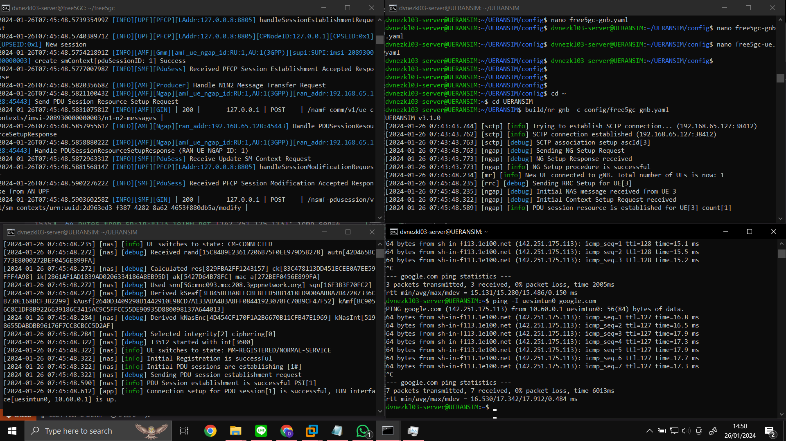

# THe Testing of 5G Core (E2E Test)

- [THe Testing of 5G Core (E2E Test)](#the-testing-of-5g-core-e2e-test)
  - [Testing free5GC](#testing-free5gc)
    - [Run the Tests:](#run-the-tests)
      - [Test Registration ](#test-registration-)
      - [Test GUTI Registration ](#test-guti-registration-)
      - [Test Service Request ](#test-service-request-)
      - [Test PDU Session Release Request ](#test-pdu-session-release-request-)
      - [Test Paging ](#test-paging-)
      - [Test N2Handover ](#test-n2handover-)
      - [Test ReSynchronization ](#test-resynchronization-)
      - [Test ULCL ](#test-ulcl-)
      - [Test Deregistration ](#test-deregistration-)
      - [Test XnHandover ](#test-xnhandover-)
      - [Test Non 3GPP ](#test-non-3gpp-)
  - [Testing UERANSIM against free5GC](#testing-ueransim-against-free5gc)

## Testing free5GC
Here we can use the commands provided in this [link](https://free5gc.org/guide/4-test-free5gc/). The test will be run below with the command: (Don't run it if not finish configuring parameter yet, or else will lead to error when testing free5GC)
```bash
sudo ./run.sh
```
Output:
```bash
dvnezkl03-server@free5GC:~/free5gc$ sudo ./run.sh
log path: ./log/20240125_162937/
2024-01-25T16:29:37.174060835Z [INFO][UPF][Main] UPF version:
        free5GC version: v3.3.0
        build time:      2024-01-25T16:15:34Z
        commit hash:     4474dc86
        commit time:     2023-06-08T03:37:39Z
        go version:      go1.18.10 linux/amd64
2024-01-25T16:29:37.175203866Z [INFO][UPF][CFG] Read config from [./config/upfcfg.yaml]
2024-01-25T16:29:37.175710694Z [INFO][UPF][CFG] ==================================================
2024-01-25T16:29:37.175812003Z [INFO][UPF][CFG] (*factory.Config)(0xc0003acbe0)({
        Version: (string) (len=5) "1.0.3",
        Description: (string) (len=31) "UPF initial local configuration",
        Pfcp: (*factory.Pfcp)(0xc0004418f0)({
                Addr: (string) (len=9) "127.0.0.8",
                NodeID: (string) (len=9) "127.0.0.8",
                RetransTimeout: (time.Duration) 1s,
                MaxRetrans: (uint8) 3
        }),
        Gtpu: (*factory.Gtpu)(0xc000441aa0)({
                Forwarder: (string) (len=5) "gtp5g",
                IfList: ([]factory.IfInfo) (len=1 cap=1) {
                        (factory.IfInfo) {
                                Addr: (string) (len=9) "127.0.0.8",
                                Type: (string) (len=2) "N3",
                                Name: (string) "",
                                IfName: (string) "",
                                MTU: (uint32) 0
                        }
                }
        }),
        DnnList: ([]factory.DnnList) (len=1 cap=1) {
                (factory.DnnList) {
                        Dnn: (string) (len=8) "internet",
                        Cidr: (string) (len=12) "10.60.0.0/24",
                        NatIfName: (string) ""
                }
        },
        Logger: (*factory.Logger)(0xc0003f6e60)({
                Enable: (bool) true,
                Level: (string) (len=4) "info",
                ReportCaller: (bool) false
        })
})
2024-01-25T16:29:37.179116118Z [INFO][UPF][CFG] ==================================================
2024-01-25T16:29:37.179223667Z [INFO][UPF][Main] Log level is set to [info]
2024-01-25T16:29:37.179489817Z [INFO][UPF][Main] Report Caller is set to [false]
2024-01-25T16:29:37.179609024Z [INFO][UPF][Main] starting Gtpu Forwarder [gtp5g]
2024-01-25T16:29:37.179691285Z [INFO][UPF][Main] GTP Address: "127.0.0.8:2152"
2024-01-25T16:29:37.201435223Z [INFO][UPF][BUFF] buff netlink server started
2024-01-25T16:29:37.201504636Z [INFO][UPF][Perio] perio server started
2024-01-25T16:29:37.201521711Z [INFO][UPF][Gtp5g] Forwarder started
2024-01-25T16:29:37.201924923Z [INFO][UPF][PFCP][LAddr:127.0.0.8:8805] starting pfcp server
2024-01-25T16:29:37.202006702Z [INFO][UPF][PFCP][LAddr:127.0.0.8:8805] pfcp server started
2024-01-25T16:29:37.202020573Z [INFO][UPF][Main] UPF started
MongoDB shell version v3.6.8
connecting to: mongodb://127.0.0.1:27017/free5gc
Implicit session: session { "id" : UUID("c88039db-ef3e-4038-ac83-9bd36f2157bb") }
MongoDB server version: 3.6.8
false
./run.sh: line 112: mongosh: command not found
2024-01-25T16:29:37.529071722Z [INFO][NRF][Main] NRF version:
        free5GC version: v3.3.0
        build time:      2024-01-25T16:14:52Z
        commit hash:     db4c0f90
        commit time:     2023-05-11T08:14:48Z
        go version:      go1.18.10 linux/amd64
2024-01-25T16:29:37.529803276Z [INFO][NRF][CFG] Read config from [./config/nrfcfg.yaml]
2024-01-25T16:29:37.530262789Z [INFO][NRF][Main] Log enable is set to [true]
2024-01-25T16:29:37.530374386Z [INFO][NRF][Main] Log level is set to [info]
2024-01-25T16:29:37.530453038Z [INFO][NRF][Main] Report Caller is set to [false]
2024-01-25T16:29:37.530493463Z [INFO][NRF][Init] nrfconfig Info: Version[1.0.2] Description[NRF initial local configuration]
2024-01-25T16:29:37.531656040Z [INFO][NRF][Init] Server starting
2024-01-25T16:29:37.533110855Z [INFO][NRF][Init] Binding addr: [127.0.0.10:8000]
2024-01-25T16:29:37.621995937Z [INFO][AMF][Main] AMF version:
        free5GC version: v3.3.0
        build time:      2024-01-25T16:14:16Z
        commit hash:     7907d3c0
        commit time:     2023-05-20T15:04:00Z
        go version:      go1.18.10 linux/amd64
2024-01-25T16:29:37.622839045Z [INFO][AMF][CFG] Read config from [./config/amfcfg.yaml]
2024-01-25T16:29:37.623968758Z [INFO][AMF][Main] Log enable is set to [true]
2024-01-25T16:29:37.624073168Z [INFO][AMF][Main] Log level is set to [info]
2024-01-25T16:29:37.624158397Z [INFO][AMF][Main] Report Caller is set to [false]
2024-01-25T16:29:37.624324923Z [INFO][AMF][Util] amfconfig Info: Version[1.0.9]
2024-01-25T16:29:37.624498425Z [INFO][AMF][Init] Server started
2024-01-25T16:29:37.624880547Z [INFO][AMF][Util] amfconfig Info: Version[1.0.9]
2024-01-25T16:29:37.627411474Z [INFO][AMF][Ngap] Listen on 127.0.0.18:38412
2024-01-25T16:29:37.634114095Z [INFO][NRF][NFM] Handle NFRegisterRequest
2024-01-25T16:29:37.636441919Z [INFO][NRF][NFM] urilist update
2024-01-25T16:29:37.642228551Z [INFO][NRF][NFM] Create NF Profile
2024-01-25T16:29:37.644248935Z [INFO][NRF][NFM] Location header:  http://127.0.0.10:8000/nnrf-nfm/v1/nf-instances/6c79a75b-3582-4c52-83e2-82615bdf6ec0
2024-01-25T16:29:37.644596801Z [INFO][NRF][GIN] | 201 |       127.0.0.1 | PUT     | /nnrf-nfm/v1/nf-instances/6c79a75b-3582-4c52-83e2-82615bdf6ec0 |
2024-01-25T16:29:37.727800149Z [INFO][SMF][Main] SMF version:
        free5GC version: v3.3.0
        build time:      2024-01-25T16:15:11Z
        commit hash:     8eb6843b
        commit time:     2023-05-31T04:43:19Z
        go version:      go1.18.10 linux/amd64
2024-01-25T16:29:37.728522659Z [INFO][SMF][CFG] Read config from [./config/smfcfg.yaml]
2024-01-25T16:29:37.729695114Z [INFO][SMF][CFG] Read config from [./config/uerouting.yaml]
2024-01-25T16:29:37.730152303Z [INFO][SMF][Main] Log enable is set to [true]
2024-01-25T16:29:37.730251302Z [INFO][SMF][Main] Log level is set to [info]
2024-01-25T16:29:37.730360281Z [INFO][SMF][Main] Report Caller is set to [false]
2024-01-25T16:29:37.730475301Z [INFO][SMF][CTX] smfconfig Info: Version[1.0.7] Description[SMF initial local configuration]
2024-01-25T16:29:37.730589418Z [INFO][SMF][CTX] Endpoints: [127.0.0.8]
2024-01-25T16:29:37.730792370Z [INFO][SMF][Init] Server started
2024-01-25T16:29:37.734626295Z [INFO][NRF][NFM] Handle NFRegisterRequest
2024-01-25T16:29:37.736411233Z [INFO][NRF][NFM] urilist update
2024-01-25T16:29:37.737460849Z [INFO][NRF][NFM] Create NF Profile
2024-01-25T16:29:37.738670773Z [INFO][NRF][NFM] Location header:  http://127.0.0.10:8000/nnrf-nfm/v1/nf-instances/a37278d8-a205-4f68-8487-b4e855994411
2024-01-25T16:29:37.738840186Z [INFO][NRF][GIN] | 201 |       127.0.0.1 | PUT     | /nnrf-nfm/v1/nf-instances/a37278d8-a205-4f68-8487-b4e855994411 |
2024-01-25T16:29:37.739833392Z [INFO][SMF][Init] SMF Registration to NRF {a37278d8-a205-4f68-8487-b4e855994411 SMF REGISTERED 0 0xc0004c6150 0xc0004c6180 [] []   [127.0.0.2] [] <nil> [] [] <nil> 0 0 0 area1 <nil> <nil> <nil> <nil> 0xc000222180 <nil> <nil> <nil> <nil> <nil> map[] <nil> false 0xc0004c6048 false false []}
2024-01-25T16:29:37.740957331Z [INFO][SMF][PFCP] Listen on 127.0.0.1:8805
2024-01-25T16:29:37.741214131Z [INFO][SMF][Main] Sending PFCP Association Request to UPF[127.0.0.8]
2024-01-25T16:29:37.741628869Z [INFO][UPF][PFCP][LAddr:127.0.0.8:8805] handleAssociationSetupRequest
2024-01-25T16:29:37.741752405Z [INFO][UPF][PFCP][LAddr:127.0.0.8:8805][CPNodeID:127.0.0.1] New node
2024-01-25T16:29:37.743178815Z [INFO][SMF][Main] Received PFCP Association Setup Accepted Response from UPF[127.0.0.8]
2024-01-25T16:29:37.834788474Z [INFO][UDR][Main] UDR version:
        free5GC version: v3.3.0
        build time:      2024-01-25T16:15:24Z
        commit hash:     a8ef9d9f
        commit time:     2023-05-11T08:26:37Z
        go version:      go1.18.10 linux/amd64
2024-01-25T16:29:37.835589825Z [INFO][UDR][CFG] Read config from [./config/udrcfg.yaml]
2024-01-25T16:29:37.836045105Z [INFO][UDR][Main] Log enable is set to [true]
2024-01-25T16:29:37.836143945Z [INFO][UDR][Main] Log level is set to [info]
2024-01-25T16:29:37.836241169Z [INFO][UDR][Main] Report Caller is set to [false]
2024-01-25T16:29:37.836333750Z [INFO][UDR][Init] UDR Config Info: Version[1.0.2] Description[UDR initial local configuration]
2024-01-25T16:29:37.837226541Z [INFO][UDR][Init] Server started
2024-01-25T16:29:37.837636285Z [INFO][UDR][Util] udrconfig Info: Version[1.0.2] Description[UDR initial local configuration]
2024-01-25T16:29:37.842755040Z [INFO][NRF][NFM] Handle NFRegisterRequest
2024-01-25T16:29:37.844246922Z [INFO][NRF][NFM] urilist update
2024-01-25T16:29:37.846039054Z [INFO][NRF][NFM] Create NF Profile
2024-01-25T16:29:37.847101120Z [INFO][NRF][NFM] Location header:  http://127.0.0.10:8000/nnrf-nfm/v1/nf-instances/cd1d1158-2fd6-447f-9568-9ac59d845342
2024-01-25T16:29:37.847173259Z [INFO][NRF][GIN] | 201 |       127.0.0.1 | PUT     | /nnrf-nfm/v1/nf-instances/cd1d1158-2fd6-447f-9568-9ac59d845342 |
2024-01-25T16:29:37.935830820Z [INFO][PCF][Main] pcf
2024-01-25T16:29:37.936018932Z [INFO][PCF][Main] PCF version:
        free5GC version: v3.3.0
        build time:      2024-01-25T16:15:07Z
        commit hash:     17f2a8fc
        commit time:     2023-05-11T08:21:46Z
        go version:      go1.18.10 linux/amd64
2024-01-25T16:29:37.936531625Z [INFO][PCF][CFG] Read config from [./config/pcfcfg.yaml]
2024-01-25T16:29:37.938199483Z [INFO][PCF][Main] Log enable is set to [true]
2024-01-25T16:29:37.938409110Z [INFO][PCF][Main] Log level is set to [info]
2024-01-25T16:29:37.938567213Z [INFO][PCF][Main] Report Caller is set to [false]
2024-01-25T16:29:37.938764674Z [INFO][PCF][Util] pcfconfig Info: Version[1.0.2] Description[PCF initial local configuration]
2024-01-25T16:29:37.939803130Z [INFO][PCF][Init] Server started
2024-01-25T16:29:37.940112716Z [INFO][PCF][Util] pcfconfig Info: Version[1.0.2] Description[PCF initial local configuration]
2024-01-25T16:29:37.944481642Z [INFO][NRF][NFM] Handle NFRegisterRequest
2024-01-25T16:29:37.945815787Z [INFO][NRF][NFM] urilist update
2024-01-25T16:29:37.946693079Z [INFO][NRF][NFM] Create NF Profile
2024-01-25T16:29:37.947316211Z [INFO][NRF][NFM] Location header:  http://127.0.0.10:8000/nnrf-nfm/v1/nf-instances/34ce50e8-63f9-4535-93a0-98d8a183be64
2024-01-25T16:29:37.947422028Z [INFO][NRF][GIN] | 201 |       127.0.0.1 | PUT     | /nnrf-nfm/v1/nf-instances/34ce50e8-63f9-4535-93a0-98d8a183be64 |
2024-01-25T16:29:37.948393830Z [INFO][NRF][DISC] Handle NFDiscoveryRequest
2024-01-25T16:29:37.949493726Z [INFO][NRF][GIN] | 200 |       127.0.0.1 | GET     | /nnrf-disc/v1/nf-instances?requester-nf-type=PCF&service-names=nudr-dr&target-nf-type=UDR |
2024-01-25T16:29:38.033676019Z [INFO][UDM][Main] UDM version:
        free5GC version: v3.3.0
        build time:      2024-01-25T16:15:19Z
        commit hash:     f9aad0ef
        commit time:     2023-05-11T08:24:25Z
        go version:      go1.18.10 linux/amd64
2024-01-25T16:29:38.034526692Z [INFO][UDM][CFG] Read config from [./config/udmcfg.yaml]
2024-01-25T16:29:38.035867161Z [INFO][UDM][Main] Log enable is set to [true]
2024-01-25T16:29:38.035992787Z [INFO][UDM][Main] Log level is set to [info]
2024-01-25T16:29:38.036101206Z [INFO][UDM][Main] Report Caller is set to [false]
2024-01-25T16:29:38.036186084Z [INFO][UDM][Init] UDM Config Info: Version[1.0.3] Description[UDM initial local configuration]
2024-01-25T16:29:38.036269368Z [INFO][UDM][Init] Server started
2024-01-25T16:29:38.036370197Z [INFO][UDM][Util] udmconfig Info: Version[1.0.3] Description[UDM initial local configuration]
2024-01-25T16:29:38.040841710Z [INFO][NRF][NFM] Handle NFRegisterRequest
2024-01-25T16:29:38.042124293Z [INFO][NRF][NFM] urilist update
2024-01-25T16:29:38.043137728Z [INFO][NRF][NFM] Create NF Profile
2024-01-25T16:29:38.044022828Z [INFO][NRF][NFM] Location header:  http://127.0.0.10:8000/nnrf-nfm/v1/nf-instances/49ad0b66-6c4e-4005-8f6b-d114738ba352
2024-01-25T16:29:38.044259174Z [INFO][NRF][GIN] | 201 |       127.0.0.1 | PUT     | /nnrf-nfm/v1/nf-instances/49ad0b66-6c4e-4005-8f6b-d114738ba352 |
2024-01-25T16:29:38.134040743Z [INFO][NSSF][Main] NSSF version:
        free5GC version: v3.3.0
        build time:      2024-01-25T16:15:05Z
        commit hash:     28cd7936
        commit time:     2023-05-11T08:20:43Z
        go version:      go1.18.10 linux/amd64
2024-01-25T16:29:38.134839689Z [INFO][NSSF][CFG] Read config from [./config/nssfcfg.yaml]
2024-01-25T16:29:38.135885492Z [INFO][NSSF][Main] Log enable is set to [true]
2024-01-25T16:29:38.135985220Z [INFO][NSSF][Main] Log level is set to [info]
2024-01-25T16:29:38.136067206Z [INFO][NSSF][Main] Report Caller is set to [false]
2024-01-25T16:29:38.136175065Z [INFO][NSSF][Init] Server started
2024-01-25T16:29:38.140141257Z [INFO][NRF][NFM] Handle NFRegisterRequest
2024-01-25T16:29:38.141695248Z [INFO][NRF][NFM] urilist update
2024-01-25T16:29:38.142542183Z [INFO][NRF][NFM] Create NF Profile
2024-01-25T16:29:38.143290843Z [INFO][NRF][NFM] Location header:  http://127.0.0.10:8000/nnrf-nfm/v1/nf-instances/113ee549-e822-48ba-a042-f6033e436bf5
2024-01-25T16:29:38.143373012Z [INFO][NRF][GIN] | 201 |       127.0.0.1 | PUT     | /nnrf-nfm/v1/nf-instances/113ee549-e822-48ba-a042-f6033e436bf5 |
2024-01-25T16:29:38.249109582Z [INFO][AUSF][Main] AUSF version:
        free5GC version: v3.3.0
        build time:      2024-01-25T16:14:47Z
        commit hash:     64f47ebe
        commit time:     2023-05-11T08:11:05Z
        go version:      go1.18.10 linux/amd64
2024-01-25T16:29:38.250583671Z [INFO][AUSF][CFG] Read config from [./config/ausfcfg.yaml]
2024-01-25T16:29:38.251198041Z [INFO][AUSF][Main] Log enable is set to [true]
2024-01-25T16:29:38.251297214Z [INFO][AUSF][Main] Log level is set to [info]
2024-01-25T16:29:38.251375802Z [INFO][AUSF][Main] Report Caller is set to [false]
2024-01-25T16:29:38.251463482Z [INFO][AUSF][Init] ausfconfig Info: Version[1.0.3] Description[AUSF initial local configuration]
ausf context =  &{{{0 0} {<nil>} map[] 0} {{0 0} {<nil>} map[] 0} f27533df-5169-410e-ba82-87a6679108b9 ausfGroup001 8000 127.0.0.9 127.0.0.9 http://127.0.0.9:8000 http http://127.0.0.10:8000 map[nausf-auth:{f27533df-5169-410e-ba82-87a6679108b9 nausf-auth 0xc00000cf00 http REGISTERED   0xc00000cee8  [] <nil> [] [] <nil> 0 0 0 <nil> <nil>  }] [{208 93} {123 45}]  0xc000390dc0 false}
2024-01-25T16:29:38.252306770Z [INFO][AUSF][Init] Server started
2024-01-25T16:29:38.256105422Z [INFO][NRF][NFM] Handle NFRegisterRequest
2024-01-25T16:29:38.257260011Z [INFO][NRF][NFM] urilist update
2024-01-25T16:29:38.258080924Z [INFO][NRF][NFM] Create NF Profile
2024-01-25T16:29:38.258835571Z [INFO][NRF][NFM] Location header:  http://127.0.0.10:8000/nnrf-nfm/v1/nf-instances/f27533df-5169-410e-ba82-87a6679108b9
2024-01-25T16:29:38.258910582Z [INFO][NRF][GIN] | 201 |       127.0.0.1 | PUT     | /nnrf-nfm/v1/nf-instances/f27533df-5169-410e-ba82-87a6679108b9 |
```

### Run the Tests:
```bash
cd ~/free5gc
make upf
chmod +x ./test.sh
```

#### Test Registration <br>
The TestRegistration feature is utilized to register a user for the 5G Core Network by sending a registration request to the Home Subscriber Server (HSS) and the Authentication and Authorization Server (AUSF). By verifying the user's identification and authentication information, generating and storing session keys, and providing necessary data to other network functions for further communication, this function manages the registration process.
```bash
./test.sh TestRegistration
```
Output:
```bash
--- PASS: TestRegistration (9.51s)
PASS
ok      test    11.178s
2024-01-25T17:14:13.177797539Z [INFO][UPF][Main] Shutdown UPF ...
2024-01-25T17:14:13.178270287Z [INFO][UPF][PFCP][LAddr:10.200.200.101:8805] Stopping pfcp server
2024-01-25T17:14:13.178708585Z [ERRO][UPF][PFCP][LAddr:10.200.200.101:8805] read udp4 10.200.200.101:8805: use of closed network connection
2024-01-25T17:14:13.179554521Z [INFO][UPF][PFCP][LAddr:10.200.200.101:8805] pfcp reciver stopped
2024-01-25T17:14:13.179935886Z [INFO][UPF][PFCP][LAddr:10.200.200.101:8805] pfcp server stopped
2024-01-25T17:14:13.212938864Z [INFO][UPF][Perio] recv event[TYPE_SERVER_CLOSE][{eType:4 lSeid:0 urrid:0 period:0}]
2024-01-25T17:14:13.213553184Z [INFO][UPF][Perio] perio server stopped
2024-01-25T17:14:13.213723232Z [INFO][UPF][Main] Terminating UPF...
2024-01-25T17:14:13.213752354Z [INFO][UPF][Main] UPF terminated
2024-01-25T17:14:13.213760622Z [INFO][UPF][Main] UPF exited
```

#### Test GUTI Registration <br>
To register a user using their GUTI, use the TestGUTIRegistration method. It sends a request for registration to the MME, which verifies the GUTI and performs necessary authentication and permission processes in coordination with the HSS and AUSF. Following a successful registration, the Subscriber Permanent Identifier (SUPI), which is used for all future communications with the user, is a permanent identification assigned by the MME to the user.
```bash
./test.sh TestGUTIRegistration
```
Output:
```bash
--- PASS: TestGUTIRegistration (9.50s)
PASS
ok      test    11.168s
2024-01-25T17:18:46.012339269Z [INFO][UPF][Main] Shutdown UPF ...
2024-01-25T17:18:46.012408450Z [INFO][UPF][PFCP][LAddr:10.200.200.101:8805] Stopping pfcp server
2024-01-25T17:18:46.012489603Z [ERRO][UPF][PFCP][LAddr:10.200.200.101:8805] read udp4 10.200.200.101:8805: use of closed network connection
2024-01-25T17:18:46.012554601Z [INFO][UPF][PFCP][LAddr:10.200.200.101:8805] pfcp reciver stopped
2024-01-25T17:18:46.012572246Z [INFO][UPF][PFCP][LAddr:10.200.200.101:8805] pfcp server stopped
2024-01-25T17:18:46.056738417Z [INFO][UPF][Perio] recv event[TYPE_SERVER_CLOSE][{eType:4 lSeid:0 urrid:0 period:0}]
2024-01-25T17:18:46.056769547Z [INFO][UPF][Perio] perio server stopped
2024-01-25T17:18:46.056815390Z [INFO][UPF][Main] Terminating UPF...
2024-01-25T17:18:46.056826590Z [INFO][UPF][Main] UPF terminated
2024-01-25T17:18:46.056847640Z [INFO][UPF][Main] UPF exited
```

#### Test Service Request <br>
A testing method called TestServiceRequest is intended to mimic user-initiated service requests within the 5G Core Network. In order to determine user authorization and check network conditions, this function generates a service request message and sends it to the SEAF (Service Authorization Function). After permission, TestServiceRequest receives a response message from the SEAF, which instructs it to setup the necessary resources for the requested service.
```bash
./test.sh TestServiceRequest
```
Output:
```bash
--- PASS: TestServiceRequest (9.75s)
PASS
ok      test    11.406s
2024-01-25T17:28:32.073762335Z [INFO][UPF][Main] Shutdown UPF ...
2024-01-25T17:28:32.074352497Z [INFO][UPF][PFCP][LAddr:10.200.200.101:8805] Stopping pfcp server
2024-01-25T17:28:32.074584939Z [ERRO][UPF][PFCP][LAddr:10.200.200.101:8805] read udp4 10.200.200.101:8805: use of closed network connection
2024-01-25T17:28:32.074651670Z [INFO][UPF][PFCP][LAddr:10.200.200.101:8805] pfcp reciver stopped
2024-01-25T17:28:32.074896461Z [INFO][UPF][PFCP][LAddr:10.200.200.101:8805] pfcp server stopped
2024-01-25T17:28:32.112318827Z [INFO][UPF][Perio] recv event[TYPE_SERVER_CLOSE][{eType:4 lSeid:0 urrid:0 period:0}]
2024-01-25T17:28:32.112417973Z [INFO][UPF][Perio] perio server stopped
2024-01-25T17:28:32.112437053Z [INFO][UPF][Main] Terminating UPF...
2024-01-25T17:28:32.112449202Z [INFO][UPF][Main] UPF terminated
2024-01-25T17:28:32.112492561Z [INFO][UPF][Main] UPF exited
```

#### Test PDU Session Release Request <br>
A testing method called TestPDUSessionReleaseRequest is made to mimic the release of a PDU (Packet Data Unit) session. By creating a release request message and sending it to the SMF (Session Management Function), it does this. Through contact with other network services, this step releases the resources allotted for the PDU session and permits its termination.
```bash
./test.sh TestPDUSessionReleaseRequest
```
Output:
```bash
--- PASS: TestPDUSessionReleaseRequest (10.44s)
PASS
ok      test    12.095s
2024-01-25T17:37:30.173716151Z [INFO][UPF][Main] Shutdown UPF ...
2024-01-25T17:37:30.174189268Z [INFO][UPF][PFCP][LAddr:10.200.200.101:8805] Stopping pfcp server
2024-01-25T17:37:30.174266083Z [ERRO][UPF][PFCP][LAddr:10.200.200.101:8805] read udp4 10.200.200.101:8805: use of closed network connection
2024-01-25T17:37:30.175568249Z [INFO][UPF][PFCP][LAddr:10.200.200.101:8805] pfcp reciver stopped
2024-01-25T17:37:30.175600837Z [INFO][UPF][PFCP][LAddr:10.200.200.101:8805] pfcp server stopped
2024-01-25T17:37:30.204704169Z [INFO][UPF][Perio] recv event[TYPE_SERVER_CLOSE][{eType:4 lSeid:0 urrid:0 period:0}]
2024-01-25T17:37:30.205378893Z [INFO][UPF][Perio] perio server stopped
2024-01-25T17:37:30.205566985Z [INFO][UPF][Main] Terminating UPF...
2024-01-25T17:37:30.205801719Z [INFO][UPF][Main] UPF terminated
2024-01-25T17:37:30.205826766Z [INFO][UPF][Main] UPF exited
```

#### Test Paging <br>
A testing approach that mimics the paging process is the TestPaging function. It accomplishes this by initiating a paging request, enabling message exchanges across the network functions involved in the process, and allocating the necessary resources for the service that is being sought.
```bash
./test.sh TestPaging
```
Output:
```bash
--- PASS: TestPaging (11.81s)
PASS
ok      test    13.491s
2024-01-25T17:38:08.669671742Z [INFO][UPF][Main] Shutdown UPF ...
2024-01-25T17:38:08.669876353Z [INFO][UPF][PFCP][LAddr:10.200.200.101:8805] Stopping pfcp server
2024-01-25T17:38:08.670211446Z [ERRO][UPF][PFCP][LAddr:10.200.200.101:8805] read udp4 10.200.200.101:8805: use of closed network connection
2024-01-25T17:38:08.670228029Z [INFO][UPF][PFCP][LAddr:10.200.200.101:8805] pfcp reciver stopped
2024-01-25T17:38:08.670242286Z [INFO][UPF][PFCP][LAddr:10.200.200.101:8805] pfcp server stopped
2024-01-25T17:38:08.713030253Z [INFO][UPF][Perio] recv event[TYPE_SERVER_CLOSE][{eType:4 lSeid:0 urrid:0 period:0}]
2024-01-25T17:38:08.713116248Z [INFO][UPF][Perio] perio server stopped
2024-01-25T17:38:08.713159680Z [INFO][UPF][Main] Terminating UPF...
2024-01-25T17:38:08.713167454Z [INFO][UPF][Main] UPF terminated
2024-01-25T17:38:08.713171615Z [INFO][UPF][Main] UPF exited
```

#### Test N2Handover <br>
An emulation of the N2 handover process is provided via the TestN2Handover function. Messages between the source and target gNBs as well as other network functions involved in the handover process are exchanged in this simulation. Enabling the smooth transfer of control plane and user plane connections from the source gNB to the target gNB is the main goal. The user's session and route data are maintained during this operation.
```bash
./test.sh TestN2Handover
```
Output:
```bash
--- PASS: TestN2Handover (11.06s)
PASS
ok      test    12.711s
2024-01-25T17:38:46.862823635Z [INFO][UPF][Main] Shutdown UPF ...
2024-01-25T17:38:46.863137894Z [INFO][UPF][PFCP][LAddr:10.200.200.101:8805] Stopping pfcp server
2024-01-25T17:38:46.863226217Z [ERRO][UPF][PFCP][LAddr:10.200.200.101:8805] read udp4 10.200.200.101:8805: use of closed network connection
2024-01-25T17:38:46.863677083Z [INFO][UPF][PFCP][LAddr:10.200.200.101:8805] pfcp reciver stopped
2024-01-25T17:38:46.863729764Z [INFO][UPF][PFCP][LAddr:10.200.200.101:8805] pfcp server stopped
2024-01-25T17:38:46.901421609Z [INFO][UPF][Perio] recv event[TYPE_SERVER_CLOSE][{eType:4 lSeid:0 urrid:0 period:0}]
2024-01-25T17:38:46.901482426Z [INFO][UPF][Perio] perio server stopped
2024-01-25T17:38:46.901503035Z [INFO][UPF][Main] Terminating UPF...
2024-01-25T17:38:46.901508645Z [INFO][UPF][Main] UPF terminated
2024-01-25T17:38:46.901515821Z [INFO][UPF][Main] UPF exited
```

#### Test ReSynchronization <br>
A testing tool that simulates the Re-Synchronization process on the network is called TestReSynchronization. This entails starting the process, enabling message exchanges between the involved network services, and verifying that synchronization has been restored between these network functions. This simulation is particularly significant after suffering a momentary loss of synchronization.
```bash
./test.sh TestReSynchronization
```
Output:
```bash
testing: warning: no tests to run
PASS
ok      test    1.653s
2024-01-25T17:39:07.419161074Z [INFO][UPF][Main] Shutdown UPF ...
2024-01-25T17:39:07.419234097Z [INFO][UPF][PFCP][LAddr:10.200.200.101:8805] Stopping pfcp server
2024-01-25T17:39:07.419299968Z [ERRO][UPF][PFCP][LAddr:10.200.200.101:8805] read udp4 10.200.200.101:8805: use of closed network connection
2024-01-25T17:39:07.419459561Z [INFO][UPF][PFCP][LAddr:10.200.200.101:8805] pfcp reciver stopped
2024-01-25T17:39:07.419479534Z [INFO][UPF][PFCP][LAddr:10.200.200.101:8805] pfcp server stopped
2024-01-25T17:39:07.448713651Z [INFO][UPF][Perio] recv event[TYPE_SERVER_CLOSE][{eType:4 lSeid:0 urrid:0 period:0}]
2024-01-25T17:39:07.448776974Z [INFO][UPF][Perio] perio server stopped
2024-01-25T17:39:07.448823037Z [INFO][UPF][Main] Terminating UPF...
2024-01-25T17:39:07.448838085Z [INFO][UPF][Main] UPF terminated
2024-01-25T17:39:07.448844383Z [INFO][UPF][Main] UPF exited
```

#### Test ULCL <br>
A testing feature that mimics the ULI Consolidation List (ULCL) process is called TestULCL. In this simulation, ULI (User Location Information) from several sources is consolidated into a single list by use of a trigger. The procedure entails confirming the consolidation's success and producing a reaction in light of the consolidation's conclusion.
```bash
./test_ulcl.sh TestRequestTwoPDUSessions
```
Output:
```bash
--- PASS: TestRequestTwoPDUSessions (11.55s)
PASS
ok      test    13.198s
2024-01-25T17:40:13.393980642Z [INFO][UPF][Main] Shutdown UPF ...
2024-01-25T17:40:13.394070215Z [INFO][UPF][PFCP][LAddr:10.200.200.102:8805] Stopping pfcp server
2024-01-25T17:40:13.394142360Z [ERRO][UPF][PFCP][LAddr:10.200.200.102:8805] read udp4 10.200.200.102:8805: use of closed network connection
2024-01-25T17:40:13.394166062Z [INFO][UPF][PFCP][LAddr:10.200.200.102:8805] pfcp reciver stopped
2024-01-25T17:40:13.394180517Z [INFO][UPF][PFCP][LAddr:10.200.200.102:8805] pfcp server stopped
2024-01-25T17:40:13.394471156Z [INFO][UPF][Main] Shutdown UPF ...
2024-01-25T17:40:13.394624992Z [INFO][UPF][PFCP][LAddr:10.200.200.101:8805] Stopping pfcp server
2024-01-25T17:40:13.394784078Z [ERRO][UPF][PFCP][LAddr:10.200.200.101:8805] read udp4 10.200.200.101:8805: use of closed network connection
2024-01-25T17:40:13.395053935Z [INFO][UPF][PFCP][LAddr:10.200.200.101:8805] pfcp reciver stopped
2024-01-25T17:40:13.395271039Z [INFO][UPF][PFCP][LAddr:10.200.200.101:8805] pfcp server stopped
2024-01-25T17:40:13.421384207Z [INFO][UPF][Perio] recv event[TYPE_SERVER_CLOSE][{eType:4 lSeid:0 urrid:0 period:0}]
2024-01-25T17:40:13.422198075Z [INFO][UPF][Perio] perio server stopped
2024-01-25T17:40:13.422682777Z [INFO][UPF][Main] Terminating UPF...
2024-01-25T17:40:13.423242782Z [INFO][UPF][Main] UPF terminated
2024-01-25T17:40:13.423438550Z [INFO][UPF][Main] UPF exited
2024-01-25T17:40:13.440701090Z [INFO][UPF][Perio] recv event[TYPE_SERVER_CLOSE][{eType:4 lSeid:0 urrid:0 period:0}]
2024-01-25T17:40:13.440736308Z [INFO][UPF][Perio] perio server stopped
2024-01-25T17:40:13.441062439Z [INFO][UPF][Main] Terminating UPF...
2024-01-25T17:40:13.441613671Z [INFO][UPF][Main] UPF terminated
2024-01-25T17:40:13.442020657Z [INFO][UPF][Main] UPF exited
ls: cannot access '*sslkey.log': No such file or directory
```

#### Test Deregistration <br>
A testing technique for imitating user deregistration within the network is the TestDeregistration function. In order to do this, a deregistration request message must be created and sent to the Access and Mobility Management Function, or AMF. The idea is to make it easier for the user to disconnect from the network and then release the resources that were allotted to them by interacting with other network features.
```bash
./test.sh TestDeregistration
```
Output:
```bash
--- PASS: TestDeregistration (8.31s)
PASS
ok      test    9.973s
2024-01-25T17:40:48.976832783Z [INFO][UPF][Main] Shutdown UPF ...
2024-01-25T17:40:48.976913619Z [INFO][UPF][PFCP][LAddr:10.200.200.101:8805] Stopping pfcp server
2024-01-25T17:40:48.977087740Z [ERRO][UPF][PFCP][LAddr:10.200.200.101:8805] read udp4 10.200.200.101:8805: use of closed network connection
2024-01-25T17:40:48.977148511Z [INFO][UPF][PFCP][LAddr:10.200.200.101:8805] pfcp reciver stopped
2024-01-25T17:40:48.977164048Z [INFO][UPF][PFCP][LAddr:10.200.200.101:8805] pfcp server stopped
2024-01-25T17:40:49.009015193Z [INFO][UPF][Perio] recv event[TYPE_SERVER_CLOSE][{eType:4 lSeid:0 urrid:0 period:0}]
2024-01-25T17:40:49.009154917Z [INFO][UPF][Perio] perio server stopped
2024-01-25T17:40:49.009411627Z [INFO][UPF][Main] Terminating UPF...
2024-01-25T17:40:49.009444155Z [INFO][UPF][Main] UPF terminated
2024-01-25T17:40:49.009474150Z [INFO][UPF][Main] UPF exited
```

#### Test XnHandover <br>
The purpose of Test XnHandover in Free5GC is to verify that the 5G core network is operating correctly during a handover procedure. In practice, the RAN (gNodeB or another Access Point) would be used by the User Equipment (UE) to register itself on the network. When a UE session request to authenticate itself in the network is received, the Access and Mobility Function (AMF) will be the first Network Function (NF) to respond. The SIM card will have all of the data requested by the AMF. For the purpose of testing the simulator and extracting some first findings to ensure its operation, Free5GC offers an additional set of tests and tools. One of the tests used in the Free5GC 5G core network testing procedure is the XnHandover test.
```bash
./test.sh TestXnHandover
```
Output:
```bash
--- PASS: TestXnHandover (9.51s)
PASS
ok      test    11.156s
2024-01-25T17:42:23.820086200Z [INFO][UPF][Main] Shutdown UPF ...
2024-01-25T17:42:23.820199576Z [INFO][UPF][PFCP][LAddr:10.200.200.101:8805] Stopping pfcp server
2024-01-25T17:42:23.820249075Z [ERRO][UPF][PFCP][LAddr:10.200.200.101:8805] read udp4 10.200.200.101:8805: use of closed network connection
2024-01-25T17:42:23.820259674Z [INFO][UPF][PFCP][LAddr:10.200.200.101:8805] pfcp reciver stopped
2024-01-25T17:42:23.820270605Z [INFO][UPF][PFCP][LAddr:10.200.200.101:8805] pfcp server stopped
2024-01-25T17:42:23.856306368Z [INFO][UPF][Perio] recv event[TYPE_SERVER_CLOSE][{eType:4 lSeid:0 urrid:0 period:0}]
2024-01-25T17:42:23.856330922Z [INFO][UPF][Perio] perio server stopped
2024-01-25T17:42:23.856408200Z [INFO][UPF][Main] Terminating UPF...
2024-01-25T17:42:23.856423393Z [INFO][UPF][Main] UPF terminated
2024-01-25T17:42:23.856427427Z [INFO][UPF][Main] UPF exited
```

#### Test Non 3GPP <br>
In 5G, Non-3GPP access networks refer to access networks that are not based on 3GPP standards. These networks include Wi-Fi, WiMAX, fixed, and CDMA networks. The 5G Core Network supports both trusted and untrusted non-3GPP access networks. An untrusted non-3GPP access network is connected to the 5G Core Network via a Non-3GPP interface, while a trusted non-3GPP access network is connected to the 5G Core Network via a Trusted interface. The free5GC is an open-source project for 5G mobile core networks that conforms to the 3GPP Release 15 (R15) standards. It supports both trusted and untrusted non-3GPP access networks. 
```bash
./test.sh TestNon3GPP
```
Output:
```bash
--- PASS: TestNon3GPPUE (9.77s)
PASS
ok      test    9.809s
2024-01-25T17:43:09.426128956Z [INFO][UPF][Main] Shutdown UPF ...
2024-01-25T17:43:09.426170633Z [INFO][UPF][PFCP][LAddr:10.200.200.101:8805] Stopping pfcp server
2024-01-25T17:43:09.426261182Z [ERRO][UPF][PFCP][LAddr:10.200.200.101:8805] read udp4 10.200.200.101:8805: use of closed network connection
2024-01-25T17:43:09.426273224Z [INFO][UPF][PFCP][LAddr:10.200.200.101:8805] pfcp reciver stopped
2024-01-25T17:43:09.426316832Z [INFO][UPF][PFCP][LAddr:10.200.200.101:8805] pfcp server stopped
2024-01-25T17:43:09.461013649Z [INFO][UPF][Perio] recv event[TYPE_SERVER_CLOSE][{eType:4 lSeid:0 urrid:0 period:0}]
2024-01-25T17:43:09.461141287Z [INFO][UPF][Perio] perio server stopped
2024-01-25T17:43:09.461162807Z [INFO][UPF][Main] Terminating UPF...
2024-01-25T17:43:09.461182019Z [INFO][UPF][Main] UPF terminated
2024-01-25T17:43:09.461185896Z [INFO][UPF][Main] UPF exited
2024-01-25T17:43:09.688615268Z [INFO][N3IWF][Init] Stopping service created by N3IWF
2024-01-25T17:43:09.688700760Z [INFO][N3IWF][NGAP] Close NGAP server....
2024-01-25T17:43:09.689451314Z [WARN][N3IWF][NGAP] [SCTP] Close connection.
2024-01-25T17:43:09.689497093Z [ERRO][N3IWF][NGAP] conn close error: bad file descriptor
2024-01-25T17:43:09.689511316Z [INFO][N3IWF][NGAP] NGAP receiver stopped
2024-01-25T17:43:09.689518663Z [INFO][N3IWF][NGAP] NGAP server stopped
2024-01-25T17:43:09.689054108Z [INFO][N3IWF][NWuCP] Close Nwucp server...
2024-01-25T17:43:09.689888154Z [ERRO][N3IWF][NWuCP] TCP server accept failed : accept tcp 10.0.0.1:20000: use of closed network connection. Close the listener...
2024-01-25T17:43:09.689939891Z [ERRO][N3IWF][NWuCP] Error closing tcpListener: close tcp 10.0.0.1:20000: use of closed network connection
2024-01-25T17:43:09.689973798Z [ERRO][N3IWF][NWuCP] Read TCP connection failed: read tcp 10.0.0.1:20000->10.0.0.120:42889: use of closed network connection
2024-01-25T17:43:09.690022577Z [ERRO][N3IWF][NWuCP] Error closing connection: close tcp 10.0.0.1:20000->10.0.0.120:42889: use of closed network connection
2024-01-25T17:43:09.690032232Z [INFO][N3IWF][NWuUP] Close Nwuup server...
2024-01-25T17:43:09.690051362Z [ERRO][N3IWF][NWuUP] Error read from IPv4 packet connection: read ip 10.0.0.1: raw-read ip4 10.0.0.1: use of closed network connection
2024-01-25T17:43:09.690090455Z [ERRO][N3IWF][NWuUP] Error closing raw socket: close ip4 10.0.0.1: use of closed network connection
2024-01-25T17:43:09.690100101Z [INFO][N3IWF][IKE] Close Ike server...
2024-01-25T17:43:09.690207117Z [ERRO][N3IWF][IKE] ReadFromUDP failed: read udp 192.168.127.1:500: use of closed network connection
2024-01-25T17:43:09.690378940Z [INFO][N3IWF][IKE] Ike receiver stopped
2024-01-25T17:43:09.690442416Z [ERRO][N3IWF][IKE] ReadFromUDP failed: read udp 192.168.127.1:4500: use of closed network connection
2024-01-25T17:43:09.690448490Z [INFO][N3IWF][IKE] Ike receiver stopped
2024-01-25T17:43:09.690472877Z [INFO][N3IWF][IKE] Ike server stopped
2024-01-25T17:43:09.690586674Z [INFO][N3IWF][Init] Terminating N3IWF...
2024-01-25T17:43:09.690600490Z [INFO][N3IWF][Init] Deleting interfaces created by N3IWF
2024-01-25T17:43:09.690689949Z [ERRO][N3IWF][Init] Delete interface xfrmi-default fail: no such device
2024-01-25T17:43:09.690791230Z [ERRO][N3IWF][Init] Delete interface xfrmi-3 fail: no such device
2024-01-25T17:43:09.690867238Z [ERRO][N3IWF][Init] Delete interface xfrmi-4 fail: no such device
2024-01-25T17:43:09.690972006Z [ERRO][N3IWF][Init] Delete interface xfrmi-5 fail: no such device
2024-01-25T17:43:09.691020135Z [INFO][N3IWF][Init] N3IWF terminated
kill: (16567): No such process
--- PASS: TestCN (26.44s)
PASS
ok      test    28.117s
```

## Testing UERANSIM against free5GC
1. SSH into free5gc. If you have rebooted free5gc, remember to run:
```bash
sudo sysctl -w net.ipv4.ip_forward=1
sudo iptables -t nat -A POSTROUTING -o ens33 -j MASQUERADE
sudo systemctl stop ufw
```
2. In addition, execute the following command:
```bash 
sudo iptables -I FORWARD 1 -j ACCEPT
```
3. Also, make sure you have make proper changes to the free5GC configuration files, then run `./run.sh`:
```bash
cd ~/free5gc
./run.sh
```
4. At this time free5GC has been started. Next, prepare three additional SSH terminals from your host machine (if you know how to use tmux, you can use just one).
5. In terminal 1: SSH into ueransim, make sure UERANSIM is built, and configuration files have been changed correctly, then execute `nr-gnb`:
```bash
cd ~/UERANSIM
build/nr-gnb -c config/free5gc-gnb.yaml
```
6. In terminal 2, SSH into ueransim, and execute `nr-ue` with admin right:
```bash
cd ~/UERANSIM
sudo build/nr-ue -c config/free5gc-ue.yaml # for multiple-UEs, use -n and -t for number and delay
```
7. In terminal 3, SSH into ueransim, and ping 192.168.65.127 to see free5gc is alive. Then, use ifconfig to see if the tunnel `uesimtun0` has been created (by `nr-ue`):
```bash
dvnezkl03-server@UERANSIM:~$ ping 192.168.65.127
PING 192.168.65.127 (192.168.65.127) 56(84) bytes of data.
64 bytes from 192.168.65.127: icmp_seq=1 ttl=64 time=0.445 ms
64 bytes from 192.168.65.127: icmp_seq=2 ttl=64 time=1.01 ms
64 bytes from 192.168.65.127: icmp_seq=3 ttl=64 time=0.537 ms
^C
--- 192.168.65.127 ping statistics ---
3 packets transmitted, 3 received, 0% packet loss, time 2008ms
rtt min/avg/max/mdev = 0.445/0.662/1.005/0.245 ms

dvnezkl03-server@UERANSIM:~$ ifconfig
ens33: flags=4163<UP,BROADCAST,RUNNING,MULTICAST>  mtu 1500
        inet 192.168.137.134  netmask 255.255.255.0  broadcast 192.168.137.255
        inet6 fe80::20c:29ff:fe05:d009  prefixlen 64  scopeid 0x20<link>
        ether 00:0c:29:05:d0:09  txqueuelen 1000  (Ethernet)
        RX packets 144549  bytes 208197199 (208.1 MB)
        RX errors 0  dropped 0  overruns 0  frame 0
        TX packets 20514  bytes 1288841 (1.2 MB)
        TX errors 0  dropped 0 overruns 0  carrier 0  collisions 0

ens34: flags=4163<UP,BROADCAST,RUNNING,MULTICAST>  mtu 1500
        inet 192.168.65.128  netmask 255.255.255.0  broadcast 192.168.65.255
        inet6 fe80::20c:29ff:fe05:d013  prefixlen 64  scopeid 0x20<link>
        ether 00:0c:29:05:d0:13  txqueuelen 1000  (Ethernet)
        RX packets 4457  bytes 339139 (339.1 KB)
        RX errors 0  dropped 0  overruns 0  frame 0
        TX packets 5267  bytes 822664 (822.6 KB)
        TX errors 0  dropped 0 overruns 0  carrier 0  collisions 0

lo: flags=73<UP,LOOPBACK,RUNNING>  mtu 65536
        inet 127.0.0.1  netmask 255.0.0.0
        inet6 ::1  prefixlen 128  scopeid 0x10<host>
        loop  txqueuelen 1000  (Local Loopback)
        RX packets 345  bytes 28359 (28.3 KB)
        RX errors 0  dropped 0  overruns 0  frame 0
        TX packets 345  bytes 28359 (28.3 KB)
        TX errors 0  dropped 0 overruns 0  carrier 0  collisions 0

uesimtun0: flags=4305<UP,POINTOPOINT,RUNNING,NOARP,MULTICAST>  mtu 1500
        inet 10.60.0.1  netmask 255.255.255.255  destination 10.60.0.1
        inet6 fe80::287a:9a74:308e:22f7  prefixlen 64  scopeid 0x20<link>
        unspec 00-00-00-00-00-00-00-00-00-00-00-00-00-00-00-00  txqueuelen 500  (UNSPEC)
        RX packets 0  bytes 0 (0.0 B)
        RX errors 0  dropped 0  overruns 0  frame 0
        TX packets 5  bytes 240 (240.0 B)
        TX errors 0  dropped 0 overruns 0  carrier 0  collisions 0
```

Now use `ping`:
```bash
ping -I uesimtun0 google.com
```
Output:
```bash
dvnezkl03-server@UERANSIM:~$ ping -I uesimtun0 google.com
PING google.com (142.251.175.113) from 10.60.0.1 uesimtun0: 56(84) bytes of data.
64 bytes from sh-in-f113.1e100.net (142.251.175.113): icmp_seq=1 ttl=127 time=16.8 ms
64 bytes from sh-in-f113.1e100.net (142.251.175.113): icmp_seq=2 ttl=127 time=16.5 ms
64 bytes from sh-in-f113.1e100.net (142.251.175.113): icmp_seq=3 ttl=127 time=17.9 ms
64 bytes from sh-in-f113.1e100.net (142.251.175.113): icmp_seq=4 ttl=127 time=17.3 ms
64 bytes from sh-in-f113.1e100.net (142.251.175.113): icmp_seq=5 ttl=127 time=17.9 ms
64 bytes from sh-in-f113.1e100.net (142.251.175.113): icmp_seq=6 ttl=127 time=17.7 ms
64 bytes from sh-in-f113.1e100.net (142.251.175.113): icmp_seq=7 ttl=127 time=17.3 ms
^C
--- google.com ping statistics ---
7 packets transmitted, 7 received, 0% packet loss, time 6013ms
rtt min/avg/max/mdev = 16.530/17.342/17.912/0.484 ms
```
GGWP!
