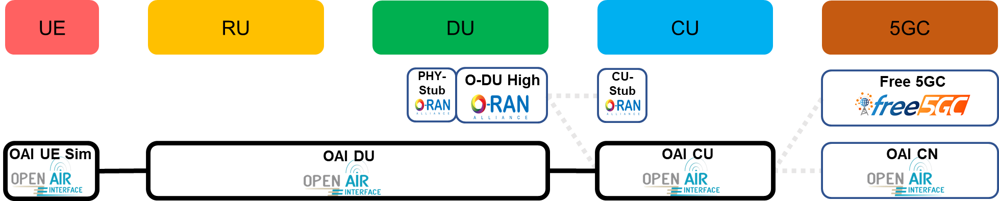

# The Installation of OpenAirInterface

## Environment
### Introduction Open Air Interface

Open Air Interface is an open-source software alliance aim to democratising 5G Technology development, established in 2014. Open Air Interface work on entire 5G Techstack, from developing RAN components (such as gNB, CU, DU), 5G Core Network development (creating AMF, SMF, UPF, etc) to develop CI/CD pipeline to seamless testing and integration for all 5G software components.
### Network Topology


### System and Equipment
VM 192.168.0.237 (SMO)
VM 192.168.0.155 (OAI CU and OAI DU)

## Prerequisite Installing OAI
### Install git and cmake

```
apt install -y git cmake build-essential
```
### Clone OAI Repository
Git clone repository from OAI and build up the binary first. In this case, we use UE simulator for testing.

```
git clone https://gitlab.eurecom.fr/oai/openairinterface5g.git
```

### Build from source code
command:
```
cd openairinterface5g
git checkout 2022.w40
```
output:
```bash
root@ubuntu:~/openairinterface5g# git checkout 2022.w40
Note: switching to '2022.w40'.

You are in 'detached HEAD' state. You can look around, make experimental
changes and commit them, and you can discard any commits you make in this
state without impacting any branches by switching back to a branch.

If you want to create a new branch to retain commits you create, you may
do so (now or later) by using -c with the switch command. Example:

  git switch -c <new-branch-name>

Or undo this operation with:

  git switch -

Turn off this advice by setting config variable advice.detachedHead to false

HEAD is now at 84611333c8 Merge branch 'integration_2022_wk40' into 'develop'
```

command:
```
source oaienv
cd cmake_targets
./build_oai -I
```
output:
```
root@ubuntu:~/openairinterface5g# source oaienv
root@ubuntu:~/openairinterface5g# cd cmake_targets
root@ubuntu:~/openairinterface5g/cmake_targets# ./build_oai -I
Will install external packages
RF HW set to None
Flags for Deadline scheduler: False
Flags for CPU Affinity:
2. Setting the OAI PATHS ...
OPENAIR_DIR    = /root/openairinterface5g
FreeDiameter prefix not found, install freeDiameter if EPC, HSS
Installing packages
.
.
.
protobuf/protobuf-c installation successful
installing dependencies successful
```

build up UE simulator and gNB command:
```
./build_oai --gNB --nrUE -w SIMU
```
output:
```
root@ubuntu:~/openairinterface5g/cmake_targets# ./build_oai --gNB --nrUE -w SIMU
Will compile gNB
Will compile NR UE
Setting hardware to: OAI_SIMU
RF HW set to OAI_SIMU
Flags for Deadline scheduler: False
Flags for CPU Affinity:
2. Setting the OAI PATHS ...
OPENAIR_DIR    = /root/openairinterface5g
FreeDiameter prefix not found, install freeDiameter if EPC, HSS
3. building the compilation directives ...
Processor has avx512 intrinsics
running cmake -DRF_BOARD=OAI_SIMU -DAVX512="True" -DAVX2="True" ../../..
.
.
.
Compiling nr-softmodem...
Log file for compilation is being written to: /root/openairinterface5g/cmake_targets/log/nr-softmodem.Rel15.txt
nr-softmodem compiled
WARNING: 38 warnings. See /root/openairinterface5g/cmake_targets/log/nr-softmodem.Rel15.txt
Compiling nr-uesoftmodem...
Log file for compilation is being written to: /root/openairinterface5g/cmake_targets/log/nr-uesoftmodem.Rel15.txt
nr-uesoftmodem compiled
WARNING: 16 warnings. See /root/openairinterface5g/cmake_targets/log/nr-uesoftmodem.Rel15.txt
Building shared libraries common to UE and gNB
Log file for compilation is being written to: /root/openairinterface5g/cmake_targets/log/params_libconfig.Rel15.txt
params_libconfig compiled
Log file for compilation is being written to: /root/openairinterface5g/cmake_targets/log/coding.Rel15.txt
coding compiled
liboai_device.so is not linked to any device library
Compiling rfsimulator
Log file for compilation is being written to: /root/openairinterface5g/cmake_targets/log/rfsimulator.Rel15.txt
rfsimulator compiled
Building transport protocol libraries
Log file for compilation is being written to: /root/openairinterface5g/cmake_targets/log/oai_eth_transpro.Rel15.txt
oai_eth_transpro compiled
liboai_transpro.so is linked to ETHERNET transport
10. Bypassing the Tests ...
BUILD SHOULD BE SUCCESSFUL
```

## Configure OAI
### Checking interface name and Aliasing interface
```
ifconfig
ifconfig ens18:CU 192.168.130.82
ifconfig ens18:DU 192.168.130.81
```
output:
```
root@ubuntu:~# ifconfig
ens18: flags=4163<UP,BROADCAST,RUNNING,MULTICAST>  mtu 1500
        inet 192.168.0.32  netmask 255.255.255.0  broadcast 192.168.0.255
        inet6 fe80::be24:11ff:fe2d:737b  prefixlen 64  scopeid 0x20<link>
        ether bc:24:11:2d:73:7b  txqueuelen 1000  (Ethernet)
        RX packets 558439  bytes 1276683004 (1.2 GB)
        RX errors 0  dropped 4698  overruns 0  frame 0
        TX packets 337435  bytes 26492006 (26.4 MB)
        TX errors 0  dropped 0 overruns 0  carrier 0  collisions 0

ens18:CU: flags=4163<UP,BROADCAST,RUNNING,MULTICAST>  mtu 1500
        inet 192.168.130.82  netmask 255.255.255.0  broadcast 192.168.130.255
        ether bc:24:11:2d:73:7b  txqueuelen 1000  (Ethernet)

ens18:DU: flags=4163<UP,BROADCAST,RUNNING,MULTICAST>  mtu 1500
        inet 192.168.130.81  netmask 255.255.255.0  broadcast 192.168.130.255
        ether bc:24:11:2d:73:7b  txqueuelen 1000  (Ethernet)

lo: flags=73<UP,LOOPBACK,RUNNING>  mtu 65536
        inet 127.0.0.1  netmask 255.0.0.0
        inet6 ::1  prefixlen 128  scopeid 0x10<host>
        loop  txqueuelen 1000  (Local Loopback)
        RX packets 306  bytes 31326 (31.3 KB)
        RX errors 0  dropped 0  overruns 0  frame 0
        TX packets 306  bytes 31326 (31.3 KB)
        TX errors 0  dropped 0 overruns 0  carrier 0  collisions 0
```
### Configure OAI-CU
1. Path to O-CU Config File
```
nano ~/openairinterface5g/targets/PROJECTS/GENERIC-NR-5GC/CONF/cu_gnb.conf
```
2. Configure mcc and mnc based on Free5GC webconsole
```
    // Tracking area code, 0x0000 and 0xfffe are reserved values
    tracking_area_code  =  1;
    plmn_list = ({ mcc = 208; mnc = 93; mnc_length = 2; snssaiList = ({ sst = 1 }) });
```

3. Modify IP local and remote
```

```

4. Setup the IP address of free5GC and the interface for NGU and setup the network interfaces
