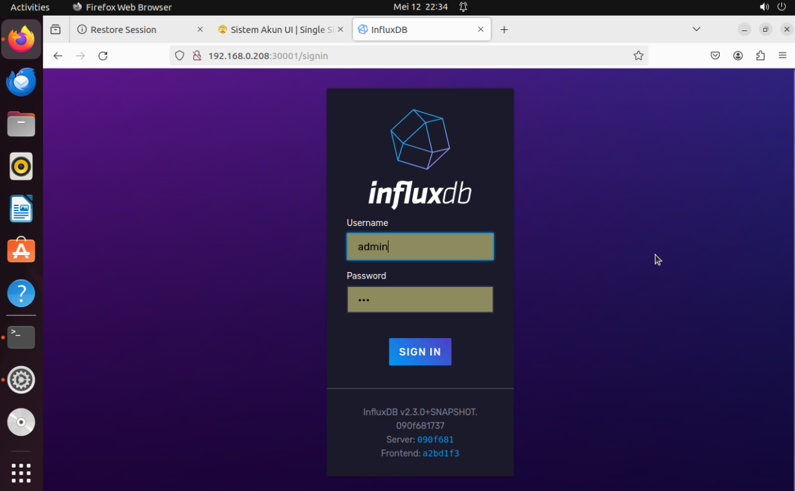
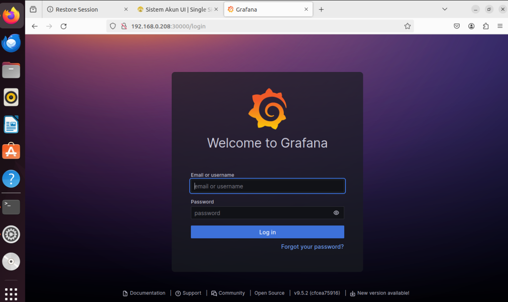

# The Installation of OSC SMO Latest Release

- [The Installation of OSC SMO Latest Release](#the-installation-of-osc-smo-latest-release)
  - [Introduction](#introduction)
  - [Environment](#environment)
    - [Mininum Requirement](#mininum-requirement)
      - [Hardware](#hardware)
      - [Software](#software)
  - [Used Hardware Specifications](#used-hardware-specifications)
    - [Prerequisite](#prerequisite)
      - [0. Log in as root](#0-log-in-as-root)
      - [1. Install Kubernetes with kubespray](#1-install-kubernetes-with-kubespray)
    - [Deployment](#deployment)
      - [1. Download the IT/dep repository from gerrit](#1-download-the-itdep-repository-from-gerrit)
      - [2. Setup Helm Charts](#2-setup-helm-charts)
      - [3. Deploy Components](#3-deploy-components)
    - [Deployment of dmaap-InfluxDB-adapter, InfluxDB and Grafana](#deployment-of-dmaap-influxdb-adapter-influxdb-and-grafana)
      - [1. Helm repository addition and installation](#1-helm-repository-addition-and-installation)
      - [2. Edit the values.yaml file](#2-edit-the-valuesyaml-file)
      - [3. Delete](#3-delete)
      - [4. If you edit the values.yaml , you need to upgrade the pod or delete and redeploy.](#4-if-you-edit-the-valuesyaml--you-need-to-upgrade-the-pod-or-delete-and-redeploy)
    - [Result](#result)
      - [InfluxDB](#influxdb)
      - [Grafana](#grafana)


## Introduction
This markdown guide consist of the step by step installation of O-RAN Service Community Service Management and Orchestration. This guide is based on this [HackMD](https://hackmd.io/@H141319/ByOoZCmDa)

## Environment
### Mininum Requirement
#### Hardware
```
6 or more CPU cores
28+ GB of RAM
50 GB of Disk 
```
#### Software
```
Ubuntu 22.04 server
Kubernetes v1.27.5 
python3 3.10.12 # Version should upper or equal to 3.9
SMO Release J (onap_upgrade provide by NYCU)
Non-RT RIC Release H
```

## Used Hardware Specifications
```
32 CPU cores (4 Sockets, 8 Cores)
50 GiB of RAM
100 GiB of Disk
```

### Prerequisite
#### 0. Log in as root
```bash
sudo -i
```

#### 1. Install Kubernetes with kubespray
command:
```bash
python3 --version # Version should upper or equal to 3.9
apt install -y python3-pip
```

output:
```bash
root@teep-template:~# python3 --version # Version should upper or equal to 3.9
apt install -y python3-pip
Python 3.10.12
Reading package lists... Done
Building dependency tree... Done
Reading state information... Done
python3-pip is already the newest version (22.0.2+dfsg-1ubuntu0.4).
0 upgraded, 0 newly installed, 0 to remove and 99 not upgraded.
```

command:
```bash
git clone https://github.com/kubernetes-sigs/kubespray -b release-2.23
cd kubespray 
pip install -r requirements.txt
```

output:
```bash
root@teep-template:~/kubespray# pip install -r requirements.txt
Requirement already satisfied: ansible==7.6.0 in /usr/local/lib/python3.10/dist-packages (from -r requirements.txt (line 1)) (7.6.0)
Requirement already satisfied: cryptography==41.0.1 in /usr/local/lib/python3.10/dist-packages (from -r requirements.txt (line 2)) (41.0.1)
Requirement already satisfied: jinja2==3.1.2 in /usr/local/lib/python3.10/dist-packages (from -r requirements.txt (line 3)) (3.1.2)
Requirement already satisfied: jmespath==1.0.1 in /usr/local/lib/python3.10/dist-packages (from -r requirements.txt (line 4)) (1.0.1)
Requirement already satisfied: MarkupSafe==2.1.3 in /usr/local/lib/python3.10/dist-packages (from -r requirements.txt (line 5)) (2.1.3)
Requirement already satisfied: netaddr==0.8.0 in /usr/local/lib/python3.10/dist-packages (from -r requirements.txt (line 6)) (0.8.0)
Requirement already satisfied: pbr==5.11.1 in /usr/local/lib/python3.10/dist-packages (from -r requirements.txt (line 7)) (5.11.1)
Requirement already satisfied: ruamel.yaml==0.17.31 in /usr/local/lib/python3.10/dist-packages (from -r requirements.txt (line 8)) (0.17.31)
Requirement already satisfied: ruamel.yaml.clib==0.2.7 in /usr/local/lib/python3.10/dist-packages (from -r requirements.txt (line 9)) (0.2.7)
Requirement already satisfied: ansible-core~=2.14.6 in /usr/local/lib/python3.10/dist-packages (from ansible==7.6.0->-r requirements.txt (line 1)) (2.14.15)
Requirement already satisfied: cffi>=1.12 in /usr/local/lib/python3.10/dist-packages (from cryptography==41.0.1->-r requirements.txt (line 2)) (1.16.0)
Requirement already satisfied: packaging in /usr/local/lib/python3.10/dist-packages (from ansible-core~=2.14.6->ansible==7.6.0->-r requirements.txt (line 1)) (24.0)
Requirement already satisfied: resolvelib<0.9.0,>=0.5.3 in /usr/local/lib/python3.10/dist-packages (from ansible-core~=2.14.6->ansible==7.6.0->-r requirements.txt (line 1)) (0.8.1)
Requirement already satisfied: PyYAML>=5.1 in /usr/lib/python3/dist-packages (from ansible-core~=2.14.6->ansible==7.6.0->-r requirements.txt (line 1)) (5.4.1)
Requirement already satisfied: pycparser in /usr/local/lib/python3.10/dist-packages (from cffi>=1.12->cryptography==41.0.1->-r requirements.txt (line 2)) (2.22)
```

command:
```bash
sed -i 's/\(kube_version: \)[^"]*/\1v1.27.5/' inventory/local/group_vars/k8s_cluster/k8s-cluster.yml
ansible-playbook -i inventory/local/hosts.ini --become --become-user=root cluster.yml
```

output:
```bash
root@teep-template:~/kubespray# sed -i 's/\(kube_version: \)[^"]*/\1v1.27.5/' inventory/local/group_vars/k8s_cluster/k8s-cluster.yml
ansible-playbook -i inventory/local/hosts.ini --become --become-user=root cluster.yml
[WARNING]: Skipping callback plugin 'ara_default', unable to load

PLAY [Check Ansible version] ***********************************************************************************
Jumat 19 April 2024  20:27:25 +0700 (0:00:00.015)       0:00:00.015 ***********

TASK [Check 2.14.0 <= Ansible version < 2.15.0] ****************************************************************
ok: [localhost] => {
    "changed": false,
    "msg": "All assertions passed"
}
Jumat 19 April 2024  20:27:25 +0700 (0:00:00.044)       0:00:00.060 ***********
```

command:
```bash
sed -i 's/\(kube_version: \)[^"]*/\1v1.27.5/' inventory/local/group_vars/k8s_cluster/k8s-cluster.yml
ansible-playbook -i inventory/local/hosts.ini --become --become-user=root cluster.yml
```

output:
```bash
root@teep-template:~/kubespray# sed -i 's/\(kube_version: \)[^"]*/\1v1.27.5/' inventory/local/group_vars/k8s_cluster/k8s-cluster.yml
ansible-playbook -i inventory/local/hosts.ini --become --become-user=root cluster.yml
[WARNING]: Skipping callback plugin 'ara_default', unable to load

PLAY [Check Ansible version] ***********************************************************************************
Jumat 19 April 2024  20:27:25 +0700 (0:00:00.015)       0:00:00.015 ***********

TASK [Check 2.14.0 <= Ansible version < 2.15.0] ****************************************************************
ok: [localhost] => {
    "changed": false,
    "msg": "All assertions passed"
}
Jumat 19 April 2024  20:27:25 +0700 (0:00:00.044)       0:00:00.060 ***********
.
.
.
download : Download_container | Download image if required ---------------------------------------------- 8.01s
download : Download_container | Download image if required ---------------------------------------------- 7.61s
container-engine/validate-container-engine : Populate service facts ------------------------------------- 7.39s
download : Download_container | Download image if required ---------------------------------------------- 7.17s
download : Download_container | Download image if required ---------------------------------------------- 6.97s
container-engine/containerd : Containerd | Unpack containerd archive ------------------------------------ 6.39s
container-engine/nerdctl : Download_file | Download item ------------------------------------------------ 6.34s
download : Download_container | Download image if required ---------------------------------------------- 6.30s
download : Download_container | Download image if required ---------------------------------------------- 6.13s
container-engine/runc : Download_file | Download item --------------------------------------------------- 6.11s
root@teep-template:~/kubespray#
```

command:
```bash
mkdir -p ~/.kube/config
sudo cp /etc/kubernetes/admin.conf ~/.kube/config
```

### Deployment
#### 1. Download the IT/dep repository from gerrit
command:
```bash
cd ~
git clone https://gerrit.o-ran-sc.org/r/it/dep.git -b master --recursive
```

output:
```bash
root@teep-template:~/kubespray# cd ~
git clone https://gerrit.o-ran-sc.org/r/it/dep.git -b master --recursive
Cloning into 'dep'...
remote: Counting objects: 427, done
remote: Finding sources: 100% (424/424)
Receiving objects:   5% (405/7203), 131.97 KiB | 19.00 KiB/s
```

#### 2. Setup Helm Charts
Execute the following commands being logged as root:
```bash
cd dep
##Setup ChartMuseum
./smo-install/scripts/layer-0/0-setup-charts-museum.sh

##Setup HELM3
./smo-install/scripts/layer-0/0-setup-helm3.sh

## Build ONAP/ORAN charts
./smo-install/scripts/layer-1/1-build-all-charts.sh
```

output:
```bash
[a1policymanagement]
make[1]: Entering directory '/root/dep/smo-install/onap_oom/kubernetes'
Hang tight while we grab the latest from your chart repositories...
2024-04-19T22:19:41.063+0700    INFO    [56] Request served     {"path": "/index.yaml", "comment": "", "clientIP": "127.0.0.1", "method": "GET", "statusCode": 200, "latency": "1.297377ms", "reqID": "cdf9f448-11ab-4187-99f2-5c3e3c732079"}
...Successfully got an update from the "local" chart repository
Update Complete. ⎈Happy Helming!⎈
Saving 3 charts
Downloading common from repo http://localhost:18080
2024-04-19T22:19:41.088+0700    INFO    [57] Request served     {"path": "/charts/common-13.0.2.tgz", "comment": "", "clientIP": "127.0.0.1", "method": "GET", "statusCode": 200, "latency": "471.474µs", "reqID": "88f85d36-10c1-458f-b53f-f6f59cf62302"}
Downloading repositoryGenerator from repo http://localhost:18080
2024-04-19T22:19:41.094+0700    INFO 
.
.
.
5360-9b7e-490c-9abf-cdb888df5cb4"}
Deleting outdated charts
Skipping linting of a1policymanagement
Pushing a1policymanagement-13.0.0.tgz to local...
2024-04-19T22:19:41.526+0700    INFO    [60] Request served     {"path": "/api/charts", "comment": "", "clientIP": "127.0.0.1", "method": "POST", "statusCode": 201, "latency": "22.081585ms", "reqID": "2c689f9e-4893-4d4d-9c15-82d6a397b31b"}
Done.
^Cmake[1]: *** [Makefile:84: package-a1policymanagement] Interrupt
make: *** [Makefile:52: a1policymanagement] Interrupt

root@teep-template:~/dep#
```

#### 3. Deploy Components
Execute the following commands being logged as root:
```bash
./smo-install/scripts/layer-2/2-install-oran.sh
```

### Deployment of dmaap-InfluxDB-adapter, InfluxDB and Grafana

#### 1. Helm repository addition and installation
```bash
helm repo add winlab https://harbor.winfra.cs.nycu.edu.tw/chartrepo/winlab-oran
helm install --namespace=o1ves o1ves winlab/o1ves-visualization --create-namespace
```

output:
```bash
root@node1:~# helm repo add winlab https://harbor.winfra.cs.nycu.edu.tw/chartrepo/winlab-oran
"winlab" has been added to your repositories
root@node1:~# helm repo add winlab https://harbor.winfra.cs.nycu.edu.tw/chartrepo/winlab-oran
helm install --namespace=o1ves o1ves winlab/o1ves-visualization --create-namespace
"winlab" already exists with the same configuration, skipping


NAME: o1ves
LAST DEPLOYED: Wed May  8 12:58:59 2024
NAMESPACE: o1ves
STATUS: deployed
REVISION: 1
NOTES:
o1ves-visualization has been installed. Check its status by running:
  kubectl --namespace o1ves get pods -l "release=o1ves"
```

#### 2. Edit the values.yaml file
```bash
helm show values winlab/o1ves-visualization > values.yaml
```
edited value.yaml file:
```bash
dmaap-influxdb-adapter:
  image:
    pullPolicy: Always
  logLevel: DEBUG
  rules:
    - topic: unauthenticated.VES_MEASUREMENT_OUTPUT
      rules:
        - bucket: my-bucket
          measurement: slice-measurement
          matches: 
            - key: event.commonEventHeader.domain
              value: stndDefined
          tags:
            - key: vendor
              value: ntust-taiwan-lab
            - key: sourceName
              field: event.commonEventHeader.sourceName
          fields:
            - key: avg-throughput-downlink
              field: event.stndDefinedFields.data.measurements[0].value
              type: int
            - key: ue-avg-mcs-index
              field: event.stndDefinedFields.data.measurements[1].value
              type: float
buckets:
  - name: my-bucket
```

#### 3. Delete
```bash
helm uninstall --namespace o1ves o1ves  
kubectl delete ns o1ves
sudo rm -r /dockerdata-nfs/o1ves-*
```
output:
```bash
root@node1:~# helm uninstall --namespace o1ves o1ves
kubectl delete ns o1ves
sudo rm -r /dockerdata-nfs/o1ves-*
These resources were kept due to the resource policy:
[PersistentVolumeClaim] o1ves-influxdb2

release "o1ves" uninstalled
namespace "o1ves" deleted
```

#### 4. If you edit the values.yaml , you need to upgrade the pod or delete and redeploy.
```bash
## Upgrade
helm upgrade --namespace=o1ves o1ves winlab/o1ves-visualization --create-namespace -f value2.yml

## Redeploy
helm uninstall --namespace o1ves o1ves  
kubectl delete ns o1ves
sudo rm -r /dockerdata-nfs/o1ves-*
helm install --namespace=o1ves o1ves winlab/o1ves-visualization --create-namespace -f values.yaml
```

output:
```bash
root@node1:~# ## Upgrade
helm upgrade --namespace=o1ves o1ves winlab/o1ves-visualization --create-namespace -f value2.yml

## Redeploy
helm uninstall --namespace o1ves o1ves
kubectl delete ns o1ves
sudo rm -r /dockerdata-nfs/o1ves-*
helm install --namespace=o1ves o1ves winlab/o1ves-visualization --create-namespace -f values.yaml
Error: open value2.yml: no such file or directory
Error: uninstall: Release not loaded: o1ves: release: not found
Error from server (NotFound): namespaces "o1ves" not found
rm: cannot remove '/dockerdata-nfs/o1ves-*': No such file or directory
NAME: o1ves
LAST DEPLOYED: Wed May  8 13:07:22 2024
NAMESPACE: o1ves
STATUS: deployed
REVISION: 1
NOTES:
o1ves-visualization has been installed. Check its status by running:
  kubectl --namespace o1ves get pods -l "release=o1ves"
```

### Result
#### InfluxDB
http:/<host_ip>/:30001
username and password : (admin/)
Use this command to find the password:
```bash
kubectl get secret -n o1ves o1ves-influxdb2-auth -o json
```

find the password then echo:
```bash
echo OGMwdDRYRG1xUXNyR29BQ3hCZFdVZkZGeGJqUlRpTlc= | base64 -d
```

If InfluxDB port didn't open, you can refer this:
```bash
kubectl edit svc -n o1ves o1ves-influxdb2

# line 33 add: nodePort:30001
# line 41 type change to NodePort
```



#### Grafana
http:/<host_ip>/:30000
Comment
Suggest edit
Here we use http://192.168.8.12:30000

username and password : (admin/smo)


