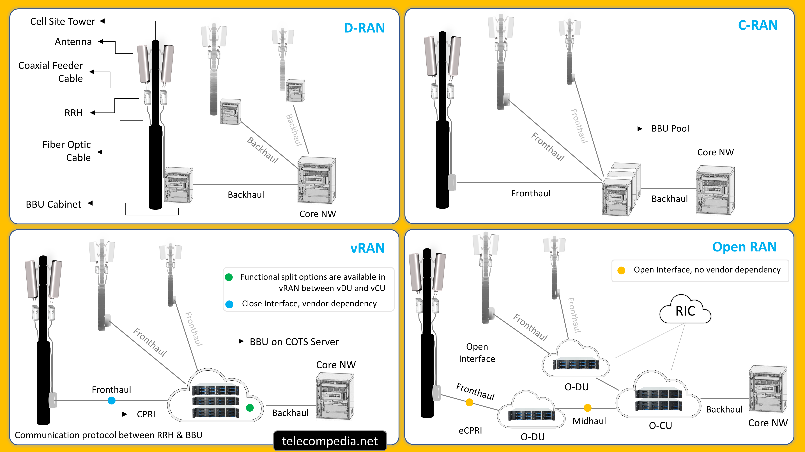

# The Study of 5G O-RAN

- [The Study of 5G O-RAN](#the-study-of-5g-o-ran)
  - [1. Open Radio Access Network](#1-open-radio-access-network)
    - [1.1. What is 5G O-RAN](#11-what-is-5g-o-ran)
    - [1.2. Radio Access Network (RAN)](#12-radio-access-network-ran)
    - [1.3. Difference between RAN and O-RAN](#13-difference-between-ran-and-o-ran)
    - [1.4. RAN Disaggregation](#14-ran-disaggregation)
      - [1.4.1. Virtualized RAN (vRAN)](#141-virtualized-ran-vran)
      - [1.4.2. Centralized RAN (C-RAN)](#142-centralized-ran-c-ran)
      - [1.4.3. Distributed RAN (D-RAN)](#143-distributed-ran-d-ran)
    - [1.5. RAN Functional Split Options](#15-ran-functional-split-options)
    - [1.6. Centralized and Decentralized Function Splits in 5G RAN](#16-centralized-and-decentralized-function-splits-in-5g-ran)
  - [2. Components General Overview of 5G O-RAN Architechture](#2-components-general-overview-of-5g-o-ran-architechture)
    - [2.1. Overall General Architechture](#21-overall-general-architechture)
    - [2.2. Radio Side Architechture](#22-radio-side-architechture)
    - [2.3. Management Side Architechture](#23-management-side-architechture)
  - [3. Detail Components](#3-detail-components)
    - [3.1. O-RAN Radio Unit (O-RU)](#31-o-ran-radio-unit-o-ru)
    - [3.2. O-RAN Distributed Unit (O-DU)](#32-o-ran-distributed-unit-o-du)
    - [3.3. O-RAN Central Unit (O-CU)](#33-o-ran-central-unit-o-cu)
    - [3.4. Near-RT RIC](#34-near-rt-ric)
    - [3.5. O-CU-CP (Control Plane)](#35-o-cu-cp-control-plane)
    - [3.6. O-CU-UP (User Plane)](#36-o-cu-up-user-plane)
    - [3.7. Service Management and Orchestration Framework](#37-service-management-and-orchestration-framework)
    - [3.8. O1 Interface](#38-o1-interface)
    - [3.9. O2 Interface](#39-o2-interface)
  - [4. Enhanced Common Public Radio Interface (E-CPRI)](#4-enhanced-common-public-radio-interface-e-cpri)
  - [5. DevOps and Usage Case in 5G OpenRAN](#5-devops-and-usage-case-in-5g-openran)
    - [5.1. DevOps](#51-devops)
    - [5.2. Usage Case](#52-usage-case)

## 1. Open Radio Access Network
### 1.1. What is 5G O-RAN

O-RAN, or Open Radio Access Network, is a type of wireless network that involves the disaggregation and virtualization of network elements, allowing for open interfaces and interoperability between hardware and software from different vendors. It is designed to promote standardization, reduce infrastructure costs, and enable the deployment of 5G services. The O-RAN architecture includes various components such as O-RU (O-RAN Radio Unit), O-DU (O-RAN Distributed Unit), O-CU (O-RAN Central Unit), and interfaces like O1 and O2 for management and orchestration. The O-RAN Alliance, founded in 2018, is a global community of mobile network operators, vendors, and academic institutions working together to advance O-RAN technology and virtualization in the RAN industry.

O-RAN separates software and hardware, known as disaggregation, which allows for the use of open management and orchestration with external AI/ML capabilities. It also provides RAN automation interfaces and open internal RAN interfaces defined by 3GPP and the O-RAN Alliance. This open-source approach to networking is intended to simplify wide-scale communication, reduce infrastructure costs, and enable the deployment of 5G services. The O-RAN Alliance, a global community of mobile network operators, vendors, and academic institutions, is working to advance O-RAN technology and virtualization in the RAN industry.

O-RAN is a significant development in wireless network technology that aims to standardize and open up the RAN, reduce infrastructure costs, and enable the deployment of 5G services through the use of open interfaces and interoperability between hardware and software from different vendors.

### 1.2. Radio Access Network (RAN)
RAN stands for Radio Access Network, which is a part of a cellular network that connects user devices to the core network. It is a type of network infrastructure used commonly for mobile networks that consist of radio base stations with large antennas. The RAN wirelessly connects user equipment to a core network. In a RAN, the radio unit (RU) processes digital radio signals and transmits, receives, and converts the signals for the RAN base station. When the RU receives signal information from the antennas, it communicates with the baseband unit (BBU) using the Common Public Radio Interface (CPRI). The BBU takes the signal information and processes it so it can be forwarded to the core network. Different generations of mobile networks use different variations of RANs. The future of RANs will be heavily influenced by 5G deployments and the push for open-source RANs.

### 1.3. Difference between RAN and O-RAN

RAN, which is a part of a cellular network that connects user devices to the core network. On the other hand, O-RAN, is a type of wireless network that involves the disaggregation and virtualization of network elements, allowing for open interfaces and interoperability between hardware and software from different vendors. The O-RAN architecture includes various components such as O-RU (O-RAN Radio Unit), O-DU (O-RAN Distributed Unit), O-CU (O-RAN Central Unit), and interfaces like O1 and O2 for management and orchestration. The O-RAN Alliance, founded in 2018, is a global community of mobile network operators, vendors, and academic institutions working together to advance O-RAN technology and virtualization in the RAN industry. In summary, RAN is a part of a cellular network, while O-RAN is a type of wireless network that involves the disaggregation and virtualization of network elements, allowing for open interfaces and interoperability between hardware and software from different vendors.

### 1.4. RAN Disaggregation

5G RAN disaggregation refers to the separation of the Radio Access Network (RAN) functions from proprietary hardware and breaking them down into smaller components that can be run on generic hardware. This disaggregation can be achieved through various architectures, including Virtual RAN (vRAN), Cloud RAN (C-RAN), and Open RAN (O-RAN). Distributed RAN (D-RAN) and Centralized RAN (C-RAN) are dueling architectures that refer to the placement of the radio processing equipment. Disaggregation and decomposition are independent concepts, with disaggregation referring to separating the RAN software from customized hardware and running it on generic hardware, while decomposition refers to splitting the RAN's function performed by the radio and baseband units and distributing them between Radio, Distributed, and Centralized Units (RU, DU, and CU). By enabling open interfaces and unifying the RAN with the core and edge clouds, transforming to vRAN and O-RAN will drive competition and increase innovation.

#### 1.4.1. Virtualized RAN (vRAN)
Virtualized Radio Access Network (vRAN) is a telecommunications architecture that allows operators to run their baseband functions as software on standard servers, separating the RAN functions from proprietary hardware. This virtualization is part of a larger network function virtualization (NFV) effort and is associated with 5G networks. Some key aspects and benefits of vRAN include:

1. **Separation of Hardware and Software**: vRAN separates the hardware from the software, allowing RAN functions to be run on standard servers instead of proprietary hardware.

2. **Flexibility and Scalability**: It provides greater flexibility, allowing for the easy implementation of functionality and capacity where and when it is required. This makes the network more agile and flexible, and resources can be scaled or de-scaled based on changing network demands.

3. **Cost Reduction and Efficiency**: vRAN can lead to cost reduction by using less expensive hardware, increasing flexibility, and simplifying network management. It also enables greater power efficiency and lower cost of ownership.

4. **Open Interfaces and Interoperability**: vRAN enables open interfaces and unifies the RAN with the core and edge clouds, driving competition and increasing innovation. It also allows for interoperability across various RAN functions and network functions from the core, edge, to RAN.

5. **Centralized and Distributed Units**: In vRAN, the RAN's functions are decomposed and distributed between Radio, Distributed, and Centralized Units (RU, DU, and CU), with the Centralized Unit (CU) providing non-real-time processing and access control.

vRAN is a key component of 5G networks, providing operators with a more flexible, cost-effective, and efficient way to manage their RAN functions by virtualizing them and running them on standard servers.

#### 1.4.2. Centralized RAN (C-RAN)
Cloud Radio Access Network (C-RAN) is a centralized, cloud computing-based architecture for radio access networks that supports 2G, 3G, 4G, and future wireless communication standards. In C-RAN architecture, the baseband units (BBUs) are delocalized and grouped together in a pool, and the radio processing equipment for multiple cell sites is pooled together in a location central to those sites. The BBUs are connected to the remote radio heads (RRHs) via a fiber optic link referred to as the fronthaul. C-RAN provides a centralized management interface that simplifies the deployment, configuration, and management of the network, leading to reduced operational costs and improved network efficiency. C-RAN has several benefits, including reduced CAPEX/OPEX for operators, enhanced capacity and coverage, improved energy efficiency, and lower latency. C-RAN is a key technology in the development of new generations of wireless technology, such as 5G and the internet of things. C-RAN networks comprise three primary components: a BBU hotel, individual units, and a fronthaul. The BBU hotel is a centralized site that functions as a data or processing center, while individual units can be located at cell sites. The fronthaul is a fiber-based connection between the BBU pool and each RRH site. C-RAN is significant in the future progression of wireless technology, and the transition from Long-Term Evolution to 5G networks will rely heavily on C-RAN development.

#### 1.4.3. Distributed RAN (D-RAN)
Distributed Radio Access Network (D-RAN) is an architecture that involves the distribution of radio access network functions among multiple locations, such as remote radio heads (RRHs) and baseband units (BBUs). This separation enables the deployment of RAN functions in various locations, providing better coverage and capacity for users. Some key aspects and benefits of D-RAN include:

1. **Lower Fronthaul Requirements**: D-RAN architecture does not rely on high-capacity, low-latency fronthaul connections, as the BBUs are co-located with the RF components at the cell sites. This reduces the need for extensive fiber infrastructure and simplifies network deployment.

2. **Network Resiliency**: Each cell site operates independently in D-RAN, providing inherent resiliency to network failures or outages. If one cell site experiences a failure, others can continue to operate, enhancing network resiliency.

3. **Improved Efficiency and Flexibility**: D-RANs are more efficient and flexible than traditional RANs, as the processing and control functions can be easily reconfigured and scaled according to changing network demands.

4. **Improved Coverage**: D-RANs can provide improved coverage compared to traditional RANs, as the RRHs can be strategically placed to provide optimal coverage in different areas.

D-RAN is an architecture that aims to distribute the processing and control functions of a RAN among multiple locations, providing improved efficiency, flexibility, and coverage compared to traditional RANs.

### 1.5. RAN Functional Split Options
The functional split options in 5G RAN refer to the division of functions between the central unit (CU) and the distributed unit (DU) in the radio access network (RAN). There are eight functional split options available as per 3GPP's 5G-NR RAN specification. The functional split options can be broadly classified as either a high layer split (HLS) or a low layer split (LLS). The HLS is progressing as a work item within 3GPP, while the LLS is still making significant progress. The low-level splits, options 6, 7, and 8, are gaining most traction within the industry. The O-RAN Alliance supports mainly option 7.2 for networks with high-capacity and high-bandwidth. The split options will be advantageous and provide gain only when a complete end-to-end network is considered while developing. The choice of functional split depends on the services provided, the economics, and the markets targeted. No single functional split will suit all scenarios.

### 1.6. Centralized and Decentralized Function Splits in 5G RAN
The difference between centralized and decentralized functional splits in 5G RAN lies in the distribution of base station functions. In a centralized split, more functions are located in a central unit (CU), while in a decentralized split, more functions are distributed to the distributed unit (DU) closer to the antenna. The choice between these splits affects factors such as fronthaul requirements, latency, and the ability to support advanced 5G features. The 3GPP has defined eight functional split options, and the O-RAN Alliance and Small Cell Forum have also proposed specifications for 5G functional split. The split options will be advantageous and provide gain only when a complete end-to-end network is considered while developing. The choice of functional split depends on the services provided, the economics, and the markets targeted. No single functional split will suit all scenarios.

The impact of centralized and decentralized functional splits in 5G RAN on scalability is significant. The choice between these splits affects factors such as fronthaul requirements, latency, and the ability to support advanced 5G features. Centralized splits, where more functions are located in a central unit (CU), can lead to a very tightly coordinated RAN, allowing efficient support of advanced 5G features that require extremely low latency. On the other hand, decentralized splits, where more functions are distributed to the distributed unit (DU) closer to the antenna, can support extended cell edge coverage benefits and higher throughput compared to LTE. The split options will be advantageous and provide gain only when a complete end-to-end network is considered while developing. The choice of functional split depends on the services provided, the economics, and the markets targeted. No single functional split will suit all scenarios.

## 2. Components General Overview of 5G O-RAN Architechture

### 2.1. Overall General Architechture
The basic components of the 5G O-RAN architecture include the following:
* O-RU (O-RAN Radio Unit): Responsible for providing wireless connectivity, supporting open interfaces, and implementing advanced radio access technologies.
* O-DU (O-RAN Distributed Unit): Handles the High-PHY, MAC, and RLC protocols in the RAN protocol stack.
* O-CU (O-RAN Central Unit): Hosts essential protocols, including the radio resource control (RRC), service data adaptation protocol (SDAP), and packet data convergence protocol (PDCP).

### 2.2. Radio Side Architechture
The radio side architecture of the 5G O-RAN includes the following components:
* Near-RT RIC: Monitors and manages RF resources in the network to optimize network performance.
* O-CU-CP (Control Plane): Hosts the RRC and the control plane part of the PDCP protocol.
* O-CU-UP (User Plane): Hosts the user plane part of the PDCP protocol and the SDAP protocol.
* O-DU: Hosts RLC/MAC/High-PHY layers based on a lower layer functional split.
* O-RU: Logical node hosting Low-PHY layer and RF processing based on a lower layer functional split.

### 2.3. Management Side Architechture
The management side architecture of the 5G O-RAN includes the following components:
* Service Management and Orchestration Framework: Contains a Non-RT- Components Definition.
* O1 Interface: Logical connection between all "O-RAN Managed Elements (MEs)" and the "management entities" within the Service Management and Orchestration (SMO) framework.
* O2 Interface: Provides a standard interface between the SMO framework and the O-Cloud.

The 5G O-RAN architecture is designed to promote standardization, reduce infrastructure costs, and enable the deployment of 5G services through the use of open interfaces and interoperability between hardware and software from different vendors. It includes various components such as O-RU, O-DU, O-CU, Near-RT RIC, and interfaces like O1 and O2 for management and orchestration. This architecture represents a significant development in wireless network technology, aiming to standardize and open up the RAN, reduce infrastructure costs, and enable the deployment of 5G services.

## 3. Detail Components
### 3.1. O-RAN Radio Unit (O-RU)

The O-RU (O-RAN Radio Unit) is a key component in the Open Radio Access Network (O-RAN) architecture, playing a crucial role in the deployment of next-generation mobile networks. It is responsible for providing wireless connectivity between user devices and the core network, supporting open interfaces, operating in various frequency bands, and implementing advanced radio access technologies.

The O-RU's functions include:
- Baseband processing
- Radio resource management, including power control, interference management, handover procedures, and scheduling algorithms
- Implementing security mechanisms to protect the wireless network
- Supporting encryption
- Enabling the deployment of multiple virtual instances on shared hardware, reducing equipment costs and energy consumption
- Simplifying network operations and maintenance through centralized management and orchestration.

The O-RU is where the radio frequency signals are transmitted, received, amplified, and digitized. It is located near or integrated into the antenna. The O-RU is a logical node hosting Low-PHY layer and RF processing based on a lower layer functional split, similar to 3GPP's "TRP" or "RRH".

The O-RU is a critical component of the O-RAN architecture, responsible for providing wireless connectivity, supporting open interfaces, and implementing advanced radio access technologies. It plays a key role in the transformation of traditional radio access networks by introducing an open, disaggregated, and virtualized approach to network deployment.

### 3.2. O-RAN Distributed Unit (O-DU)

The O-RAN Distributed Unit (O-DU) is a crucial component in the O-RAN architecture, responsible for handling the High-PHY, MAC, and RLC protocols in the RAN protocol stack. It is a commercial off-the-shelf (COTS) edge server that can function as a baseband processing unit, supporting network function virtualization (NFV) or containerization. The O-DU is designed to run real-time RAN functions and is based on Intel Architecture, optimized to perform the main baseband processing tasks.

The main components for O-DU design include:
- **Central Processing Unit (CPU)**: Performs the main baseband processing tasks.
- **Memory**: Defines the amount of memory available for processing.
- **Network Interface Cards (NICs)**: Deployed for southbound fronthaul connectivity between O-DU and O-RU.
- **Synchronization and Transport**: GPS/PTP (IEEE 1588) modules can be used for synchronization, while transport NIC cards are used for fronthaul connectivity.

The O-DU is designed to support different 3GPP-specified functional splits, synchronization using IEEE1582 v2 or GPS (optional), various operating systems, and virtualization/containerization technologies. It is designed for both outdoor and indoor scenarios. The O-DU plays a critical role in the transformation of traditional radio access networks by introducing an open, disaggregated, and virtualized approach to network deployment.

### 3.3. O-RAN Central Unit (O-CU)
The O-RAN Central Unit (O-CU) is a fundamental component in the O-RAN architecture, responsible for hosting essential protocols and playing a key role in the transformation of traditional radio access networks by introducing an open, disaggregated, and virtualized approach to network deployment. The O-CU is further divided into two parts: the O-CU-CP (Control Plane) and the O-CU-UP (User Plane). The O-CU-CP is a logical node that hosts the Radio Resource Control (RRC) and the control plane part of the Packet Data Convergence Protocol (PDCP) protocol. On the other hand, the O-CU-UP is a logical node that hosts the user plane part of the PDCP protocol and the Service Data Adaptation Protocol (SDAP).

The O-CU is designed to run the layer 3 protocol in the Radio Access Network (RAN) and is responsible for controlling and optimizing the elements and resources of an O-RAN. It interacts with multiple Distributed Units (DUs) and forwards the digitized radio signal into the network or Internet. The O-CU is a critical element in the O-RAN architecture, enabling the deployment of 5G services through its open, disaggregated, and virtualized approach to network deployment.

The O-RAN Central Unit (O-CU) is a fundamental component in the O-RAN architecture, responsible for hosting essential protocols and playing a key role in the transformation of traditional radio access networks by introducing an open, disaggregated, and virtualized approach to network deployment.

### 3.4. Near-RT RIC

The Near-RT RIC (RAN Intelligent Controller) is a logical function that enables near-real-time control and optimization of RAN elements and resources in the O-RAN architecture. It is responsible for intelligent edge control of RAN nodes and resources and resides within a telco edge cloud or regional cloud. The Near-RT RIC controls RAN elements and their resources with optimization actions that typically take between 10 milliseconds and one second to complete. It receives policy guidance from the non-RT RIC and provides policy feedback to the non-RT RIC. The Near-RT RIC is responsible for fine-grained RRM (Radio Resource Management) of control-plane and user-plane of the RAN protocol stack at a per-UE level over the E2 interface. The Near-RT RIC is typically deployed at the edge of the RAN and is a key component in the O-RAN architecture, enabling the deployment of 5G services through its open, disaggregated, and virtualized approach to network deployment.

### 3.5. O-CU-CP (Control Plane)
The O-CU-CP (O-RAN Central Unit-Control Plane) is a logical node that hosts the Radio Resource Control (RRC) and the control plane part of the Packet Data Convergence Protocol (PDCP) protocol in the O-RAN architecture. The O-CU-CP is responsible for controlling and optimizing the elements and resources of an O-RAN. It interacts with multiple Distributed Units (DUs) and forwards the digitized radio signal into the network or Internet. The O-CU-CP is a critical element in the O-RAN architecture, enabling the deployment of 5G services through its open, disaggregated, and virtualized approach to network deployment. The O-CU-CP is a standardized interface that connects the SMO to the RAN managed elements, including the near real-time RIC, O-CU, O-DU, O-RU, and the open evolved NodeB (O-eNB). The O-CU-CP enables the management of all O-RAN components that need to be orchestrated and the components managed via O-CU-CP include the near-RT RIC, the O-CU, and the O-DU in 5G NR.

### 3.6. O-CU-UP (User Plane)
The O-CU-UP (O-RAN Central Unit-User Plane) is a fundamental component in the O-RAN architecture, responsible for hosting the user plane part of the Packet Data Convergence Protocol (PDCP) protocol and the Service Data Adaptation Protocol (SDAP). It is a logical node that handles the user plane aspects of the RAN protocol stack, including the processing and adaptation of service data and the transmission of user plane data. The O-CU-UP is designed to run the user plane functions in the RAN and is a critical element in the O-RAN architecture, enabling the deployment of 5G services through its open, disaggregated, and virtualized approach to network deployment.

### 3.7. Service Management and Orchestration Framework

Service Management and Orchestration (SMO) in the O-RAN architecture provides centralized control, automation, and optimization of services and resources. It enhances flexibility, simplifies service lifecycle management, and orchestrates the allocation and utilization of resources within the O-RAN architecture. SMO monitors the health, performance, and quality of services in the O-RAN ecosystem. It enables the coexistence of multiple services with varying characteristics, promotes interoperability among different vendors' equipment and software components, and facilitates multi-vendor deployments. 

SMO plays a vital role in achieving this interoperability by providing standardized interfaces and enabling the integration of new services and technologies. The O-RAN Alliance's architecture principles aim to minimize proprietary hardware dependency and make the network more accessible to a broader range of vendors. The key O-RAN SMO interfaces include the O1 and O2 interfaces, which are essential for the operation, management, and communication between different network functions within the 5G O-RAN architecture. The O1 interface is a logical connection between all "O-RAN Managed Elements (MEs)" and the "management entities" within the SMO framework, supporting typical FCAPS and other management functions. The O2 interface provides a standard interface between the SMO framework and the O-Cloud, enabling secured communication and platform resources and workload management. 

SMO is a crucial automation platform for Open RAN Radio Resources and is known as Service Management and Orchestration (SMO). It provides a common data collection platform for the management of RAN data as well as mediation for O1, O2, and A1 interfaces. The SMO platform supports multiple deployment options to suit end-user requirements, such as distributed systems, on-premises deployment with telco-cloud as-a-Service, and more. Overall, SMO is a fundamental component in the O-RAN architecture, enabling the deployment of 5G services through its open, disaggregated, and virtualized approach to network deployment.

### 3.8. O1 Interface
The O1 interface is a logical connection between all "O-RAN Managed Elements (MEs)" and the "management entities" within the Service Management and Orchestration (SMO) framework. It is a crucial interface in the O-RAN architecture, supporting the operation and management of O-RAN components, including the near-RT RIC, the O-CU, the O-DU, and the O-RU. The O1 interface supports typical FCAPS (Fault, Configuration, Accounting, Performance, and Security) and other management functions, such as discovery/registration, configuration of addressing, versioning, and monitoring. It also allows the collection, access to, and management of data records relating to the traffic transferred over the RAN, selected routing, and handover operations. The O1 interface is essential for the overall O-RAN architecture and network operation. It is a standardized interface that connects the SMO to the RAN managed elements, including the near real-time RIC, O-CU, O-DU, O-RU, and the open evolved NodeB (O-eNB). The O1 interface enables the management of all O-RAN components that need to be orchestrated and the components managed via O1 include the near-RT RIC, the O-CU, and the O-DU in 5G NR.

### 3.9. O2 Interface
The O2 interface is a key component of the O-RAN architecture, providing a standard interface between the Service Management and Orchestration (SMO) framework and the O-Cloud. It enables secured communication between these entities, allowing for platform resources and workload management. The O2 interface is built on top of the O2 Service in StarlingX, providing a common language for different network functions to communicate with each other. This feature allows telecom providers to leverage powerful cloud infrastructure capabilities and customize their 5G networks to meet specific needs and requirements, without being locked into a single vendor's solution. The O2 interface is a standardized interface that connects the SMO to the O-Cloud, enabling the management of O-Cloud infrastructures and the network functions virtualization (NFV), and cloud-native architectures to enable a more flexible, scalable, and efficient network infrastructure.

## 4. Enhanced Common Public Radio Interface (E-CPRI)

eCPRI is a protocol used in 5G Open RAN to connect the radio unit (RU) and distributed unit (DU) via fronthaul transport. Compared to CPRI, eCPRI reduces both latency and jitter for high-priority traffic and improves the efficiency of 5G fronthaul networks. eCPRI is more suitable for 5G because it is packet-based and works on functional split, which determines the fronthaul capacity requirements and with what parameters the fronthaul bandwidth scales with real active user data. eCPRI gives the radio access network more flexibility and enables a reduction in fronthaul costs by leveraging industry-standard technologies like Ethernet and PTP synchronization. Additionally, eCPRI has a function splitting feature inside the PHY layer, which keeps most of the functions in the BBU, reducing the number of radio equipment on the tower and allowing faster introduction of new features. The eCPRI interface enables flexibility as it depends on the functional split between DU and the required bandwidth can scale flexibly and proportionally with user plane traffic.

eCPRI (Enhanced Common Public Radio Interface) improves the efficiency of 5G fronthaul networks in several ways. Compared to CPRI, eCPRI reduces both latency and jitter for high-priority traffic, leading to improved network performance. It also offers a more flexible and scalable architecture, supporting virtualization options like Ethernet and IP, which can lead to a reduction in fronthaul costs. Additionally, eCPRI's function splitting feature inside the PHY layer keeps most of the functions in the Baseband Unit (BBU), reducing the number of radio equipment on the tower and allowing faster introduction of new features. Furthermore, eCPRI's packet-based nature and functional split determine the fronthaul capacity requirements and how the fronthaul bandwidth scales with real active user data, providing more flexibility and efficiency in 5G fronthaul networks.

## 5. DevOps and Usage Case in 5G OpenRAN
### 5.1. DevOps

DevOps plays a crucial role in 5G ORAN by enabling operators to automate the development, deployment, and operation of the RAN functions as software applications on cloud platforms. DevOps helps to support short software development cycles and frequent software delivery, which is essential for Open RAN, the most transaction-intensive and time-sensitive area of the network. The Continuous Integration/Continuous Delivery (CI/CD) methodology is a DevOps approach that helps to automate the software delivery process, reducing the time and effort required to release software into production. Open RAN also promotes a microservices-based flexible and responsive container environment, which is managed and upgraded when needed. The use cases of Open RAN include managing mobile handoff, network connection optimization, traffic steering, and resource sharing. Traffic steering is an important element of the current mobile systems due to the heterogeneous network in 5G, and Open RAN enables dynamic and flexible network slicing, allowing enterprises to allocate network resources based on their unique requirements. The use cases of Open RAN in private 5G include industrial IoT and automation, smart cities, retail and hospitality, and public safety and emergency services. Automation is a key factor in the success of 5G at scale, and it is essential for the deployment and management of 5G networks. AI and analytics are also important in automating the full lifecycle of services and network slices in 5G operations.

Some best practices for implementing DevOps in 5G ORAN include:

1. **Cloud-Native Security**: Ensure that security is embedded in the entire lifecycle management from development to deployment to address the new security risks introduced by ORAN's disaggregated networks and open-source code.

2. **Continuous Integration/Continuous Delivery (CI/CD)**: Implement CI/CD methodology to automate the software delivery process, reducing the time and effort required to release software into production.

3. **Test Automation Strategy**: Establish a robust test automation strategy, especially with CI/CD and DevOps process proficiencies, to ensure optimal 5G deployments.

4. **Microservices-Based Architecture**: Leverage a microservices-based flexible and responsive container environment, which is managed and upgraded when needed, to support the evolution of RAN towards more openness with ORAN.

5. **Domain Orchestration**: Implement domain orchestration with cloud-native microservices, a DevOps design platform, and a model-driven approach to minimize errors and maximize programmability.

6. **NFV Security Framework**: Adhere to the NFV security framework, which includes best practices for mitigating the main cybersecurity risks of 5G networks, especially in the context of Network Function Virtualization (NFV) and software-Defined Networking (SDN).

These practices aim to improve collaboration, communication, and automation between development and operations, enabling faster innovation, better performance, and higher reliability in 5G ORAN.

### 5.2. Usage Case
The use cases of 5G Open RAN (O-RAN) include various applications and scenarios that leverage the capabilities of this technology. Some of the use cases of 5G O-RAN are:

1. **Managing Mobile Handoff**: This involves the seamless transfer of a mobile device's connection from one base station to another.

2. **Network Connection Optimization**: Optimizing network connections to ensure efficient and reliable communication for connected devices.

3. **Traffic Steering**: Directing network traffic to optimize performance and resource utilization.

4. **Resource Sharing**: Efficient sharing of network resources to support various services and applications.

5. **MEC-RAN Integration for Low-Latency Use Case**: Integrating Multi-Access Edge Computing (MEC) with RAN to support low-latency applications, such as augmented reality and real-time analytics.

6. **UAV Resource Allocation**: Allocating resources to support the connectivity and communication requirements of Unmanned Aerial Vehicles (UAVs).

These use cases demonstrate the diverse applications of 5G O-RAN, ranging from traditional mobile network management to emerging technologies like MEC and UAV connectivity.