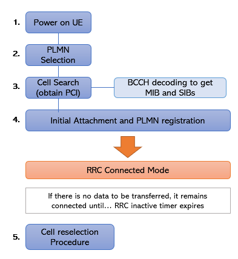
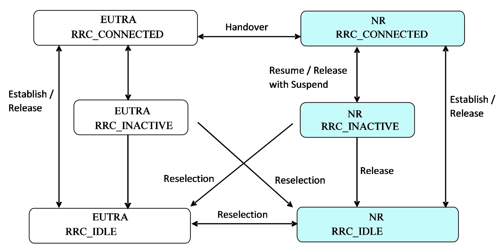

# The Paper Study of UE Idle Mode

- [The Paper Study of UE Idle Mode](#the-paper-study-of-ue-idle-mode)
  - [What is UE Idle Mode?](#what-is-ue-idle-mode)
  - [The Purpose of UE Idle Mode](#the-purpose-of-ue-idle-mode)
  - [Activities in UE Idle Mode](#activities-in-ue-idle-mode)
  - [Functions of UE Idle Mode in 5G Network:](#functions-of-ue-idle-mode-in-5g-network)
  - [States of UE Idle Mode and Transitions Between Each Other](#states-of-ue-idle-mode-and-transitions-between-each-other)
  - [Resource](#resource)

## What is UE Idle Mode?
In the context of cellular networks, User Equipment (UE) Idle Mode refers to the state in which a UE (e.g., a mobile phone) is not actively connected to the network. During this mode, the UE is still performing various activities to maintain its connection to the network and be prepared for incoming communication or network changes. Some of the activities performed by the UE in Idle Mode include PLMN selection, cell selection, cell reselection, and paging monitoring.

In the context of 5G networks, User Equipment (UE) Idle Mode, also known as RRC_IDLE state, refers to the state in which a UE is not actively connected to the network but is still prepared for incoming communication or network changes. During this mode, the UE performs various activities, including PLMN selection, cell selection, cell reselection, and paging monitoring.

## The Purpose of UE Idle Mode
The purpose of UE Idle Mode is to conserve battery power by allowing the UE to periodically become available for downlink broadcast paging without the need for connection to a specific gNB. The UE is registered with the network but is not attached to a specific session or data path. The UE in idle mode tracks its location based on Tracking Areas (TAs), and the network keeps track of which TAs the UE is camped on. The Idle Mode process in 5G involves several key aspects, including Tracking Area Update (TAU), Paging, Network Attachment, Mobility Management, and Quality of Service (QoS) Management. When there's incoming data or a call for an idle UE, the network initiates a paging procedure to locate and notify the UE. Even in idle mode, the UE remains attached to the network and periodically sends signals to indicate its presence. In idle mode, the UE can move across different cells or even different Radio Access Technologies (RATs) within 5G. The 5G system allows for dynamic QoS adjustments based on network conditions, application requirements, and user needs. The transition between idle mode and connected mode involves various procedures and mechanisms to maintain connectivity, manage sessions, and adapt to changing network conditions.

## Activities in UE Idle Mode
User Equipment (UE) Idle Mode, also known as RRC_IDLE state, refers to the state in which a UE is not actively connected to the network but is still prepared for incoming communication or network changes. During this mode, the UE performs various activities, including PLMN selection, cell selection, cell reselection, and paging monitoring.

1. **PLMN Selection**: The UE selects a Public Land Mobile Network (PLMN) to connect to.
2. **Cell Selection**: The UE selects a cell within the chosen PLMN to camp on.
3. **Cell Reselection**: If the UE is already camped on a cell, it may need to reselect a different cell based on certain criteria.
4. **Paging Monitoring**: The UE monitors paging messages from the network to detect incoming calls or messages.

These activities are essential for efficient network operation and seamless handover between cells. They are defined by 3GPP (3rd Generation Partnership Project) standards and are crucial for the proper functioning of the cellular network. For more detailed information on the specific procedures and criteria involved in 5G UE Idle Mode, you can refer to the 3GPP technical specifications such as TS 38.304 for 5G.

## Functions of UE Idle Mode in 5G Network:
1. **Power Saving:**
Idle mode utilizes Discontinuous Reception (DRX) where the UE periodically listens for signals instead of continuously monitoring, significantly reducing power consumption. Additionally, minimized signaling with the network compared to connected mode further contributes to lower power usage.

2. **Efficient Location Management:** The UE remains coarsely registered with the network, reducing location update traffic. This "coarse" location involves tracking areas rather than pinpoint accuracy, balancing efficient management with maintaining adequate knowledge of the UE's whereabouts. Cell reselection occurs seamlessly when necessary for good signal quality.

3. **Fast Paging:** Idle mode utilizes dedicated paging channels where the UE specifically listens for broadcast messages from the network. This significantly reduces latency compared to searching across all channels, enabling faster notification of incoming calls or messages.

4. **Network Access Preparation:** The UE continuously monitors System Information (SI) broadcasts, staying updated on network parameters, cell information, and available services. This pre-loaded information minimizes connection establishment time when the UE transitions to connected mode, ensuring a smooth and rapid handoff.

5. **Emergency Message Reception:** Even in idle mode, the UE remains capable of receiving critical messages like Cell Broadcast Service (CBS) notifications. This crucial feature ensures public safety and enables timely communication during disasters or emergencies, regardless of active connectivity.

6. **Reduced Network Load:** By minimizing unnecessary signaling and location updates, idle mode contributes to efficient network resource allocation. This reduced load benefits all users, especially during peak usage periods, ensuring smoother network operation and avoiding congestion.

7. **Support for Multiple Access Technologies (RATs):** Idle mode facilitates seamless switching between 5G and other compatible technologies like 4G LTE based on network availability and service requirements. This dynamic adaptation ensures optimal connectivity based on real-time conditions

8. **Mobility Management:** Even in idle mode, the UE can perform basic cell reselection if the signal quality deteriorates significantly. This ensures continuous service and avoids unexpected dropouts.

9. **Flexibility for Advanced Services:** Idle mode can be configured with different parameters based on specific needs, such as optimizing for low latency or extended battery life.
Enables adaptation to various use cases and user preferences.

10. **Security and Authentication:** Although not actively connected, the UE maintains basic security measures to prevent unauthorized access and ensure data integrity.

## States of UE Idle Mode and Transitions Between Each Other

5G NR (New Radio) defines two main states within Idle Mode:

**1. Connected Idle (CM-Idle):**
* UE maintains minimal connection with the network through a dedicated cell identity.
* Receives paging messages on specific channels for incoming calls or messages.
* Tracks System Information (SI) broadcasts for network updates.
* Enables faster access to active service compared to RRC Inactive state.
* Higher power consumption but suitable for situations with potential for frequent activity.

**2. RRC Inactive:**
* UE completely disconnects from the RRC (Radio Resource Control) layer, significantly reducing power consumption.
* Maintains coarser location registration with the network.
* Requires full re-establishment of RRC connection for active service, leading to slightly higher latency.
* Optimal for scenarios with infrequent activity or extended battery life priority.

**Additional Considerations:**
* **Cell reselection:** Both states allow cell reselection for maintaining good signal quality.
* **DRX (Discontinuous Reception):** Used in both states to reduce power consumption by listening periodically instead of continuously.
* **Security:** Basic security measures remain active in both states for data protection.
* **Transition between states:** The UE dynamically switches between CM-Idle and RRC Inactive based on network configuration, user preferences, and inactivity timers.

This shows the possible state transitions for a 5G User Equipment (UE) between RRC_CONNECTED, RRC_INACTIVE, and RRC_IDLE states.

**States:**
* **RRC_CONNECTED:** This is the active state where the UE is connected to the network and can send and receive data.
* **RRC_INACTIVE:** This is a power-saving state where the UE is not connected to the network but can still be paged by the network for incoming calls or messages. The connection to the network is suspended, but the UE maintains a coarse location registration.
* **RRC_IDLE:** This is another power-saving state where the UE is not connected to the network and cannot be directly paged. It has a more relaxed location registration compared to RRC_INACTIVE.

**Transitions:**
* **Establish/Release:** This transition is used to move between the RRC_CONNECTED state and either RRC_INACTIVE or RRC_IDLE depending on the network's instructions or the UE's need to save power.
* **Reselection:** This transition occurs when the UE detects a better serving cell while in either RRC_INACTIVE or RRC_IDLE state. It allows the UE to connect to the new cell without going through a full connection establishment process.
* **Resume/Release with Suspend:** This transition is specific to moving between RRC_CONNECTED and RRC_INACTIVE. It allows the network to temporarily suspend the UE's connection while preserving some context information, enabling a faster resume when needed.

The diagram shows that the UE can move between all three states depending on various factors like network instructions, power saving needs, and signal quality. The choice of transition depends on the specific context and the desired balance between power saving, latency, and accessibility.

## Resource
* Michele Polese, Leonardo Bonati. 2022. "Understanding O-RAN: Architecture, Interfaces, Algorithms, Security, and Research Challenges". IEEE. Available : https://arxiv.org/pdf/2202.01032.pdf (accessed 15 Feb 2024)
* 3GPP. 2018. "LTE; Evolved Universal Terrestrial Radio Access (E-UTRA); User Equipment (UE) procedures in idle mode
(3GPP TS 36.304 version 13.8.0 Release 13)". ETSI. Available : https://www.etsi.org/deliver/etsi_ts/136300_136399/136304/13.08.00_60/ts_136304v130800p.pdf (accessed 15 Feb 2024)
* Xincheng Zhang. 2018. "LTE Optimization Engineering Handbook". John Wiley & Sons, Incorporated. Available : https://remote-lib.ui.ac.id:2145/lib/indonesiau-ebooks/reader.action?docID=5050444# (accessed 15 Feb 2024)
* https://www.researchgate.net/figure/LTE-RRC-UE-state-handling_fig1_261383342
* https://www.oreilly.com/library/view/radio-protocols-for/9781118188569/chapter02.html
* https://www.sharetechnote.com/html/5G/5G_RRC_Inactive.html
* http://go.radisys.com/rs/radisys/images/paper-lte-eutran.pdf
