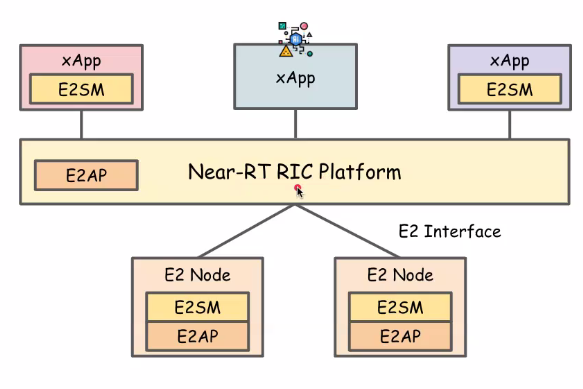

# The Installation of E2 Protocol (E2SIM)

- [The Installation of E2 Protocol (E2SIM)](#the-installation-of-e2-protocol-e2sim)
  - [E2 Simulator](#e2-simulator)
    - [Flow Function](#flow-function)
    - [Components Function](#components-function)
  - [Install E2SIM](#install-e2sim)
    - [Clone Repo:](#clone-repo)
    - [Install dependencies:](#install-dependencies)
    - [Build the official e2sim:](#build-the-official-e2sim)
    - [Generate .deb packages and move it:](#generate-deb-packages-and-move-it)
    - [Change the e2tern-sctp-alpha address to connect](#change-the-e2tern-sctp-alpha-address-to-connect)
      - [View E2term SCTP IP](#view-e2term-sctp-ip)
    - [Edit file with address to connect](#edit-file-with-address-to-connect)
    - [Ready to build the docker image](#ready-to-build-the-docker-image)
  - [Run docker container](#run-docker-container)
    - [docker run ](#docker-run-)
  - [Successfully run the container](#successfully-run-the-container)
    - [View docker container Log](#view-docker-container-log)


## E2 Simulator


### Flow Function
* Upon startup, Simulator generates E2 Setup Request
* For each E2SM that is registered, include RAN function definition
* Upon receiving incoming requests, decode
* Identify RAN function ID
* Call appropriate callback function for RAN function ID and request type
* Provide entire encoded request
* If no callback is provided, we return an error response
* Upon receiving responses, decode:
* Identify RAN function ID
* If a callback is registered for this message type, call it based on RAN function ID and request type
* Provide entire encoded response
* If no callback is registered, no action is taken

### Components Function
E2 Simulator enables a specific E2SM to be supported by the calling application in the following way:
* E2SM must be registered by the calling application
* E2SM-specific code uses callbacks to handle interaction from xApp
* E2SM-specific code must continuously implement simulation logic

Registration of an E2SM with the E2 Simulator entails the following:
* RAN function definition
* Callback functions for any of the following:
    1. Subscription
    2. Control
    3. Any Responses
* Callback functions are responsible for sending responses
* They may also need to set up ongoing simulation messaging
* REPORT Service sends back periodic Indication messages containing REPORT
* INSERT Service sends back periodic Indication messages containing INSERT
* They may need to associate incoming messages with existing service invocation
* Modify Subscription
* CONTROL message associated with INSERT
* Base E2 simulator should not be concerned with these details; only specific E2SM code should be responsible for any messaging

## Install E2SIM

### Clone Repo:
```
git clone https://gerrit.o-ran-sc.org/r/sim/e2-interface.git
```

output:
```
root@teep-ric:~# git clone https://gerrit.o-ran-sc.org/r/sim/e2-interface.git
sc.org/r/sim/e2-interface"Cloning into 'e2-interface'...
remote: Total 4964 (delta 0), reused 4964 (delta 0)
Receiving objects: 100% (4964/4964), 4.49 MiB | 880.00 KiB/s, done.
Resolving deltas: 100% (3911/3911), done.
```

### Install dependencies:
```
sudo apt-get install -y build-essential git cmake libsctp-dev lksctp-tools autoconf automake libtool bison flex libboost-all-dev
sudo apt-get clean
```

Output:
```
Reading package lists... Done
Building dependency tree
Reading state information... Done
libtool is already the newest version (2.4.6-14).
0 upgraded, 0 newly installed, 0 to remove and 72 not upgraded.
```

### Build the official e2sim:
```
cd ~/e2-interface/e2sim/
mkdir build
cd build
cmake ..
make package
cmake .. -DDEV_PKG=1
make package
```

Output:
```
root@teep-ric:~/e2-interface/e2sim# mkdir build
root@teep-ric:~/e2-interface/e2sim# cd build
root@teep-ric:~/e2-interface/e2sim/build# cmake ..
-- The C compiler identification is GNU 9.4.0
-- The CXX compiler identification is GNU 9.4.0
-- Check for working C compiler: /usr/bin/cc
-- Check for working C compiler: /usr/bin/cc -- works
-- Detecting C compiler ABI info
-- Detecting C compiler ABI info - done
-- Detecting C compile features
-- Detecting C compile features - done
.
.
.
root@teep-ric:~/e2-interface/e2sim/build# make package
Scanning dependencies of target encoding_objects
[  0%] Building CXX object src/encoding/CMakeFiles/encoding_objects.dir/encode_e2apv1.cpp.o
/root/e2-interface/e2sim/src/encoding/encode_e2apv1.cpp: In function ‘long int encoding::get_function_id_from_subscription(E2AP_PDU_t*)’:
.
.
.
[100%] Built target asn1_objects
Run CPack packaging tool...
CPack: Create package using DEB
CPack: Install projects
CPack: - Run preinstall target for: e2sim
CPack: - Install project: e2sim []
CPack: Create package
-- CPACK_DEBIAN_PACKAGE_DEPENDS not set, the package will have no dependencies.
CPack: - package: /root/e2-interface/e2sim/build/e2sim_1.0.0_amd64.deb generated.
.
.
.
root@teep-ric:~/e2-interface/e2sim/build# cmake .. -DDEV_PKG=1
+++ pkg name: e2sim-dev_1.0.0_amd64.deb
### make package will generate only deb package; cannot find support to generate rpm packages
+++ profiling is off
-- Configuring done
-- Generating done
-- Build files have been written to: /root/e2-interface/e2sim/build
.
.
.
root@teep-ric:~/e2-interface/e2sim/build# make package
[  0%] Built target encoding_objects
[  0%] Built target def_objects
[  1%] Built target sctp_objects
[  1%] Built target messagerouting_objects
[  1%] Built target base_objects
Scanning dependencies of target e2sim_static
[  2%] Linking CXX static library libe2sim.a
[  2%] Built target e2sim_static
[  2%] Built target e2sim_shared
[100%] Built target asn1_objects
Run CPack packaging tool...
CPack: Create package using DEB
CPack: Install projects
CPack: - Run preinstall target for: e2sim
CPack: - Install project: e2sim []
CPack: Create package
-- CPACK_DEBIAN_PACKAGE_DEPENDS not set, the package will have no dependencies.
CPack: - package: /root/e2-interface/e2sim/build/e2sim-dev_1.0.0_amd64.deb generated.
```

### Generate .deb packages and move it:
* On plain Ubuntu you might need to install apt install cmake c++ libsctp-dev
* To start building docker image one should generate the .deb packages using following
* Generate .deb packages and move it to e2sm_examples/kpm_e2sm folder : 
```
cmake .. && make package && cmake .. -DDEV_PKG=1 && make package
cp *.deb ../e2sm_examples/kpm_e2sm/
```

output:
```
root@teep-ric:~/e2-interface/e2sim/build# cmake .. && make package && cmake .. -DDEV_PKG=1 && make package
+++ pkg name: e2sim_1.0.0_amd64.deb
### make package will generate only deb package; cannot find support to generate rpm packages
+++ profiling is off
-- Configuring done
-- Generating done
-- Build files have been written to: /root/e2-interface/e2sim/build
[  0%] Built target encoding_objects
[  0%] Built target def_objects
.
.
.
root@teep-ric:~/e2-interface/e2sim/build# cp *.deb ../e2sm_examples/kpm_e2sm/
```

### Change the e2tern-sctp-alpha address to connect
if you wish to change the e2t address to connect then modify the Dockerfile in e2sm_examples/kpm_e2sm/ path.
#### View E2term SCTP IP
```
kubectl get service -n ricplt
```

output:
```
root@teep-ric:~/e2-interface/e2sim/build# kubectl get service -n ricplt
NAME                                        TYPE        CLUSTER-IP       EXTERNAL-IP   PORT(S)                           AGE
aux-entry                                   ClusterIP   10.103.52.204    <none>        80/TCP,443/TCP                    4d17h
r4-influxdb-influxdb2                       ClusterIP   10.98.30.84      <none>        80/TCP                            4d17h
r4-infrastructure-kong-proxy                NodePort    10.108.148.223   <none>        32080:32080/TCP,32443:32443/TCP   4d17h
r4-infrastructure-prometheus-alertmanager   ClusterIP   10.103.139.225   <none>        80/TCP                            4d17h
r4-infrastructure-prometheus-server         ClusterIP   10.105.159.39    <none>        80/TCP                            4d17h
service-ricplt-a1mediator-http              ClusterIP   10.104.13.121    <none>        10000/TCP                         4d17h
service-ricplt-a1mediator-rmr               ClusterIP   10.98.219.252    <none>        4561/TCP,4562/TCP                 4d17h
service-ricplt-alarmmanager-http            ClusterIP   10.106.11.95     <none>        8080/TCP                          4d17h
service-ricplt-alarmmanager-rmr             ClusterIP   10.96.239.11     <none>        4560/TCP,4561/TCP                 4d17h
service-ricplt-appmgr-http                  ClusterIP   10.99.219.13     <none>        8080/TCP                          4d17h
service-ricplt-appmgr-rmr                   ClusterIP   10.99.29.140     <none>        4561/TCP,4560/TCP                 4d17h
service-ricplt-dbaas-tcp                    ClusterIP   None             <none>        6379/TCP                          4d17h
service-ricplt-e2mgr-http                   ClusterIP   10.103.220.166   <none>        3800/TCP                          4d17h
service-ricplt-e2mgr-rmr                    ClusterIP   10.104.31.254    <none>        4561/TCP,3801/TCP                 4d17h
service-ricplt-e2term-prometheus-alpha      ClusterIP   10.111.79.150    <none>        8088/TCP                          4d17h
service-ricplt-e2term-rmr-alpha             ClusterIP   10.110.117.116   <none>        4561/TCP,38000/TCP                4d17h
service-ricplt-e2term-sctp-alpha            NodePort    10.111.178.222   <none>        36422:32222/SCTP                  4d17h
service-ricplt-jaegeradapter-agent          ClusterIP   10.100.6.250     <none>        5775/UDP,6831/UDP,6832/UDP        4d17h
service-ricplt-jaegeradapter-collector      ClusterIP   10.96.101.59     <none>        14267/TCP,14268/TCP,9411/TCP      4d17h
service-ricplt-jaegeradapter-query          ClusterIP   10.108.15.213    <none>        16686/TCP                         4d17h
service-ricplt-rtmgr-http                   ClusterIP   10.101.199.232   <none>        3800/TCP                          4d17h
service-ricplt-rtmgr-rmr                    ClusterIP   10.98.130.194    <none>        4561/TCP,4560/TCP                 4d17h
service-ricplt-submgr-http                  ClusterIP   None             <none>        3800/TCP,8088/TCP                 4d17h
service-ricplt-submgr-rmr                   ClusterIP   None             <none>        4560/TCP,4561/TCP                 4d17h
service-ricplt-vespamgr-http                ClusterIP   10.102.59.56     <none>        8080/TCP,9095/TCP                 4d17h
```

### Edit file with address to connect
```
nano Dockerfile
```

### Ready to build the docker image
```
cd ../e2sm_examples/kpm_e2sm/
docker build -t e2sim:v1 .
```

output:
```
root@teep-ric:~/e2-interface/e2sim/e2sm_examples/kpm_e2sm# root@teep-ric:~/e2-interface/e2sim/e2sm_examples/kpm_e2sm#
root@teep-ric:~/e2-interface/e2sim/e2sm_examples/kpm_e2sm# docker build -t e2sim:v1 .
Sending build context to Docker daemon  1.172MB
Step 1/17 : ARG CONTAINER_PULL_REGISTRY=nexus3.o-ran-sc.org:10001
Step 2/17 : FROM ${CONTAINER_PULL_REGISTRY}/o-ran-sc/bldr-ubuntu18-c-go:1.9.0 as buildenv
1.9.0: Pulling from o-ran-sc/bldr-ubuntu18-c-go
f22ccc0b8772: Pull complete
3cf8fb62ba5f: Pull complete
e80c964ece6a: Pull complete
d4194511dbdc: Pull complete
2d489c440bae: Pull complete                                                                                             33ee3c77506b: Pull complete
7cdf3f1d17d0: Pull complete
cf153de296b0: Pull complete
e1920709a3af: Pull complete
6cdcae3380c6: Pull complete
6dbdb1c3e5fd: Pull complete
1710cd1faa0e: Pull complete
d44308ed4b3e: Extracting [=======
```

## Run docker container
### docker run <simulator-image-name>
```
docker run e2sim:v1
```
output:
```
root@teep-ric:~/sim-e2-interface/e2sim/e2sm_examples/kpm_e2sm# docker run e2sim:v1
Starting KPM processor simJSON Test
<E2SM-KPM-RANfunction-Description>
    <ranFunction-Name>
        <ranFunction-ShortName></ranFunction-ShortName>
        <ranFunction-E2SM-OID>OID123</ranFunction-E2SM-OID>
        <ranFunction-Description>KPM monitor</ranFunction-Description>
        <ranFunction-Instance>1</ranFunction-Instance>
.
.
.
            </RIC-ReportStyle-List>
        </ric-ReportStyle-List>
    </e2SM-KPM-RANfunction-Item>
</E2SM-KPM-RANfunction-Description>
er encded is 469
after encoding message
here is encoded message 0
%%about to register callback for subscription for func_id 0
```

## Successfully run the container

```
docker ps -a
```

output:
```
root@teep-ric:~# docker ps -a
CONTAINER ID   IMAGE                                                     COMMAND                  CREATED          STATUS                        PORTS                                       NAMES
c7676279849b   e2sim:v1                                                  "/bin/sh -c 'kpm_sim…"   5 minutes ago    Up 5 minutes                                                              confident_mestorf
309a7d8423a1   665dd7a029a2                                              "/bin/sh -c 'cd /pla…"   14 minutes ago   Exited (1) 14 minutes ago                                                 stoic_edison
73877825e185   7325695dac74                                              "/bin/sh -c 'cd /pla…"   15 minutes ago   Exited (1) 15 minutes ago                                                 thirsty_cartwright
188297d2d4bc   88d0f000a908                                              "/bin/sh -c 'apt-get…"   19 minutes ago   Exited (100) 18 minutes ago                                               intelligent_cannon
```

### View docker container Log
```
docker logs c7676279849b
```

output:
```
root@teep-ric:~# docker logs c7676279849b
Starting KPM processor simJSON Test
<E2SM-KPM-RANfunction-Description>
    <ranFunction-Name>
        <ranFunction-ShortName></ranFunction-ShortName>
        <ranFunction-E2SM-OID>OID123</ranFunction-E2SM-OID>
        <ranFunction-Description>KPM monitor</ranFunction-Description>
        <ranFunction-Instance>1</ranFunction-Instance>
    </ranFunction-Name>
    <e2SM-KPM-RANfunction-Item>
        <ric-EventTriggerStyle-List>
            <RIC-EventTriggerStyle-List>
.
.
.
value of this index is 48
value of this index is 0
value of this index is 0
value of this index is 0
value of this index is 5
value of this index is 79
value of this index is 73
value of this index is 51
value of this index is 77
value of this index is 101
value of this index is 100
%%about to register e2sm func desc for 0
Start E2 Agent (E2 Simulator
After reading input options
[SCTP] Binding client socket to source port 36422
[SCTP] Connecting to server at 10.108.94.138:36422 ...
```