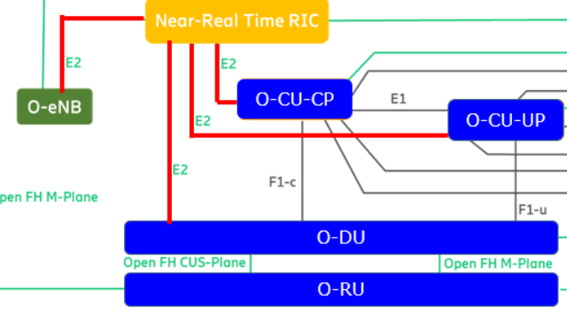

# E2 Protocol

- [E2 Protocol](#e2-protocol)
  - [1. What is E2 Protocol (E2 Interface)?](#1-what-is-e2-protocol-e2-interface)
  - [2. Why E2 Protocol is Used?](#2-why-e2-protocol-is-used)
  - [3. E2AP (E2 Application Protocol)](#3-e2ap-e2-application-protocol)
  - [4. E2SM (E2 Service Model)](#4-e2sm-e2-service-model)
  - [5. Connection with E2 Protocol](#5-connection-with-e2-protocol)
  - [6. Conclusion](#6-conclusion)
  - [Reference](#reference)

## 1. What is E2 Protocol (E2 Interface)?
The E2 protocol is a key component of the Open Radio Access Network (Open RAN) architecture, which is designed to enable interoperability and flexibility in the deployment and management of radio access networks. The E2 protocol is composed of two main parts: the E2 Application Protocol (E2AP) and the E2 Service Model (E2SM).

## 2. Why E2 Protocol is Used?
The E2 Protocol, as part of the Open Radio Access Network (O-RAN) architecture, offers several benefits:
* Interoperability: The E2 Protocol enables interoperability between different vendors’ equipment. This allows network operators to install units from different vendors, enabling customized Radio Access Networks (RANs).
* Disaggregation: The E2 Protocol supports the disaggregation of the baseband unit into a centralized unit (CU), a distributed unit (DU), and a radio unit (RU). This disaggregation provides flexibility and scalability in network design.
* Control and Management: The E2 Protocol carries events, control, and policy information to the Open RAN network functions. This allows for efficient control and management of the network.
* Real-Time and Non-Real-Time Control: The E2 Protocol supports both real-time and non-real-time control of the RAN through the RIC (RAN Intelligent Controller). This allows for efficient and flexible network operation.
* Standardization: The E2 Protocol is part of the O-RAN Alliance’s efforts to standardize interfaces in the RAN. This promotes competition and innovation in the industry.

## 3. E2AP (E2 Application Protocol)
E2AP is a basic procedural protocol that coordinates the communication between the near-real-time RIC (Network Intelligence Controller) and the E2 nodes, such as Distributed Units (DUs) and Central Units (CUs) in 5G and O-RAN compliant eNBs in 4G. It provides a set of services for managing the interface between the near-RT RIC and the E2 nodes, including E2 setup, E2 reset, E2 Indication, and E2 reporting of errors and near-RT RIC service updates. E2AP messages can embed different E2SMs, which implement specific functionalities related to RAN metrics and RAN control, such as E2 Report, E2 Insert, E2 Control, and E2 Policy.

## 4. E2SM (E2 Service Model)
E2SM is a set of service models that implement functionalities related to RAN metrics and RAN control. These service models include E2 Report, E2 Insert, E2 Control, and E2 Policy. E2 Report is used for streaming selected Key Performance Metrics (KPMs) from the E2 node to the near-RT RIC. E2 Insert is used for inserting specific information into the E2 node. E2 Control is used for controlling RAN parameters and procedures, such as call processing, radio resource allocation, handover control, idle mode mobility control, radio admission, carrier aggregation, and dual connectivity behaviors on a per-user basis. E2 Policy is used for defining and enforcing policies in the E2 node.

## 5. Connection with E2 Protocol

E2 Protocol are used in the Open RAN system that connects between Near-Real Time RIC and Central Unit like O-CU-CP, O-CU-UP, and Distributed Unit (O-DU).

## 6. Conclusion
There are a few things that can be concluded and shortly summarized about E2 Protocol, which is:
* O-RAN Architecture: The O-RAN architecture disaggregates a cell tower’s baseband unit into three units: a centralized unit (CU), a distributed unit (DU), and a radio unit (RU). This allows network operators to install units from different vendors, enabling customized Radio Access Networks (RANs).
* E2 Interface: The E2 interface is one of the standardized hardware and software interfaces that connect these interoperable RAN units. It plays a crucial role in the disaggregated architecture.
* Functionality: The E2 interface carries events, control, and policy information to the Open RAN network functions1. It is used for low latency control of the Open RAN network functions O-DU, CU-CP, or CU-UP.
* Protocol Stack: The E2 interface protocol stack is built on top of the IP layer. An application protocol called E2AP is specified by the O-RAN Alliance over SCTP/IP as the transport protocol. On top of E2AP, application-specific controls and events are conveyed through E2 service models (E2SM).
* E2AP and E2SM: E2AP defines the general protocol by which the nRT-RIC and disaggregated E2 Nodes communicate. E2SMs are “contracts” between an xApp and the E2 Node. They define function-specific protocols that are implemented on top of the E2AP specification.

## Reference
* https://www.5gtechnologyworld.com/how-does-5gs-o-ran-e2-interface-work/
* https://www.openairinterface.org/docs/workshop/2021-06-SUMMER-VIRTUAL-WORKSHOP/PDF/09_SHAD_ANSARI_MTS-OPEN_NETWORKING_FOUNDATION_O-RAN_E2AP_IMPLEMENTATION_IN_OAI.pdf
* M. Polese, L. Bonati, S. D’Oro, S. Basagni and T. Melodia, "Understanding O-RAN: Architecture, Interfaces, Algorithms, Security, and Research Challenges," in IEEE Communications Surveys & Tutorials, vol. 25, no. 2, pp. 1376-1411, Secondquarter 2023, doi: 10.1109/COMST.2023.3239220.
keywords: {Computer architecture;Security;Precoding;3GPP;Radio frequency;Radio access networks;Optimization;Open RAN;O-RAN;cellular;5G;6G}, https://remote-lib.ui.ac.id:2147/document/10024837
* https://www.sharetechnote.com/html/OpenRAN/OR_E2AP.html