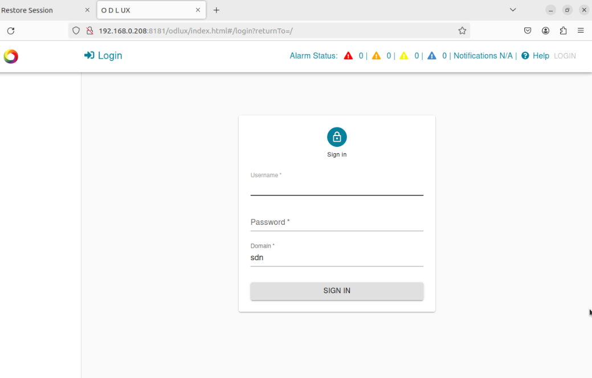
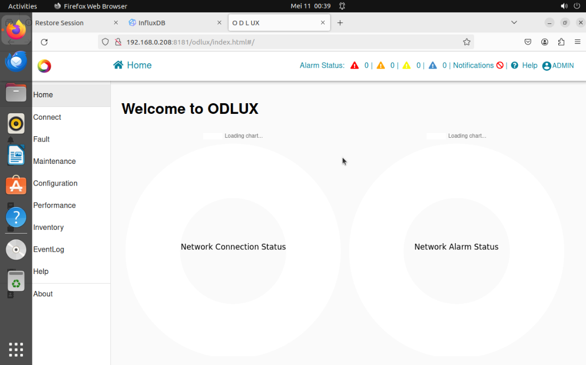

# The Installation of O1 Protocol (O1 Interface)

- [The Installation of O1 Protocol (O1 Interface)](#the-installation-of-o1-protocol-o1-interface)
  - [Configuration SMO/O1](#configuration-smoo1)
  - [1. Clone Repository](#1-clone-repository)
  - [2. Build Docker](#2-build-docker)
  - [3. Verify Deployment](#3-verify-deployment)
  - [4. Check GUI Interface for O1](#4-check-gui-interface-for-o1)


## Configuration SMO/O1

## 1. Clone Repository
command:
```bash
git clone -b master "https://gerrit.o-ran-sc.org/r/smo/o1"
```

output:
```bash
root@node1:~# git clone -b master "https://gerrit.o-ran-sc.org/r/smo/o1"
Cloning into 'o1'...

remote: Counting objects: 1, done
remote: Total 96 (delta 0), reused 96 (delta 0)
Receiving objects: 100% (96/96), 107.65 KiB | 246.00 KiB/s, done.
Resolving deltas: 100% (19/19), done.
```

## 2. Build Docker
command:
```bash
cd o1/client/
docker-compose up -d
```

output:
```bash
root@node1:~/o1/client# docker-compose up -d
/usr/lib/python3/dist-packages/paramiko/transport.py:237: CryptographyDeprecationWarning: Blowfish has been deprecated
  "class": algorithms.Blowfish,
Creating network "smo_integration" with driver "bridge"
Pulling sdnrdb (docker.elastic.co/elasticsearch/elasticsearch-oss:7.9.3)...
7.9.3: Pulling from elasticsearch/elasticsearch-oss
f1feca467797: Pull complete
93626c177301: Pull complete
873430713363: Pull complete
afc418f5d88f: Pull complete
df6a9a629e0a: Pull complete
be529dd21bf8: Pull complete
b3261f022911: Pull complete
670a689859e6: Pull complete
be3bae0e1b32: Pull complete
Digest: sha256:580ab57fdd7de1ce108b4c4b872bf51a16048b1061b4a7dc68249971ec961164
Status: Downloaded newer image for docker.elastic.co/elasticsearch/elasticsearch-oss:7.9.3
Pulling sdnr (nexus3.onap.org:10001/onap/sdnc-image:2.3.2)...
2.3.2: Pulling from onap/sdnc-image
3cdd72d8cb07: Pull complete
Digest: sha256:c7a05a3a256a8ec0d58a87036b0dc8f735ade3a3823cf8790559b827d11b6916
Status: Downloaded newer image for nexus3.onap.org:10001/onap/sdnc-image:2.3.2
Creating sdnr   ... done
Creating sdnrdb ... done
```

## 3. Verify Deployment
command:
```bash
docker-compose ps
```

output:
```bash
root@node1:~/o1/client# docker-compose ps
/usr/lib/python3/dist-packages/paramiko/transport.py:237: CryptographyDeprecationWarning: Blowfish has been deprecated
  "class": algorithms.Blowfish,
 Name               Command               State                                         Ports
------------------------------------------------------------------------------------------------------------------------------------
sdnr     /bin/sh -c /opt/onap/sdnc/ ...   Up      0.0.0.0:8101->8101/tcp,:::8101->8101/tcp, 0.0.0.0:8181->8181/tcp,:::8181->8181/tcp
sdnrdb   /tini -- /usr/local/bin/do ...   Up      9200/tcp, 9300/tcp
```

## 4. Check GUI Interface for O1
```bash
http://<host_ip>:8181/odlux/index.html
```
username: admin
password: Kp8bJ4SXszM0WXlhak3eHlcse2gAw84vaoGGmJvUy2U

This can be updated by updating the .env file in the repository.

output:


