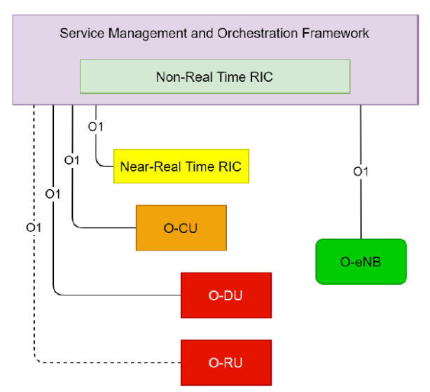

# O1 Protocol

- [O1 Protocol](#o1-protocol)
  - [1. What is O1 Protocol (O1 Interface)?](#1-what-is-o1-protocol-o1-interface)
  - [2. Mechanism of O1 Interfaces and Protocols](#2-mechanism-of-o1-interfaces-and-protocols)
  - [References](#references)

## 1. What is O1 Protocol (O1 Interface)?
The O1 interface in Open RAN is a logical connection between all O-RAN Managed Elements (MEs) and the management entities within the SMO (Smart Management Entity) framework. It ensures the operation and management of the O-RAN components, including the near-RT RIC, O-CU, O-DU, and O-RU, using standard protocols such as SSH, TLS, and NETCONF, and the Yang Data model management services. The O1 interface enables the SMO framework to access the O-RAN network functions and supports network management in line with the FCAPS model. It allows the SMO to receive information from the MEs, such as current resource utilization, and initiate optimized configurations of the MEs. In O-RAN based mobile networks, the O1 interface is used to collect data from the MEs for AI/ML purposes. The O-RAN architecture allows the collection, access to, and management of data records relating to the traffic transferred over the RAN, the selected routing, and the handover operations carried out.

## 2. Mechanism of O1 Interfaces and Protocols
The O1 interface in Open RAN enables open and intelligent radio access networks by providing a centralized connection between all O-RAN Managed Elements (MEs) and the management entities within the SMO (Smart Management Entity) framework. This logical connection ensures the operation and management of the O-RAN components, including the near-RT RIC, O-CU, O-DU, and O-RU, using standard protocols such as SSH, TLS, and NETCONF, and the Yang Data model management services. The O1 interface supports network management in line with the FCAPS model, which includes fault, configuration, accounting, performance, and security management.

The O1 interface plays a crucial role in the overall O-RAN architecture and network operation, as it enables the SMO framework to access the O-RAN network functions and supports typical FCAPS and other management functions. It allows the SMO to receive information from the MEs, such as current resource utilization, and initiate optimized configurations of the MEs. In O-RAN based mobile networks, the O1 interface is used to collect data from the MEs for AI/ML purposes. The O-RAN architecture allows the collection, access to, and management of data records relating to the traffic transferred over the RAN, the selected routing, and the handover operations carried out.

By using the O1 interface, Open RAN networks can be built with multi-vendor, interoperable components and can be programmatically optimized through a centralized abstraction layer and data-driven intelligence. This open and intelligent approach enables more refined and dynamic sleep cycles for base stations and RF components, which generally are the cause of most of the power consumption in cellular networks. The O1 interface also supports the integration of AI/ML applications for optimal traffic and resource management, using the X2 interface for model sharing and REST APIs for managing RIC applications.

## References
* M. Polese, L. Bonati, S. D’Oro, S. Basagni and T. Melodia, "Understanding O-RAN: Architecture, Interfaces, Algorithms, Security, and Research Challenges," in IEEE Communications Surveys & Tutorials, vol. 25, no. 2, pp. 1376-1411, Secondquarter 2023, doi: 10.1109/COMST.2023.3239220.
keywords: {Computer architecture;Security;Precoding;3GPP;Radio frequency;Radio access networks;Optimization;Open RAN;O-RAN;cellular;5G;6G}, https://remote-lib.ui.ac.id:2147/document/10024837
* https://www.techplayon.com/what-o1-interface-in-open-ran/
* https://www.telecomhall.net/t/what-is-o1-interface-in-open-ran/19275