# Deep Reinforcement Learning for User Association and Resource Allocation in Heterogeneous Cellular Networks

- [Deep Reinforcement Learning for User Association and Resource Allocation in Heterogeneous Cellular Networks](#deep-reinforcement-learning-for-user-association-and-resource-allocation-in-heterogeneous-cellular-networks)
  - [ABOUT](#about)
  - [1. Introduction](#1-introduction)
  - [2. System Model and Problem Formulation](#2-system-model-and-problem-formulation)
    - [A. System Model](#a-system-model)
    - [B. Problem Formulation](#b-problem-formulation)
  - [3. Multi-Agent Cooperative RL for the Joint UARA Optimization Problem (MARL)](#3-multi-agent-cooperative-rl-for-the-joint-uara-optimization-problem-marl)
    - [A. Game Formulation](#a-game-formulation)
    - [B. Multi-Agent Q-Learning (MAQL) Method](#b-multi-agent-q-learning-maql-method)
  - [4. Multi-Agent DRL for the Joint UARA Optimization Problem](#4-multi-agent-drl-for-the-joint-uara-optimization-problem)
  - [5. Performance Evaluation](#5-performance-evaluation)
    - [A. Simulation Settings](#a-simulation-settings)
    - [B. Simulation Results](#b-simulation-results)
      - [1. Training Efficiency With Different Learning Hyperparameters:](#1-training-efficiency-with-different-learning-hyperparameters)
      - [2. Training Efficiency With Different Scenarios](#2-training-efficiency-with-different-scenarios)
      - [3. Optimization Performance With Different Strategies in Mobile HetNets Scenario](#3-optimization-performance-with-different-strategies-in-mobile-hetnets-scenario)
  - [6. Conclusion](#6-conclusion)

## ABOUT
| Items | Information |
| --- | --- |
| Paper Link | https://ieeexplore.ieee.org/document/8796358 |
| Authors | Nan Zhao, Ying-Chang Ling |
| Date of Publication | 13 August 2019 |
| Published In | IEEE Transactions on Wireless Communications |
| Type | Journal and Magazines |
| Keywords | Heterogeneous cellular networks, user association, resource allocation, multi-agent deep reinforcement learning |

## 1. Introduction
- The next-generation wireless network faces challenges due to the growth in mobile devices and the emergence of the Internet of Things, leading to the need for solutions like heterogeneous networks (HetNets) with picocells and femtocells.
- HetNets offload user equipments (UEs) from macro base stations (MBSs) to pico BSs (PBSs) and femto BSs (FBSs) to increase system capacity.
- User association and resource allocation (UARA) optimization problems in HetNets are challenging due to non-convex and combinatorial characteristics, leading to the exploration of reinforcement learning (RL) methods.
- RL agents aim to maximize long-term rewards in dynamic systems, with multi-agent RL (MARL) being considered for optimal joint strategies in wireless networks.

## 2. System Model and Problem Formulation
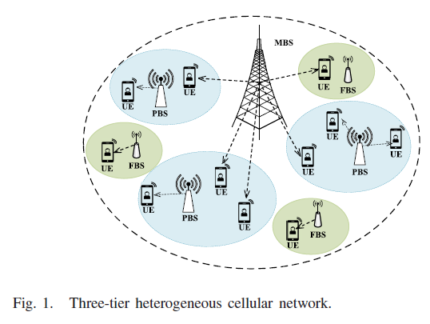

### A. System Model
HetNet composed of:
- $N_m$ MBSs
- $N_p$ PBSs
- $N_f$ FBSs
- $N$ randomly located UEs

All set of base stations (BS) are denoted
$$
\mathcal{BS} = \{mbs_1, . . . , mbs_{n_m}, pbs_1, . . . , pbs_{n_p}, fbs_1, . . . , fbs_{n_f}\},
$$
with the set of the BSs’ indices 
$\mathcal{B} = \{0, 1, . . ., L − 1\}$, where
$L = N_m + N_p + N_f$

Assume that each UE can only choose at most one BS at any time. That is,
$$
\sum_{l=0}^{L-1} b^l_i(t) \leq 1, \quad \forall i \in \mathcal{N}
$$
where $\mathcal{N} = \{1, . . .,N\}$, $b^l_i(t) = 1$ when the ith UE chooses to associate with the $\mathcal{BS}_l$, and $b^l_i(t) = 0$ otherwise.

Spectrum resource of each BS is assigned to its associated UEs. The binary channel-allocation is formulated:
$$
\sum_{k=1}^{K} c^k_i(t) \leq 1, \quad \forall i \in \mathcal{N}.
$$
where $c^l_i(t) = 1$ when the ith UE utilizes the channel $C_k$ at time $t$, and $c^l_i(t) = 0$ otherwise.

Since PBSs and FBSs are deployed within the radio coverage of the MBSs, co-channel interference should be considered. $\mathbf{p}_{li}(t) = (p_{li}^{1}(t), \ldots, p_{li}^{K}(t)), l \in B, i \in N, k \in K$ which defined as a vector of the transmit power used on channel $(C_k)$ between the ith UE and its associated $\mathcal{BS}_l$ at time $t$.

The Signal to Noise plus Interference Ratio (SINR) at $i^{th}$ UE:
$$
\Gamma_{li}^{k}(t) = \frac{b_{i}^{l}(t)h_{l}^{i,k}(t)c_{i}^{k}(t)p_{l,j}^{k}(t)}{\sum_{j \in B\backslash\{l\}} b_{i}^{j}(t)h_{j}^{i,k}(t)c_{i}^{k}(t)p_{j,i}^{k}(t) + W N_0}
$$
where:
- $h_{i}^{i,k}$ is the channel gain between the $\mathcal{BS}_l$ and the $i^{th}$ UE operating on the channel $C_k$ at time $t$
- $W$ denotes the channel bandwidth
- $N_0$ denotes the noise power spectral density

The downlink capacity of the $i^{th}$ UE from $\mathcal{BS}_l$ on the channel $C_k$ is:
$$
r_{li}^{k}(t) = W\log_2(1 + \Gamma_{li}^{k}(t))
$$
So, the total transmission capacity of the $i^{th}$ UE is:
$$
r_i(t) = \sum_{l=0}^{L-1} \sum_{k=1}^K r_{li}^{k}(t) = \sum_{l=0}^{L-1}\sum_{k=1}^K W\log_2(1+\Gamma_{li}^{k}(t))
$$

### B. Problem Formulation
All UEs want to obtain their **maximum transmission** capacity from their selected BSs while meeting a minimum QoS requirement $\Omega_i$, hence:
$$
\Gamma_{i}(t) = \sum_{l=0}^{L-1} \sum_{k=1}^{K} \Gamma_{li}^{k}(t) \geq \Omega_{i}
$$
Considering $p_{li}^k(t)$ is the transmit power of $\mathcal{BS}_l$, the total transmission cost associated with the $i^{th}$ UE is:
$$
\varphi_{i}(t) = \sum_{l=0}^{L-1} \lambda_{l}(t)b_{i}^{l}(t) \sum_{k=1}^{K} c_{i}^{k}(t)p_{li}^{k}(t)
$$
where: $\lambda_l$ is the unit price of the $\mathcal{BS}_l$'s transmit power.

The difference between the achieved profit and the transmission cost is
$$
w_i(t) = \rho_i r_i(t) - \varphi_i(t) = \sum_{l=0}^{L-1} [\sum_{k=1}^K [\rho_i r_{li}^k(t) - \lambda_l b_i^l(t) c_i^k p_li^k(t)]]
$$
where: $\rho_i$ is the profit per transmission rate.

Considering that action selection may consume some cost, the reward of the $i^{th}$ UE is:
$$
\mathcal{R}_i(t) = w_i(t) - \Psi_i
$$
where $\Psi_i > 0$

In this HetNet, the joint UARA optimization problem is to
maximize the long-term reward which is:
$$
\Phi_i = \sum_{t=0}^{T-1}\gamma^t R_i(t)
$$
where: $\gamma \in [0,1)$ is the discount rate to determine the weight
of the future reward.

Note that due to the non-convex and combinatorial characteristics, it is challenging to obtain a globally optimal strategy of the joint UARA optimization issue.

## 3. Multi-Agent Cooperative RL for the Joint UARA Optimization Problem (MARL)

### A. Game Formulation
The joint optimization problem is formulated as a stochastic game $\mathcal{<N,S,A,P,R>}$:
- $\mathcal{N}$ is the set of $N$ UEs
- $\mathcal{S}$ is the set possible states
- $\mathcal{A_i}$ is the set of $i^{th}$ UE's action
- $\vec{a} = \begin{bmatrix} a_1 \\ a_2 \\ \vdots \\ a_n \end{bmatrix} \in \mathcal{A_i}$ is a vector of the joint action of all UEs
- $\mathcal{P}$ is the state transition probability
- $\mathcal{P}_{ss'}(\vec{a})$ is the state transition probability from state s to s' by taking joint action
- $\mathcal{R_i}$ is the reward function of the $i^{th}$ UE

State is defined to indicate whether each UE meets its QoS demand at time $t$, where:
$$ s(t) = \{s_1(t), s_2(t), \ldots, s_N(t)\} $$
where: $s_i(t) \in \{0,1\}$. 

If $\Gamma_i(t) \leq \Omega_i$ then $s_i(t) = 0$ and vice versa. Number of possible states is $2^N$

Consider that all UEs need to choose a BS and transmission channel at time $t$, the action space $\mathcal{A}_i$ of each UE is defined:
$$ a_{li}^{k} = \{b_i^l(t),c_i^k(t)\} $$
Number of possible actions of each UE is $LK$.

Considering actions of other UEs $a_{-i}(t)$, reward of $i^{th}$ UE can be expressed as 
$$R_i(t) = R_i(s,a_i^*,\vec{a}_{-i})$$ 
Here we define action vector $(a_i,\vec{a}_{-i}) \in \mathcal{A}$ as possible solution to this game. When following inequalities hold true for every UE in any $s \in \mathcal{S}$, game obtains NE state: 
$$
R(s;a_i^*,a_{-i}^*) \geq R(s;a_i^*,\vec{a}_{-i}); \forall a_i \in A_{-i}
$$
Note that each UE’s action can be considered as best response to other UEs’ actions. No UEs can benefit from unilateral deviation.

If each User Equipment (UE) obtains the information about the reward function and state transition, the Nash Equilibrium (NE) strategy can be found with integer programming methods. In this non-cooperative stochastic game, such information is unknown to each UE. To address this challenge, we resort to a reinforcement learning method to obtain a NE strategy $\pi_i^*$​ at any state $s$ by interacting with the environment repeatedly.

### B. Multi-Agent Q-Learning (MAQL) Method
A finite-state Markov decision process (MDP) is introduced to describe this stochastic game.
We model the joint optimization problem as a MDP $\mathcal{(S;A_i;R_i;P_{ss'})}$, 
where:
- S is a discrete set of environment states, 
- $\mathcal{A_1,\ldots,A_\mathbb{N}}$ define a discrete set of possible actions of UEs, 
- $\mathcal{R_1,\ldots,R_\mathbb{N}}$ are the reward functions of UEs
- Pss' means the state transition probability

Each UE iteratively sends its own optimal policy and state information to its associated BS with only one bit (0 or 1). 
By the message passing between the BSs through a backhaul communication link, the global state information and joint policies of all UEs is obtained.

For the $i^{th}$ UE, an optimal policy $π_i^*$ should be obtained at
each state to maximize its value-state function:
$$
V_i(s, \pi_i, \pi_{-i}) = E\left[ \sum_{t=0}^{T-1} \gamma^t \mathcal{R}_i(s(t), \pi_i(t), \pi_{-i}(t))|s(0) = s \right]
$$
Considering Markov property:
$$
V_i(s,\pi_i,\pi_{-i}) = u_i(s,\pi_i,\pi_{-i}) + 
\gamma \sum_{{s'}\in S} P_{{ss'}}(\pi_{i},\pi_{-i}) V_i(s',\pi_{i},\pi _{-i})
$$
where:
- $u_i(s, \pi_i, \pi_{-i}) = E[R_i(s, \pi_i, \pi_{-i})]$
- $P_{ss'}(\pi_i, \pi_{-i})$ is state transition probability

A strategy tuple $(\pi_1^*, \pi_{-i}^*)$, with $\pi^{*-i}=(\pi_1^*,\ldots, \pi_{i-1}^*, \pi_{i+1}^*,\ldots,\pi_N^*)$, is an NE if the following inequalities hold for any $\pi_i$:
$$
V_i(s_i,\pi^{*}_i,\pi^{*}_{-i}) \geq V_i(s_i,\pi_{i},\pi^{*}_{-i}) \quad \forall s \in \mathcal{S}
$$

Considering that any finite games have the mixed-strategy equilibrium, there always exists an NE to satisfy the following Bellman optimality equation:
$$
V^*(s, \pi_i, \pi_{-i}) = V_i(s, \pi_i^*, \pi_{-i}^*) 
= \max_{a_i \in A_i} u_i(s, a_i, \pi_{-i}) + 
\gamma \sum_{s' \in \mathcal{S}} P_{ss'}(a_i, \pi^*_{-i})V_i(s',\pi^*_i,\pi^*_{-i})
$$
The optimal Q-value function:
$$
Q^*(s,a_i) = u_i(s,a_i,\pi^*_{-i}) + 
\gamma\sum_{s'\in \mathcal{S}} P_{ss'}(a_i,\pi^*_{-i})V_i(s',\pi^*_i,\pi^*_{-i})
$$
where: $$V_i(s',\pi^*_i,\pi^*_{-i})=\max_{{a}_i \in \mathcal{A}_i} Q^*(s',{a}_i')$$
It is generally difficult to get the information about the transition probability. However, through the Q-learning method, the optimal strategy can be found based on the available information in a recursive manner, which leads to an update equation:
$$
Q_i(s,a_i) = Q_i(s,a_i) + \delta \left[u_i(s,a_i,\pi^*_i)+\gamma \max_{a'_i \in \mathcal{A}_i} Q_i(s',a'_i)-Q_i(s,a_i)\right]
$$

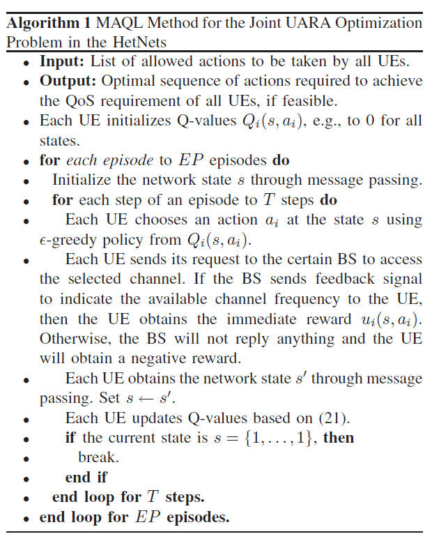

- Exploration-Exploitation Tradeoff: A balance is maintained between using the best Q-value function and exploring better options using an ε-greedy policy.
- MAQL Method: This method, described in Algorithm 1, optimizes the network state at the start of each training episode.
- Network State Initialization: Each User Equipment (UE) connects to the nearest Base Station (BS) with the highest signal power and reports its state.
- Global State Information: All UEs receive global state information via message passing among the BSs.
- Episode Duration: Each episode lasts T steps. In each step, an action is selected using the ε-greedy policy from the estimated Q-value.
- Request and Response: Each UE sends a channel request to its associated BS, which may accept or reject based on available resources.
- Reward and Update: After receiving a reward and the next state, each UE updates its Q-values. An episode ends when all UEs’ Quality of Service (QoS) is satisfied or when the maximum step T is reached. The total reward is the sum of all step rewards within an episode.

## 4. Multi-Agent DRL for the Joint UARA Optimization Problem
- Q-learning struggles with large state and action spaces, leading to the introduction of DNNs in the form of DQN to approximate Q-value functions.
- DQN uses online and target networks, experience replay, and double DQN to stabilize learning and prevent overestimation of Q-values.
- Dueling neural networks split the last layer of DDQN into $V(s)$ and $A(s, a_i)$ to improve policy evaluation.
- Multi-agent D3QN combines D3QN with MAQL, allowing UEs to estimate Q-values and interact with BSs to optimize channel selection.
- Convergence of the multi-agent DRL method relies on hyperparameter tuning through trial and error due to the complexity of deep learning algorithms.
- Simulation results are provided to demonstrate convergence, with hyperparameters like learning rate and hidden layer structure playing crucial roles.
- The proposed algorithm is analyzed as a finite game with bounded rewards, finite state-action spaces, and the ability to store historical state information using replay memory.
- Through message passing, each UE can obtain global state information and other UEs' actions to choose suitable actions, ensuring convergence to a SPNE in the proposed game using MARL optimization algorithm.

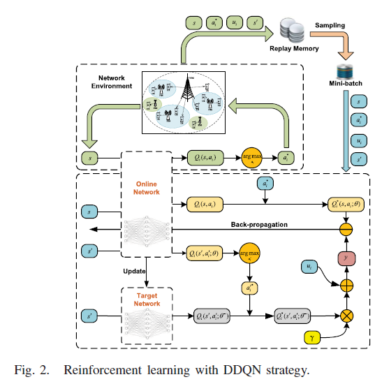

The Q-Network (DQN) minimizes the loss function:
$$
L_i(\theta) = E_{s,a_i,u_i(s,a_i),s'} \left[ (y_i^{DQN} - Q(s,a; \theta))^2 \right]
$$
where:
$$y_i^{DQN} = u_i(s,a_i) + \gamma \max_{a_i' \in \mathcal{A}_i} Q_i(s',a_i';\theta^-)$$
and $\theta^-$ represents the weights of a target network. On the otherhand, to prevent the Q-value function to be over-optimistically estimated, Double DQN (DDQN) is used, so the loss function is still the same but the following target is replaced by:
$$
y_i^{DDQN} = u_i(s,a_i)+\gamma Q_i (s', \argmax_{a_i' \in \mathcal{A}_i} Q_i(s',a_i';\theta);\theta^-)
$$

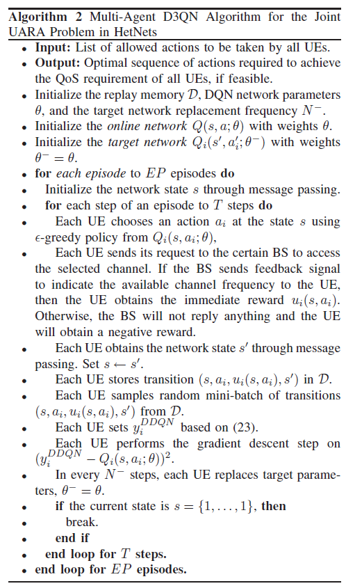

## 5. Performance Evaluation
### A. Simulation Settings
- Simulation settings include a network with 2 MBSs, 8 PBSs, 16 FBSs, and 50 UEs with different radii. 
- The learning method's training efficiency is evaluated with fixed UE locations and compared in a mobile scenario using a D3QN structure with specific parameters.

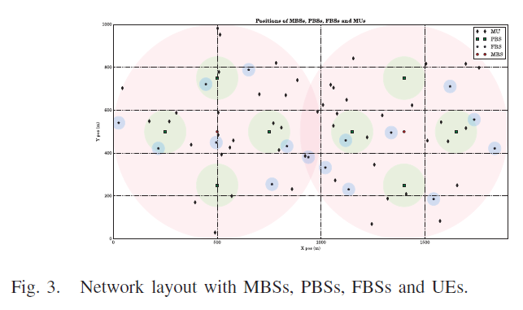
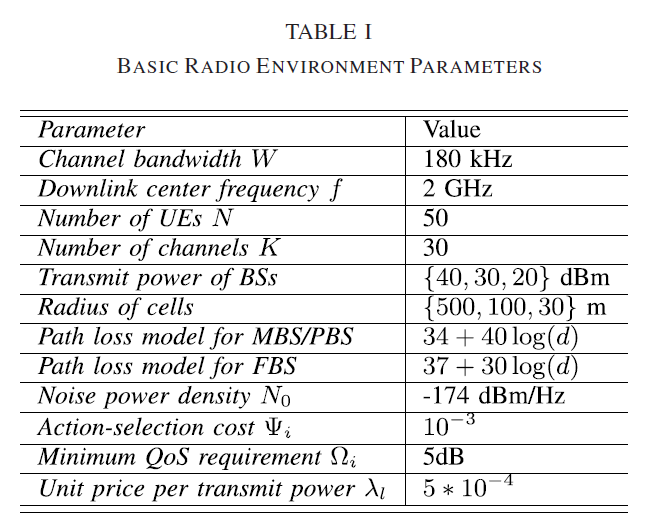

- The D3QN structure consists of input, hidden, and output layers with specific neuron numbers and hyperparameters. 
- ReLU activation function, ε-greedy policy, and RMSProp optimization approach are used in weight updating for optimal stochastic gradient descent.

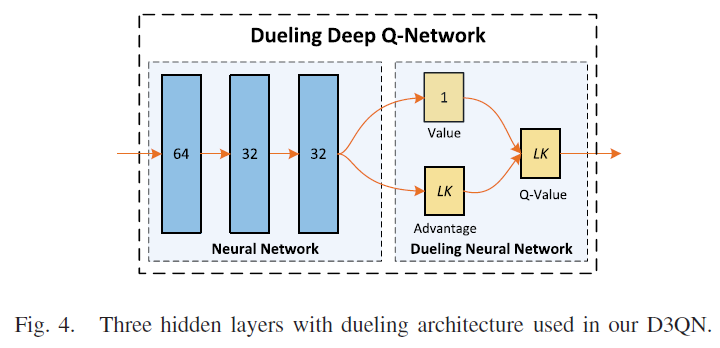

### B. Simulation Results
#### 1. Training Efficiency With Different Learning Hyperparameters:
- D3QN method's training efficiency was evaluated with different learning rates, showing faster convergence with higher rates but a risk of local optima. 
- A learning rate of 0.1 was chosen for practical real-time execution.
- Performance of D3QN was assessed with various optimization strategies, with RMSProp showing the fastest convergence. This strategy was selected for the method.
- Evaluation of D3QN with different DNN structure layers revealed faster convergence with 3 hidden layers and 64, 32, and 32 neurons. 
- Too many layers or neurons can lead to local optima or overfitting.

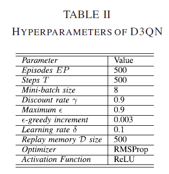

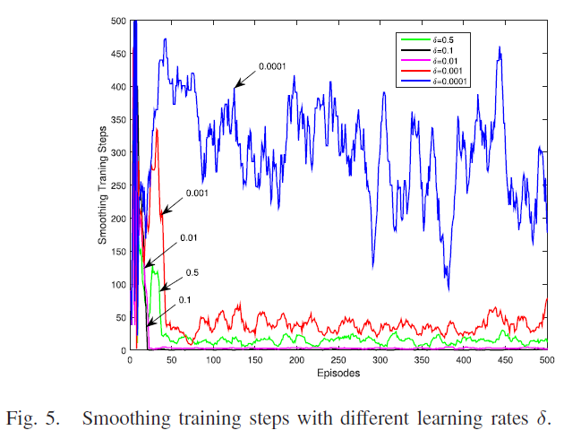
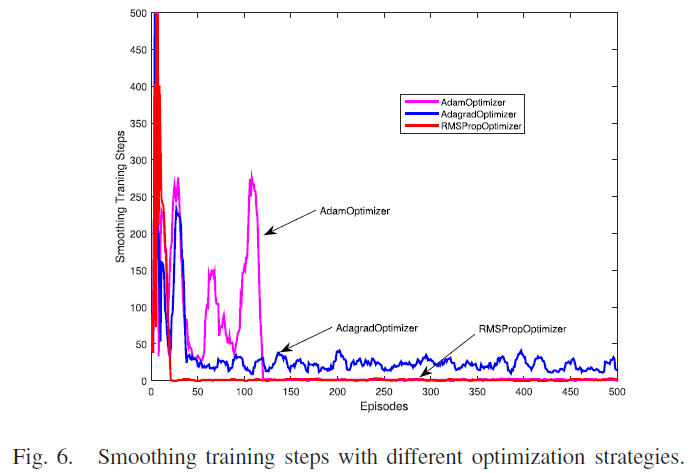
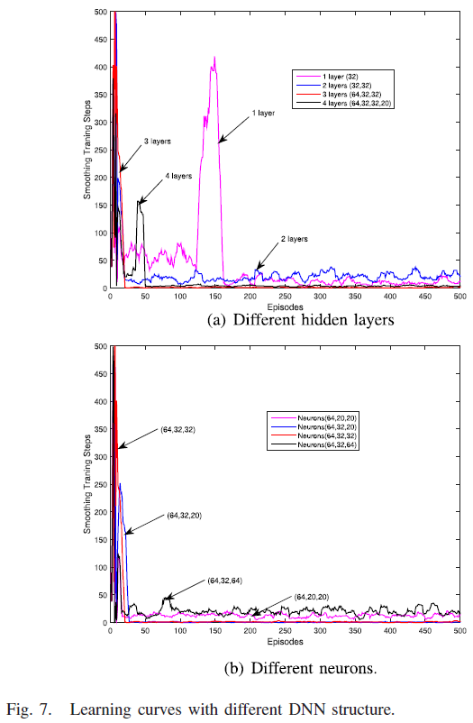

#### 2. Training Efficiency With Different Scenarios
- D3QN method's performance is evaluated with different numbers of channels K, showing faster convergence with K=26 compared to K=22 and K=24, resulting in easier meeting of UEs' QoS requirements with fewer training steps.
- Increasing the number of UEs N leads to higher system capacity but also requires more training steps to meet QoS requirements due to increased co-channel interference.
- Various MARL methods are compared, with D3QN (GS) achieving the highest system capacity among D3QN (SS), DQN, and Q-learning, while GA and MRSP methods perform well in specific cases.
- Fewer training steps are needed with smaller N or Ωi, resulting in similar system capacity across the four MARL methods, but higher system capacity is achieved with growing N when QoS requirements are met.

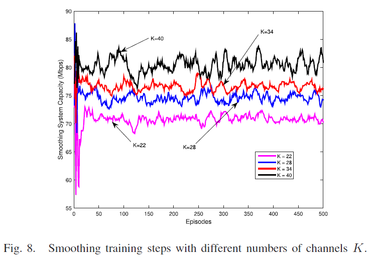
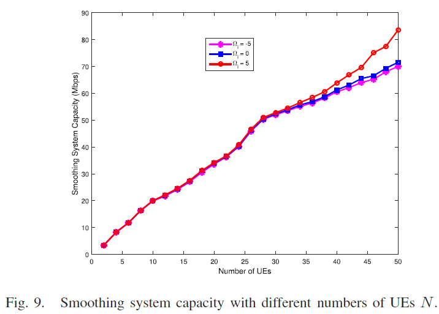
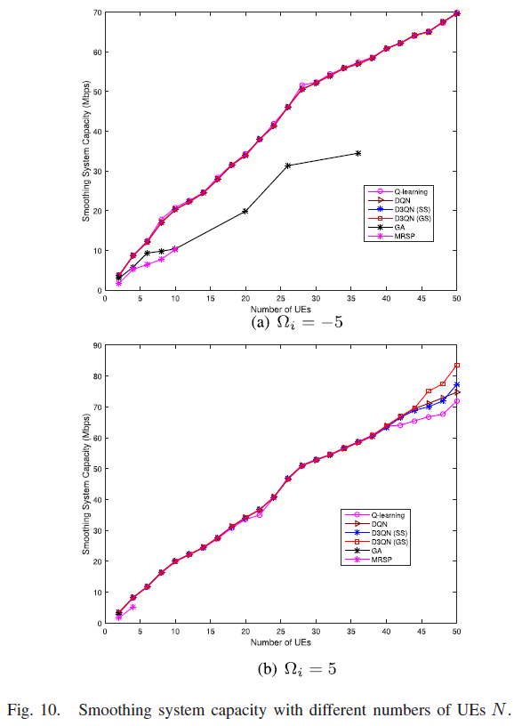

#### 3. Optimization Performance With Different Strategies in Mobile HetNets Scenario
- Evaluation of optimization performance in mobile HetNets involves UEs moving randomly with Rayleigh fading. 
- Six optimization methods are compared, with GA evaluated in Matlab and others in Python.
- ASC, ANU, and ACT are compared across optimization methods in different scenarios. 
- GA and MRSP perform well with small $N$ and $Ω_i$, while learning methods show good generalization ability in mobile scenarios.
- Learning methods require less time for small $N$ or $Ω_i$, achieving similar system capacities. 
- D3QN (GS) method excels in large-scale problems, obtaining highest system capacity and network utility with low computational time for $N = 40$ and $N = 50$.

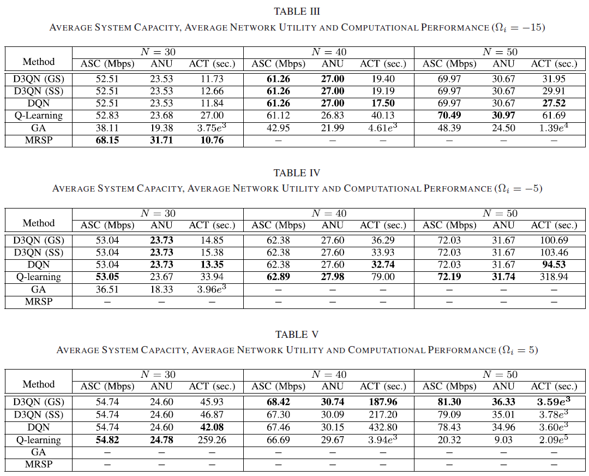

## 6. Conclusion
- The paper introduces a distributed multi-agent deep reinforcement learning (DRL) method for achieving the jointly optimal User Association and Resource Allocation (UARA) strategy in Heterogeneous Cellular Networks (HetNets).
- The proposed Multi-Agent RL (MARL) method addresses the non-convex and combinatorial nature of the UARA optimization problem, ensuring maximum long-term downlink utility while meeting Quality of Service (QoS) requirements.
- By leveraging the Dueling Double Deep Q-Network (D3QN) approach, the paper achieves faster convergence speeds and better generalization abilities compared to other RL methods, demonstrating superior performance in large-scale learning problems.