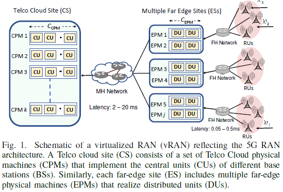
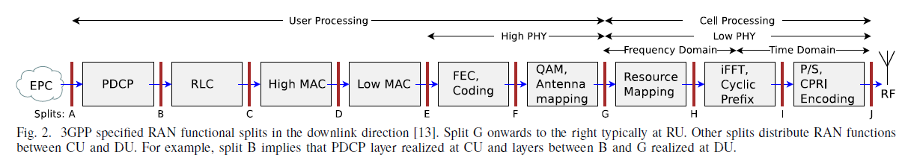
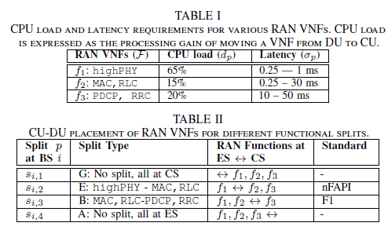
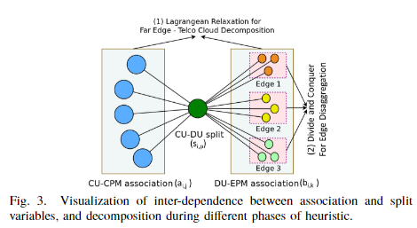
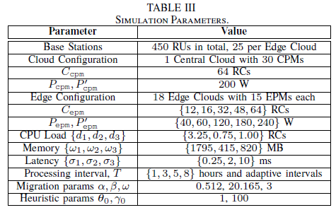
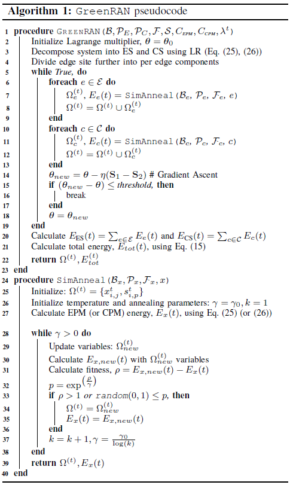
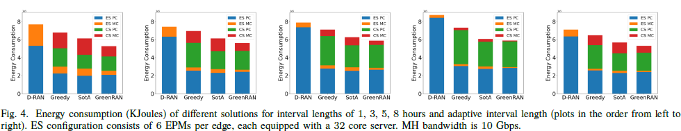
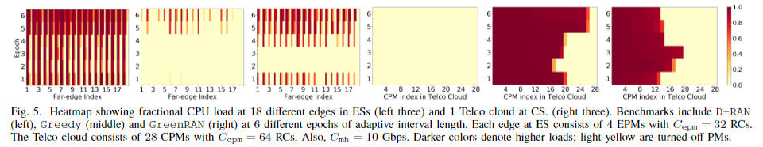

# Energy-Efficient Orchestration of Metro-Scale 5G Radio Access Networks

## ABOUT
| Items | Information |
| --- | --- |
| Paper Link | https://ieeexplore.ieee.org/document/9488786 |
| Authors | Rajkarn Singh, Cengis Hasan, etc. |
| Date of Conference | 10-13 May 2021 |
| Date of Added to IEEE Xplore | 26 July 2021 |
| Type | Conference : IEEE INFOCOM 2021 - IEEE Conference on Computer Communications |
| Keywords | Energy consumption, Cloud computing, 5G mobile communication, Computational modeling, Urban areas, Energy efficiency, Computational efficiency |

## I. Introduction
- Telecommunication industry consumes 2-3% of global energy, with 20-40% energy costs for mobile operators, expected to triple with 5G.
- 5G RAN focuses on energy optimization, utilizing vRAN with virtualization, cloudification, and functional splits for efficiency.
- vRAN architecture includes RUs, DUs, and CUs connected by FH and MH networks, offering flexibility in functional splits.
- Energy-efficient vRAN orchestration is complex due to traffic load correlations, processing demands, and VNF migration.
- Energy-efficient 5G RAN orchestration aims for metro-scale scenarios, optimizing energy consumption costs and VNF migration overhead.
- An IQP problem is formulated to optimize energy consumption across CS and ES sites, solved by GreenRAN using Lagrangian decomposition and simulated annealing.
- GreenRAN outperforms state-of-the-art approaches by up to 25% in energy efficiency, considering real-world mobile network traffic datasets.
- Contributions include a comprehensive vRAN system model, an IQP formulation for energy optimization, and the development of GreenRAN for efficient and scalable solutions.
- GreenRAN's evaluation shows significant energy efficiency gains compared to traditional distributed RAN configurations, highlighting the impact of edge cloud configurations and MH bandwidth on functional splits and processing load distribution.

## II. Related Works
- Traditional cellular RAN architecture focuses on BS sleep modes and cell zooming for energy efficiency.
- Centralized RAN (C-RAN) consolidates processing, with RF at RRHs and BBU centrally, leading to physically interdependent BSs.
- Cloud RAN virtualizes BBUs over cloud infrastructure for energy efficiency.
- Recent work explores flexible functional splits in C-RAN, showing power savings and efficiency improvements.
- Apt-RAN experimentally shows CU/DU energy consumption dependency on traffic demand and functional split.
- GreenRAN solution is evaluated at metro-scale with real-world mobile network traffic data.

## III. System Model and Problem Formulation
### A. Generic Virtualized RAN Model
- The virtualized RAN model consists of BSs, edge clouds, and Telco clouds, with specific functions and functional splits assigned to different locations.
- Compute servers are deployed at far-edge sites and Telco cloud sites, connected via dedicated MH links with defined processing capacities and bandwidth.
- Each edge cloud processes VNFs for specific BSs, with restrictions on associations between BSs, edge clouds, and Telco clouds represented by binary matrices.
- Network configuration variables V, W, and X are predefined to adhere to vRAN topological constraints set by the mobile network operator.

### B. 5G RAN Function Processing and Functional Splits
- Full centralization of RAN functions maximizes energy savings, but due to latency constraints and data rate demands, some lowPHY functions are placed at RUs.
- In LTE, MAC imposes a strict round-trip latency budget of 3ms, but 5G's asynchronous uplink HARQ relaxes this constraint based on service class.
- Different RAN functions can be distributed across compute sites based on deployment scenarios, with varying CPU processing loads and latency requirements.
- The vRAN model considers four functional splits responsible for load changes across DU and CU, standardized and used in operational networks.
- CPU load and latency requirements for various RAN VNFs are detailed in tables, showing the processing gain of moving VNFs from DU to CU.
- The model can be extended to uplink scenarios, with adjustments to CPU load and latency figures for different RAN VNFs.

### C. Decision Variables
#### 1. DU-EPM association matrix
The placement of DUs at EPMs at each time step $t$ is represented by the binary association matrix $\mathbf{A}^t \in \{0,1\}^{|\mathcal{B}| \times |\mathcal{P}_E|}$ such that each element $a_{i,j}^t \in \mathbf{A}^t$ represents:
$$
a_{i,j}^t = 
\begin{cases} 
1, & \text{DU of BS } i \text{ is associated with EPM } j, \\
0, & \text{otherwise}.
\end{cases}
$$

#### 2. CU-CPM association matrix
The placement of CUs at CPMs is represented in a similar manner i.e., by the binary association matrix $\mathbf{B}^t \in \{0,1\}^{|\mathcal{B}| \times |\mathcal{P}_C|}$ with each element $b_{i,k}^t \in \mathbf{B}^t$ given by
$$
b_{i,k}^t = 
\begin{cases} 
1, & \text{CU of BS } i \text{ is associated with CPM } k, \\
0, & \text{otherwise}.
\end{cases}
$$

#### 3. CU-DU splits matrix
Functional split between CU and DU of a BS is represented by the binary matrix $\mathbf{S}^t \in \{0,1\}^{|\mathcal{B}| \times |\mathcal{S}|}$ where each element $s_{i,p}^t \in \mathbf{S}^t$ represents:
$$
s_{i,p}^t = 
\begin{cases} 
1, & \text{BS } i \text{ performs functional split } p, \\
0, & \text{otherwise}.
\end{cases}
$$

We refer to the fixed or variable intervals at which the variables are decided as resource reorchestration intervals.

### D. Computational Load at Edge and Telco Cloud
$\hat{\lambda}_i^t$ and $\bar{\lambda}_i^t$ are the peak and average input traffic to the BS $i$ at time epoch $t$. CPU computation load (i.e., number of CPU cores required per second) incurred at CU and DU of each BS depends upon its input traffic demand, expressed as:

$$
l_{du,i}^t = \lambda_i^t \sum_{p \in \mathcal{S}} s_{i,p}^t (\delta_1 - \delta_p),
\\
l_{cu,i}^t = \lambda_i^t \sum_{p \in \mathcal{S}} s_{i,p}^t \delta_p.
$$

The peak, $\hat{l}_{epm,j}^t$, and average, $\bar{l}_{epm,j}^t$, computation load of an EPM $j$ at time epoch $t$ are the sum of the computation load of their associated DUs as per matrix $A^t$, hence:

$$
l_{epm,j}^t = \sum_{i \in \mathcal{B}} a_{i,j}^t l_{du,i}^t, \quad \forall j \in \mathcal{P}_E, \quad a_{i,j}^t \in A^t.
$$

Load at CPM k is given as the sum of the computation load of its associated CUs, as:
$$
l_{cpm,k}^t = \sum_{i \in B} b_{i,k}^t l_{cu,i}^t, \quad \forall k \in P_C, b_{i,k}^t \in B_t.
$$

### E. Energy Consumption Related to Processing
The energy consumed by an EPM at epoch t over a period length T is a function of average CPU load $(\bar{l})$, modeled as:
$$
E^p_{\text{epm},j}(t) = \left(\mathbb{I}_{(t_{\text{epm},j}>0)}P_{epm} + P_{epm}'\frac{\bar{l}_{epm,j}^t}{C_{epm}} \right)T
$$
- $(P_{\text{epm}})$ is the static power (Watts) of EPM and accounts for fixed costs of running a server (cooling, power amplification, network switches etc.) for the duration it is kept switched-on. 
- $(P'_{\text{epm}})$ (Watts) is the dynamic (i.e., load dependent) power consumption that increases linearly with machine's load. 
- $\mathbb{I}_{(t_{\text{epm},j}>0)}$ is indicator variable which takes value 1 when EPM j is busy or 0 when EPM j is idle.

Energy consumption of a CPM k is given as:
$$
E^p_{\text{cpm},k}(t) = \left(\mathbb{I}_{(t_{\text{cpm},k}>0)}P_{cpm} + P_{cpm}'\frac{\bar{l}_{cpm,k}^t}{C_{cpm}} \right)T
$$

where $P_{cpm}$, $P'_{cpm}$ are static and dynamic power consumptions.

### F. Energy Consumption Related to Function Migration
- To ensure uninterrupted service during reorchestration, live VM migration is necessary. 
- This increases energy consumption due to the extra memory and processing data transferred between the two PMs. 
- This transfer also consumes additional storage, processing, and networking resources.

The migration cost of DU and CU at BS i are modelled as:
$$
E_{m_{du,i}}(t) = \alpha V_{m_{du,i}} + \beta 
$$
$$
E_{m_{cu,i}}(t) = \alpha V_{m_{cu,i}} + \beta 
$$
- $V^m_{du,i}, V^m_{cu,i}$ is the volume of data transfer incurred while migrating DU, CU i. 
- $\alpha$ and $\beta$ are the coefficients that map network traffic to energy consumption
- Migration volume depends upon the split $p$ and can be calculated from the cumulative memory footprint of VNFS $(\omega_p)$
- Actual volume of data transferred between two VMs for a VNF $p, \omega_p$ increases by a factor $\tau$.

The total migration cost at EPM:
$$
E^{m}_{epm,j}(t) = \sum_{i \in B} \left(a^{t}_{i,j} - a^{t−1}_{i,j}\right)^{2}a^{t}_{i,j}E^{m}_{du,i}(t)
$$
- $\left(a^{t}_{i,j} - a^{t−1}_{i,j}\right)^{2}$ is the association of DU i changed w.r.t EPM j from the previous interval
- DU moved to EPM from some other EPM
Because $a^t_{i,j}$ is binary, hence:
$$
E^m_{epm, j}( t ) =  \sum _{ i\in B }  \left( 1 - { { a }_{ i, j } } ^{ t - 1 }\right){ { a }_{ i, j }}^ t { E }^ m_{{ du }, i }( t )
$$
and for CPM:
$$
E^m_{cpm, k}( t ) =  \sum _{ i\in \mathcal{B} }  \left( 1 - { { b }_{ i, k } } ^{ t - 1 }\right){ { b }_{ i, k }}^ t { E }^ m_{{ cu }, i }( t )
$$

### G. Overall Optimization Framework
The goal is to minimize the processing and resource orchestration energy consumption at each time epoch t by finding the optimal DU-EPM association matrix $(\mathbf{A}^t)$, CU-CPM association matrix $(\mathbf{B}^t)$ and the optimal functional split matrix $(\mathbf{S}^t)$.

$$
\min_{A_t^{'},B_t^{'},S_t^{'}} E_{\text{tot}}(t) = \min_{A_t^{'},B_t^{'},S_t^{'}} \left(E_{ES}(t) + E_{CS}(t)\right) \\
= \min_{A_t^{'},B_t^{'},S_t^{'}} \sum_{j \in \mathcal{P}_E}  (E^p_{epm,j} + E^m_{epm,j}) +  \sum_{k \in \mathcal{P}_C}  (E^p_{cpm,k} + E^m_{cpm,k}) \\ 
$$

subject to

$$
\begin{align}
& a_{t,j}^{'}  \leq w_{i,j}, \quad \forall i \in B_j , j \in \mathcal{P}_E \\
& b_{t,i,k}^{'} \leq l_{i,k}, \quad \forall i \in B_k , k \in \mathcal{P}_C \\
& t_j \leq C_{epm,j}, \quad \forall j \in \mathcal{P}_E \\
& t_k \leq C_{cpm,k}, \quad \forall k \in \mathcal{P}_C \\
& \sum_{i\in B} \sum_{p\in S} v_{i,e,s,t} p_{l,i,p} \leq C_{mh,e}, \quad \forall e \in E \\
& a_{i,j} = \sum_{k\in \mathcal{P}_C} b_{i,k} =1 , \quad \forall i \in B \\
& s_{i,p}=1 , \quad \forall i \in B
\end{align}
$$

- Constraints 1 and 2 ensure that a base station (BS) is only associated with eligible edge and cloud processing modules (EPMs and CPMs) based on connection possibilities defined by matrices W and X.
- Constraints 3 to 7 set limits on loads, data transfer, placement of processing units, and functional splits within the network architecture, focusing on energy gains and excluding CoMP-related benefits and latency constraints.
- The constrained optimization problem described in equations is NP-hard and addressed through a proposed distributed algorithm for efficient and near-optimal solutions.

## IV. GreenRAN: A Multi-Phase Distributed Solution 
- GreenRAN is a solution for placing CU/DU in the cloud, facing NP-hard bin-packing problems.
- It divides the main problem into sub-problems using a metaheuristic algorithm in three phases.
- The solution involves decomposing the problem, dividing it further, and solving with Simulated Annealing, targeting different parts of the vRAN.

### A. Phase 1: Lagrangian Relaxation for vRAN Far Edge – Telco Cloud Decomposition

- Lagrangian Relaxation method is used to solve complex problems by breaking them into smaller parts with added constraints.
- By introducing new split variables and constraints, the method makes the association variables independent, enabling the problem to be divided into two parts.
- The two divided objective function can be expressed into:

$$
f_1(A^t, S^t_1) = E_{CS}(t) = \sum_{j \in \mathcal{P}_E} \left(E^p_{epm,j}(t) + E^m_{epm,j}(t) \right)
$$

$$
f_2(B^t, S^t_2) = E_{CS}(t) = \sum_{k \in \mathcal{P}_C} \left(E^p_{cpm,k}(t) + E^m_{cpm,k}(t) \right)
$$

where they are being executed at ES and CS respectively.
- To handle the dual problems, Lagrange multipliers are introduced and updated using gradient ascent, ensuring independence between the variables with the optimization problem become:

$$
f_1(A, S_1) = E_{cs} = \min_{A^t, S^t_1} f_1(A^t,S^t) + \sum_{i \in \mathcal{B}} \sum_{p \in \mathcal{S}} \theta_{i,p} s_{i,p}
$$

$$
f_2(B, S_2) = E_{cs} = \min_{B^t, S^t_2} f_2(B^t,S^t) + \sum_{i \in \mathcal{B}} \sum_{p \in \mathcal{S}} \theta_{i,p} s_{i,p}
$$

### B. Phase 2: Divide-and-Conquer for Edge Disaggregation
- Using LR for edge disaggregation in Phase 2 allows for independent DU-EPM associations for each edge cloud, decomposing the ES optimization problem into |E| sub-problems.
- The optimization framework remains the same for distributed edge settings, with minor changes to include subsets of BSs, EPMs, and CPMs specific to each edge and Telco cloud, referenced in energy equations $f_1(A, S_1)$ (25) and $f_2(B, S_2)$ (26).

### C. Phase 3: Efficient Placement via Simulated Annealing
- Simulated Annealing (SA) is used for efficient placement in edge and Telco clouds.
- SA algorithm starts with random decision variables and adjusts solutions based on energy values and parameters like temperature and fitness.
- The algorithm balances exploration and exploitation to find the best solution and prevent getting stuck in local optima.

### D. Computational Complexity Analysis of GreenRAN
The time complexity of GreenRAN is polynomial and doesn't increase exponentially with network size, making it efficient for solving network optimization problems.

### E. Adaptive Resource Reorchestration Intervals
To improve efficiency, GreenRAN suggests adjusting the timing of resource reorchestration based on how quickly traffic changes, avoiding unnecessary migrations or resource underutilization.

## V. Evaluation Methodology

### A. Network Infrastructure Configuration
- Telco cloud and 18 far-edge clouds are set up with 4G BSs mapped to RU4 sites.
- CPU load of VNFs is estimated based on Reference CPU cores needed for traffic processing.
- Cloud servers have uniform capacity, while edge cloud configurations vary from 12 to 64 RCs.
- Memory footprint of RAN functions is determined through measurements, and reorchestration intervals are computed based on threshold analysis.

### B. Comparison Benchmarks
1. Traditional distributed RAN (D-RAN) places baseband processing at DUs in the ES with energy consumption at the ES only.
2. Greedy centralized RAN (Greedy) aims to move functions to the CU while considering latency and link capacity constraints.
3. State-of-the-art Cloud RAN (SotA) benchmarks GreenRAN against a solution neglecting VM migration consumptions for energy-efficient vRANs.

## VI. Results
- The study conducted experiments on GreenRAN's energy efficiency and resource utilization in a large-scale RAN setup, comparing it with benchmarks and vRAN configurations.
- GreenRAN showed significantly better runtime performance than solving IQP with CPLEX solver, taking less than 5 minutes compared to over 3 hours for optimization.

### A. Energy Consumption

- GreenRAN reduces energy costs in RAN operation by up to 14% compared to competitors and 33% to traditional D-RAN.
- Adaptive intervals in GreenRAN lead to minimum energy consumption, utilizing both edge and Telco cloud resources efficiently.
- Legacy approaches overlook migration costs, resulting in less efficient resource utilization compared to GreenRAN's optimized packing strategy.
- GreenRAN's approach balances processing and migration costs, showing significant energy savings over traditional methods.

### B. Impact of Reorchestrating over Adaptive Intervals
In Figure 4, it shows that using adaptive resource reorchestration intervals helps reduce energy consumption by avoiding excessive migrations with smaller intervals or keeping CPU resources unnecessarily reserved with longer intervals, addressing previous weaknesses in benchmarks.

### C. Analysis of Associations and Splits Chosen

- Figure 5 compares the CPU load of PMs in D-RAN and Greedy approaches, showing higher load at EPMs in D-RAN and lower in Greedy due to different goals.
- GreenRAN prioritizes DU-EPM associations over CU-CPM associations, resulting in more active EPMs and fewer active CPMs to save energy.
- The research compares different strategies for offloading functions in GreenRAN, finding that a balanced approach between central and edge processing is more effective than solely relying on central processing.

### D. Effect of Different Edge Cloud and MH Configurations
- Different edge cloud configurations and MH link capacities affect GreenRAN's performance.
- MH bandwidth influences VNF processing location, impacting energy consumption.
- Small EPMs benefit from higher MH bandwidth, while large EPMs are more efficient with low MH bandwidth.
- Opting for high-capacity MH links or large EPM sizes may not always be the most cost-effective choice for mobile operators.

## VII. Conclusion
- The research paper introduces GreenRAN, a solution for optimizing energy consumption in virtualized Radio Access Networks (RANs) through processing and migration energy optimization.
- GreenRAN achieves significant energy savings compared to benchmarks by efficiently computing optimal CU-DU functional splits and BS-PM associations in a metro-scale vRAN scenario.
- The study highlights that offloading all processing to Telco or central clouds may not always be the most efficient strategy, emphasizing the importance of processing functions in the far-edge when possible .
- Results suggest that deploying a high-capacity Mobile Hub (MH) link with high-performance edge servers may not always be the best combination due to conflicting resource purposes.

