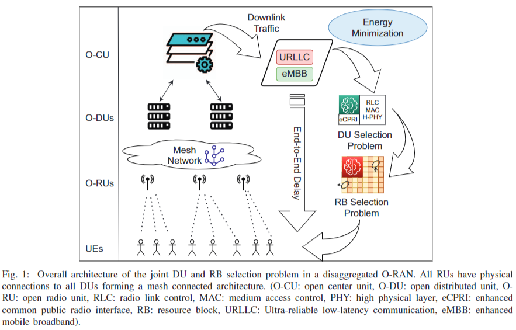
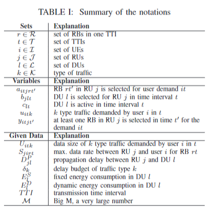
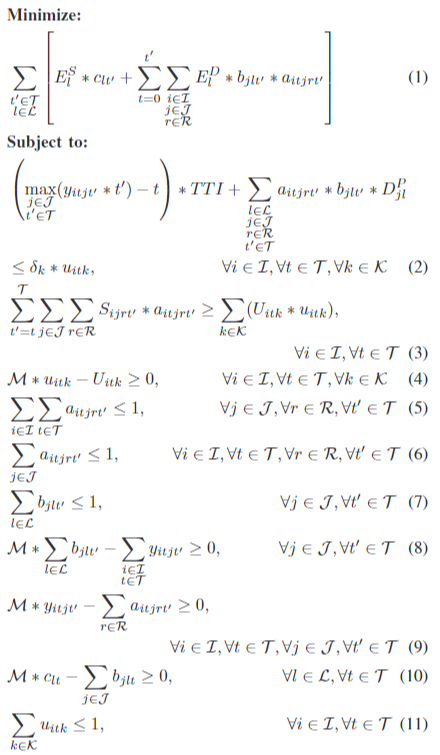
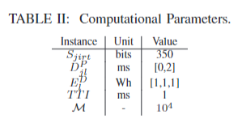
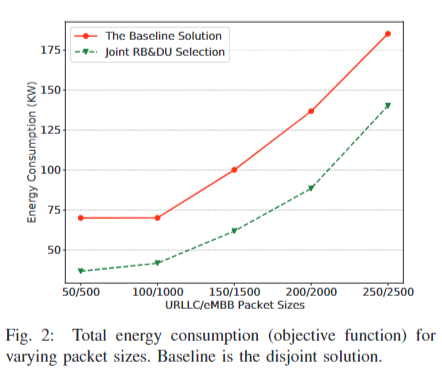
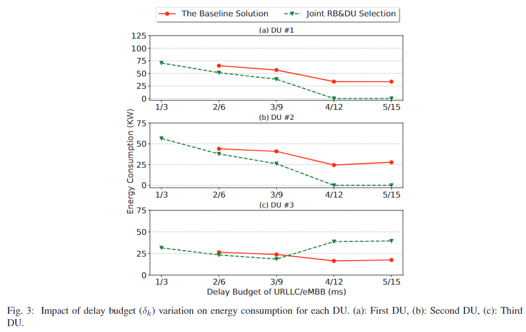
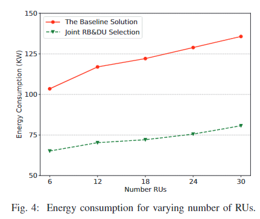

# Energy-Efficient and Delay Guaranteed Joint Resource Allocation and DU Selection in O-RAN

## ABOUT
| Items | Information |
| --- | --- |
| Paper Link | https://ieeexplore.ieee.org/document/9605044 |
| Authors | Turgay Pamuklu, Shahram Mollahasani, etc. |
| Date of Conference | 13-15 October 2021 |
| Date of Added to IEEE Xplore | 19 November 2021 |
| Type | Conference : 2021 IEEE 4th 5G World Forum (5GWF) |
| Keywords | Energy consumption, Wireless networks, Quality of service, Minimization, Energy efficiency, Resource management, Optimization, Resource allocation, Open Radio Access Networks (O-RAN) |

## I. Introduction
- Open RAN (O-RAN) allows flexibility in choosing vendors and aims to improve key performance indicators (KPIs) like energy efficiency and end-to-end delay.
- Energy efficiency is crucial due to rising operational costs and environmental concerns, while reducing overall energy consumption is a key goal for new RAN architectures.
- RB selection in 5G involves machine learning approaches and considers factors like traffic types and channel state information for energy reduction.
- Disaggregation in O-RAN introduces location and mapping challenges between network tiers, requiring innovative solutions for efficient network operation.
- Combining RB allocation and DU selection can enhance energy efficiency and meet delay constraints in O-RAN architecture, leading to significant energy savings.
- The study focuses on an energy-aware optimization model for joint RB allocation and DU selection in O-RAN, comparing it to a baseline method to show energy consumption reduction.

## II. System Model

* The system model focuses on how RUs allocate RBs to UEs in an O-RAN network connected to DUs.
* The model aims to improve network performance by considering traffic types, data sizes, and end-to-end delay.
* Key KPIs addressed are energy consumption and end-to-end delay, with proposed solutions targeting DU and RB selection for better network efficiency.

### A. Proposed Energy Minimization Problem with a Guarenteed Maximum Delay Scheme
* Proposed a problem to save energy and ensure timely data transmission by using a MILP-based approach.
* Objective function considers fixed and dynamic energy consumption in DUs.
* Constraints ensure latency requirements and user demands are met.
* Solver results can be analyzed using MILP solver and heuristics.
* The problem aims to minimize energy consumption while meeting delay and data rate constraints.
* Various constraints ensure efficient RB and DU selection, user demand satisfaction, and network functionality.
* MILP solver and heuristics can be used to solve the joint selection problem effectively.
* The proposed approach optimizes energy consumption and network performance simultaneously.
* The problem formulation considers various factors like energy consumption, latency, and user demands.
* The solution ensures efficient utilization of resources while meeting network requirements.

### Notations

### Optimization Objective Function

* The objective is to minimize the sum of energy consumption for sending and receiving data in the O-RAN architecture.
* Constraints ensure that the total transmission time for data packets does not exceed a certain threshold, considering the data rate and delay requirements.
* Another constraint guarantees that the total data sent by a user meets the minimum requirement for all services.
* The formulation includes constraints to limit the decision variables within specific ranges to ensure feasibility.
* Constraints are in place to control the allocation of resources and ensure that each resource is utilized effectively.
* The formulation also includes constraints to manage the selection of processing units and their capacities efficiently.
* Overall, the formulation aims to optimize energy efficiency while meeting the delay requirements and resource allocation constraints in the O-RAN architecture.

## III. Computational Experiments
* The computational experiments involved simulations in an O-RAN network with 3 DUs serving 6 RUs and 12 users demanding two types of traffic.
* The traffic types were URLLC and eMBB with different packet sizes and delay budgets, simulated over 10 time intervals.
* The simulations used various parameters like arrival rates, propagation delays, and energy consumption models.
* A MILP solver, GUROBI, was used to minimize energy consumption, with results based on averages from 6 runs.
* A joint solution was proposed, showing 40% lower energy consumption for larger packet sizes compared to the baseline method.
* The joint solution considered RB and DU selections based on propagation delays, improving scheduling and reducing energy consumption.
* By migrating functions to a lower energy-consuming DU, the proposed solution further reduced overall energy consumption.
* The joint solution's performance was tested with varying network sizes, showing 40% less energy consumption even with 30 RUs compared to the baseline solution.

## IV. Conclusion
* The research paper proposes a solution focusing on energy minimization and limiting latency for delay-sensitive user traffic in the O-RAN architecture.
* By formulating a joint DU selection and RB allocation problem as a MILP problem, the study compares this approach with a disjoint scheme, showing that the joint selection method is crucial for reducing energy consumption in O-RAN.
* The joint solution outperforms the baseline method by efficiently managing DU functions migration within strict budget constraints, ultimately leading to lower energy consumption, especially in larger network sizes.
* The study highlights the significance of balancing scheduling and propagation delays in optimizing energy efficiency and guaranteeing low-latency traffic in O-RAN.