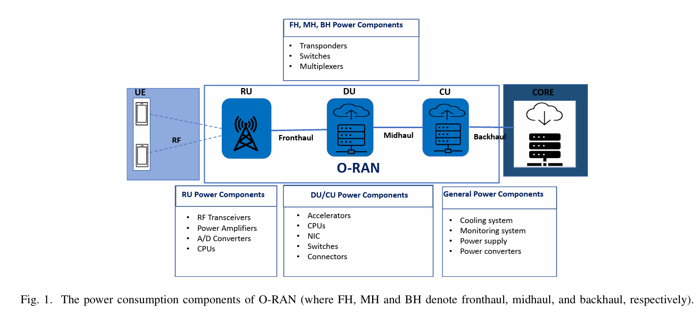
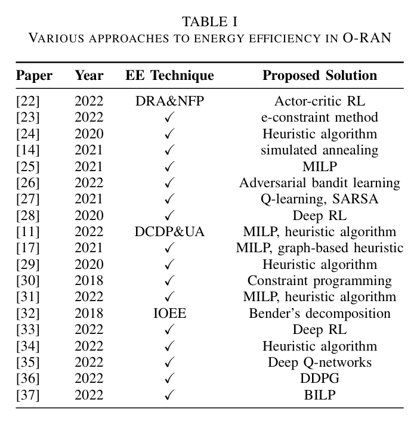

# Energy Efficiency of Open Radio Access Network: A Survey

- [Energy Efficiency of Open Radio Access Network: A Survey](#energy-efficiency-of-open-radio-access-network-a-survey)
  - [ABOUT](#about)
  - [I. Introduction](#i-introduction)
  - [II. RAN Evolution](#ii-ran-evolution)
  - [III. Power Consumption of O-RAN](#iii-power-consumption-of-o-ran)
    - [A. Power Consumption Components of O-RAN](#a-power-consumption-components-of-o-ran)
    - [B. Power Consumption Model of O-RAN Radio Network](#b-power-consumption-model-of-o-ran-radio-network)
    - [C. Power Consumption Model of O-RAN Transport Network](#c-power-consumption-model-of-o-ran-transport-network)
  - [IV. Energy Efficiency Techniques in O-RAN](#iv-energy-efficiency-techniques-in-o-ran)
    - [A. Dynamic Resource Allocation and Network Function Placement (DRA\&NFP)](#a-dynamic-resource-allocation-and-network-function-placement-dranfp)
    - [B. Dynamic CU and DU placement and user association (DCDP\&UA)](#b-dynamic-cu-and-du-placement-and-user-association-dcdpua)
    - [C. Indirect optimization of energy efficiency (IOEE)](#c-indirect-optimization-of-energy-efficiency-ioee)
  - [V. Challenges and Open Research Problems](#v-challenges-and-open-research-problems)
  - [VI. Conclusion](#vi-conclusion)

## ABOUT
| Items | Information |
| --- | --- |
| Paper Link | https://ieeexplore.ieee.org/document/10200477 |
| Authors | Attai Ibrahim Abubakar, Oluwakayode Onireti, etc. |
| Date of Conference | 20-23 June 2023 |
| Date of Added to IEEE Xplore | 14 August 2023 |
| Type | Conference : 2023 IEEE 97th Vehicular Technology Conference (VTC2023-Spring) |
| Keywords | O-RAN, Energy Efficiency, Power Consumption Model, 5G, and Beyond Networks |

The paper investigates the energy efficiency (EE) perspective of the Open Radio Access Network (O-RAN) architecture, reviewing power consumption models and techniques proposed to minimize energy consumption. The aim is to ensure that the advantages of O-RAN, such as enhanced network deployment, innovation, and reduced expenses, are not overshadowed by increased energy consumption.

## I. Introduction
- The paper discusses **the evolution of the radio access network (RAN)** from distributed architecture to the Open Radio Access Network (O-RAN) architecture, highlighting the improvements and challenges associated with each architecture.
- The O-RAN architecture is characterized by open interfaces, disaggregated network entities, virtualization of hardware and software, and intelligent control. It enables cost savings, efficient resource allocation, and enhanced competition and innovation.
- However, the impact of O-RAN on energy consumption is still an area of open research. The paper aims to **investigate the energy efficiency (EE)** perspective of O-RAN by reviewing power consumption models and techniques proposed to minimize energy consumption. It also identifies challenges and opportunities for further research in optimizing the EE of O-RAN.

## II. RAN Evolution
- Radio Access Network technology evolution:
    1. **Distributed RAN (D-RAN)**
        - Traditional RAN or Distributed RAN (D-RAN) architecture consists of a segmented base station with a BBU for signal processing and resource management, and an RRH for RF functions.
        - Each RRH is connected to its own dedicated BBU, resulting in closed interfaces and limited inter-operation among different vendor equipment. This architecture requires more base stations as the number of users increases, leading to higher CAPEX/OPEX.
    2. **Centralized RAN (C-RAN)**
        - Centralized-RAN (C-RAN) architecture pools together BBUs in a central location, improving resource utilization, network scalability, coordination, load balancing, and energy efficiency.
        - C-RAN offers energy-saving gains through stacking gains, pooling gains, and cooling benefits, resulting in enhanced utilization of RAN hardware and efficient power usage.
        - However, C-RAN requires a high-capacity and low-latency transport network, has security concerns, and faces the problem of a single point of failure due to BBU pooling.
    3. **Virtualized RAN (V-RAN)**
        - The Virtual-RAN (V-RAN) architecture introduces network virtualization, allowing for the softwarization of RAN components and their deployment on generic hardware, improving flexibility and scalability while reducing costs, but also introducing challenges in network management and closed interfaces.
    4. **Open RAN (O-RAN)**
        - The O-RAN architecture separates the RAN into three logical nodes: O-CU, O-DU, and O-RU, allowing for the disaggregation of network functions and the execution of different segments of the protocol stack in different nodes.
        - It embraces virtualization, open interfaces, and intelligent controllers to enable flexibility, dynamic allocation of network resources, and support for artificial intelligence and machine learning in the orchestration and optimization of the O-RAN.
- The transition from D-RAN to O-RAN involves significant changes in the architecture and factors responsible for these advancements.
- O-RAN enables enhanced network deployment, innovation, improved competition, and reduction of capital and operating expenses (CAPEX/OPEX) in 5G and beyond networks.
- The open interfaces and disaggregated network entities in O-RAN allow for interoperability, flexibility, and efficient resource allocation.
- O-RAN also promotes virtualization of network hardware and software, enabling more efficient utilization of resources.
- The transition to O-RAN architecture presents opportunities for cost savings, efficient resource allocation, and enhanced competition and innovation.

## III. Power Consumption of O-RAN
O-RAN architecture consists of various components that contribute to power consumption, including RF transceivers, power amplifiers, AD converters, CPUs, accelerators, NIC switches, connectors, transponders, switches, multiplexers, general power components, cooling system, monitoring system, power supply, and power converters.

### A. Power Consumption Components of O-RAN
- The power consumption of the radio network in O-RAN is determined by the hardware and software used for CUs, DUs, and RUs, as well as their location on the network nodes. Network virtualization and the use of virtual machines on COTS servers contribute to energy consumption.
- Components of the radio network include CPUs, accelerators, network interface cards, RF transceivers, power amplifiers, and common site infrastructures such as cooling and power supply systems.
- The energy consumption of the radio network is influenced by the functional split implemented, with more centralized network functions at the CU resulting in lower energy consumption for the RU.
- The power consumption of the transport network in O-RAN depends on the technology, network configuration, capacity requirement, and number of connections between CUs, DUs, and RUs.
- Components of the transport network include switches, transponders, and multiplexers, and examples of transport technologies are P2P fiber, PON, microwave radio, CWDM, and Ethernet. The type of split option adopted also affects power consumption.

### B. Power Consumption Model of O-RAN Radio Network
- The shift from dedicated hardware to software implemented on GPPs in O-RAN leads to CPUs becoming the main power consumers.
- Power consumption models for O-RAN can be categorized into analytical models (based on mathematical derivations) and statistical models (based on experimentation).
- Analytical models consider processing operations, function migration, and computational resource allocation.
- Statistical models consider parameters like SNR, MCS, traffic load, and channel quality to quantify CPU power consumption.
- Experimental models for virtual C-RAN consider MCS, physical resource block, CPU clock frequency, and traffic load.

### C. Power Consumption Model of O-RAN Transport Network
- The transport network in the Open Radio Access Network (O-RAN) architecture is referred to as the crosshaul network, which consists of the backhaul, midhaul, and fronthaul components. These components are implemented using different technologies.
- The power consumption of the transport networks in O-RAN depends on the type of technology used and the topology of the transport network.
- In this section, the paper reviews the power models that have been proposed in the literature for the transport networks compatible with O-RAN.
- The authors of the paper have proposed various power models based on simulations for five different technologies: P2P fibre, PON, microwave radio, CWDM, and Ethernet. These technologies can be used for mobile crosshaul in O-RAN.
- Another paper considered different configurations of optical transport networks and proposed power models to quantify the power consumption of each type of network topology.

## IV. Energy Efficiency Techniques in O-RAN
The energy efficiency techniques in O-RAN can be classified into three categories: dynamic resource allocation and network function placement, dynamic CU and DU placement and user association, and indirect optimization of energy efficiency.

### A. Dynamic Resource Allocation and Network Function Placement (DRA&NFP)
- Dynamic resource allocation and network function placement (DRA&NFP) is a research area focused on optimizing energy efficiency in O-RAN.
- Research works have proposed various techniques such as RL algorithms, e-constraint methods, heuristic algorithms, and MILP to minimize energy consumption while meeting QoS requirements.
- The optimal location of network functions among DUs can improve energy efficiency while considering latency and computation capacity constraints.
- V-RAN centralization may not always impact energy consumption, and CU-DU mapping can minimize energy costs without affecting user experience.
- Energy-efficient orchestration in 5G V-RAN considers functional splits and determines optimal locations for CUs and DUs to minimize energy consumption.
- Resource allocation and DU selection in O-RAN can be optimized to maximize energy efficiency while guaranteeing low-latency traffic requirements.
- Energy-aware scheduling of virtual base stations in O-RAN can adapt RAN performance to energy consumption using online learning algorithms.
- Dynamic function splitting in disaggregated and virtualized green O-RAN can be optimized to utilize renewable energy supplies and reduce network operation costs.
- Virtual network formation and forward graph embedding placement can minimize overall energy consumption in the network using combinatorial optimization and reinforcement learning frameworks.

### B. Dynamic CU and DU placement and user association (DCDP&UA)
- Dynamic CU and DU placement and user association (DCDP&UA) aims to optimize energy consumption in O-RAN by efficiently using computational resources.
- Different works have proposed optimization strategies for energy-efficient placement of CUs and DUs in 5G RAN and optical metro access networks.
- These strategies include MILP and heuristic algorithms to minimize power consumption while considering constraints like capacity and latency.
- Virtual RAN models have been used to jointly optimize midhaul bandwidth and total energy consumption, considering processing and capacity constraints.
- The deployment of DU, CU, and MEC in next-generation cellular networks has also been studied to minimize power consumption, using MILP and heuristic algorithms.

### C. Indirect optimization of energy efficiency (IOEE)
- Indirect optimization of energy efficiency (IOEE) focuses on factors such as computational cost and routing cost that impact energy consumption in O-RAN.
- Dynamic V-RAN configuration that minimizes RAN costs by selecting optimal functional split and signal transmission paths. [32]
- Proposed model that uses a neural combinatorial reinforcement learning problem and LSTM model to optimize functional split placement in V-RAN. [33]
- There is a model that proposes an optimal virtual network function splitting framework for O-RAN to balance network load and consider delay requirements. [34]
- This model proposed solves the problem of DU-CU placement and user association in O-RAN using multi-objective optimization and DQN. [35]

## V. Challenges and Open Research Problems
- Research on energy efficiency (EE) of O-RAN is in early stages, with most works focused on C-RAN architecture.
- More research attention is needed to address the peculiarities of O-RAN architecture and achieve energy savings.
- Developing a holistic power consumption model for O-RAN that considers hardware, software, functional splits, and virtualization is a challenge.
- The impact of dynamic placement of CUs and DUs, as well as dynamic functional splitting, on energy consumption needs further investigation.
- The energy consumption of RUs and the effect of transport technology and network design on overall energy consumption also require study.

## VI. Conclusion
- The Open Radio Access Network (O-RAN) architecture has the potential to enhance network deployment, innovation, competition, and reduce costs in 5G and beyond networks. However, it is important to carefully investigate the impact of O-RAN on energy consumption to ensure that the benefits of O-RAN are not overshadowed by increased energy usage.
- The paper reviews state-of-the-art power consumption models and energy efficiency (EE) techniques proposed for O-RAN. It highlights the need for optimization of EE in O-RAN and identifies opportunities for further research. 
- The evolution from Distributed RAN (D-RAN) to O-RAN brings significant changes and factors that affect power consumption. Various power models have been proposed to quantify energy consumption in both the radio and transport network of O-RAN. 
- Techniques for optimizing the energy efficiency of O-RAN have been developed, including resource allocation, function splitting, scheduling, and virtual network formation. These techniques aim to minimize energy consumption while meeting performance and delay requirements.
- The paper concludes by highlighting open challenges in optimizing the energy efficiency of O-RAN, indicating areas for future research and development.

