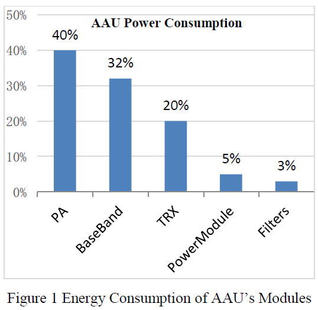
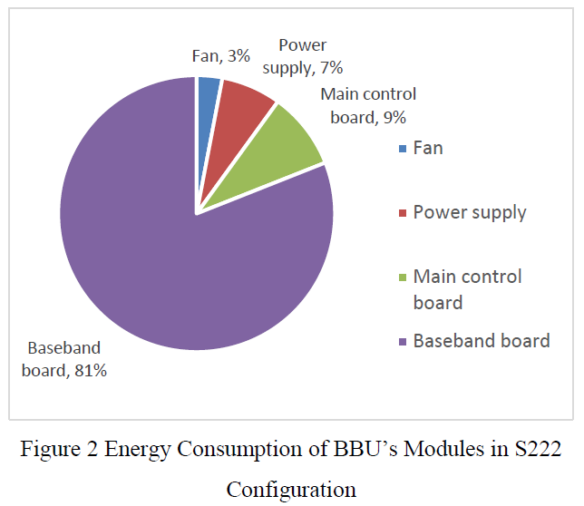
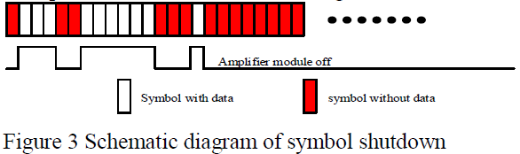
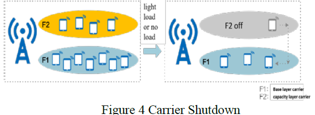
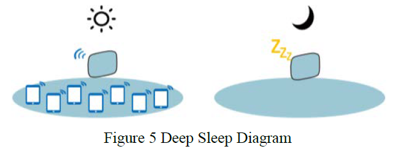
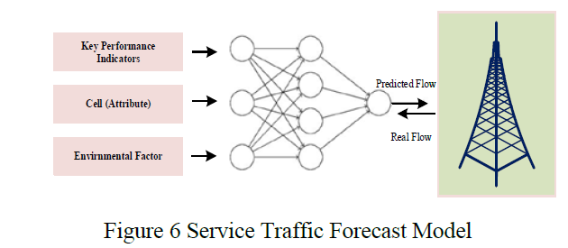
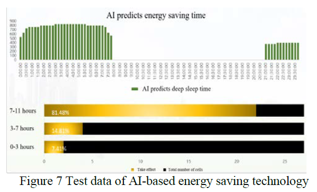

# Intelligent Energy Saving Technology and Strategy of 5G RAN

- [Intelligent Energy Saving Technology and Strategy of 5G RAN](#intelligent-energy-saving-technology-and-strategy-of-5g-ran)
  - [ABOUT](#about)
  - [I. Requirements and Scenarios of 5G RAN Energy Saving](#i-requirements-and-scenarios-of-5g-ran-energy-saving)
  - [II. Key Factors of 5G RAN Energy Consumption](#ii-key-factors-of-5g-ran-energy-consumption)
    - [A. AAU Energy Consumption Analysis](#a-aau-energy-consumption-analysis)
    - [B. BBU Energy Consumption Analysis](#b-bbu-energy-consumption-analysis)
  - [III. Energy Saving Principle of 5G RAN](#iii-energy-saving-principle-of-5g-ran)
    - [A. Dynamic Scaling Principle](#a-dynamic-scaling-principle)
    - [B. Trade-off Principle](#b-trade-off-principle)
    - [C. Scenario based Demand Principle](#c-scenario-based-demand-principle)
  - [IV. Energy Saving Technology for 5G RAN](#iv-energy-saving-technology-for-5g-ran)
    - [A. Traditional energy-saving technology of 5G RAN](#a-traditional-energy-saving-technology-of-5g-ran)
      - [1. Hardware energy-saving technology of 5G RAN](#1-hardware-energy-saving-technology-of-5g-ran)
      - [2. Software energy-saving technology of 5G RAN](#2-software-energy-saving-technology-of-5g-ran)
    - [B. AI-Based energy-saving technology of 5G RAN](#b-ai-based-energy-saving-technology-of-5g-ran)
      - [1. AI Model for energy-saving of 5G RAN](#1-ai-model-for-energy-saving-of-5g-ran)
  - [V. Energy Efficiency Evaluation System for 5G RAN](#v-energy-efficiency-evaluation-system-for-5g-ran)

## ABOUT
| Items | Information |
| --- | --- |
| Paper Link | https://ieeexplore.ieee.org/document/9828681 |
| Authors | Zhirong Zhang, Mingshuo Wei, etc. |
| Date of Conference | 15-17 June 2022 |
| Date of Added to IEEE Xplore | 25 July 2022 |
| Type | Conference : 2022 IEEE International Symposium on Broadband Multimedia Systems and Broadcasting (BMSB) |
| Keywords | 5G RAN, Energy Saving, AI, MIMO, KPI |

The paper discusses the need for high-speed, low power consumption in radio access networks (RANs) and the challenges associated with achieving these requirements. It highlights the importance of energy-saving techniques in RANs and the potential impact of deep sleep mode on the reliability of active antenna units (AAUs). The paper also mentions the analysis of key factors, core technologies, and the prospect of combining AI technology with 5G RAN energy-saving techniques. Additionally, it introduces the principles of dynamic scaling, trade-off, and scenario-based demand as the basis for energy-saving technology research and evaluation in 5G RANs. The paper emphasizes the complexity of implementing energy-saving techniques in RANs, particularly in the context of RANs cooperation and the challenges associated with different manufacturers and energy consumption.

## I. Requirements and Scenarios of 5G RAN Energy Saving
- The development of 5G technology has led to an increase in mobile data traffic, resulting in higher energy consumption of 5G RAN compared to 4G RAN.
- Energy saving in 5G RAN is a crucial aspect of 5G technology and is being prioritized by telecom operators worldwide.
- This paper analyzes the factors contributing to 5G RAN's energy consumption, discusses traditional energy-saving technologies, explores the potential of AI technology in energy saving, and proposes an evaluation system and future prospects for 5G RAN's energy saving.

## II. Key Factors of 5G RAN Energy Consumption
In the 5G network, the energy consumption of the main equipments accounts for more than 60% of the energy consumption of 5G RAN, and the AAU (Active Antenna Unit) exceeds 80%. Therefore, the energy saving technology is mainly oriented to the AAU.

### A. AAU Energy Consumption Analysis
- The power consumption test in the laboratory reveals that the 64TR AAU accounts for 90% of the total power consumption of the 5G base station with increased digital IF processing bandwidth and number of channels.
- To reduce AAU energy consumption, improving the energy efficiency of the power amplifier module, digital baseband, and transceiver is important.

### B. BBU Energy Consumption Analysis
- The BBU (Baseband Unit) in a 5G network consists of physical, second, and third layers for data processing and transmission.
- The baseband processing unit in the BBU is the main source of power consumption, accounting for 81% of the BBU's total power consumption.
- To improve energy efficiency, it is important to enhance the processing capability of the baseband board and use advanced technologies to reduce energy consumption.
- The power consumption of the BBU can be dynamically reduced by adjusting the service processing capability of the baseband processing unit based on user loads.

## III. Energy Saving Principle of 5G RAN
Basic principles of 5G RAN’s energy saving, which can be used as an important basis for subsequent energy saving technology research and Evaluation.

### A. Dynamic Scaling Principle
Involves service-based resource scaling and power consumption scaling, with a focus on allocating resources based on network KPIs and QoS requirements, and reducing resource overhead to save energy.

### B. Trade-off Principle
- Trade-offs are important in 5G RAN energy saving strategies and need to be carefully managed to improve overall energy-saving ability.
- There is a trade-off between energy-saving gain and network performance, where reducing network resources can lead to greater energy savings but also impact performance.
- "Performance on Demand" is a method that involves squeezing the margin of network performance in leisure scenes to minimize impact on user experience.
- There is a trade-off between 5G RAN's energy-saving and terminal's energy-saving, as adjustments made to reduce terminal power consumption can increase overhead for 5G RAN.
- 5G RAN needs to make changes to signaling interaction with terminals for energy-saving, but terminals must also be compatible with these changes to avoid affecting normal business processes.

### C. Scenario based Demand Principle
- The energy-saving demands of 5G RAN vary across different scenarios due to varying design constraints and user experience guarantees.
- Setting Energy-Saving Objectives: It’s necessary to set energy-saving objectives for each scenario, analyze the key technologies involved, and ensure performance.
- Evolution of Scenarios: Initially, energy-saving scenarios were relatively simple. However, with network evolution, scenario classification has become more complex with many characteristic scenarios such as outdoor, indoor, and high-speed railway scenarios.
- Differentiation Characteristics: Different scenarios often exhibit distinct characteristics. These characteristics can pose challenges or constraints in energy-saving design.
- Rational Utilization and Targeted Analysis: Utilizing these differentiation characteristics rationally and conducting targeted analysis can become the key technology for 5G RAN energy saving.

## IV. Energy Saving Technology for 5G RAN

### A. Traditional energy-saving technology of 5G RAN

#### 1. Hardware energy-saving technology of 5G RAN
- This technology aims to reduce the basic power consumption and improve the energy utilization of 5G RAN by optimizing its hardware design and enhancing equipment integration and production technology.
- New Semiconductor Processes: Accelerating the use of new semiconductor processes, such as the latest 5 or 7 nm process, can optimize the integrated circuit (IC) design, greatly improve the performance of 5G RAN, and further reduce its power consumption.
- Integration of AAU Hardware System: Improving the integration of key devices such as the real-time processing module of baseband, digital IF module, PA module, and other RF modules can enhance the integration of 5G RAN and reduce its power consumption.
- Technological Innovation and Product Application: Accelerating the innovation and application of new materials and processes related to the energy saving of 5G RAN, such as the use of new semiconductor material Gallium nitride (GaN), can continuously optimize the power amplifier efficiency of AAU.
- Challenges: Reducing hardware power consumption is a key indicator of the energy saving of 5G RAN. However, the current hardware design technology is not fully mature and exploration is still needed.

#### 2. Software energy-saving technology of 5G RAN
Software energy-saving technology in 5G RAN aims to reduce energy consumption by dynamically adjusting system resources based on communication service characteristics and network load, while maintaining system performance.

1. Symbol Shutdown
    - This process involves shutting down the PA and other RF components in real-time when there is no data on downlink symbols to reduce power consumption. 
    - These components can be quickly restarted when 5G RAN detects data on downlink symbols, ensuring no impact on real-time data transmission and network performance.
    - Improving Comprehensive Gain: There are multiple dimensions to improve the comprehensive gain of symbol shutdown. These include expanding application scenarios, such as applying symbol shutdown jointly to NR and LTE PA scenarios, and improving the shutdown depth by applying symbol-level shutdown to more devices beyond the traditional shutdown PA. This requires enhanced hardware capabilities.
    

2. Channel Shutdown
    - The Massive MIMO technology has improved 5G capacity. However, in low-demand scenarios such as at night, some downlink transmission channels can be shut down to meet real-time capacity requirements and reduce power consumption.
    - Automatic Adjustments: When the cell load is lower than a preset threshold, 5G RAN automatically shuts down some transmit channels to save energy. It also adjusts the transmit power of the common channels in the cell to ensure coverage and service are minimally affected.
    - Uplink Coverage: In scenarios where there is a margin for uplink coverage, it can be considered to close some uplink and downlink receiving channels to save power. However, the recovery time is long and affects uplink coverage.
    - UL/DL Channel Shutdown Function: Whether to shut down uplink receiving channels depends on if the uplink performance loss caused by shutdown can be accepted. The UL/DL channel shutdown function can be considered separately and selected according to the specific application scenario to balance energy saving gains and KPIs.

3. Carrier Shutdown
    - In multi-frequency co-coverage networks, carriers configured as basic cells and capacity cells can be shut down to reduce energy consumption during low-demand periods, such as at night.
    - Service Load Thresholds: When the service load of the co-coverage cell group is lower than a preset threshold, users of the capacity cell are migrated to the basic cell, and the capacity cell is shut down. When the service load exceeds a preset threshold, the capacity cell is restarted, restoring the network’s capacity to its pre-shutdown level.
    - Frequency Band Prioritization: If there are many frequency bands with the same coverage, the shutdown priority of different frequency bands can be configured based on their energy-saving gain and the capacity loss caused by shutting down.
    - Carrier Shutdown Scenarios: Carrier shutdown can occur within the NR system or between the NR and LTE systems. For example, if the service load is low, the service load of an NR cell can be migrated to an LTE cell, allowing the NR cell to be shut down to save energy.
    

4. Deep Sleep
    - In certain scenarios like shopping malls, subways, gymnasiums, offices, etc., when the network is not in use for a long time (e.g., at night), it’s necessary to turn off the cell and let the AAU enter a deep sleep state.
    - AAU in Deep Sleep: When the AAU is in deep sleep state, only the eCPRI, which communicates with BBU, is kept alive, and other hardware modules are shut down. This results in significant energy savings but at the cost of a longer wake-up time.
    - Considerations: Deep sleep is not recommended in scenarios where a quick wake-up speed is required. Also, due to the impact of deep sleep on AAU’s reliability, this function should be used in scenarios with controlled temperature and humidity to avoid affecting the normal operation of RF modules in AAU.
    

### B. AI-Based energy-saving technology of 5G RAN

#### 1. AI Model for energy-saving of 5G RAN
1. Energy Saving Scenario Identification
    - AI technology enables 5G RAN to automatically identify scenarios and select appropriate energy-saving policies.
    - Use of AI Models: The model uses historical data such as wireless resource usage, environmental conditions, traffic users, and service loads to establish typical energy-saving scenarios and apply different energy-saving policies.
    - Automatic Scenario Determination: The system can automatically determine the scenario based on the model and apply the corresponding energy-saving policy when the scenario changes.
    - Adaptation to Scenarios: The 5G RAN can adapt to each scenario according to the service usage trend.
    - Service Traffic Prediction: If the future service traffic trend can be predicted, corresponding measures can be taken in advance to reduce power consumption. This technology allows for longer energy-saving time compared to traditional energy-saving policy configuration based on real-time data.
    - Building the Model: The service traffic prediction model is built using a neural network that finds the mapping relationships between historical KPIs, other related cell information, and environmental factors and the service model. The real-time KPI and other related cell information are input into the service traffic prediction neural network to obtain the predicted service traffic of the local cell. The real service traffic value is used as a feedback item to modify the neural network and make its subsequent prediction more accurate.
    

2. Test data of AI-Based energy-saving technology of 5G RAN
    - In August 2021, China Telecom conducted a test of AI-based energy-saving technology for 5G RAN in Chengdu.
    - Energy-Saving Strategy Deployment: The test involved cell level load forecasting and a one station, one policy energy-saving strategy, considering both energy-saving demand and network performance.
    - Power Consumption Test Results: The average energy consumption of AAU was 593.70W when the energy-saving function was disabled and 409.15W when AI energy-saving technology based on load forecast was enabled.
    - Energy Saving Benefit: Turning on AI energy-saving based on load forecasting resulted in a 31.08% energy saving compared to not turning on energy saving.
    - Power Saving: 5G AAU saves 184.558W power consumption per hour, and the average daily power saving of a single device is 4.43 KWh.
    

3. AI-Based cooperative energy-saving technology of RANs
    - AI-Based Cooperative Energy-Saving: AI technology enables 5G RAN to identify scenarios and select energy-saving policies automatically.
    - Space Cooperation: Uses historical data of adjacent base stations for joint model prediction, improving traffic prediction accuracy.
    - Granger Causality Testing: Finds strong causality relationships between RANs for more accurate and stable predictions.
    - 4G/5G RAN’s Cooperation: Migrates service performance requirements from 5G to 4G RAN for energy saving, based on service traffic prediction.
    - Network-Wide Performance Evaluation: Using AI for energy saving for RANs allows for network-wide performance evaluation to prevent RANs from enabling the energy saving function due to their own optimal policies, resulting in network performance degradation.
    - Challenges: The basic AI energy saving model is still experimental, and cooperative energy saving needs to consider different manufacturers’ energy-saving methods. Exploration is ongoing.

## V. Energy Efficiency Evaluation System for 5G RAN
- This system for 5G RAN includes power consumption evaluation, energy saving benefit evaluation, and energy saving operation evaluation modules.
- Power Consumption Evaluation: This module calculates power consumption based on the power consumption counters of the existing network.
- Energy Saving Benefit Evaluation: This module compares the energy-saving benefits under different PRB usage rates and establishes energy-saving benefit models.
- Energy Saving Operation Evaluation: This module monitors the actual operation status of different energy-saving functions and determines the actual validation time of energy saving.
- Balanced State: The core of energy saving of 5G RAN is to achieve a balance of energy saving with benefits and stable network performance (KPI).
- Energy Efficiency Evaluation System: This system evaluates the effectiveness of energy-saving technology and strategy of 5G RAN without significantly affecting the network KPI. It improves the energy efficiency of 5G RAN and reduces the OPEX of 5G RAN.
- Challenges: Achieving good energy-saving results can be complex and requires ongoing exploration.