# Optimization of Energy-Efficient Cloud Radio Access Networks for 5G using Neural Networks

- [Optimization of Energy-Efficient Cloud Radio Access Networks for 5G using Neural Networks](#optimization-of-energy-efficient-cloud-radio-access-networks-for-5g-using-neural-networks)
  - [ABOUT](#about)
  - [1. Introduction](#1-introduction)
  - [2. Cloud-RAN System Model](#2-cloud-ran-system-model)
    - [A. Architechture Model](#a-architechture-model)
      - [At Remote Site](#at-remote-site)
      - [At the End User](#at-the-end-user)
    - [B. Power Consumption Model](#b-power-consumption-model)
    - [C. Problem Formulation and Analysis](#c-problem-formulation-and-analysis)
    - [D. ANN Architechture and Performance Analysis](#d-ann-architechture-and-performance-analysis)
  - [3. Artificial Neural Network-Based Optimization Model For Bisection GSBF Algorithm](#3-artificial-neural-network-based-optimization-model-for-bisection-gsbf-algorithm)
    - [A. Bi-Section GSBF algorithm procedure](#a-bi-section-gsbf-algorithm-procedure)
    - [B. The proposed ANN model complexity analysis](#b-the-proposed-ann-model-complexity-analysis)
  - [4. Simulation and Results](#4-simulation-and-results)
  - [5. Conclusion](#5-conclusion)

## ABOUT
| Items | Information |
| --- | --- |
| Paper Link | https://ieeexplore.ieee.org/document/9615290 |
| Authors | Maha Fathy, Mohamed Salah Abood, etc. |
| Date of Conference | 01-02 November 2021 |
| Date of Added to IEEE Xplore | 25 November 2021 |
| Type | Conference : 2021 International Conference on Intelligent Technology, System and Service for Internet of Everything (ITSS-IoE) |
| Keywords | Artificial Neural Network (ANN), Cloud Radio Access Network (Cloud-RAN), Group Sparse Beamforming, Remote Radio Heads (RRHs) optimization |

## 1. Introduction
- The paper focuses on optimizing energy-efficient Cloud Radio Access Networks (Cloud-RAN) for 5G using Neural Networks.
- Cloud-RAN architecture addresses challenges faced by mobile operators and increasing end-users while maintaining profitability and quality of service.
- The power consumption is jointly formulated as a beamforming and RRHs selection problem, which is complex to solve using conventional methods, leading to the introduction of an Artificial Neural Network (ANN) based optimization model.

## 2. Cloud-RAN System Model
### A. Architechture Model
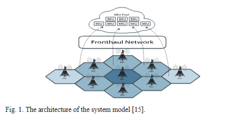

- The system architecture consists of RRHs connected to a centralized BBU pool through fiber links, enabling resource sharing and cooperation to reduce transmission power and improve Cloud-RAN performance by minimizing active RRHs and links. 
- The model composed of $L$ deployed RRHs of the same type, each connected with $N$ antennas, and $K$ end users, each with a single antenna: $S = {\{1,...,K\}}$ denotes users' index set.

#### At Remote Site
Baseband signal transmitted from each RRH:
$$
X_l = \sum_{k=1}^{K} W_{lk} S_k , \forall l \in A ,
$$
where:
$ W_{lk} \in \mathbb{C}^{N_l\times 1}, \forall l \in L, k\in K $
is the beamforming coefficients at RRH $l$ for end-user $k$, $S_k$ is user $k$ data symbol with unit power $E[|S_k|^2] = 1$.

Transmitted power for each active RRH is constrained by:
$$
\sum_{k=1}^{K} ||W_{lk}||^2 \leq P_l , ∀l ∈ A .
$$
where:
$P_l$ is the maximum power transmitted from RRH $l$.

#### At the End User
Baseband signal $y_k$ is received at user $k$ calculated as:
$$
y_k = \sum_{l \in \mathcal{A}} h_{kl}^H w_{kl} s_k + \sum_{i \neq k} \sum_{l \in \mathcal{A}} h_{kl}^H w_{il} s_i + e_k,
$$
where $h_{kl} \in \mathbb{C}^{N_l\times 1}$ for all $l \in L, k\in S$ is the channel vector between user $k$ and RRH $l$, $E_k$ is the additive noise with Gaussian distribution $\mathcal{CN}(0, \sigma_k^2)$, and $\sigma_k^2$ is the noise power at end user $k$.

If interference be considered as noise, each user has a signal-to-
interference-plus-noise ratio (SINR) of:
$$
SINR_k = \dfrac{\left|\sum_{{l}\in{\mathcal A}} h_{kl}^H w_{lk}\right|^2}{{\sum_{{i}\neq{k}}} {\left|\sum_{{l}\in{\mathcal A}} h_{kl}^H w_{li}\right|^2 + {\sigma_k}^2}}, \forall l\in L ~and~ k\in S.
$$

### B. Power Consumption Model
A sleep mode for RRHs and connected links is considered:
1. Model of RRH Power
RRH Power Consumption using linear model:
$$
p_l^{rrh} = 
\begin{cases} 
p_{a,l}^{rrh} + \frac{1}{n_l} p_{l}^{out} & \text{if } p_l^{out} > 0, \\
p_{s,l}^{rrh} & \text{if } p_l^{out} = 0,
\end{cases}
$$
- The linear model of RRHs considers the power of the entire RRH system, not the subsystem components of each RRH.
- This approach aligns with the goals of the proposed optimization problem, which requires only the power consumption of RRHs in on/off states.
- Other models have been proposed to capture the power consumed by each sub-component of the RRH.
- RRH power model can be divided into five sections which are Number of antennas, RF Transceiver, Power Amplifier (PA), RRH’s power conversion, and RRH cooling.
2. Fronthaul links the power model
Power consumed in the front-haul network is defined as:
$$
P^{tn} = P_{olt} + \sum_{l=1}^L P_l^{tl}
$$
where:
$P_{olt}$ is OLT consumed power

3. Overall network consumed power
$$
P(A, W) = \sum_{l \in A} \sum_{k=1}^{K} \frac{1}{n_l} ||W_k||_{l_2}^2 + 
\sum_{l \in A} P_l^C
$$
where $P_l^C$ is the link consumed power.

### C. Problem Formulation and Analysis
The problem of minimizing network power consumption can be formulated in this work as a combination of RRH set selection and beamforming transmission.
$$
\mathcal{P} : \min_{W_{lk}, A} P(A,W)
$$
subject to:
$$
\frac{\left| \sum_{l\in A} h_{kl}^H W_{lk} \right|^2}{\sum_{i\neq k}\left| \sum_{l\in A} h_{kl}^H W_{li}\right|^2 + {\sigma_k^2}} \geq \gamma_k,
$$
$$
\sum_{k=1}^{K}||W_k||_{l_2}^2 \leq P_l, \quad l \in A
$$
where $\gamma_k$ is user $k$ target $SINR$.

The constraint must be reformulated to second-order cone (SOC) form so that beamforming phases do not affect the objective function or
constraints.
$$
C_{Q}(A, W) : \left\| \begin{bmatrix} \begin{bmatrix} h_{k}^{H} W_{1}, \ldots, h_{k}^{H} W_{K}\end{bmatrix}^T \\ \sigma_k\end{bmatrix}\right\| \leq \sqrt{\beta_k} R(h_{k}^{H} W_k),
$$
where: $\beta_k = 1 + \frac{1}{\gamma_k}$.

The RRH power constraints in SOC form:
$$
C_p(A, W) : \|W_i\| 
\leq \sqrt{P_l}, l \in A ,
$$
where: $W_i = [W_1^T, ..., W_K^T]^T  \in C^{KN_l\times 1}.$

The driven optimization problem with the given active RRH set:
$$
p(A) : \min_{W} \sum_{l \in A} \sum_{k=1}^{K} \frac{1}{n_l} ||W_{lk}||_{l_2}^2 
$$
subject to:
$$
C_q(A,W), C_p(A,W), k \in S
$$

### D. ANN Architechture and Performance Analysis
- Artificial Neural Network (ANN) model designed with feed-forward topology includes one input layer, one output layer, and two hidden layers with 15 neurons each, using linear and hyperbolic tangent transfer functions.
- The ANN is trained using supervised learning with Bayesian regularization process, 80% training, and 20% testing instances collected from simulations, suitable for small-scale network models.

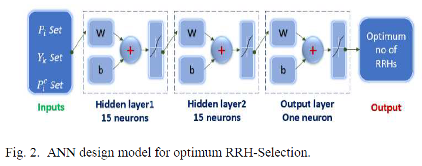

- Performance of the model is evaluated using Mean Square Error (MSE), Regression analysis, and Error Histogram, showing high correlation coefficients and accuracy in predicting new instances.

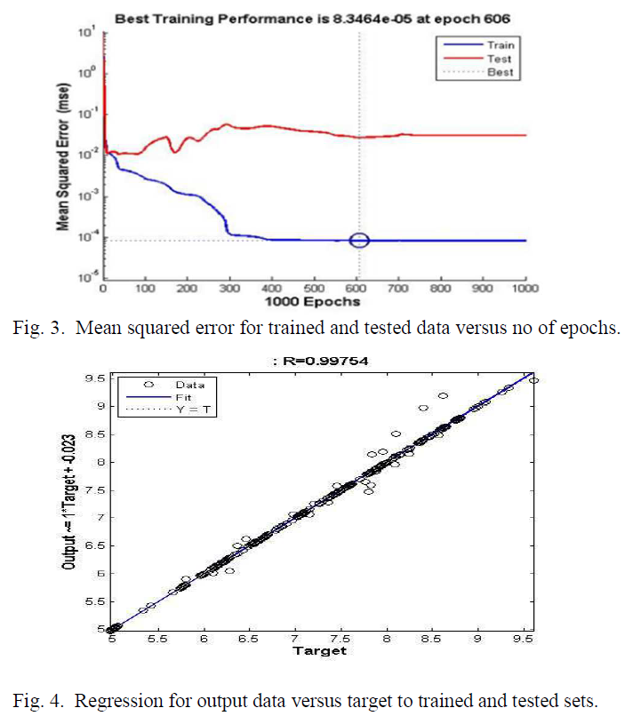

- MSE errors decrease over epochs, regression analysis yields high correlation coefficients, and Error Histogram analysis indicates most model outputs have errors near zero.
- The ANN architecture and performance analysis demonstrate the effectiveness and reliability of the model in optimizing RRH selection in wireless networks.

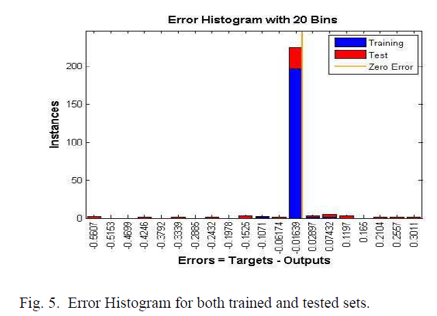

## 3. Artificial Neural Network-Based Optimization Model For Bisection GSBF Algorithm
1. the algorithm checks the network state (i.e., number of
distributed RRHs, end-users & QoS requirements and front-haul
power consumption)
2. the proposed ANN model delivers the near-optimum number of RRHs needed to be active in the remote site
3. the Bi-Section GSBF algorithm is applied to reach optimum and optimized solutions in some running RRHs and consumed power

### A. Bi-Section GSBF algorithm procedure
This algorithm is a binary search algorithm to minimize the number of active RRHs and hence total power consumption by applying three stages GSBF framework.

**Stage 1**: minimizes a weighted mixed $(\frac{l_1}{l_2}-norm)$ group-sparsity inducing norm problem, cause the group sparsity in the aggregative beamforming $w$. 
$$
w = \left[ W_{11}^T, ..., W_{1K}^T, ..., W_{L1}^T, ..., W_{LK}^T \right]^T,
$$
where: $\tilde{w}_l = \left[ w_{l1}^T, ..., w_{lk}^T \right]^T \in C^{KN_l}$.
RRHs with a higher link power consumption and a lower power amplifier efficiency will have a greater chance of being forced to be turned off.

**Stage 2**: Based on some key system parameters: beamforming gain, channel power gain, power amplifier efficiency, and relative link power consumption, an ordering rule is applied to set the priority for the off RRHs.
$$
\theta_l = \sqrt{\frac{k_l \eta_l}{P_l^C}} \left(\sum_{k=1}^{K} ||W_k||_{l_2}^2 \right)^{1/2}, \quad \forall l = 1, ..., L
$$

**Stage 3**: binary search procedure to determine the optimal active RRH set, followed by coordinated beamforming.
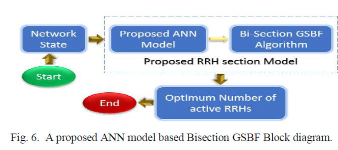

### B. The proposed ANN model complexity analysis
The total number of SOCP problems that must be solved grows quadratically with a near-optimal solution of the active number of RRHs obtained by the ANN model $L_{ANN}$ rather than the total number of presented RRHs $(L)$, given that the overall time complexity of the Bi-Section GSBF algorithm is given by:
$$ O((N_l L K)^{3.5} \log L) $$
where: $L$ is the total number of RRHs at the site, $N_l$ is the number of antennas at RRHl and K is the total number of users.

The new time complexity after the model is applied:
$$O((N L_{ANN} K)^{3.5} \log L_{ANN})$$
where $L_{ANN}$ is near the optimum solution of the active number
of RRHs obtained by the ANN proposed model. 

Since $L_{ANN} \leq L$, we achieve a **reduction in time complexity**.

## 4. Simulation and Results
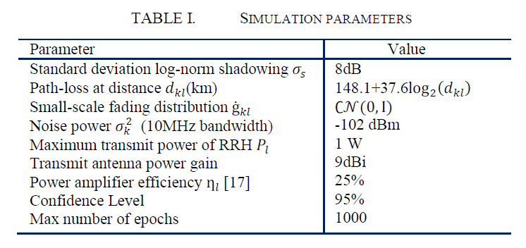
- Simulation results analyze network performance improvement by running RRHs at remote sites and reducing total consumed power.
- The Bi-Section GSBF algorithm's time complexity is evaluated for designing a power-efficient system and compared with the Coordinated Beamforming technique.

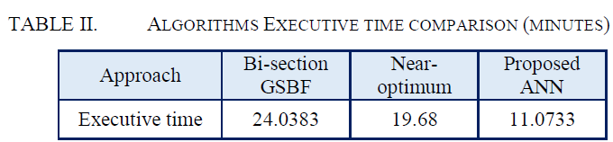

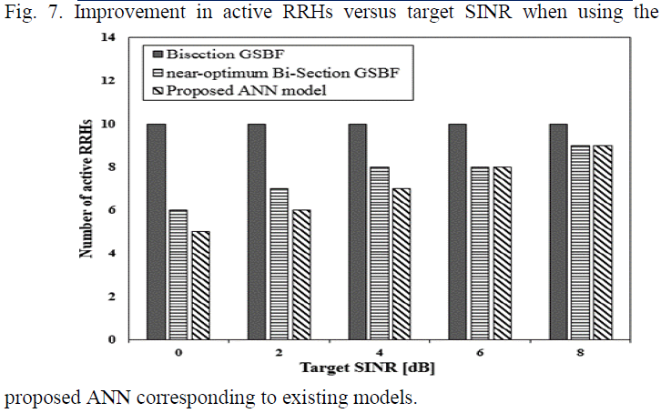

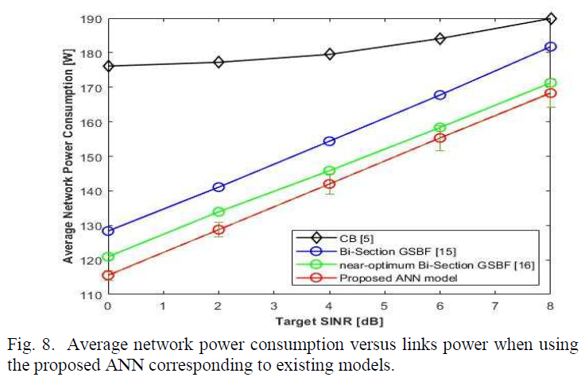

- Path-loss calculation, antenna gain, shadowing coefficient, and small-scale fading coefficient are considered in the channel model.
- Standard cellular network settings are used, and results are statistically confirmed with a 95% confidence interval.
- The proposed ANN model outperforms Bi-Section GSBF and near-optimum solutions in optimizing active RRHs and reducing network power consumption.
- The ANN model demonstrates efficiency by achieving near-optimum results in significantly less time compared to heuristic approaches.
- A clear comparison of algorithms' execution time shows a time improvement by applying the proposed ANN model.
- The ANN model predicts optimum active RRHs based on relative power consumption, leading to minimized network power consumption compared to heuristic-driven approaches.

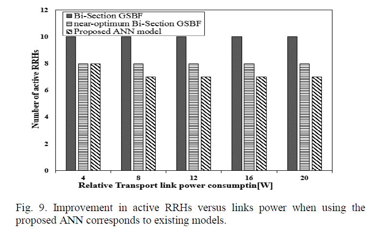

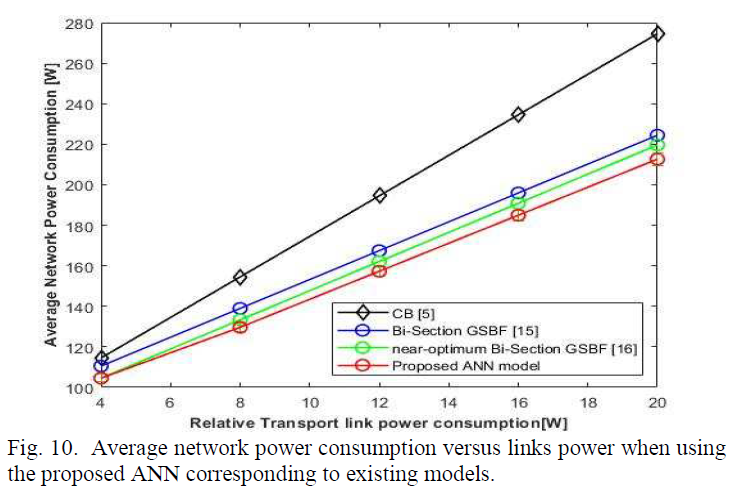

## 5. Conclusion
* The paper introduces an Artificial Neural Network (ANN) based optimization model to optimize active Remote Radio Heads (RRHs) numbers and power consumption in Cloud Radio Access Networks for 5G.
* The proposed model considers various signal to interference plus noise ratios per client and power consumption models, using a Bi-Section Group Sparse Beamforming (GSBF) optimization algorithm.
* The results validate the effectiveness of machine learning techniques in reducing complexity and power consumption in Cloud-RAN for 5G networks.