# Understanding O-RAN Architecture Interfaces Algorithms Security and Research Challenges

## ABOUT
| Items | Information |
| --- | --- |
| Paper Link | https://ieeexplore.ieee.org/document/10024837 |
| Authors | Michele Polese, Leonardo Bonati, etc. |
| Date of Publication | 23 January 2023 |
| Type | Journal and Magazines |
| Published In | IEEE Communications Surveys & Tutorials (Volume: 25, Issue: 2, Secondquarter 2023) |
| Keywords | Open RAN, O-RAN, Cellular , 5G, 6G |

## 1. Introduction
- The paper provides a detailed tutorial on O-RAN, its architecture, interfaces, and workflows. 
- O-RAN promotes virtualized RANs with disaggregated components connected via open interfaces and optimized by intelligent controllers. 
- O-RAN networks can be built with multi-vendor, interoperable components and can be programmatically optimized through a centralized abstraction layer and data-driven closed-loop control. 
- The paper discusses the research challenges and early research results related to O-RAN networks. 
- It covers topics such as AI and ML workflows enabled by O-RAN, security challenges, standardization issues, and experimental research platforms for designing and testing O-RAN networks.

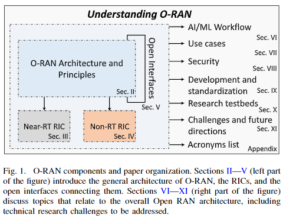

## 2. O-RAN Key Architechtural Principles
- The Open RAN vision is based on years of research on open and programmable networks, with principles from Software-defined Networking (SDN) being applied to the wireless domain.
- The xRAN Forum and C-RAN Alliance have proposed standardized interfaces and architectures for the integration of external controllers and centralization of baseband processing in virtualized cloud data centers.
- The O-RAN Alliance, formed by the collaboration of xRAN Forum and C-RAN Alliance, aims to specify and standardize an architecture and set of interfaces for Open RAN, with expectations of driving 50% of RAN-based revenues by 2028.
- The foundational principles of Open RAN include **disaggregation, intelligent data-driven control with RICs, virtualization, and open interfaces**.

### A. Disaggregation
- RAN disaggregation splits base stations into functional units, including Central Unit (CU), Distributed Unit (DU), and Radio Unit (RU).
- The CU is split into Control Plane (CP) and User Plane (UP), allowing different functionalities to be deployed on different hardware platforms.
- The O-RAN Alliance has evaluated different RU/DU split options and selected the 7.2x split, which balances simplicity and data rates/latency requirements.
- In split 7.2x, the RU handles time-domain functionalities, while the DU takes care of remaining physical layer functionalities and MAC/RLC layers.
- The CU units implement higher layers of the 3GPP stack, such as RRC, SDAP, and PDCP layers.

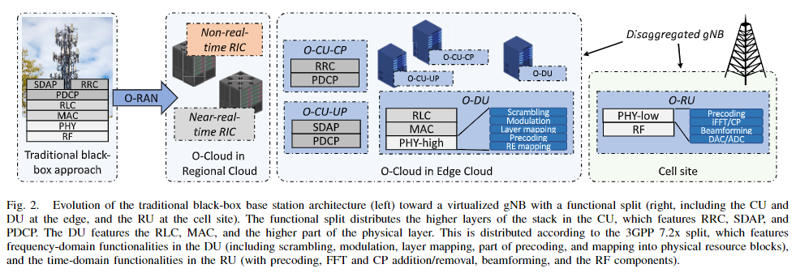

### B. RAN Intelligent Controllers and Closed-Loop Control
- The RAN Intelligent Controllers (RICs) introduce programmable components that optimize and orchestrate the RAN using closed-loop control.
- The RICs process data from Key Performance Measurements (KPMs) and external sources to determine control policies and actions for network optimization.
- The O-RAN Alliance has specifications for a non-real-time RIC and a near-real-time RIC, which operate on different time scales.
- The non-real-time RIC provides guidance and management of ML models for the near-real-time RIC, and can influence SMO operations.
- The near-real-time RIC operates control loops with a periodicity between 10 ms and 1 s, affecting the QoS of multiple RAN nodes and User Equipments (UEs).
- The near-real-time RIC consists of xApps, which are microservices used for radio resource management, and supporting services and infrastructure.
- Future extensions to the O-RAN architecture may include real-time control loops for radio resource management at the RAN node level and device management and optimization.

### C. Virtualization
- The O-RAN architecture introduces additional components for network management and optimization, including virtualization platforms.
- The O-Cloud platform combines computing resources and virtualization infrastructure for O-RAN, enabling decoupling between hardware and software components and automated deployment of RAN functionalities.
- The O-RAN Alliance Working Group is developing hardware acceleration abstractions and defining characteristics for white box hardware to implement O-RAN-compliant equipment.
- Virtualization in the RAN components and O-RAN compute elements is expected to reduce power consumption by dynamically scaling compute resources and enabling refined sleep cycles for base stations and RF components.
- Virtualized RAN implementations on commercial hardware are being developed to support 3GPP NR use cases.

### D. Open Interfaces
- The O-RAN Alliance has introduced technical specifications for open interfaces in the O-RAN architecture.
- These open interfaces enable data analytics, telemetry, and control actions, breaking the traditional RAN black box approach.
- Standardization of these interfaces helps in breaking vendor lock-in, promoting market competitiveness and innovation.
- The E2 interface connects the near-RT RIC to the RAN nodes, enabling near-real-time loops.
- The O-RAN architecture allows for flexible deployment of equipment in different network locations.
- The O-RAN Alliance has defined tests for interoperability across different interface implementations.

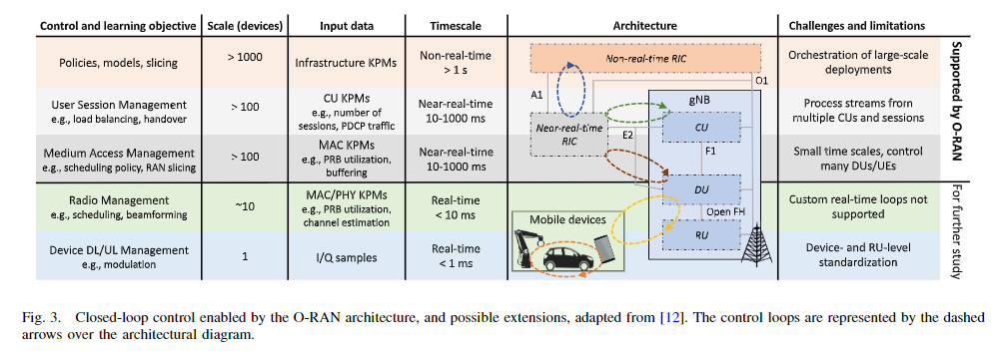
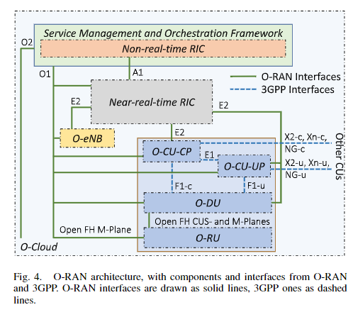

## 3. Near RT-RIC, xApps, and Control of the RAN
* The near-RT RIC is crucial for controlling and optimizing the RAN through the E2 interface.
* The near-RT RIC platform includes interfaces (O1, A1, and E2), xApps, and components for executing and managing xApps.
* The O-RAN Alliance provides a reference implementation of a functional near-RT RIC based on microservices running on a Kubernetes cluster.

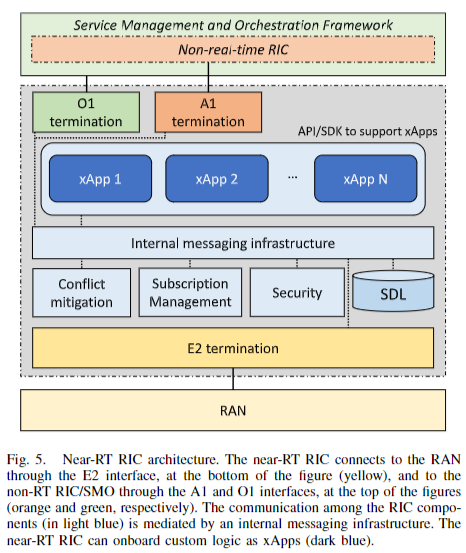

### A. Near-RT RIC Internal Components
- Near-RT RIC architecture includes internal messaging infrastructure, conflict mitigation, subscription manager, security sub-system, NIB database, shared data layer API, and xApp management.
- **Internal messaging infrastructure** connects xApps, platform services, and interface terminations and provides registration, discovery, and messaging APIs.
- **Conflict mitigation** component resolves conflicts arising from different xApps applying conflicting configurations.
- **Subscription manager** allows xApps to connect to functions over the E2 interface and controls access to E2 messages.
- **Security sub-system** aims to prevent malicious xApps from leaking sensitive RAN data or affecting RAN performance.
- **Network Information Base (NIB)** database stores information on E2 nodes and UE-NIB tracks and correlates user identity across different E2 nodes.
- **xApp management** provides services for automated life-cycle management of xApps, including onboarding, deployment, termination, and FCAPS tracing and logging.

### B. Near-RT RIC xApps
- Near-RT RIC consists of xApps, which are plug-and-play components that implement custom logic for RAN data analysis and control.
- xApps are defined by a descriptor and a software image, and can receive data from the RAN and send control using the E2 interface.
- The O-RAN specifications currently mandate a limited set of APIs for the near-RT RIC platform, but efforts are being made to develop a broader set of APIs for seamless portability of xApps.

### C. Open Source Near-RT Implementations
- Open source near-RT RIC implementations, such as ColO-RAN and SD-RAN, enrich the Open RAN ecosystem by providing experimentation and control capabilities.

- **The SD-RAN project by ONF** is developing an open source and cloud-native implementation of near-RT RIC, along with xApps and an SDK for designing new xApps.

- **FlexRIC** offers a monolithic near-RT RIC and a RAN agent for interfacing with the OpenAirInterface radio stack, including monitoring and slicing programmability use cases.

- **5G-EmPOWER** is a near-RT RIC for heterogeneous RANs, featuring non-standard-compliant functionalities like mobility management and custom resource allocation within network slices.

- **The SMO framework** is responsible for orchestration, management, and automation procedures in the O-RAN architecture. It hosts the non-RT RIC and provides interfaces for interaction between network components, as well as data collection capabilities for network monitoring and control via AI/ML.

## 4. Non-RT RIC and Orchestration Framework
* The SMO framework is a key element of the O-RAN architecture and is responsible for orchestration, management, and automation procedures in RAN components.
* The SMO hosts the non-RT RIC and provides interfaces for interaction between network components and data collection for network monitoring and control via AI/ML.
* The SMO architecture includes functionalities and interfaces anchored to the non-RT RIC, functionalities anchored outside the non-RT RIC, and functionalities that are not yet anchored or span multiple components.

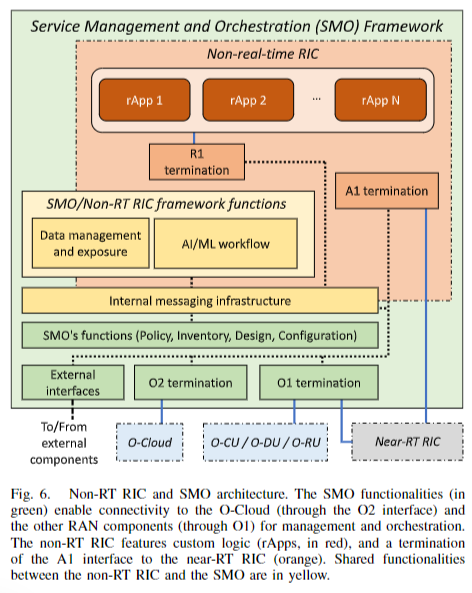

### A. Non-Real-Time RIC
* Non-Real-Time RIC in O-RAN architecture enables closed-loop RAN control with timescales larger than 1s and supports third-party applications (rApps) for services like policy guidance, configuration management, and data analytics.
* rApps at non-RT RIC provide functionalities such as frequency management, RAN sharing, performance diagnostics, SLA assurance, and network slicing for control policies affecting multiple users and network nodes.
* Non-RT RIC offers intent-based network management for operators to specify intents via a high-level language and intelligent orchestration to coordinate network intelligence and applications execution.
* Intent-based network management allows operators to specify intents through a human-machine interface, parsed by non-RT RIC to determine policies and apps needed for execution.
* Intelligent orchestration by non-RT RIC ensures selected apps are suitable for operator intents, instantiated at the right RIC location, fed with relevant data, and avoid conflicts in controlling functionalities simultaneously.

### B. Other SMO/Non-RT RIC Functionalities
* SMO and non-RT RIC have shared functionalities and components for internal messaging infrastructure, enabling access to interfaces and data. Policies from rApps can reach the non-RT RIC through terminations and interfaces.
* O-RAN specifications include data management and exposure services for SMO/non-RT RIC, following a consumer/producer protocol for data exchange. AI/ML solutions are supported through data collection, pre-processing, and consumption by rApps.
* The non-RT RIC offers oversight of the entire AI life cycle, covering data collection, training, validation, deployment, and execution. This AI/ML workflow supports development processes detailed in Section VI with a diagram provided.

### C. SMO Framework and Open Source SMO Implementations
* SMO framework manages FCAPS, service inventory, network configuration, and policy orchestration within O-RAN components.
* Proprietary SMO solutions by O-RAN Alliance members are closed, while open-source options like ONAP and OSM offer automation and orchestration in virtualized networks.
* ONAP, maintained by Linux Foundation, integrates with major projects like Kubernetes, while OSM, hosted by ETSI, follows VNF standard specifications.
* ETSI's cooperation with O-RAN Alliance is enhancing integration between OSM and O-RAN architecture for efficient network management.

## 5. The O-RAN Open Interfaces
* O-RAN Open Interfaces, defined by O-RAN Alliance specifications, enable control loops in near-RT and non-RT RICs through well-defined procedures and message exchanges, such as subscription and indication procedures for E2, providing services like telemetry reporting from the RAN.
* The interfaces like E2, O1, A1, and fronthaul are crucial in the Open RAN ecosystem, each with specific roles and procedures outlined in different sections of the O-RAN Alliance specifications.

### A. E2 Interface
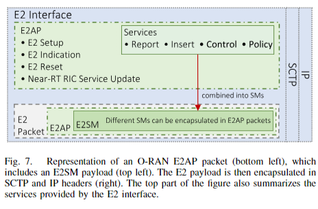

* The E2 interface facilitates communication between the near-RT RIC and E2 nodes like DUs, CUs, and LTE eNBs, enabling control over radio resource management and data collection of RAN metrics.
* Unique identifiers based on 3GPP specifications are used by the O-RAN Alliance for gNB, slice, QoS class, and a common UE-ID for specific UEs to ensure consistent user identity.
* The E2 interface is structured into E2 Application Protocol (AP) and E2 Service Model (SM), running on SCTP protocol, coordinating communication and specific functionalities between near-RT RIC and E2 nodes.
* E2 nodes expose RAN functions and capabilities, allowing xApps on near-RT RIC to subscribe to specific functions through the E2 interface, enabling clear separation and interaction with the RAN.
* Procedures for E2 session setup and streaming of KPMs involve interactions between E2 nodes and near-RT RIC, with E2AP managing interface setup, errors, and RAN function updates.
* E2 setup involves establishing SCTP connection, transmitting setup requests listing RAN functions and configurations, and receiving setup responses from the near-RT RIC.

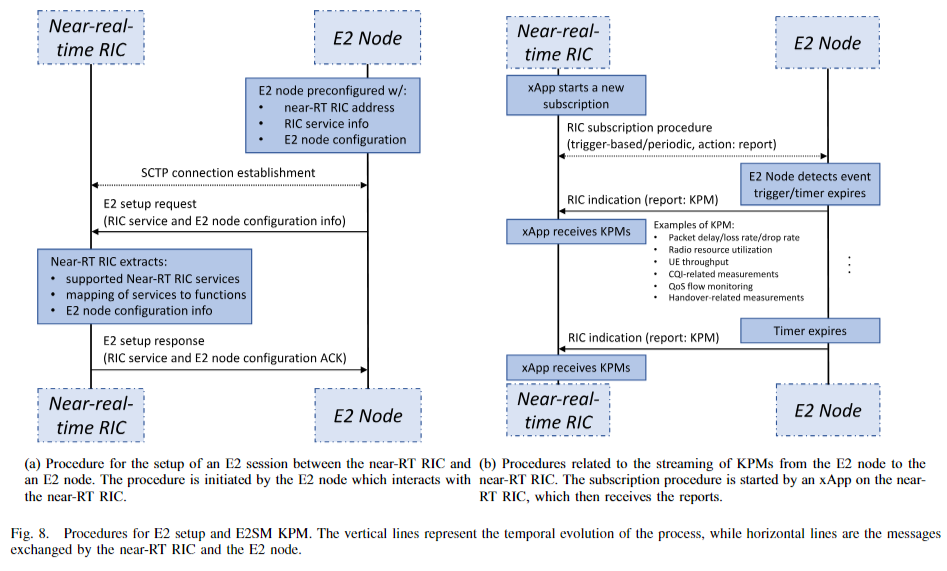

#### Services of E2 Application Protocol (AP)
- E2AP provides four services: E2 Report for data and telemetry, E2 Insert for event notifications, E2 Control for parameter influence, and E2 Policy for radio resource management.
- E2 services are activated upon subscription from xApp to E2 node, involving RIC Indication messages and trigger events.
- E2 Control service involves RIC Control Request and Acknowledge messages to influence RAN parameters.
- E2 Policy service includes event triggers and policies for autonomous radio resource management by the E2 node.
- Services are combined to create a service model, encoded using ASN.1 notation, and examples are provided in Appendices A and B.

#### E2 Service Models
- O-RAN Alliance WG3 has developed four E2 service models: E2SM KPM, E2SM Network Interfaces (NI), E2SM Cell Configuration and Control (CCC), and E2SM RAN Control (RC).
- E2SM KPM reports RAN performance metrics using E2 report service, allowing for subscription of specific metrics and periodic or trigger-based reporting.
- E2SM NI forwards messages from E2 nodes on specific network interfaces to near-RT RIC domain via E2 report messages over the E2 interface.
- E2SM CCC controls and re-configures E2 nodes at a cell or node level, focusing on tasks like bandwidth part configuration and leveraging E2 report and control messages.
- E2SM RAN Control (RC) acts as a service controller for specific task especially in Near-RT RIC part which used the concept of closed loop control.

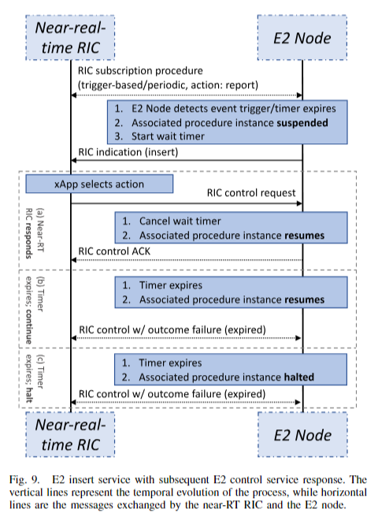

#### Closed-Loop Control with E2SM RAN Control (RC)
- E2SM RAN Control (RC) optimizes radio resource management in E2 nodes with granular control up to UE or bearer level.
- Control domains include radio bearer control, resource allocation, mobility control, access control, Dual Connectivity (DC) control, Carrier Aggregation (CA) control, and idle mobility control.
- E2SM RC enables UE identification, UE information reporting, and control actions based on 3GPP standardized parameters.
- E2SM leverages E2 services for control actions, with examples of E2 messages exchanged between E2 node and xApp during control procedures.
- Control procedures involve triggering events or timers, E2 Insert messages, handover control requests, and responses from near-RT RIC.
- Control actions can be asynchronous, and E2SM can specify control policies and offset policies to modify E2 node behaviors.
- Policies allow E2 nodes to perform actions without RIC interaction based on conditions, while offset policies adjust thresholds by adding or removing offsets.

### B. O1 Interface

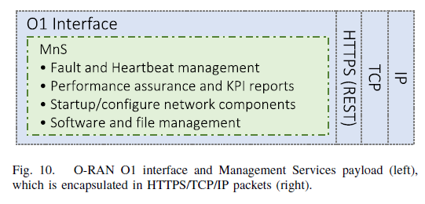

* The O1 interface in O-RAN connects components like near-RT RIC and RAN nodes to SMO and non-RT RIC, supporting Management Services (MnS) for lifecycle management, performance assurance, and trace collection.
* Provisioning Management Services in O1 allow SMO to push configurations, receive updates, and report errors using REST/HTTPS APIs and NETCONF, following 3GPP technical specifications.
* Fault Supervision MnS reports errors to SMO based on 3GPP-defined fault events, allowing RAN nodes to report errors using REST APIs and manage alarms and heartbeats.
* Performance Assurance MnS streams or reports performance data to SMO for analytics, selecting KPIs and reporting frequency based on 3GPP or VES project standards.
* O1 interface enables file transfer notifications, bulk transfers through SFTP, real-time streaming via WebSocket, and monitoring trace-based events for profiling calls and failures.
* The O1 interface facilitates pushing and downloading files for software updates, beamforming configurations, ML model deployment, and security certificates on nodes managed by SMO.

### C. A1 Interface

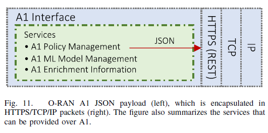

* The A1 interface in O-RAN connects non-RT RIC with near-RT RIC, enabling policy-based guidance, ML model management, and enrichment information transfer using JSON schema.
* A1AP application protocol is used for service management over A1, based on 3GPP framework for policy deployment, utilizing REST APIs over HTTP for JSON object transfer.
* A1 Policy management by non-RT RIC defines high-level intent for RAN through QoS or KPI goals, deploying policies over A1 and managing their lifecycle.
* Policies in A1 interface are based on specific JSON schema grouped by policy types, with unique identifiers, scopes, and policy statements for different entities like UEs, slices, cells, etc.
* A1 Enrichment Information (EI) service enhances RAN performance by providing external information like capacity forecasts, aggregate analytics to xApps in near-RT RIC via non-RT RIC or directly.

### D. Open RAN Fronthaul (FH)
* O-RAN Fronthaul interface connects DU to RUs in a gNB, enabling a 7.2x split of physical layer functionalities with data and control over CU-planes.
* The split 7.2x configuration balances interface simplicity, RU design, interoperability, and fronthaul data rate, supporting Ethernet or UDP/IP encapsulation for transport.
* Category A and B RUs handle different physical layer functions, with DUs supporting scrambling, modulation, and mapping.
* O-RAN FH interface allows one DU to serve multiple RUs, with options for multiplexing streams or daisy-chaining RUs, ensuring reliable, low-latency communications matching URLLC flow requirements.
* Fronthaul interface includes modulation compression techniques for reduced network load and supports URLLC flows with minimal jitter, enhancing overall performance.

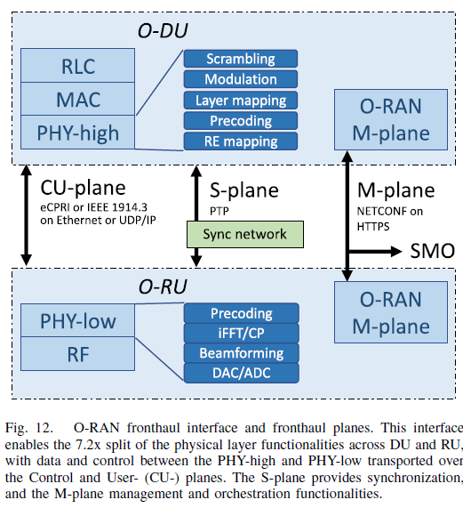

#### O-RAN Fronthaul Protocols
- O-RAN FH protocol consists of U-plane, C-plane, S-plane, and M-plane for data transport, control commands, synchronization, and management.
- C-plane manages commands from high-PHY in DU to low-PHY in RU, including beamforming, scheduling, NR numerologies, and spectrum sharing.
- C-plane and M-plane together configure beamforming capabilities in RUs, supporting multiple antenna panels and beamforming options.
- U-plane transfers I/Q samples between RU and DU, handling scheduling, beamforming, timing, digital gain, and data compression.
- S-plane ensures time, frequency, and phase synchronization between DU and RU clocks for proper system functioning.
- S-plane can have different topologies and synchronization profiles using protocols like PLFS or PTP for sub-microsecond accuracy.
- M-plane runs parallel to other planes, establishing IPv4/IPv6 tunnel for DU-RU connection, management, and configuration.
- M-plane manages RU life cycle operations, such as start-up, software updates, configuration, fault monitoring, and beamforming vectors.
- O-RAN Alliance develops specifications for open fronthaul networks supporting connectivity between DUs and RUs, including network-enabled synchronization and management aspects.
- ETSI has adopted O-RAN Alliance FH document as a standard, covering user, control, and synchronization planes.

## 6. AI/ML Workflow
* The AI/ML workflow in O-RAN architecture involves six main steps: data collection, training, validation, deployment, AI/ML execution, and continuous operations, aiming to address common issues in AI/ML for networks.
* O-RAN WG2 is investigating the AI/ML workflow with specifications described in "O-RAN AI/ML workflow description and requirement 1.03", focusing on developing, training, and deploying xApps to control RAN slicing policies based on network load and traffic demand.
* The workflow helps avoid issues like limited data availability, improper training, and lack of infrastructure support, ensuring diverse performance requirements of network slices are met.
* The xApp example involves managing URLLC, eMBB, and mMTC slices by assigning PRBs to meet performance needs, showcasing the AI/ML life-cycle within O-RAN systems.

### I. Workflow in Detail

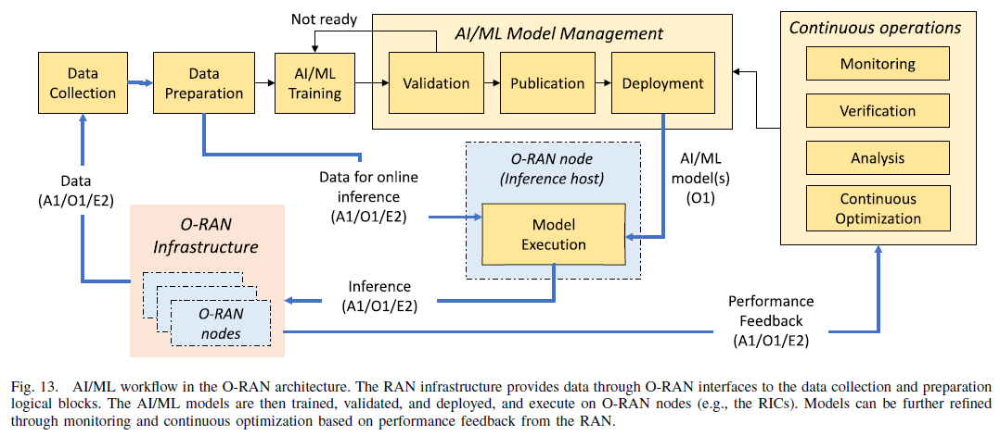

#### A. Data Collection and Processing
- Data collection in O-RAN involves storing data from various interfaces in centralized repositories for extraction. 
- Designing data reporting solutions for interfaces like O1, A1, and E2 helps in collecting large-scale datasets beneficial for AI/ML models.
- O-RAN specifications include data preprocessing to shape and format data for training and online inference, considering different KPM types and granularity. 
- This step involves using techniques like autoencoders, normalization, scaling, and reshaping to avoid issues with poorly formatted data.
- For xApp controlling RAN slicing policies, data collection over the O1 interface is crucial for generating a training dataset. 
- This dataset includes performance metrics like PRBs, throughput, latency, and packet transmission to adapt slicing policies based on data demand and performance requirements.

#### B. Training
- O-RAN specifications do not allow the deployment of any untrained data-driven solution.
- All AI/ML models are required to undergo an offline training phase. This ensures the reliability of the models and prevents network issues due to poorly trained or untrained models .
- Online training is supported by O-RAN, but it should only be used to fine-tune and update a model that has been previously trained offline .
- Operators can train a variety of AI algorithms, each controlling the number of Physical Resource Blocks (PRBs) allocated to each network slice.
- These algorithms can differ in their implementation details, combinations, input formats, and architectures.
- Operators can train a set of Deep Reinforcement Learning (DRL) agents and decision trees, exploring different combinations and input formats.
- The goal is to train a large number of AI algorithms and identify which ones are the most suitable to accomplish a specific task.

#### C. Validation and Publishing
- Trained models undergo a validation phase to ensure reliability and effectiveness.
- Successful validation leads to models being published and stored in an AI/ML catalog on the SMO/non-RT RIC.
- If validation fails, models undergo redesign and re-training until they pass.
- Post-training, AI algorithms are compared and validated against diverse datasets to identify the most effective models for controlling RAN slicing policies.
- The validation process helps identify underperforming AI solutions that need retraining and also determines the subset of AI algorithms that can be published to the AI/ML catalog.
- The process also provides information on the ideal network conditions under which a specific AI solution delivers the best performance. 
- This helps operators deploy the most suitable AI solution for a specific deployment.

#### D. Deployment
- AI/ML models can be deployed in two ways: image-based and file-based deployments.
- The deployment is performed using the O1 interface, and the node where the model executes is called the inference host.
- In image-based deployment, the model executes as a containerized image in the form of an O-RAN application (e.g., xApps and rApps) at the O-RAN nodes to perform online inference. Currently, these nodes are limited to the RICs.
- In file-based deployment, the model is downloaded as a standalone file that executes within an inference environment outside the O-RAN application domain. The inference output of the model is forwarded to one or more O-RAN applications.
- The main challenge in AI/ML deployment is selecting the model that satisfies the operator’s needs and/or intent.
- In the example, the operator selects the pre-trained AI-based RAN slicing models from the AI/ML catalog and deploys them as xApps in the near-RT RIC.

#### E. AI/ML Execution and Inference
- Deployed AI/ML models perform tasks like classification and prediction.
- They derive policies at RICs and take management actions via specific interfaces.
- Timely execution of inference algorithms is crucial for control loop closure.
- Performance needs to be tested and profiled for expected scale.
- In the example, an xApp deployed on near-RT RIC performs RAN slicing control by processing KPMs and computing control actions.

#### F. Continuous Operations
- Continuous operations are crucial in the AI/ML workflow for monitoring and analyzing the deployed intelligence across the network.
- The goal is to ensure the inference outputs of AI/ML models are effective, accurate, and do not negatively impact network performance.
- Poorly performing models can be refined and re-trained to improve their functionalities, avoid data/service unavailability issues, and update the AI/ML models without service interruption.
- In the example, the operator continuously monitors the performance of the RAN slicing xApp. If anomalies or inefficiencies are detected, the operator can decide to re-train the AI/ML model embedded in the xApp using new data collected through the O1 and E2 interfaces.

### II. AI/ML Deployment Scenarios

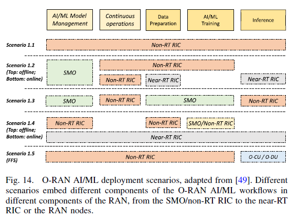

- 5G networks support a wide variety of use-cases and applications, making a one-size-fits-all solution for deploying and controlling network intelligence unlikely.
- The O-RAN Alliance has specified five different deployment scenarios that define where the components of the AI/ML workflow are instantiated and executed.
- These scenarios cover a large set of real-world use cases, but practical deployments might deviate to accommodate operator- and application-specific requirements.
- O-RAN specifications are designed for the RAN portion of the network, but they can influence decisions regarding the core network and the Multi-access Edge Computing (MEC) infrastructure.
- The SMO can act as a gateway between the RAN and other network components, orchestrating functionalities across the whole network.
- xApps and rApps within the O-RAN environment can gather information on the RAN that can be used by the SMO to make informed decisions about MEC service instantiation and delivery, as well as network slicing policies in the core network.

### III. Gathering Inputs for Online Inference

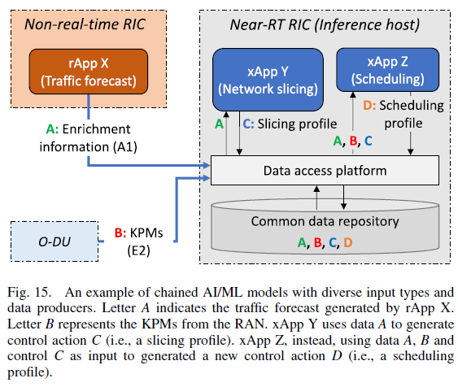

- Data for online inference is collected from multiple data producers over the O1, A1, and E2 interfaces, supporting O-RAN control loops operating at different time scales.
- The O1 interface allows components in the SMO/non-RT RIC domain to gather data and perform non-real-time optimization.
- The A1 interface can be used by the non-RT RIC to send enrichment information to the near-RT RIC and its applications.
- The E2 interface allows the near-RT RIC and its xApps to collect data from E2 nodes for near-RT control of the RAN.
- O-RAN specifications consider the case where input data might be generated within the same inference host by different data producers. This is the case of chained AI/ML models.
- To regulate data production and consumption between applications hosted in the same node, the O-RAN specifications lay the basis for a data access platform that regulates data production, sharing, and access.
- In the example, an rApp forecasts traffic load (data type A). Two xApps leverage AI to control network slicing and scheduling strategies, respectively. They consume data from the data access platform and produce a slicing profile or select a scheduling profile to be used by the controlled DU.

### IV. Using AI/ML to Design O-RAN Systems
- AI/ML infrastructure offered by O-RAN can be leveraged to make its design and operations more efficient and effective.
- AI/ML can improve any of the operations or functionalities within the O-RAN architecture, with key applications in managing the software infrastructure, open interfaces, and security.
- AI/ML plays a crucial role in making intelligent decisions on regulating the lifecycle of all software components within the O-RAN infrastructure. 
- It can automate and optimize the instantiation, placement, and management of RICs to adapt to network conditions and traffic load.
- AI/ML can help design open interfaces by determining the optimal data retrieval rate on each interface to adapt and capture current network dynamics.
- Security is another use-case where AI/ML can fine-tune security mechanisms to secure the O-RAN architecture. 
- Tools such as DRL can adaptively regulate the level of security in the network by controlling encryption rates, detecting intruders, and moving services and functionalities to reduce the likelihood they can be targeted by adversarial nodes.   

## 7. Open RAN Use Cases and Research
* The RICs, open interfaces, and AI/ML workflow in Open RAN enable advanced use cases and scenarios for RAN control and deployment optimization.
* O-RAN research focuses on xApps, rApps, and network optimization, with the O-RAN Alliance listing 19 use cases for Open RAN deployments.
* Use cases are classified based on control knobs, inference targets, and the domain being optimized, showcasing the potential of O-RAN-based solutions for RAN optimization.

### 1. Mobility
- Open RAN networks impact mobility management by adjusting handover, load balancing, and beamforming parameters based on user mobility predictions and base station states. 
- This allows for context-based handover in vehicular scenarios and dynamic routing of autonomous vehicles to prevent congestion.
- O-RAN mechanisms utilize AI/ML RAN data and enrichment information to predict base station loads, manage handovers for vehicles, and configure RAN parameters for Unmanned Aerial Vehicles based on expected trajectories.

### 2. Resource Allocation
- Resource allocation in Open RAN involves network slicing, scheduling, and service provisioning, allowing adaptation to dynamic contexts and user requirements.
- Intelligent O-RAN control focuses on ML-based optimization, demonstrated through closed-loop control on experimental platforms like Colosseum and Arena.
- Various xApps are developed for controlling RAN slicing allocation and scheduling policies, optimizing performance and managing radio resources in O-RAN.
- Research explores DRL-based control loops, placement of RAN slices, and cell selection processes in O-RAN for improved resource allocation and quality of service.
- Frameworks like multi-agent team learning coordinate xApps and rApps for efficient resource allocation via AI/ML infrastructure in O-RAN.
- Anticipatory mobility prediction and QoS-based resource allocation are studied for mobile users, including UAVs, to dynamically provision resources and prevent congestion in O-RAN infrastructure.

### 3. QoE/QoS-based Control
- Researchers are exploring QoE/QoS-based control in RAN optimization, such as optimizing transmission directionality and drone location for video streaming applications. 
- Experimental and simulation evaluations are conducted to assess the proposed solutions.
- The O-RAN Alliance utilizes QoE optimization scenarios by combining inputs from external systems and monitoring application performance to identify the best RAN configuration for user-based QoE optimization. 
- O-RAN interfaces enable the fusion of data from diverse sources for enhanced performance.

### 4. RAN Sharing
- RAN sharing in O-RAN involves spectrum and infrastructure sharing to enhance spectral and energy efficiencies, reduce costs, and enable dynamic control mechanisms.
- Spectrum sharing mechanisms in O-RAN include slicing, dynamic spectrum access control at DU/RU, and inter-technology sharing solutions.
- Research explores scenarios like sharing with low-Earth orbit satellites, spectrum sensing, deep learning analysis for interference avoidance, and dynamic spectrum access control using contextual information.
- Blockchain integration in O-RAN enables secure resource exchange among operators, dynamic allocation, and smart contracts for carrier aggregation on shared infrastructure.

### 5. Massive MIMO
- Massive MIMO in 5G networks with Open RAN architecture allows dynamic control and adaptability of MIMO codebook and beam selection, enhancing mobile experience reliability.
- Signal processing research benefits from C-RAN and virtualized centralized units, focusing on sharing channel state information and compression schemes for O-RAN FH interface.
- O-RAN RICs control and optimize beam parameters and codebooks in DUs and RUs, utilizing data-driven solutions for beam adaptation and mobility configuration optimization.
- Dynamic reconfiguration of beamforming with RICs in Open RAN is an underexplored area, offering capacity enhancement and diversity through policy guidance and control mechanisms.

### 6. Security
- The next generation of wireless cellular networks is expanding to support UAVs, vehicular communications, and industrial IoT scenarios with high reliability and precise timing. 5G networks from Release 16 also support positioning through dedicated signals and location management functions.
- O-RAN RICs enable elastic configurations for adapting to evolving conditions on the factory floor, while near-RT RIC with a dedicated positioning xApp provides an alternative to the 5G core location management function for precise and timely estimation in communication scenarios.

### 7. O-RAN Deployments Optimization
- Research papers explore optimizing Open RAN deployments by leveraging SMO management functionalities, telemetry, and statistics from the RAN.
- Innovative frameworks like zero-touch orchestration, RLOps for reinforcement learning, and fault-tolerant xApps library are developed to enhance O-RAN components' deployment and management.
- Focus on virtualized components includes strategies for maximizing network availability, green Open RANs, function split techniques, and matching schemes between DUs and RUs for efficient resource utilization.

### 8. O-RAN White Papers and Surveys
- Various researchers have provided overviews of O-RAN and its components, discussing AI/ML workflows, capabilities, shortcomings, building blocks, interfaces, services, and applications like deep learning and artificial intelligence.
- In contrast to existing works, this paper offers a detailed exploration of O-RAN specifications, focusing on open interfaces, protocols, services, use cases, AI/ML workflows, deployment scenarios, and open platforms for experimental research.

## 8. Security in the Open RAN
* Introduction of new components and interfaces in Open RAN improves efficiency but brings security challenges due to its distributed nature.
* O-RAN Alliance addresses security concerns through a dedicated working group, defining threat models and security measures for a zero-trust model.
* Security stakeholders, threat surface, and countermeasures in Open RAN deployments are discussed by the O-RAN Alliance for network protection.

### A. Security Stakeholders
* O-RAN Security Focus Group (SFG) has identified various stakeholders for securing the RAN, including operators who play a key role in customizing and vetting security in open network components.
* New stakeholders like network function vendors, virtualization platform vendors, and administrators are involved in securing virtualized and disaggregated components, with the orchestrator managing network operations.

### B. Extended Threat Surface
* Softwarization and disaggregation in cellular systems increase the threat surface, leading to various types of attacks.
* Threats include attacks on O-RAN system components, data integrity, confidentiality, and logical architecture elements.
* O-Cloud faces threats like compromising virtual network functions, misuse of containers, and abuse of privileged VMs.
* Open-source code vulnerabilities arise from intentional backdoors by developers or uncontrolled upstream libraries.
* Physical threats involve compromising hardware, while wireless functionality attacks can degrade performance.
* Protocol stack attacks target layers with injection, denial of service, and exposure of identifiers.
* AI/ML components are vulnerable to poisoning attacks, leading to wrong predictions or control decisions.
* O-RAN WG11 identified critical assets related to interfaces, data, and logical components.
* Other issues include low product quality, immature technical specifications, supply chain tampering, and infrastructure failures.

### C. O-RAN Security Principles and Opportunities
* O-RAN architecture brings new security opportunities and challenges, allowing for rethinking security practices aligned with cloud-native deployments.
* Openness in O-RAN enhances network visibility and control for operators, enabling quick security updates and simplified network functions.
* O-RAN WG11 mandates authentication and encryption procedures across O-RAN elements, following specific technical specifications.
* Security measures include protocols like SSH, TLS, NETCONF, DTLS, IPSec, CMP, and OAuth 2.0 for authentication, encryption, and authorization.
* Leveraging data insights from interfaces like E2 and O1 can enhance RAN security through self-monitoring and anomaly detection using machine learning and deep learning techniques.
* O-RAN builds on existing security measures from data centers and cloud networks, facilitating the transition to virtual appliances.
* Deployment of port-based network access control and spoofing mechanisms are optional elements for vendors in O-RAN security.

## 9. O-RAN Development and Standardization
* The O-RAN Alliance works on making RAN systems more open, intelligent, and interoperable by extending standards, developing open-source software, and providing guidance for testing and integration.
* They collaborate with organizations like 3GPP, ITU, and ETSI to include openness and intelligence in RAN standards and activities.
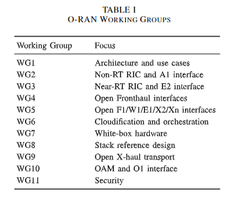
* O-RAN Alliance has 10 Working Groups (WGs) focusing on different aspects of the O-RAN architecture.
* WG1 deals with use cases, architecture, and network slicing.
* WG2 focuses on non-RT RIC and A1 interface.
* WG3 handles near-RT RIC, E2 interface, and AI/ML support.
* Other WGs cover interfaces, cloudification, hardware, transport, and security aspects of O-RAN.
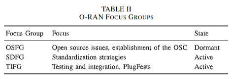
* O-RAN Alliance includes Focus Groups (FGs) like OSFG, SDFG, and TIFG to address specific areas like open source, standard development, and testing.
* OSFG focuses on open source issues but is currently inactive due to the Open Source Community (OSC) taking over its tasks.
* SDFG plans development strategies, collaborates with standard organizations, and gathers requirements from Alliance entities.
* TIFG oversees testing, integration, and PlugFests, ensuring compliance with O-RAN specifications through OTICs.
* The Alliance has a Technical Steering Committee with sub-committees focusing on network compliance, procedures, industry engagement, and research for future networks.
* O-RAN collaborates with external organizations like ONF and TIP to develop interoperable solutions for the RAN.

## 10. Experimental Wireless Platforms for O-RAN
* Softwarization in cellular networking and Open RAN frameworks offer new opportunities for experimental research on cellular networks.
* Open-source protocol stacks like srsRAN and OpenAirInterface enable easy instantiation of 3GPP-compliant network elements on general devices for experimental validation.
* Publicly-available platforms and frameworks, like those in Table III, allow researchers to virtualize cellular stacks, prototype solutions, and collect data for AI/ML in realistic wireless environments.
* Open RAN experimentation requires compute resources for virtualized components and radio resources for the over-the-air RAN component.
* Platforms like srsRAN and OpenAirInterface use Software-defined Radios for base stations and user implementations, supporting Open RAN research.
* Research pipelines typically involve components like near-RT RIC, RAN, E2 interface, and custom xApps for RAN control in Open RAN experimentation.
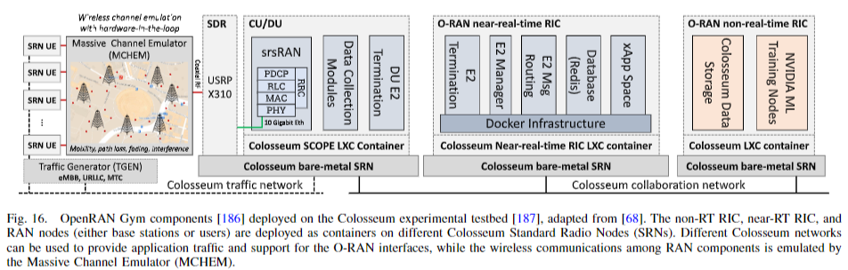
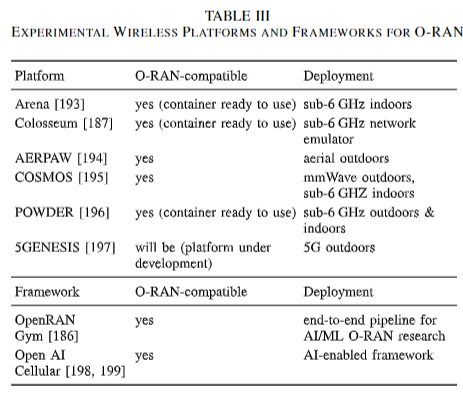
### A. Experimental Open RAN Research with OpenRAN Gym
* OpenRAN Gym enables experimental research by combining software-defined cellular stacks with a lightweight RIC for O-RAN.
* It provides a Linux Container-based implementation with components like OSC near-RT RIC, E2 termination, and xApp space for managing RIC connectivity.
* Through E2 termination, near-RT RIC connects to E2 nodes for controlling the RAN, utilizing the SCOPE framework for enhanced functionalities.
### B. Colosseum and Arena
* Colosseum is a large wireless network emulator that helps researchers test wireless conditions using FPGA fabric and 256 USRP X310 SDRs.
* It offers resources like Standard Radio Nodes, data storage, GPUs, and Massive Channel Emulator for experimenting with ML models and wireless environments.
* Arena is an indoor testbed with 24 SDRs and 64 antennas for testing MEC capabilities and private indoor cellular deployments.
* Researchers can prototype O-RAN solutions on Colosseum and then transfer them to other testbeds like Arena for further experimentation.

### C. Other Experimental Research Platforms
* Various experimental research platforms like POWDER, COSMOS, and AERPAW in the U.S. focus on different aspects of wireless communication technologies such as sub-6 GHz, mmWave, and aerial cellular deployments.
* These platforms support experimentation in different environments like outdoor, indoor, and aerial settings using technologies like SDRs, UAVs, and Terragraph radios.
* The platforms are compatible with the O-RAN paradigm, allowing users to use white-box base stations managed by O-RAN RICs.
* In Europe, initiatives like 5GENESIS and SLICES are working on implementing 5G components and creating testbeds compatible with the O-RAN ecosystem.
* Open AI Cellular (OAIC) is an open-source initiative that integrates with the O-RAN ecosystem, enabling users to manage cellular networks using AI controllers and identify network flaws.

## 11. Challenges and Futur Research and Development Directions for OpenRAN
* O-RAN faces challenges in standardization and research, focusing on technical obstacles.
* Key use cases for O-RAN include radio resource management, private cellular networks, and spectrum sharing solutions.
* O-RAN enables closed-loop control for various applications like AR/VR, private networks, and spectrum sharing.
* Future research is needed to refine use cases, optimize private networks, and develop spectrum sharing algorithms.
* New interfaces in O-RAN architecture require interoperability testing for multi-vendor deployments.
* APIs and SDK for RICs enable interoperability for xApps and rApps.
* E2 service models are crucial for near-RT RIC control in Open RAN, requiring comprehensive design for new use cases and vendor compliance.
* O-RAN architecture involves disaggregated RAN nodes and RICs hosting xApps and rApps, with potential extensions for 6G networks.
* Energy efficiency in Open RAN can be improved through virtualization and closed-loop control for dynamic network function allocation.
* Security in O-RAN is enhanced by increased visibility into RAN performance, deploying security xApps, and developing novel security approaches leveraging O-RAN capabilities.
* Multi-time-scale control in O-RAN architecture requires research on designing algorithms for different time scales and selecting optimal control loops.
* Effective AI/ML algorithm design for O-RAN involves challenges like collecting diverse datasets, refining solutions without affecting RAN performance, and creating algorithms that can handle real-world input.

## 12. Conclusions
* The paper discussed O-RAN specifications, architectures, and operations, covering architectural building blocks, RIC components, SMO, and interfaces like E2, O1, A1.
* It focused on AI/ML workflows, use cases, security challenges, and the O-RAN Alliance's structure and development efforts.
* Appendices provide examples of E2 messages and a list of acronyms used in the paper.