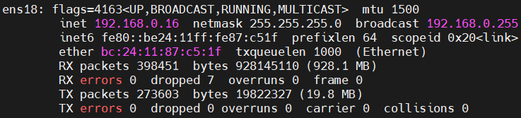
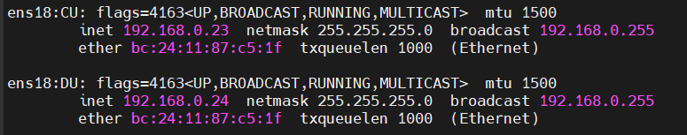

# OpenAirInterface (OAI-gNB)

## Introduction


Open Air Interface is an open-source software alliance aim to democratising 5G Technology development, established in 2014. Open Air Interface work on entire 5G Techstack, from developing RAN components (such as gNB, CU, DU), 5G Core Network development (creating AMF, SMF, UPF, etc) to develop CI/CD pipeline to seamless testing and integration for all 5G software components.

## Installation
### Install cmake, git and clone OAI repository
```bash
sudo su # login as root
apt install -y git cmake build-essential
git clone https://gitlab.eurecom.fr/oai/openairinterface5g.git
```

### Build from source code
```bash
cd openairinterface5g
git checkout 2022.w40
source oaienv
```
command:
```bash
cd cmake_targets
./build_oai -I
```
output:
```bash
Will install external packages
OPENAIR_DIR    = /root/openairinterface5g
Installing packages
.
.
.
'../simde/x86/svml.h' -> '/usr/include/simde/x86/svml.h'
'../simde/x86/xop.h' -> '/usr/include/simde/x86/xop.h'
BUILD SHOULD BE SUCCESSFUL
```
command:
```bash
./build_oai --gNB --nrUE -w SIMU
```
output:
```bash
Will compile gNB
Will compile NR UE
OPENAIR_DIR    = /root/openairinterface5g
Running "cmake -DOAI_SIMU=ON ../../.."
.
.
.
nr-softmodem nr-cuup nr-uesoftmodem rfsimulator params_libconfig coding rfsimulator dfts compiled
BUILD SHOULD BE SUCCESSFUL
```

## Configure OAI
### Checking Interface Name
```bash
ifconfig
```



Note: should not exist `ens18:CU` and `ens18:DU` because not specified yet

### Aliasing Interface
```bash
ifconfig ens18:CU 192.168.0.23
ifconfig ens18:DU 192.168.0.24
```



Note : You need to retype this command after boot up

### Configure OAI-CU
1. Path to O-CU Config File
    ```bash
    nano ~/openairinterface5g/targets/PROJECTS/GENERIC-NR-5GC/CONF/cu_gnb.conf
    ```
2. Configure mcc and mnc based on Free5GC webconsole
    ```bash
    tracking_area_code  =  1;
    plmn_list = ({ mcc = 208; mnc = 93; mnc_length = 2; snssaiList = ({ sst = 1 }) });
    ```
3. Modify IP local and remote
    ```bash
    local_s_if_name = "ens18:CU";
    local_s_address = "192.168.0.23";
    remote_s_address = "192.168.0.24";
    local_s_portc   = 501;
    local_s_portd   = 2152;
    remote_s_portc  = 500;
    remote_s_portd  = 2152;
    ```
4. Setup the IP address of free5GC and the interface for NGU and Setup the network interfaces
    ```bash
    ////////// AMF parameters:
    amf_ip_address = ({ ipv4 = "192.168.0.12";
                        ipv6 = "192.168.30::17";
                        active = "yes";
                        preference = "ipv4";
                        }
                );

    NETWORK_INTERFACES :
    {

        GNB_INTERFACE_NAME_FOR_NG_AMF            = "ens18";
        GNB_IPV4_ADDRESS_FOR_NG_AMF              = "192.168.0.16";
        GNB_INTERFACE_NAME_FOR_NGU               = "ens18";
        GNB_IPV4_ADDRESS_FOR_NGU                 = "192.168.0.16";
        GNB_PORT_FOR_S1U                         = 2152; # Spec 2152
    };
    ```

### Configure OAI-DU
1. Path to O-DU Config File
    ```bash
    nano ~/openairinterface5g/targets/PROJECTS/GENERIC-NR-5GC/CONF/du_gnb.conf
    ```
2. Config O-DU
    ```bash
    MACRLCs = (
      {
        num_cc           = 1;
        tr_s_preference  = "local_L1";
        tr_n_preference  = "f1";
        local_n_address = "192.168.0.24";
        remote_n_address = "192.168.0.23";
        local_n_portc   = 500;
        local_n_portd   = 2152;
        remote_n_portc  = 501;
        remote_n_portd  = 2152;

      }
    );
    ```

### Configure UE
1. Path to UE
    ```bash
    nano ~/openairinterface5g/targets/PROJECTS/GENERIC-NR-5GC/CONF/ue.conf
    ```
2. Config UE based on Free5GC webconsole
    ```bash
    uicc0 = {
    imsi = "208930000000001";
    key = "8baf473f2f8fd09487cccbd7097c6862";
    opc= "8e27b6af0e692e750f32667a3b14605d";
    dnn= "oai";
    nssai_sst=1;
    nssai_sd=1;
    }
```

### AMF Config
a. Edit file ~/free5gc/config/amfcfg.yaml
    ```bash
    cd ~/free5gc
    sudo nano ./config/amfcfg.yaml
    ```
b. Find the ngapIpList key
    ```bash
    ...
      ngapIpList:  # the IP list of N2 interfaces on this AMF
      - 127.0.0.1
    ```
c. Replace localhost address with 192.168.0.12 (free5GC IP)
```bash
...
  ngapIpList:  # the IP list of N2 interfaces on this AMF
  - 192.168.0.12  # 127.0.0.1
```

### SMF Config
a. Edit file ~/free5gc/config/smfcfg.yaml
```bash
cd ~/free5gc
sudo nano ./config/smfcfg.yaml
```
b. Find interfaces block
```bash
...
  interfaces: # Interface list for this UPF
   - interfaceType: N3 # the type of the interface (N3 or N9)
     endpoints: # the IP address of this N3/N9 interface on this UPF
       - 127.0.0.8
```
c. Replace address 127.0.0.8 with your static address
```bash
...
interfaces: # Interface list for this UPF
- interfaceType: N3 # the type of the interface (N3 or N9)
 endpoints: # the IP address of this N3/N9 interface on this UPF
   - 192.168.0.12  # 127.0.0.8
```

### UPF Config
a. Edit file ~/free5gc/config/upfcfg.yaml
```bash
cd ~/free5gc
sudo nano ./config/upfcfg.yaml
```

b. Find gtpu IP line
```bash
...
  gtpu:
    forwarder: gtp5g
    # The IP list of the N3/N9 interfaces on this UPF
    # If there are multiple connection, set addr to 0.0.0.0 or list all the addresses
    ifList:
      - addr: 127.0.0.8
        type: N3
```

c. Replace address 127.0.0.8 with your static address
```bash
...
  gtpu:
    forwarder: gtp5g
    # The IP list of the N3/N9 interfaces on this UPF
    # If there are multiple connection, set addr to 0.0.0.0 or list all the addresses
    ifList:
      - addr: 192.168.0.12
        type: N3
```
