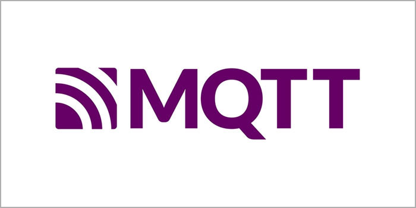
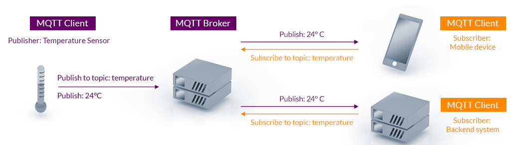
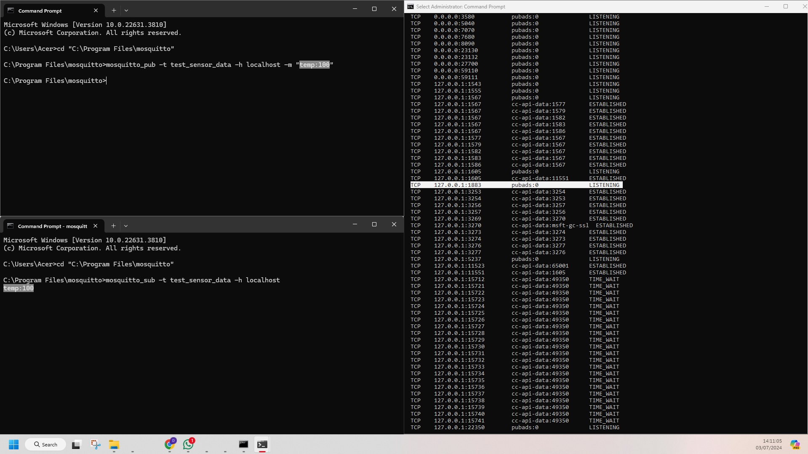

# MQTT Study Note
## MQTT
### What is MQTT?



MQTT (Message Queuing Telemetry Transport) is a lightweight, publish-subscribe network protocol designed for resource-constrained environments, such as IoT (Internet of Things) applications. It is highly efficient for scenarios with limited bandwidth or unreliable networks.

### Why MQTT?
* **Lightweight and Efficient:** MQTT is a standards-based messaging protocol used for machine-to-machine communication. It requires minimal resources, making it suitable for small microcontrollers. A minimal MQTT control message can be as little as two data bytes.
* **Scalable:** MQTT has built-in features to support communication with a large number of IoT devices. It requires a minimal amount of code that consumes very little power in operations.
* **Reliable:** MQTT has built-in features that reduce the time the IoT device takes to reconnect with the cloud. It also defines three different quality-of-service levels to ensure reliability for IoT use cases— at most once (0), at least once (1), and exactly once (2).
* **Secure:** MQTT makes it easy for developers to encrypt messages and authenticate devices and users using modern authentication protocols.
* **Well-supported:** Several languages like Python have extensive support for MQTT protocol implementation.
* **Publish/Subscribe Model:** MQTT operates on a publish-subscribe model which allows devices to send messages on specific topics, while other devices can subscribe to those topics to receive the messages.

### MQTT Architecture and Components
* **Broker**:
    * The central server that manages the distribution of messages. It receives messages from publishers and forwards them to subscribers.
    * Handles client connections, subscriptions, message routing, and provides security features like authentication and authorization.
* **Publisher**:
    * A client that sends messages to the broker.
    * The messages are associated with specific topics.
* **Subscriber**:
    * A client that receives messages from the broker based on its subscription to topics.
    * It can subscribe to multiple topics to receive relevant data.
* **Topic**:
    * The namespace used to organize and filter messages.
    * Topics are hierarchical, allowing for fine-grained filtering. For example, sensors/temperature or home/livingroom/light.



### Protocol Workflow
Publish-Subscribe Model:
In MQTT, publishers and subscribers interact with the broker using topics.

* Publishing: Publishers send messages to a specific topic on the broker. For example a temperature sensor publishes its readings to the topic sensors/temperature.
* Subscription: Subscribers register their interest in specific topics with the broker. For example an application subscribes to sensors/temperature to receive temperature updates.
* Message Routing: The broker receives messages from publishers and routes them to all subscribers of the respective topic.

Quality of Service (QoS) Levels:
MQTT offers three QoS levels to balance between reliability and performance:
* QoS 0 (At most once): 
    * The message is delivered at most once, without acknowledgment.
    * Fastest and least reliable, suitable for non-critical data.
* QoS 1 (At least once):
    * The message is delivered at least once, with acknowledgment.
    * Ensures delivery but may result in duplicate messages.
* QoS 2 (Exactly once):
    * The message is delivered exactly once, using a four-step handshake.
    * Most reliable but introduces higher latency and overhead.

Retained Messages:
* A retained message is stored by the broker and sent to any future subscribers to that topic.
* Ensures that new subscribers receive the last known message immediately upon subscribing.

Will Messages:
* A will message is specified by a client during connection and is sent by the broker if the client disconnects unexpectedly.
* This feature helps other clients detect and respond to unexpected disconnections.

### MQTT Security
MQTT Security is a critical aspect of the MQTT protocol, especially considering the vast number of IoT devices that use it. Here are some key aspects of MQTT Security:
* **Authentication and Authorization**: MQTT supports modern authentication protocols1. It is important to not only control the device access, but to also control what a device is allowed to do once it is connected to the network.
* **Encryption and Data Integrity**: MQTT operates on a transmission control protocol (TCP), which does not use encryption by default. Therefore, it’s critical to provide encryption by leveraging Transport Layer Security (TLS) or Secure Sockets Layer (SSL) certificates.
* **Secure MQTT Broker Configuration**: Implementing secure broker configurations is crucial for MQTT security.
* **Secure MQTT Client Configuration**: Securing MQTT client connections and implementing fine-grained authorization rules are important for MQTT security.
* **Secure MQTT Over the Web**: Securing MQTT over WebSocket and configuring secure web gateways for MQTT communication are essential for MQTT security.
* **MQTT Security Auditing and Monitoring**: Regular security audits and assessments, monitoring MQTT traffic and detecting anomalies, and responding to security incidents and vulnerabilities are important for maintaining MQTT security.
* **Best Practices for Securing MQTT**: IoT vendors should enforce strong password policies and require users to change default passwords1. The most sophisticated encryption algorithms cannot overcome a password that is easily guessable.

### MQTT Use Cases
Certainly! Here’s the information presented in a compact table form:

| Application Area              | Scenario                                       | Devices                                                 | Topics & Use Cases                                                                                                                                           |
|-------------------------------|------------------------------------------------|---------------------------------------------------------|--------------------------------------------------------------------------------------------------------------------------------------------------------------|
| **Smart Home Automation**     | Temperature & Lighting Control                 | Smart thermostats, lighting systems, security cameras   | `home/thermostat/temperature`: Thermostat data for adjusting heating/cooling <br> `home/lights/status`: Light status updates for apps                          |
| **Industrial IoT (IIoT)**     | Equipment Monitoring                           | Sensors, actuators, machinery                           | `factory/machine1/status`: Machine status data for monitoring <br> `factory/environment/temperature`: Environmental data for anomaly detection and maintenance |
| **Fleet Management**          | Vehicle Tracking                               | GPS trackers, vehicle sensors                           | `fleet/truck1/location`: Location data for route optimization and delivery times                                                                              |
| **Supply Chain Monitoring**   | Temperature-Sensitive Goods                    | RFID tags, temperature sensors                          | `supplychain/warehouse1/temperature`: Temperature data for safe storage and transport                                                                          |
| **Remote Patient Monitoring** | Health Data Collection                         | Wearable health monitors, glucose meters                | `health/patient123/heart_rate`: Vital signs data for remote monitoring                                                                                        |
| **Hospital Asset Tracking**   | Equipment Location Tracking                    | RFID tags, beacons                                      | `hospital/equipment/loc`: Equipment location data for tracking                                                                                               |
| **Environmental Monitoring**  | Air Quality & Weather Tracking                 | Air quality sensors, weather stations                   | `city/environment/air_quality`: Air quality data for pollution monitoring and alerts                                                                          |
| **Traffic Management**        | Traffic Flow Optimization                      | Traffic cameras, vehicle counters                       | `city/traffic/volume`: Traffic density data for optimizing traffic lights and reducing congestion                                                             |
| **Messaging and Notifications**| Real-Time Chat                                 | Mobile phones, tablets, messaging apps                  | `chat/session123`: Chat messages for instant delivery                                                                                                        |
| **Device Management**         | Policy Updates                                 | Smartphones, tablets, IoT devices                       | `mdm/device123/policy`: Device policy updates for compliance and security                                                                                     |
| **Precision Farming**         | Soil & Weather Monitoring                      | Soil moisture sensors, weather stations                 | `farm/field1/soil_moisture`: Soil moisture data for irrigation scheduling                                                                                     |
| **Livestock Monitoring**      | Animal Location Tracking                       | GPS collars, health monitors                            | `farm/livestock/cow123/location`: Location data for monitoring livestock                                                                                     |
| **Inventory Management**      | Stock Tracking                                 | RFID tags, barcode scanners                             | `store/inventory/product123`: Inventory updates for stock level management                                                                                    |
| **Customer Engagement**       | Product Availability & Promotions              | Smart shelves, digital signage, mobile apps             | `store/shelf1/status`: Shelf status updates for promotions and product info                                                                                   |

### Difference Between MQTT and OpenDDS
| Feature                     | MQTT                                          | OpenDDS                                      |
|-----------------------------|-----------------------------------------------|----------------------------------------------|
| **Full Name**               | Message Queuing Telemetry Transport           | Open Data Distribution Service               |
| **Type**                    | Messaging protocol                            | Data distribution middleware                 |
| **Standardization**         | ISO/IEC 20922:2016                            | OMG Data Distribution Service (DDS) Standard |
| **Primary Use Case**        | Lightweight communication for IoT devices     | Real-time, scalable, and high-performance data communication |
| **Transport Protocol**      | TCP/IP, WebSockets                            | TCP/IP, UDP/IP, Multicast                    |
| **Quality of Service (QoS)**| At most once, At least once, Exactly once     | Fine-grained QoS policies (e.g., reliability, latency, durability) |
| **Scalability**             | Suitable for small to medium-sized networks   | Designed for large-scale, distributed systems|
| **Message Broker**          | Requires a broker (e.g., Mosquitto, HiveMQ)   | Peer-to-peer, broker-less architecture       |
| **Data Model**              | Simple, topic-based                           | Rich data model with strong typing (IDL-based) |
| **Real-time Support**       | Limited                                       | Strong real-time guarantees                  |
| **Discovery Mechanism**     | Broker-centric                                | Dynamic discovery of publishers and subscribers |
| **Security**                | TLS/SSL, SASL, token-based authentication     | Built-in security with Access Control, encryption, and authentication |
| **Performance**             | Low overhead, suitable for constrained devices| High-performance, optimized for low latency  |
| **Implementation Complexity**| Simple, easy to implement                    | More complex, requires understanding of DDS concepts |
| **Popular Implementations** | Mosquitto, HiveMQ, EMQ X                      | OpenDDS, RTI Connext DDS, PrismTech OpenSplice DDS |

### MQTT Application and Implementation
In this example, I am using Mosquitto MQTT Broker. I sent data string "temp:100" from client to broker with publication-subscription communication. The IP address of the MQTT in my PC is 127.0.0.1:1883. The topic that I'm using named "test_sensor_data" and I use the command:
```
mosquitto_pub -t test_sensor_data -h localhost -m "temp:100"
```
to publish the string data, and I use the command:
```
mosquitto_sub -t test_sensor_data -h localhost
```
to read the received data in the subcribed topic. All of the command must be executed inside the mosquitto directory. In my case it is `"C:\Program Files\mosquitto"`.



## References
* https://www.paessler.com/it-explained/mqtt
* https://aws.amazon.com/what-is/mqtt/
* https://www.hivemq.com/mqtt/
* https://randomnerdtutorials.com/what-is-mqtt-and-how-it-works/
* https://www.comparitech.com/net-admin/what-is-mqtt/
* https://mqtt.org/use-cases/