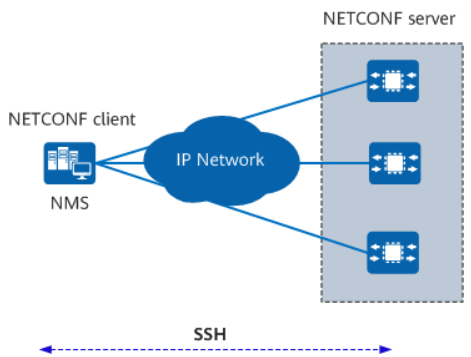
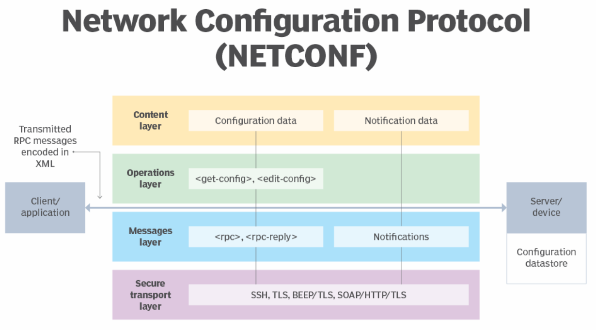
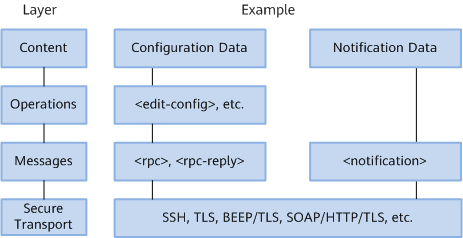
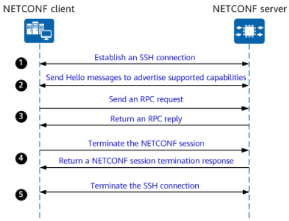
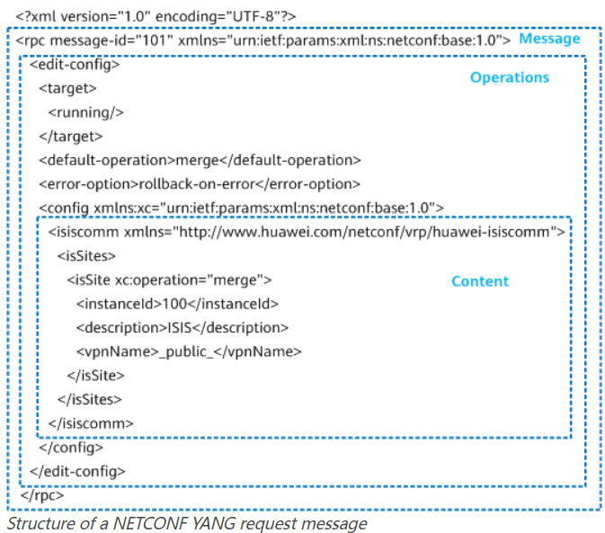
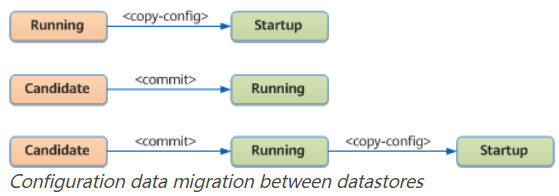
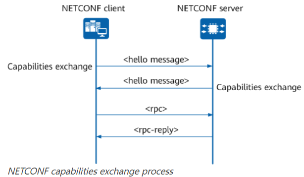

# Netconf Study Note
## Netconf
### What is Netconf?
- **Protocol Type**: NETCONF is a network management protocol.
- **Functionality**: It allows an NMS to manage configurations of network devices.
- **API Support**: Standard APIs on network devices enable NMS interaction.
- **Data Encoding**: Uses XML for configuration data and protocol messages.
- **Communication**: Implements RPC for client-server communication.
- **Clients**: Can be scripts or applications on an NMS.
- **Servers**: Typically network devices themselves.

### Why Netconf?
- **Network Automation Needs**: Essential for fast, on-demand service provisioning and automated Operations & Maintenance (O&M) in cloud networks.
- **Disadvantages of CLI**:
  - Complex, vendor-specific configurations.
  - Requires adaptation scripts per vendor.
  - Unpredictable output and syntax changes.
- **Disadvantages of SNMP**:
  - Low configuration efficiency due to lack of transaction support.
  - Relies on UDP for communication, lacking reliability and security.
  - Manages device configurations individually, lacks network-level collaboration.
- **Advantages of NETCONF**:
  - **Protocol Framework**: Hierarchical structure ideal for automated and big data needs.
  - **Data Encoding**: Uses XML, enhancing interoperability across vendor devices.
  - **YANG Model**: Reduces network faults from manual configuration errors.
  - **Security**: Includes robust authentication and authorization mechanisms.
  - **Transaction Support**: Enables reliable configuration changes with rollback capabilities.
  - **Operation Flexibility**: Defines various interfaces, supports vendor-specific extensions for unique management functions.
  
### Netconf Architecture

- **Basic Architecture**:
  - NETCONF system includes at least one Network Management System (NMS) managing network devices.
  - Architecture comprises clients and servers.
- **Client Functions**:
  - Manages network devices using NETCONF.
  - Sends RPC requests to NETCONF servers to query or modify parameter values.
  - Receives status updates from managed devices through alarms and events sent by NETCONF servers.
- **Server Functions**:
  - Maintains information about managed devices.
  - Responds to client-initiated RPC requests by parsing and sending replies.
  - Reports alarms or events to clients regarding managed device status changes.
- **Notification Mechanism**:
  - Enables servers to notify clients of faults or events occurring on managed devices.
  - Facilitates real-time monitoring and management of network devices.

### How Netconf Works?
- **Communication Mechanism**:
  - Uses RPC protocol for client-server communication.
  - RPC messages encoded in XML, transmitted via secure, connection-oriented sessions.

- **Roles**:
  - **Client**: Often part of a network manager, can be a script or application.
  - **Server**: Usually a network device.

- **Operations**:
  - Client sends RPC messages to invoke operations on the server.
  - Server executes operations and can send notifications to the client.
  - Client can subscribe to notifications from the server.

- **Configuration Datastores**:
  - Servers contain one or more configuration datastores.
  - Datastores hold configuration data needed for device operation.
  - Can be implemented in databases, files, flash memory, or combinations.

- **NETCONF Protocol Layers**:
  - **Secure Transport Layer**:
    - Core communication path between client and server.
    - Can be layered over transport protocols like TLS and SSH.
  - **Messages Layer**:
    - Provides transport-independent framing for encoding RPCs and notifications.
    - Focuses on RPC communications (as per RFC 6241).
  - **Operations Layer**:
    - Defines base operations for retrieving information and managing configurations.
    - Operations include `<get-config>`, `<edit-config>`, etc.
  - **Content Layer**:
    - Concerned with configuration and notification data.
    - Relies on device's data model (e.g., YANG data models).

- **RPC Communication**:
  - Client sends `<rpc>` request messages, server responds with `<rpc-reply>`.
  - Request includes RPC name and parameters.
  - Response data encoded within `<rpc-reply>` element.

### Establishing a Netconf Session

  

1. **NETCONF Session Establishment**:
  - Client establishes an SSH connection with the server.
  - Authentication and authorization occur over SSH.
  - NETCONF session is established between client and server.  
2. **Negotiation of Capabilities**:
  - Hello messages exchanged to negotiate capabilities between client and server.
3. **RPC Communication**:
  - Client sends RPC requests to the server.
  - Requests include modifying configurations, querying data, or performing maintenance operations.
4. **Session Termination**:
  - Client terminates the NETCONF session.
  - SSH connection is subsequently terminated.

### Netconf Message Format

XML encoding is used in NETCONF, allowing complex hierarchical data to be expressed in a text format that can be read, saved, and manipulated with both traditional text tools and XML-specific tools.
    
### Netconf Communication Mode
The client-initiated RPC requests and the server-originated replies are both encoded in `<rpc>` and `<rpc-reply>` elements using XML. This request-reply framework is independent of transport layer protocols. The following lists some basic RPC elements:
* `<rpc>`, is used to enclose a request sent from a NETCONF client to a NETCONF server.
* `<rpc-reply>`, is sent by a NETCONF server in response to each `<rpc>` request.
* `<rpc-error>`, If any error or alarm occurs during the processing of an `<rpc>` request, the NETCONF server returns an `<rpc-reply>` message containing only the `<rpc-error>` element to the NETCONF client.
* `<ok>`, If no error or alarm occurs during the processing of an `<rpc>` request, the NETCONF server returns an `<rpc-reply>` message containing only the `<ok>` element to the NETCONF client.

### Configuration Datastores

- **Configuration Datastore**:
  - Complete set of configuration parameters for a device.
  - NETCONF defines multiple configuration datastores and allows operations on them.
- **Types of Configuration Datastores**:
  - **`<running/>`**:
    - Stores all currently active configurations on a network device.
    - Only one `<running/>` configuration datastore exists per device.
    - Always exists on the device.
  - **`<candidate/>`**:
    - Stores configuration data that is about to be committed to `<running/>`.
    - Can be manipulated without affecting the current configuration.
    - Requires the device to support the candidate configuration capability.
    - Configuration committed to `<running/>` using the `<commit>` operation.
  - **`<startup/>`**:
    - Similar to a saved configuration file.
    - Stores configuration data to be loaded during device startup.
    - Requires the device to support the distinct startup capability.
    
### Netconf Operations and Capabilities
* Include IETF-defined standard capabilities for basic functions.
* Include vendor-defined extended capabilities for additional functions.
* Allow devices to support more protocol operations and extend the scope of existing configuration objects.
* NETCONF defines the syntax and semantics of capabilities.
* Clients and servers can advertise their supported capabilities to each other.
* Clients send operation requests within the capability range supported by the server.

#### Netconf Capabilities Exchange

- **Capabilities Advertisement**:
  - Advertised in messages during session establishment.
  - Exchanged via Hello messages containing the `<hello>` element listing supported capabilities.
- **Negotiation**:
  - Based on server-supported standard capabilities (except notifications).
  - Extended capabilities depend on mutual support by both peers.

**Process**:
1. **Session Establishment**:
   - Client and server establish a connection-oriented transport protocol session.
2. **Hello Messages Exchange**:
   - Exchange Hello messages for capabilities negotiation.
   - Ensures both support the latest NETCONF version and prevents data parsing ambiguity.
3. **RPC Communication**:
   - Client sends an `<rpc>` request to the server.
   - Server receives, parses, and validates the `<rpc>` request based on the YANG data model.
   - Server executes the `<rpc>` request and returns an `<rpc-reply>` with the result.
   - Client receives and parses the `<rpc-reply>` message.

#### Basic Operations of NETCONF
| **Operation**     | **Description**                                                                                           |
|-------------------|-----------------------------------------------------------------------------------------------------------|
| `<get-config>`    | Queries all or specified configuration data. The `<source>` parameter specifies the datastore to query.   |
| `<get>`           | Queries configuration data and status data from the `<running/>` datastore only.                          |
| `<edit-config>`   | Loads configuration data to a specified target datastore (`<running/>` or `<candidate/>`).                |
| `<copy-config>`   | Copies data from one configuration datastore to another.                                                  |
| `<delete-config>` | Deletes a configuration datastore (except `<running/>`).                                                  |
| `<lock>`          | Locks a specified configuration datastore to prevent conflicts.                                           |
| `<unlock>`        | Releases a lock on a configuration datastore obtained by `<lock>`.                                        |
| `<close-session>` | Requests graceful termination of a NETCONF session.                                                       |
| `<kill-session>`  | Forces termination of a NETCONF session (admin-only operation).                                           |

#### NETCONF Standard Capabilities
| **Capability**              | **Description**                                                                                                                         |
|-----------------------------|-----------------------------------------------------------------------------------------------------------------------------------------|
| Writable-running            | Supports direct writes to the `<running/>` configuration datastore.                                                                    |
| Candidate configuration     | Supports the `<candidate/>` configuration datastore for staging configurations before committing to `<running/>`.                       |
| Confirmed commit            | Supports `<confirmed>` and `<confirm-timeout>` parameters for the `<commit>` operation, ensuring safe configuration trials.            |
| Rollback-on-error           | Allows rollback if an error occurs during `<edit-config>`, restoring the configuration to its previous state.                           |
| Distinct startup            | Distinguishes between `<running/>` and `<startup/>` datastores, requiring explicit operations to update `<startup/>`.                    |
| Notification                | Enables the device to send alarms and events to a client.                                                                               |
| XPath                       | Supports the use of XPath expressions in the `<filter>` element for `<get>` and `<get-config>` operations.                               |
| Validate                    | Checks configurations for syntactical and semantic errors during delivery and committing processes.                                     |
| URL                         | Supports modifying or copying files in specified paths via `<edit-config>` and `<copy-config>` operations.                               |
| Interleave                  | Allows NETCONF session reuse for multiple purposes, enhancing management efficiency.                                                    |
| With-defaults               | Processes default values of the model in `<get>`, `<get-config>`, and `<copy-config>` operations.                                        |

#### NETCONF Extended Capabilities
| **Extended Capability**     | **Description**                                                                                          |
|-----------------------------|----------------------------------------------------------------------------------------------------------|
| Sync capability             | Supports full or incremental data synchronization between NMS/controller and network devices.            |
| Active notification         | Periodically sends keepalive messages to prevent client timeout during time-consuming operations.        |
| Commit-description          | Allows user-defined descriptions for the `<commit>` operation to help identify configurations.           |
| YANG push                   | Enables the server to report user-specified data to a client periodically or upon trigger conditions.    |
| YANG-library                | Provides the YANG capabilities supported by a device, including module names, versions, namespaces, etc. |

### Difference Between SNMP and Netconf
| Feature | SNMP | NETCONF |
| --- | --- | --- |
| **Primary Use** | SNMP is primarily used for performance monitoring. | NETCONF is primarily used for configuration management. |
| **Data Description** | SNMP uses Object Identifiers (OIDs) to describe resources. | NETCONF uses paths to describe resources. |
| **Data and Configuration Distinction** | SNMP cannot distinguish between configuration data and operational data. | NETCONF can distinguish between configuration data and operational data. |
| **Security** | SNMP, particularly its older versions (v1 and v2c), lacks proper encryption and authentication. | NETCONF typically runs over SSH (Secure Shell), providing strong encryption and secure authentication mechanisms. |
| **Access Control** | SNMP's access control is less flexible, relying on community strings. | NETCONF offers more granular and flexible access control mechanisms. |
| **Data Structure** | SNMP uses a less structured and less intuitive data representation called the Management Information Base (MIB). | NETCONF uses structured data models, such as YANG, to define the configuration and operational state of network devices. |
| **Error Handling and Transaction Support** | SNMP lacks built-in transaction support. | NETCONF offers better error handling and transaction support. |
| **Transport Protocol** | SNMP uses UDP (User Datagram Protocol) for transport. | NETCONF uses TCP (Transmission Control Protocol) and ties in to security protocols like SSHv2 and TLS. |

### Netconf Application and Implementation

## References
* https://info.support.huawei.com/info-finder/encyclopedia/en/NETCONF.html
* https://www.techtarget.com/searchnetworking/definition/NETCONF
* https://docs.opendaylight.org/projects/netconf/en/latest/user-guide.html
* https://learningnetwork.cisco.com/s/question/0D56e0000Cs41kACQQ/what-is-netconf-and-restconf