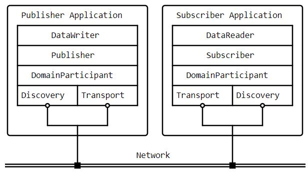

# OpenDDS Study Note

## Introduction to Data Distribution Service (DDS)
* The Data Distribution Service (DDS) is a specification for distributed systems using the publish-subscribe paradigm.
* Published by the Object Management Group (OMG).
* DDS applications share data efficiently over the network using strongly-typed, asynchronous cache updates.
* Data sharing is based on topics and Quality of Service (QoS) policies.
* DDS v1.4 2.2.1.2 Conceptual Outline provides a detailed overview of DDS.
* Data-Centric Publish-Subscribe (DCPS) is the application model defined by DDS.
* The DCPS API describes the main concepts and entities of DDS and their interactions.

### DDS DCPS API Overview and Basic Concepts

| **Concept**            | **Description**                                                                                                                                                                |
|------------------------|--------------------------------------------------------------------------------------------------------------------------------------------------------------------------------|
| **Domain**             | Fundamental partitioning unit; entities within a domain interact only within that domain; identified by an integer identifier; no entity represents the domain in DCPS API.     |
| **Entity**             | Object in a domain with QoS policy, status, and usable with listeners and waitsets; interface implemented by other DCPS concepts.                                              |
| **Domain Participant** | Entry point for application interaction within a domain; factory for objects involved in data writing/reading.                                                                  |
| **Topic**              | Means of interaction between publishers and subscribers; unique name within domain; allows many-to-many communication; associated with specific data types and instances.       |
| **Samples, Instances, and Types** | Application publishes data samples for instances on a topic; static types defined at compile-time via IDL; dynamic types created/acquired via API; XTypes feature for type exchange. |
| **DataWriter**         | Used by publishing application to introduce samples; bound to a topic; marshals data for transmission; supports dynamic data writers for runtime type-checking.                 |
| **Publisher**          | Disseminates published data to relevant subscribers; can group writes across data writers for coherent changes; multiple publishers per participant.                            |
| **Subscriber**         | Receives data from publisher; passes to relevant data readers; multiple subscribers per participant.                                                                            |
| **DataReader**         | Receives and demarshals data from subscriber; bound to a topic; provides type-specific interfaces for sample reception; supports dynamic data readers for runtime type-checking.  |

### Discovery, Matching, and Association in DDS
* **Discovery**: Participants in DDS learn about publications and subscriptions from other participants through a process managed by the implementation.
* **Matching**: After discovering a remote publication or subscription, a participant compares its local entities to determine compatibility. Matching involves checking if data writers and data readers share the same topic, have compatible types, and compatible Quality of Service (QoS) policies.
* **Association**: When a local entity matches a remote entity, the DDS implementation configures data flow from the data writer to the data reader, allowing them to exchange data.

### Quality of Service (QoS) Policy
* **Definition**: DDS specifies QoS policies that applications use to define their requirements to the service.
* **Application**: Participants in DDS specify desired behavior through QoS policies, and the service decides how to achieve these behaviors.
* **Entities**: QoS policies can be applied to various DCPS entities (topic, data writer, data reader, publisher, subscriber, domain participant), though not all policies are applicable to all entity types.
* **Matching (RxO Model)**: Subscribers and publishers use a request-versus-offered (RxO) model. Subscribers request a minimal set of required QoS policies, while publishers offer their own set of QoS policies. The DDS implementation matches these requested and offered policies to form associations between subscribers and publishers, ensuring compatibility for data exchange

### Conceptual Data Flow
- **Data Flow**: 
  - **Publishing Side**: The application writes data samples to a DataWriter. The DataWriter sends these samples to its associated Publisher.
  - **Transmission**: The Publisher disseminates the samples to associated Subscribers.
  - **Receiving Side**: Each Subscriber passes the received samples to its associated DataReaders, which deliver the data to the subscribing application.
  - **Completion**: The subscribing application retrieves and processes the data from the DataReader.
- **QoS Policies**: 
  - **Sending Side**: QoS policies of the Publisher, DataWriter, and Topic regulate data transmission from the publishing side.
  - **Receiving Side**: QoS policies of the Subscriber, DataReader, and Topic manage data reception and processing on the subscribing side.

### Built-in Topics
- **Built-in Topics**: Defined by the DDS specification, these topics are integral to the DDS implementation.
- **Functionality**: Subscribing to built-in topics provides developers with:
  - Access to the current state of the domain, including registered topics.
  - Information on discovered data readers and data writers, including their status.
  - Details on Quality of Service (QoS) settings for various entities within the domain.
- **Sample Reception**: While subscribed, the application receives samples that indicate changes in entities within the domain, such as updates to data readers, data writers, and their associated QoS settings.

### Listeners
- **Definition**: The DCPS API provides callback interfaces for each entity, allowing applications to listen for specific state changes or events related to that entity.
- **Example**: For instance, a Data Reader Listener is notified when new data values become available for reading.
- **Purpose**: Listeners enable applications to react to events dynamically, such as handling incoming data or monitoring changes in entity states, without the need for continuous polling.

### Conditions
- **Conditions**: 
  - Applications use Conditions to detect specific events or state changes in DDS entities.
  - Examples include StatusCondition and QueryCondition, each serving different purposes.
  - Conditions are attached to a WaitSet, which allows the application to wait until one or more conditions become true.
- **Wait Sets**: 
  - A WaitSet is a mechanism that applications use to wait for conditions to occur.
  - It aggregates multiple Conditions and allows the application to block until any of these conditions are met.
- **Usage Pattern**:
  - The application creates a Condition object (e.g., StatusCondition, QueryCondition) and attaches it to a WaitSet.
  - It then waits on the WaitSet until one or more conditions become true.
  - Upon detection of a true condition, the application interacts with corresponding entity objects (e.g., DataReader) to retrieve relevant information.
- **DataReader Interface**: 
  - The DataReader interface supports operations that accept a ReadCondition argument, facilitating condition-based data retrieval.
- **QueryCondition**: 
  - Part of the Content-Subscription Profile in DDS.
  - Extends the ReadCondition interface, providing enhanced functionality for querying and subscribing to specific content based on defined criteria.

## OpenDDS
### What is OpenDDS?

OpenDDS is an open-source C++ implementation of the OMG Data Distribution Service specification. It uses a file-based configuration mechanism, allowing users to configure publishers, subscribers, debugging output, memory allocation, the DCPSInfoRepo broker location, and more. Detailed configuration settings are described in the Configuration Chapter of the OpenDDS Developer's Guide.

### Specifications
| **Specification**                                | **Description**                                                                                   | **Version Used by OpenDDS**     |
|--------------------------------------------------|---------------------------------------------------------------------------------------------------|---------------------------------|
| Data Distribution Service (DDS)                  | Core specification for efficiently distributing application data in real-time systems.             | DDS v1.4                         |
| Real-time Publish-Subscribe (RTPS)               | Defines interoperability requirements between DDS implementations.                                | RTPS v2.3 (protocol v2.4)        |
| DDS Security                                     | Extends DDS with authentication and encryption capabilities.                                      | DDS Security v1.1                |
| Extensible and Dynamic Topic Types for DDS (XTypes) | Defines type system details for data exchanged on DDS Topics, including schema and data encoding. | DDS XTypes v1.3                  |
| IDL                                              | Language for defining data structures and interfaces mapped to multiple programming languages.    | IDL v4.2                         |
| IDL to C++03 Language Mapping                    | Mapping specification from IDL to C++03.                                                          | IDL to C++03 v1.3                |
| IDL to C++11 Language Mapping                    | Mapping specification from IDL to C++11, utilizing C++11 features and standard library types.     | IDL to C++11 v1.5                |
| IDL to Java Language Mapping                     | Mapping specification from IDL to Java, used for Java Bindings.                                    | IDL to Java v1.3                 |

### Compliances
| **Compliance**      | **Compliance Details**                                                                                                                                                                         | **Version Used by OpenDDS** |
|------------------------|-------------------------------------------------------------------------------------------------------------------------------------------------------------------------------------------------|-----------------------------|
| DDS Specification      | - Complies with entire DDS specification, including all optional profiles. - Implements all Quality of Service (QoS) policies. - Supports RELIABLE_RELIABILITY_QOS with specified transports. - Incorporates planned changes for version 1.5. | DDS v1.4                     |
| DDSI-RTPS Specification | - Complies with the requirements of the DDSI-RTPS specification. - Some features not implemented such as writer-side content filtering and directed write. - Implements necessary functionality for transport and discovery.                               | RTPS v2.3 (protocol v2.4)    |
| IDL Specification      | - Supports Core Data Types and limited support for "fixed" data type. - Limited support for anonymous types directly within struct fields. - Supports annotations and user-defined annotation types. - Supports select integer types.                 | IDL v4.2                     |

### DDS Specification Extensions
- **Extensions to DDS IDL Module**:
  - **DDS::SampleInfo**: Contains an extra field starting with opendds_reserved.
  - **Type-specific DataReaders**: Include additional operations `read_instance_w_condition()` and `take_instance_w_condition()`.

- **Extended Behavior in OpenDDS**:
  - **Recorder and Replayer**: Provide alternate interfaces to data handling.
  - **OpenDDS::DCPS::TypeSupport**: Adds `unregister_type()` operation, not present in the DDS specification.
- **Constants**:
  - **OpenDDS::DCPS::ALL_STATUS_MASK, NO_STATUS_MASK, and DEFAULT_STATUS_MASK**: Useful constants for DDS::StatusMask type, used by DDS::Entity, DDS::StatusCondition, and various create operations.

These extensions and features enhance the functionality of OpenDDS beyond the core DDS specification, providing additional operations, constants, and interfaces for improved data handling and management.

### OpenDDS Architecture
#### Transport

| **Transport Type**     | **Description**                                                                                           | **Key Points**                                                                                                                                                      |
|------------------------|-----------------------------------------------------------------------------------------------------------|---------------------------------------------------------------------------------------------------------------------------------------------------------------------|
| TCP                    | Uses TCP as the transmission mechanism. Reliable and default for many configurations.                     | - **Library Filename**: OpenDDS_Tcp - **MPC Project Name**: dcps_tcp - **CMake Target Name**: OpenDDS::Tcp - **Initialization Header**: dds/DCPS/transport/tcp/Tcp.h |
| RTPS/UDP               | Uses UDP-based transport as defined in RTPS for interoperability. Supports reliability.                   | - **Library Filename**: OpenDDS_Rtps_Udp - **MPC Project Name**: dcps_rtps_udp - **CMake Target Name**: OpenDDS::Rtps_Udp - **Initialization Header**: dds/DCPS/transport/rtps_udp/RtpsUdp.h |
| UDP                    | Uses unicasted UDP for transmission. Does not support reliability.                                          | - **Library Filename**: OpenDDS_Udp - **MPC Project Name**: dcps_udp - **CMake Target Name**: OpenDDS::Udp - **Initialization Header**: dds/DCPS/transport/udp/Udp.h |
| Multicast              | Uses multicasted UDP for transmission. Supports reliability.                                               | - **Library Filename**: OpenDDS_Multicast - **MPC Project Name**: dcps_multicast - **CMake Target Name**: OpenDDS::Multicast - **Initialization Header**: dds/DCPS/transport/multicast/Multicast.h |
| Shared Memory          | Uses local shared memory for transmission on the same host. Reliable.                                      | - **Library Filename**: OpenDDS_Shmem - **MPC Project Name**: dcps_shmem - **CMake Target Name**: OpenDDS::Shmem - **Initialization Header**: dds/DCPS/transport/shmem/Shmem.h |
| Custom Transports      | Allows developers to implement customized transports by specializing classes in the transport framework.  | - Developers can use UDP transport as a foundation. - Implementation details are found in `dds/DCPS/transport/udp/` directory.                                   |

#### Discovery
- **InfoRepo Discovery:**

  - Uses a centralized CORBA service called DCPSInfoRepo.
  - Each application connects to the InfoRepo for participant, topic, data writer, and data reader discovery.
  - Deprecated in future versions of OpenDDS.
- **RTPS Discovery:**

  - Peer-to-peer discovery using the RTPS protocol.
  - Enables interoperability with other DDS implementations.
  - Requires RTPS/UDP Transport.
  - Uses Simple Participant Discovery Protocol (SPDP) and Simple Endpoint Discovery Protocol (SEDP).
- **Static Discovery:**

  - Participants start with preconfigured databases.
  - Each participant broadcasts periodic announcements for discovery.
  - Requires RTPS/UDP Transport.
  - Built-in feature in OpenDDS (`dcps_static`), no additional library required.

#### Threading
  - **Service Threads:**
    - OpenDDS creates service threads for handling I/O, timers, asynchronous tasks, and cleanup.
    - These threads manage tasks like sending samples to subscribers, queuing samples when necessary due to blocking send calls, and invoking listeners for incoming data.
  - **Callback Handling:**
    - Applications can receive callbacks from service threads via Listeners.
    - Listeners are invoked when specific events occur, such as data availability for DataReaders.
  - **Publishing and Subscribing:**
    - When publishing, samples are initially sent using the calling thread; if blocking occurs, they are queued for sending on service threads.
    - Incoming data is read by service threads and queued for application consumption by DataReaders.
    - DataReader listeners are invoked by service threads upon data availability.

#### Configuration
  - OpenDDS offers a file-based configuration framework.
  - Configuration options include global settings (e.g., debug level, memory allocation) and transport-specific details for publishers and subscribers.
  - Externalized configuration is recommended for ease of maintenance and to minimize runtime errors.
  - Detailed configuration options are documented in the Run-time Configuration guide.

### Difference Between MQTT and OpenDDS
| Feature                     | MQTT                                          | OpenDDS                                      |
|-----------------------------|-----------------------------------------------|----------------------------------------------|
| **Full Name**               | Message Queuing Telemetry Transport           | Open Data Distribution Service               |
| **Type**                    | Messaging protocol                            | Data distribution middleware                 |
| **Standardization**         | ISO/IEC 20922:2016                            | OMG Data Distribution Service (DDS) Standard |
| **Primary Use Case**        | Lightweight communication for IoT devices     | Real-time, scalable, and high-performance data communication |
| **Transport Protocol**      | TCP/IP, WebSockets                            | TCP/IP, UDP/IP, Multicast                    |
| **Quality of Service (QoS)**| At most once, At least once, Exactly once     | Fine-grained QoS policies (e.g., reliability, latency, durability) |
| **Scalability**             | Suitable for small to medium-sized networks   | Designed for large-scale, distributed systems|
| **Message Broker**          | Requires a broker (e.g., Mosquitto, HiveMQ)   | Peer-to-peer, broker-less architecture       |
| **Data Model**              | Simple, topic-based                           | Rich data model with strong typing (IDL-based) |
| **Real-time Support**       | Limited                                       | Strong real-time guarantees                  |
| **Discovery Mechanism**     | Broker-centric                                | Dynamic discovery of publishers and subscribers |
| **Security**                | TLS/SSL, SASL, token-based authentication     | Built-in security with Access Control, encryption, and authentication |
| **Performance**             | Low overhead, suitable for constrained devices| High-performance, optimized for low latency  |
| **Implementation Complexity**| Simple, easy to implement                    | More complex, requires understanding of DDS concepts |
| **Popular Implementations** | Mosquitto, HiveMQ, EMQ X                      | OpenDDS, RTI Connext DDS, PrismTech OpenSplice DDS |

## OpenDDS Application and Implementation

## References
* https://opendds.readthedocs.io/en/latest-release/
* https://opendds.org/about/articles/Article-Intro.html