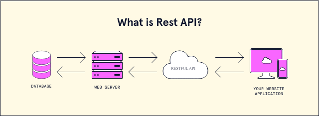
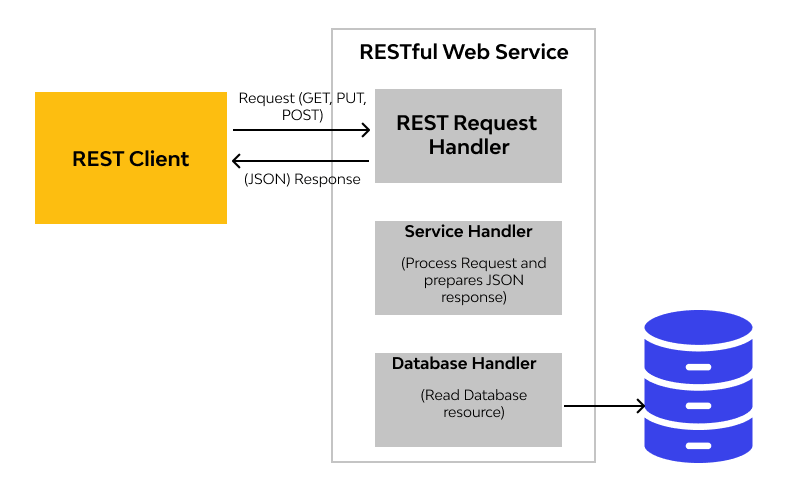
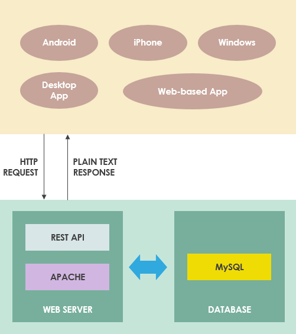
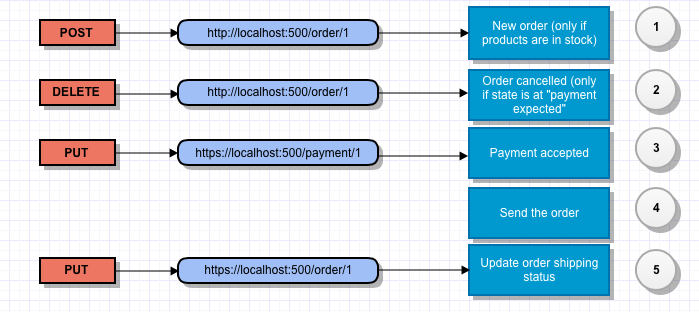

# RESTful Study Note

## RESTful

### What is RESTful?

RESTful (Representational State Transfer) refers to a design pattern for creating web services that interact via HTTP requests. A RESTful API is an interface that allows two computer systems to securely exchange information over the internet. Business applications often need to communicate with internal and third-party systems to perform tasks such as generating monthly payslips, where an internal accounts system shares data with a customer's banking system and an internal timesheet application. RESTful APIs facilitate this information exchange by adhering to secure, reliable, and efficient communication standards.

### Components of RESTful API

**RESTful API Elements:**
- **Client**: Software or application requesting resources.
- **Server**: Software or application controlling resources and responding to client requests.
- **Resource**: Data or content (text, video, images) managed by the server and accessible to the client.

**RESTful API Client Request Components**
| **Component**                 | **Description**                                                                                                                                                                   |
|-------------------------------|-----------------------------------------------------------------------------------------------------------------------------------------------------------------------------------|
| **Unique Resource Identifier**| - **Identifier**: Server uses unique resource identifiers, typically URLs.                                                                                                         |
|                               | - **URL (Endpoint)**: Specifies the path to the resource, similar to a website address.                                                                                            |
| **Method**                    | - **GET**: Access resources at the specified URL; can cache requests and filter data using parameters.                                                                             |
|                               | - **POST**: Send data to the server; creates a new resource each time the same request is sent.                                                                                    |
|                               | - **PUT**: Update existing resources; same request sent multiple times gives the same result.                                                                                      |
|                               | - **DELETE**: Remove a resource; request fails without appropriate authentication.                                                                                                 |
| **HTTP Headers**              | - **Metadata**: Exchanged between client and server, indicating request and response format, request status, etc.                                                                  |
| **Data**                      | - **Included in Requests**: Necessary for methods like POST and PUT.                                                                                                               |
| **Parameters**                | - **Path Parameters**: Specify URL details.                                                                                                                                       |
|                               | - **Query Parameters**: Request more information about the resource.                                                                                                              |
|                               | - **Cookie Parameters**: Authenticate clients quickly.                                                                                                                            |

**Parameters Types**
| **Parameter Type**  | **Description**                                                                                                                                                 |
|---------------------|-----------------------------------------------------------------------------------------------------------------------------------------------------------------|
| **Path Parameters** | Specify URL details.                                                                                                                                             |
| **Query Parameters**| Request more information about the resource.                                                                                                                     |
| **Cookie Parameters**| Authenticate clients quickly.                                                                                                                                   |
- **Server Response:**
  - Processes the call and forms a response.
  - Sends a machine-readable representation of requested data (XML, JSON, plain text).
  - Includes additional data such as error codes, time stamps, and other instructions for the client.
- **Self-Descriptive Calls and Responses**: Include information on how to process and interpret them.

### How RESTful APIs work?

- **Modularity**: Breaks down transactions into small modules, each addressing a part of the transaction.
- **Commands**: Uses HTTP methods (GET, PUT, POST, DELETE) to interact with resources.
- **Resource Representation**: The state of a resource at a specific time.
- **Stateless**: No state is retained between executions, improving scalability and flexibility.
- **Data Formats**: Supports `application/json`, `application/xml`, `application/x-web+xml`, `application/x-www-form-urlencoded`, `multipart/form-data`.

The basic function of a RESTful API is the same as browsing the internet. The client contacts the server by using the API when it requires a resource. API developers explain how the client should use the REST API in the server application API documentation. These are the general steps for any REST API call:
1. The client sends a request to the server. The client follows the API documentation to format the request in a way that the server understands.
2. The server authenticates the client and confirms that the client has the right to make that request.
3. The server receives the request and processes it internally.
4. The server returns a response to the client. The response contains information that tells the client whether the request was successful. The response also includes any information that the client requested.

The REST API request and response details vary slightly depending on how the API developers design the API.

### Communication between Client and Server

#### Making Requests

- **Components of a Request:**
  - **HTTP Verb**: Defines the operation (GET, POST, PUT, DELETE).
  - **Header**: Contains metadata about the request.
  - **Path**: Specifies the resource.
  - **Optional Body**: Contains data for POST or PUT requests.

#### HTTP Verbs

| **HTTP Verb** | **Description**                        |
|---------------|----------------------------------------|
| **GET**       | Retrieve a specific resource or collection of resources. |
| **POST**      | Create a new resource.                |
| **PUT**       | Update a specific resource.           |
| **DELETE**    | Remove a specific resource.           |

#### Headers and Accept Parameters

- **Accept Field**: Specifies the content types the client can process (e.g., `text/html`, `application/json`).
- **MIME Types**: Used to specify content types (e.g., `text/html`, `image/png`, `application/json`).

#### Paths

- **Design**: Should be descriptive and hierarchical.
  - **Example**: `fashionboutique.com/customers/223/orders/12` indicates accessing order 12 for customer 223.
- **Usage**:
  - **Collection**: `POST fashionboutique.com/customers` (no ID needed).
  - **Single Resource**: `GET fashionboutique.com/customers/:id`.

#### Sending Responses

- **Content Types**: Server includes a `Content-Type` header to specify the data format (e.g., `text/html`).

#### Response Codes

| **Status Code** | **Meaning**                                                   |
|-----------------|---------------------------------------------------------------|
| **200 (OK)**    | Standard response for successful HTTP requests.               |
| **201 (CREATED)** | Response for successful creation of an item.                |
| **204 (NO CONTENT)** | Successful request with no content in response body.     |
| **400 (BAD REQUEST)** | Request can't be processed due to client error.         |
| **403 (FORBIDDEN)** | Client doesn't have permission to access the resource.    |
| **404 (NOT FOUND)** | Resource couldn't be found.                               |
| **500 (INTERNAL SERVER ERROR)** | Generic error for unexpected server failure.  |

#### Expected Status Codes for HTTP Verbs

| **HTTP Verb** | **Expected Status Code**        |
|---------------|---------------------------------|
| **GET**       | 200 (OK)                        |
| **POST**      | 201 (CREATED)                   |
| **PUT**       | 200 (OK)                        |
| **DELETE**    | 204 (NO CONTENT)                |

If the operation fails, the server should return the most specific status code corresponding to the problem.

Illustration of the commands in an example:

### Usage of RESTful APIs
- **Cloud Applications**: Statelessness allows for easy redeployment, retries, and scalability.
- **Web Applications**: Any request can be directed to any instance, making REST APIs ideal for web services.
- **Cloud Services and Microservices**: API binding is controlled by URL decoding, essential for modern architectures.

**Common Use Cases:**
- **Mobility**: Apps like Lyft and Uber use REST APIs for maps and ride scheduling.
- **Banking**: Apps access account data and support transactions via REST APIs.
- **Streaming Services**: Platforms like Spotify and Netflix use REST APIs to access media from remote servers.
- **Social Media**: Services like X (formerly Twitter) and Facebook use REST APIs to manage posts and integrate with other apps.

### Benefits of RESTful APIs
| **Benefit**     | **Description**                                                                                                            |
|-----------------|----------------------------------------------------------------------------------------------------------------------------|
| **Simplicity**  | Uses common HTTP methods (GET, PUT, POST, DELETE), making them easy to design, implement, and use.                        |
| **Independence**| Platform-independent; can be created using almost any programming language and work with various client devices.          |
| **Flexible**    | Supports multiple data formats (JSON, XML, plain text), allowing developers to choose the best fit for their needs.       |
| **Scalable**    | Stateless nature supports horizontal scaling, handling significant loads by running many API calls in parallel.           |
| **Cacheable**   | Supports caching, speeding up server response times and potentially eliminating redundant API calls.                      |
| **Secure**      | Uses OAuth authentication and SSL/TLS encryption to secure calls and data exchanges.                                      |
| **Compatible**  | Proper versioning allows for adding new features over time while maintaining backward compatibility for existing clients. |

### Challenges of RESTful APIs
| **Challenge**                 | **Description**                                                                                                                   |
|-------------------------------|-----------------------------------------------------------------------------------------------------------------------------------|
| **Endpoint Consistency**      | Maintaining consistent endpoint paths that follow common web standards can be difficult.                                          |
| **API Versioning**            | Ensuring endpoint URLs remain valid and backward compatible when used internally or with other applications.                      |
| **Long Response Times**       | Handling increased load and response times due to the growing amount of returned resources.                                       |
| **Navigation Paths**          | Determining URL spaces for input parameters can be challenging due to REST's use of URL paths.                                    |
| **Security**                  | Managing security issues, such as HTTPS usage, access control, URL validation, payload size limits, and request monitoring.       |
| **Authentication**            | Implementing and managing common authentication methods (e.g., HTTP basic authentication, API keys, JWT, OAuth 2.0).             |
| **Requests and Data**         | Handling excessive data and metadata in requests or requiring multiple requests to obtain all necessary data.                     |
| **Error Codes and Messages**  | Using standard HTTP error codes and effectively distinguishing between successful responses and errors.                          |
| **API Testing**               | Setting up and running comprehensive API testing, including initial setup, schema updates, parameter combinations, and validation. |

### RESTful Application and Implementation

## References
* https://www.codecademy.com/article/what-is-rest
* https://www.techtarget.com/searchapparchitecture/definition/RESTful-API
* https://www.brainboxes.com/faq/what-is-the-rest-protocol
* https://aws.amazon.com/what-is/restful-api/
* https://www.redhat.com/en/topics/api/what-is-a-rest-api