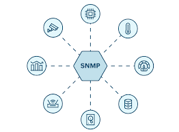
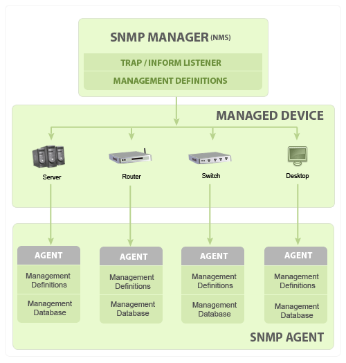
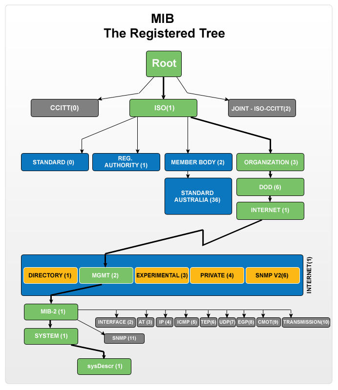

# SNMP Study Note
## Simple Network Management Protocol (SNMP)
### What is SNMP?

SNMP (Simple Network Management Protocol) is an application-layer protocol established by the Internet Architecture Board (IAB) through RFC1157. It facilitates the exchange of management information between network devices within the TCP/IP protocol suite. SNMP is widely adopted for managing and monitoring network elements. Many professional-grade network devices include an SNMP agent, which must be configured and enabled to communicate with network monitoring tools or Network Management Systems (NMS).

### SNMP Basic Components

| **Component**       | **Key Functions**                                                                                     |
|---------------------|-------------------------------------------------------------------------------------------------------|
| **SNMP Manager**    | - Queries agents - Gets responses from agents - Sets variables in agents - Acknowledges asynchronous events from agents |
| **Managed Devices** | - Includes routers, switches, servers, workstations, printers, UPSs, etc.                              |
| **SNMP Agent**      | - Collects management information about its local environment - Stores and retrieves information as defined in the MIB - Signals events to the manager - Acts as a proxy for non-SNMP manageable nodes |
| **Management Information Base (MIB)** | - Maintained by SNMP agents to describe device parameters - Used by SNMP manager to request specific information - Contains standard and vendor-specific values - Facilitates comprehensive network monitoring and management |

### MIB Browser and Walk Tool
* Tool in ManageEngine's Suite of Free Tools for SNMP management.
* Loads and unloads MIBs, fetches MIB data from SNMP agents (v1, v2c, v3).
* Monitors SNMP-enabled devices and servers.
* Supports multiple MIB modules, GET, GETNEXT, and SET SNMP operations.
* Configures and parses SNMP traps.
* Works on Windows and Linux platforms.
* User-friendly interface for easy SNMP monitoring and management.

### MIB Structure and Object ID

- **MIB Structure and Object Identifier (OID)**:
  - **Definition**: Management Information Base (MIB) contains information for managing network elements, organized into managed objects identified by Object Identifiers (OIDs).
  - **Uniqueness**: Each OID is unique and denotes specific characteristics of a managed device.
  - **Return Values**: OIDs can return different types of data such as text, numbers, counters, etc., depending on the queried object.
- **Types of Managed Objects**:
  - **Scalar**: Represents a single object instance (e.g., device vendor name).
  - **Tabular**: Represents multiple related instances grouped together (e.g., CPU utilization of a Quad Processor, providing separate results for each CPU).
- **Hierarchy and Representation**:
  - **Tree Structure**: MIB hierarchy is organized hierarchically, represented in a tree structure with individual variable identifiers.
  - **Example**: Example OID structure in RFC1213 for "sysDescr" is .1.3.6.1.2.1.1.1.

### Basic Commands of SNMP and SNMP Traps
| **Command**   | **Description**                                                                                              |
|---------------|--------------------------------------------------------------------------------------------------------------|
| **GET**       | - Requests one or more values from a managed device.                                                           |
| **GET NEXT**  | - Retrieves the value of the next OID in the MIB tree.                                                         |
| **GET BULK**  | - Retrieves voluminous data from large MIB tables.                                                            |
| **SET**       | - Modifies or assigns values on a managed device.                                                             |
| **TRAPS**     | - Unsolicited messages initiated by agents to notify managers of significant events.                          |
| **INFORM**    | - Similar to TRAPS, includes confirmation from manager upon receipt.                                          |
| **RESPONSE**  | - Carries back values or signals of actions directed by the SNMP Manager.                                     |
| **SNMP Traps**| - Enables agents to notify managers of events via unsolicited SNMP messages. - Includes sysUpTime, OID, and optional variable bindings. - Format changed in SNMPv2.

### Typical SNMP Communication
Being the part of TCP⁄ IP protocol suite, the SNMP messages are wrapped as User Datagram Protocol (UDP) and intern wrapped and transmitted in the Internet Protocol. The following diagram will illustrate the four–layer model developed by Department of Defense (DoD).

### SNMP Security Levels

| **Security Level** | **Description** |
|--------------------|-----------------|
| **noAuthNoPriv**   | - Uses community string for authentication. - No encryption for privacy. |
| **authNoPriv**     | - Uses HMAC with MD5 for authentication. - No encryption for privacy. |
| **authPriv**       | - Uses HMAC with MD5 or SHA for authentication. - Uses DES-56 algorithm for encryption. |

### Versions of SNMP

| **SNMP Version** | **Description** |
|------------------|-----------------|
| **SNMPv1**       | - Uses community strings for authentication. - Uses UDP. |
| **SNMPv2c**      | - Uses community strings for authentication. - Can use UDP or TCP. - Enhanced MIB structure and protocol elements. - Based on SNMPv1 administrative structure. |
| **SNMPv3**       | - Uses Hash-based MAC with MD5 or SHA for authentication. - Uses DES-56 for privacy. - Uses TCP. - Provides remote configuration. - Most secure version. |

### Advantages and Disadvantages
| **Advantages of SNMP**                                   | **Limitations of SNMP**                                      |
|----------------------------------------------------------|---------------------------------------------------------------|
| 1. Simple to implement.                                  | 1. Too simple, doesn't scale well.                            |
| 2. Widely implemented agents.                            | 2. Lacks object-oriented data view.                           |
| 3. Minimal agent-level overhead.                         | 3. No standard control definition.                            |
| 4. Robust and extensible.                                | 4. Many implementation-specific (private MIB) extensions.     |
| 5. Polling approach suitable for LAN-based managed objs. | 5. High communication overhead due to polling.                |
| 6. Offers a direct manager-agent interface.              |                                                               |
| 7. Meets critical management needs.                      |                                                               |

### Difference Between SNMP and Netconf
| Feature | SNMP | NETCONF |
| --- | --- | --- |
| **Primary Use** | SNMP is primarily used for performance monitoring. | NETCONF is primarily used for configuration management. |
| **Data Description** | SNMP uses Object Identifiers (OIDs) to describe resources. | NETCONF uses paths to describe resources. |
| **Data and Configuration Distinction** | SNMP cannot distinguish between configuration data and operational data. | NETCONF can distinguish between configuration data and operational data. |
| **Security** | SNMP, particularly its older versions (v1 and v2c), lacks proper encryption and authentication. | NETCONF typically runs over SSH (Secure Shell), providing strong encryption and secure authentication mechanisms. |
| **Access Control** | SNMP's access control is less flexible, relying on community strings. | NETCONF offers more granular and flexible access control mechanisms. |
| **Data Structure** | SNMP uses a less structured and less intuitive data representation called the Management Information Base (MIB). | NETCONF uses structured data models, such as YANG, to define the configuration and operational state of network devices. |
| **Error Handling and Transaction Support** | SNMP lacks built-in transaction support. | NETCONF offers better error handling and transaction support. |
| **Transport Protocol** | SNMP uses UDP (User Datagram Protocol) for transport. | NETCONF uses TCP (Transmission Control Protocol) and ties in to security protocols like SSHv2 and TLS. |

### SNMP Application and Implementation

## References
* https://www.manageengine.com/network-monitoring/what-is-snmp.html
* https://www.geeksforgeeks.org/simple-network-management-protocol-snmp/
* http://www.net-snmp.org/
* https://www.networkcomputing.com/network-infrastructure/netconf-introduction-to-an-emerging-networking-standard
* https://community.cisco.com/t5/security-knowledge-base/security-comparison-between-netconf-restconf-and-snmp/ta-p/4805483
* https://itexamanswers.net/question/what-are-two-differences-between-snmp-and-netconf-choose-two
* https://themediumblog.com/network-optimization-with-netconf-and-snmp/