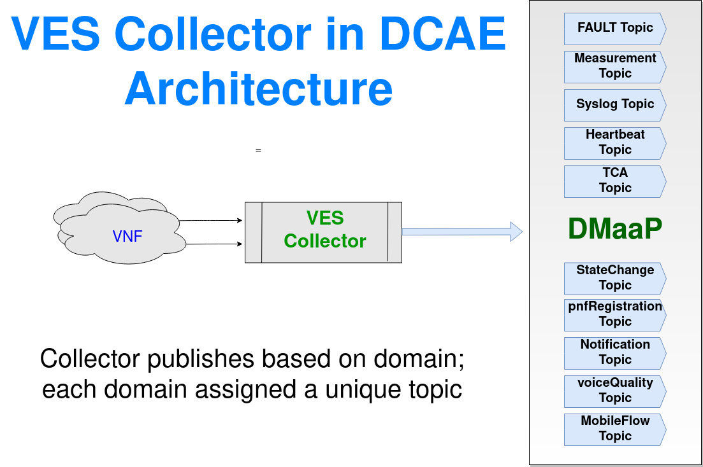

# VES Study Note
## Virtual Event Streaming (VES)
### What is VES?
Virtual Event Streaming (VES) is a protocol that promotes adoption of a unified data model for streaming telemetry from physical or virtual infrastructure and applications. It provides a common model to gather platform telemetry data and enables all relevant data, in any form, to be delivered from hosts/VNFs using an easily-integrated set of agent and collector code artifacts. VES can be integrated with the Open Networking Automation Platform (ONAP) environment for a standardized event framework.
Virtual Event Streaming (VES) Collector is RESTful collector for processing JSON messages. The collector verifies the source and validates the events against VES schema before distributing to DMAAP MR topics.

### VES Architecture

The VES architecture consists of several key components that work together to enable the collection and processing of telemetry data from physical and virtual infrastructure:

**VES Collector**
- The VES Collector is a RESTful service that processes JSON-formatted VES messages
- It verifies the source of the events (when authentication is enabled), validates the events against the VES schema, and distributes them to DMAAP MR topics for downstream systems to subscribe to
- The collector supports ingesting individual events or batches of events posted to its endpoints
- It also provides configurable event transformation functions and event distribution to DMAAP MR topics

**VES Integration Components**
- collectd: A system statistics collection daemon that collects metrics using read plugins and pushes data to Kafka topics using write plugins
- Apache Kafka: A distributed streaming platform that provides a scalable, persistent, and fault-tolerant buffer for the collected metrics
- Barometer VES Plugin (ves_app.py): Consumes the collectd data from Kafka, translates it to VES format, and forwards it to the VES Collector

**VES Processing Flow**

1. collectd collects system metrics using various read plugins (e.g., CPU, memory, storage, network)
2. collectd pushes the metrics to Kafka topics using the write_kafka plugin
3. The Barometer VES Plugin (ves_app.py) consumes the data from Kafka, translates it to VES format, and sends it to the VES Collector
4. The VES Collector:
   - Verifies the source of the events (when authentication is enabled)
   - Validates the events against the VES schema
   - Applies any configured event transformation rules
   - Publishes the events to the ONAP message bus (DMAAP) for further processing and analytics
   - Saves the events in a local time-series database

**VES Schema Validation**
- The VES Collector is configured to support multiple VES versions (1.2, 4.1, 5.4, 7.2.1)
- It uses the corresponding VES schema definition for event validation when processing incoming messages

**VES Collector Features**
- Acknowledgement to the sender with appropriate response codes (success or failure)
- Authentication of events posted to the collector (supports two types of authentication settings)
- Support for single or batch JSON event inputs
- General schema validation against the standard VES definition
- Validation of standardized (stndDefined) fields against the schema
- Mapping of external schemas to local schema files during stndDefined validation
- Multiple schema support and backward compatibility
- Configurable event transformation and suppression
- Publishing of events to DMAAP topics (with or without AAF)

### Dynamic configuration fed into Collector via DCAEPlatform
* Outbound Dmaap/UEB topic
* Schema version to be validated against
* Authentication account for VNF

POST requests result in standard HTTP status codes:
* 200-299 Success
* 400-499 Client request has a problem (data error)
* 500-599 Collector service has a problem

### VES OpenAPI Manager
- **Purpose**:
  - Validate OpenAPI schemas in VES_EVENT type artifacts during Service Model distribution in SDC.
- **Deployment**:
  - Automatically listens to Service Model distribution events using the SDC Distribution Client.
- **Functionality**:
  - Reads declared OpenAPI descriptions from VES_EVENT artifacts.
  - Partially validates these artifacts from distributed service resources.
  - Checks if stndDefined events in VES_EVENT artifacts contain schemaReferences accessible by the DCAE VES Collector.
- **Notification**:
  - Informs ONAP users if any schemaReferences are absent in the local externalSchema repository.
  - Guides users on which schemas need to be uploaded to the DCAE run-time environment.

### VES OpenAPI Manager Architecture

- **Communication Requirement**:
  - Needs to interact with other ONAP components.
- **SDC Distribution Client**:
  - Used as a library to facilitate communication with necessary components.
- **Required Components**:
  - **SDC BE (Back-End)**
  - **Kafka**
- **Configuration**:
  - SDC Distribution Client must be properly configured to enable communication with SDC BE and Kafka.
  - Configuration instructions can be found in the VES OpenAPI Manager deployment guide.

### VES Application and Implementation

## References
* https://docs.onap.org/projects/onap-dcaegen2/en/latest/sections/services/ves-http/index.html
* https://docs.onap.org/projects/onap-dcaegen2/en/latest/sections/apis/ves.html
* https://networkbuilders.intel.com/docs/networkbuilders/integration-with-vnf-event-stream-intel-platform-service-assurance.pdf
* https://wiki.o-ran-sc.org/pages/viewpage.action?pageId=35881888
* https://docs.onap.org/projects/onap-dcaegen2/en/latest/sections/services/ves-http/architecture.html
* https://docs.onap.org/projects/onap-dcaegen2/en/latest/sections/services/ves-openapi-manager/architecture.html