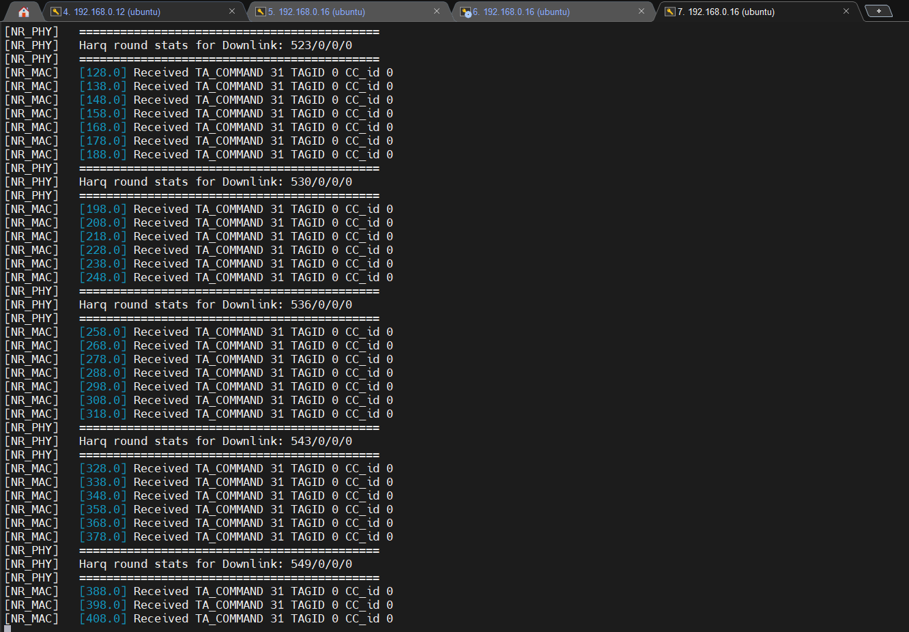
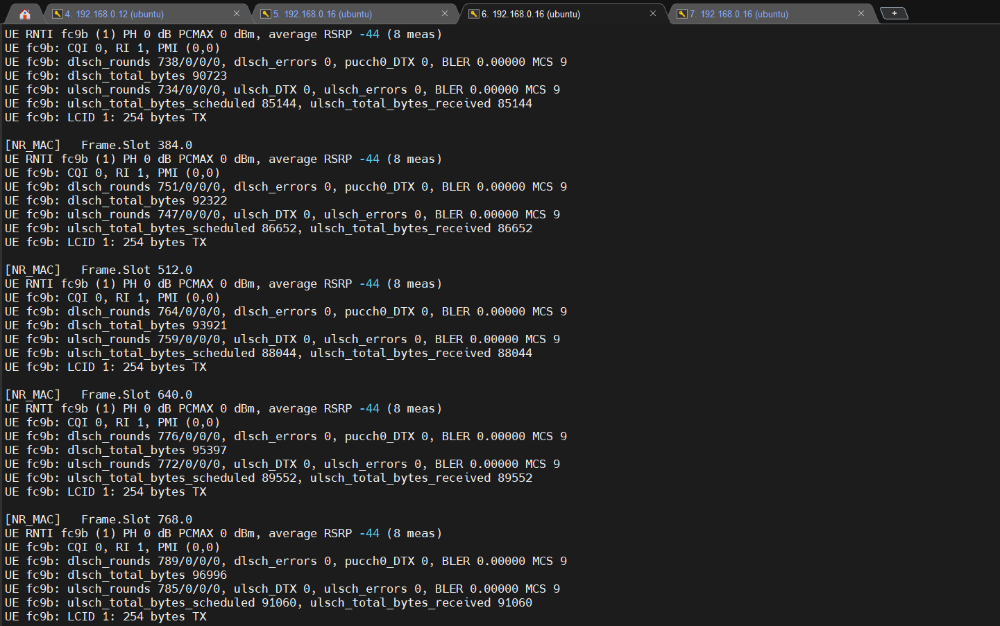
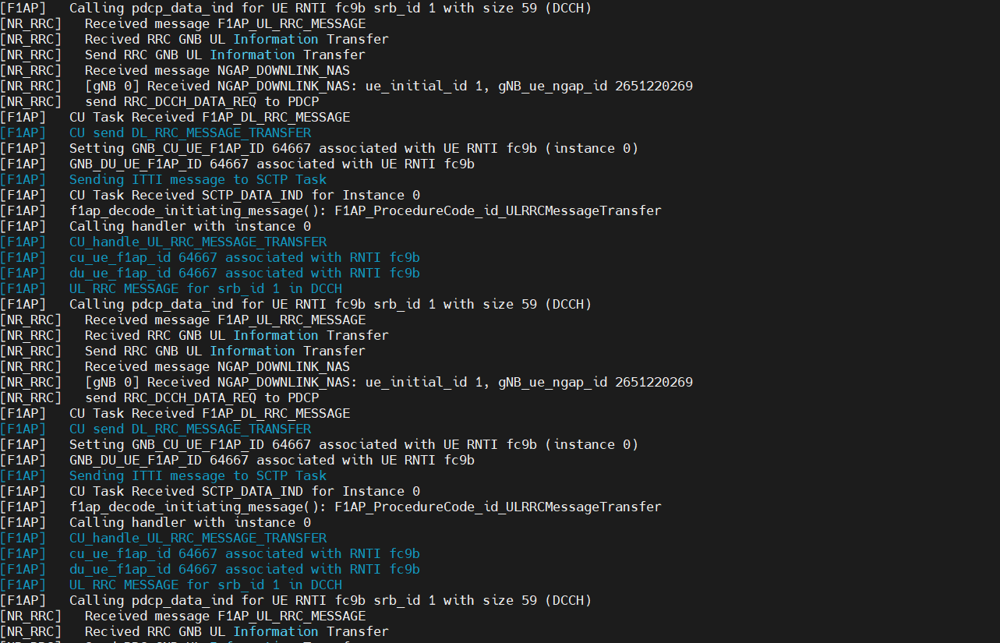

# Connect Free5GC to OpenAirInterface (OAI)

## End to End Testing
### Move to a directory
```bash
cd ~/openairinterface5g/cmake_targets/ran_build/build/
```

### Launch CU Component in Terminal 1
```bash
sudo RFSIMULATOR=server ./nr-softmodem --rfsim --sa -O ../../../targets/PROJECTS/GENERIC-NR-5GC/CONF/cu_gnb.conf
```

### Launch DU Component in Terminal 2
```bash
sudo RFSIMULATOR=server ./nr-softmodem --rfsim --sa -O ../../../targets/PROJECTS/GENERIC-NR-5GC/CONF/du_gnb.conf
```

### Launch UE in Terminal 3
```bash
sudo RFSIMULATOR=127.0.0.1 ./nr-uesoftmodem -r 106 --numerology 1 --band 78 -C 3619200000 --rfsim --sa --nokrnmod -O ../../../targets/PROJECTS/GENERIC-NR-5GC/CONF/ue.conf
```

If not working, try:
```bash
sudo RFSIMULATOR=server ./nr-uesoftmodem -r 106 --numerology 1 --band 78 -C 3619200000 --rfsim --sa --nokrnmod -O ../../../targets/PROJECTS/GENERIC-NR-5GC/CONF/ue.conf
```

Results:
UE:

DU:

CU:


