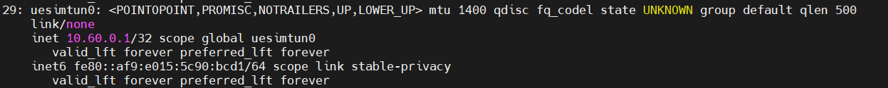
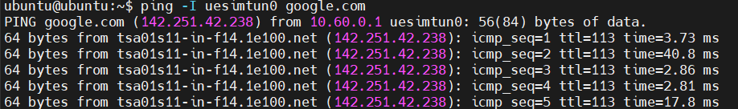

# Connect Free5GC to UERANSIM
## Test the E2E between UE and 5GC. (UE can ping to DN)
### Setting free5GC and UERANSIM Parameters
In free5gc VM, we need to edit three files:
```bash
~/free5gc/config/amfcfg.yaml
~/free5gc/config/smfcfg.yaml
~/free5gc/config/upfcfg.yaml
```

First SSH into free5gc VM, and change `~/free5gc/config/amfcfg.yaml`:
```bash
cd ~/free5gc
nano config/amfcfg.yaml
```

Replace ngapIpList IP from `127.0.0.1` to `192.168.0.12`, namely from:
```bash
...
  ngapIpList:  # the IP list of N2 interfaces on this AMF
  - 127.0.0.1
```
into:
```bash
...
  ngapIpList:  # the IP list of N2 interfaces on this AMF
  - 192.168.0.12  # 127.0.0.1
```
```bash
configuration :
amfName: AMF # the name of this AMF
ngapIpList: # the IP list of N2 interfaces on this AMF
- 192.168.0.12
ngapPort: 38412 # the SCTP port listened by NGAP
sbi: # Service-based interface information
```

Next edit `~/free5gc/config/smfcfg.yaml`:
```bash
nano config/smfcfg.yaml
```
and in the entry inside userplaneInformation / upNodes / UPF / interfaces / endpoints, change the IP from 127.0.0.8 to 192.168.0.12, namely from:
```bash
...
  interfaces: # Interface list for this UPF
   - interfaceType: N3 # the type of the interface (N3 or N9)
     endpoints: # the IP address of this N3/N9 interface on this UPF
       - 127.0.0.8
```
into:
```bash
...
  interfaces: # Interface list for this UPF
   - interfaceType: N3 # the type of the interface (N3 or N9)
     endpoints: # the IP address of this N3/N9 interface on this UPF
       - 192.168.0.12  # 127.0.0.8
```
Finally, edit ~/free5gc/config/upfcfg.yaml，and chage gtpu IP from 127.0.0.8 into 192.168.0.12, namely from:
```bash
...
  gtpu:
    forwarder: gtp5g
    # The IP list of the N3/N9 interfaces on this UPF
    # If there are multiple connection, set addr to 0.0.0.0 or list all the addresses
    ifList:
      - addr: 127.0.0.8
        type: N3
```
into:
```bash
...
  gtpu:
    forwarder: gtp5g
    # The IP list of the N3/N9 interfaces on this UPF
    # If there are multiple connection, set addr to 0.0.0.0 or list all the addresses
    ifList:
      - addr: 192.168.0.12 # 127.0.0.8
        type: N3
```

### Setting UERANSIM
In the ueransim VM, there are two files related to free5GC：
```bash
~/UERANSIM/config/free5gc-gnb.yaml
~/UERANSIM/config/free5gc-ue.yaml
```
The second file is for UE, which we don’t have to change if the data inside is consistent with the (default) registration data we set using WebConsole previously.
Comment
Suggest edit

First SSH into ueransim, and edit the file ~/UERANSIM/config/free5gc-gnb.yaml, and change the ngapIp IP, as well as the gtpIp IP, from 127.0.0.1 to 10.99.1.237，and also change the IP in amfConfigs into 10.99.1.150, that is, from:
```bash
...
  ngapIp: 127.0.0.1   # gNB's local IP address for N2 Interface (Usually same with local IP)
  gtpIp: 127.0.0.1    # gNB's local IP address for N3 Interface (Usually same with local IP)

  # List of AMF address information
  amfConfigs:
    - address: 127.0.0.1
```
into:
```bash
...
  ngapIp: 192.168.0.12 # 127.0.0.1   # gNB's local IP address for N2 Interface (Usually same with local IP)
  gtpIp: 192.168.0.12  # 127.0.0.1    # gNB's local IP address for N3 Interface (Usually same with local IP)

  # List of AMF address information
  amfConfigs:
    - address: 192.168.0.12  # 127.0.0.1
```
Next we examine the file ~/UERANSIM/config/free5gc-ue.yaml，and see if the settings is consistent with those in free5GC (via WebConsole), for example:
```bash
# IMSI number of the UE. IMSI = [MCC|MNC|MSISDN] (In total 15 or 16 digits)
supi: 'imsi-208930000000003'
# Mobile Country Code value
mcc: '208'
# Mobile Network Code value (2 or 3 digits)
mnc: '93'

# Permanent subscription key
key: '8baf473f2f8fd09487cccbd7097c6862'
# Operator code (OP or OPC) of the UE
op: '8e27b6af0e692e750f32667a3b14605d'
# This value specifies the OP type and it can be either 'OP' or 'OPC'
opType: 'OP'

...

# Initial PDU sessions to be established
sessions:
  - type: 'IPv4'
    apn: 'internet'
    slice:
      sst: 0x01
      sd: 0x010203

# List of requested S-NSSAIs by this UE
slices:
  - sst: 0x01
    sd: 0x010203
...
```
The data appear to be the same as what we set in WebConsole.

### Testing UERANSIM against free5GC
SSH into free5gc. If you have rebooted free5gc, remember to run:
```bash
sudo sysctl -w net.ipv4.ip_forward=1
sudo iptables -t nat -A POSTROUTING -o <dn_interface> -j MASQUERADE
sudo systemctl stop ufw
```
Note: In Ubuntu Server 20.04 and 22.04 the dn_interface may be called enp0s3 or enp0s4 by default. Use the command ip a to help to figure it out.

In addition, execute the following command:
```bash
sudo iptables -I FORWARD 1 -j ACCEPT
```
Tip: As per the information on the appendix page, it's possible to use a script to reload the config above automatically after reboot

Also, make sure you have make proper changes to the free5GC configuration files, then run ./run.sh:
```bash
cd ~/free5gc
./run.sh
```
At this time free5GC has been started.

Next, prepare three additional SSH terminals from your host machine (if you know how to use tmux, you can use just one).

In terminal 1: SSH into ueransim, make sure UERANSIM is built, and configuration files have been changed correctly, then execute nr-gnb:
```bash
cd ~/UERANSIM
build/nr-gnb -c config/free5gc-gnb.yaml
```
In terminal 2, SSH into ueransim, and execute nr-ue with admin right:
```bash
cd ~/UERANSIM
sudo build/nr-ue -c config/free5gc-ue.yaml # for multiple-UEs, use -n and -t for number and delay
```
In terminal 3, SSH into ueransim, and ping 192.168.0.12 to see free5gc is alive. Then, use ifconfig to see if the tunnel uesimtun0 has been created (by nr-ue)



Now use ping:
```bash
ping -I uesimtun0 google.com
```
Success Result:

