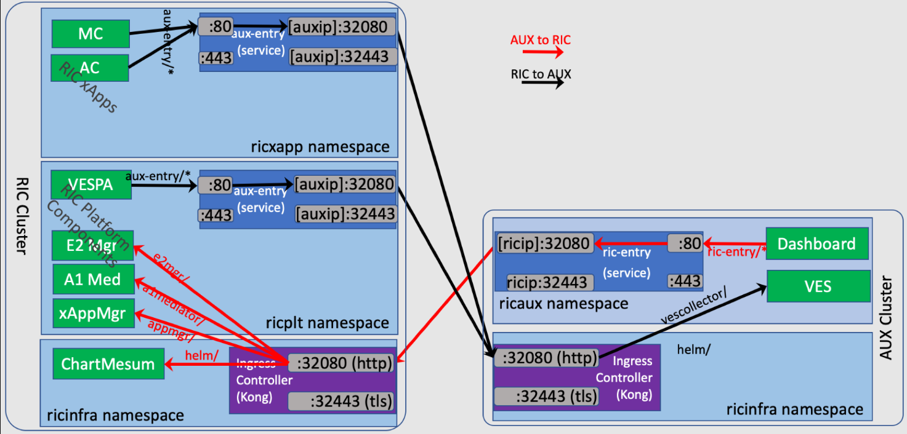
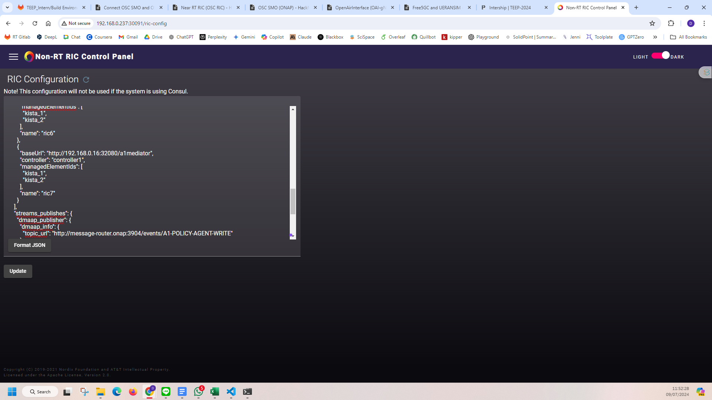
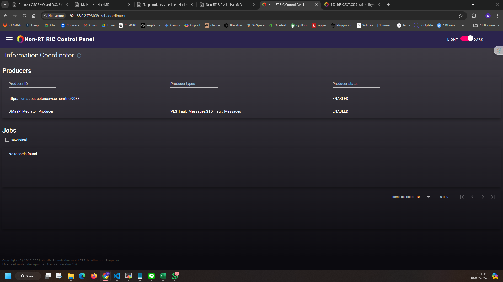
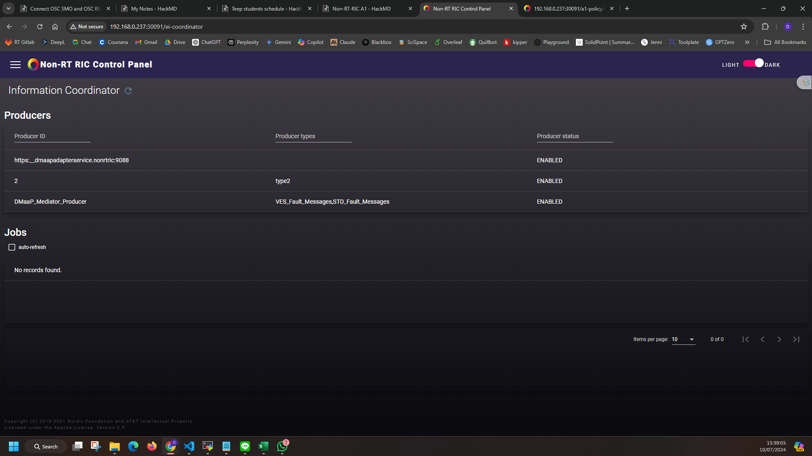
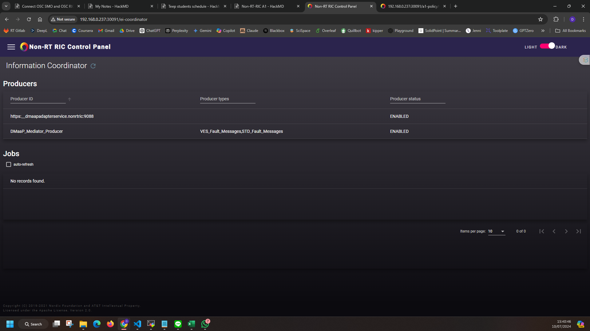
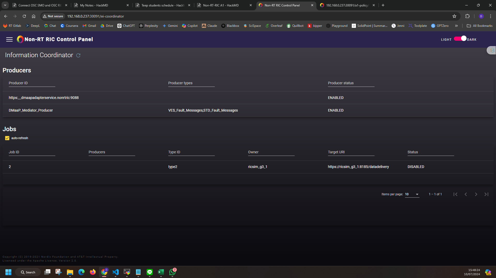

# Connect OSC SMO and OSC RIC with A1 Interface

## Non-RT RIC connect to Near-RT RIC



### Step 1: Enter Control Plane
```
http://192.168.0.237:30091/ric-config
```
output:



### Step 2: Set up RIC Configuration
JSON Config, add "ric7" part:
```jsonld
{
  "config": {
    "controller": [
      {
        "baseUrl": "http://sdnc.onap:8282",
        "name": "controller1",
        "password": "Kp8bJ4SXszM0WXlhak3eHlcse2gAw84vaoGGmJvUy2U",
        "userName": "admin"
      }
    ],
    "ric": [
      {
        "baseUrl": "http://a1-sim-osc-0.nonrtric:8085",
        "controller": "controller1",
        "managedElementIds": [
          "kista_1",
          "kista_2"
        ],
        "name": "ric1"
      },
      {
        "baseUrl": "http://a1-sim-osc-1.nonrtric:8085",
        "controller": "controller1",
        "managedElementIds": [
          "kista_1",
          "kista_2"
        ],
        "name": "ric2"
      },
      {
        "baseUrl": "http://a1-sim-std-0.nonrtric:8085",
        "controller": "controller1",
        "managedElementIds": [
          "kista_1",
          "kista_2"
        ],
        "name": "ric3"
      },
      {
        "baseUrl": "http://a1-sim-std-1.nonrtric:8085",
        "controller": "controller1",
        "managedElementIds": [
          "kista_1",
          "kista_2"
        ],
        "name": "ric4"
      },
      {
        "baseUrl": "http://a1-sim-std2-0.nonrtric:8085",
        "controller": "controller1",
        "managedElementIds": [
          "kista_1",
          "kista_2"
        ],
        "name": "ric5"
      },
      {
        "baseUrl": "http://a1-sim-std2-1.nonrtric:8085",
        "controller": "controller1",
        "managedElementIds": [
          "kista_1",
          "kista_2"
        ],
        "name": "ric6"
      },
      {
        "baseUrl": "http://192.168.0.61:32080/a1mediator",
        "controller": "controller1",
        "managedElementIds": [
          "kista_1",
          "kista_2"
        ],
        "name": "ric7"
      }
    ],
    "streams_publishes": {
      "dmaap_publisher": {
        "dmaap_info": {
          "topic_url": "http://message-router.onap:3904/events/A1-POLICY-AGENT-WRITE"
        },
        "type": "message_router"
      }
    },
    "streams_subscribes": {
      "dmaap_subscriber": {
        "dmaap_info": {
          "topic_url": "http://message-router.onap:3904/events/A1-POLICY-AGENT-READ/users/policy-agent?timeout=15000&limit=100"
        },
        "type": "message_router"
      }
    }
  }
}
```

JSON File Output from `http://192.168.0.237:30091/a1-policy/v2/rics`:
```jsonld
{
  "rics": [
    {
      "ric_id": "ric1",
      "managed_element_ids": [
        "kista_1",
        "kista_2"
      ],
      "policytype_ids": [],
      "state": "AVAILABLE"
    },
    {
      "ric_id": "ric3",
      "managed_element_ids": [
        "kista_1",
        "kista_2"
      ],
      "policytype_ids": [
        ""
      ],
      "state": "AVAILABLE"
    },
    {
      "ric_id": "ric2",
      "managed_element_ids": [
        "kista_1",
        "kista_2"
      ],
      "policytype_ids": [],
      "state": "AVAILABLE"
    },
    {
      "ric_id": "ric5",
      "managed_element_ids": [
        "kista_1",
        "kista_2"
      ],
      "policytype_ids": [],
      "state": "AVAILABLE"
    },
    {
      "ric_id": "ric4",
      "managed_element_ids": [
        "kista_1",
        "kista_2"
      ],
      "policytype_ids": [
        ""
      ],
      "state": "AVAILABLE"
    },
    {
      "ric_id": "ric7",
      "managed_element_ids": [
        "kista_1",
        "kista_2"
      ],
      "policytype_ids": [],
      "state": "AVAILABLE"
    },
    {
      "ric_id": "ric6",
      "managed_element_ids": [
        "kista_1",
        "kista_2"
      ],
      "policytype_ids": [],
      "state": "AVAILABLE"
    }
  ]
}
```
### Step 3: Check if it successful
```
curl -v http://192.168.0.237:30091/a1-policy/v2/rics
```
output:
```bash
root@ubuntu:~/ric-dep# curl -v http://192.168.0.237:30091/a1-policy/v2/rics
*   Trying 192.168.0.237:30091...
* TCP_NODELAY set
* Connected to 192.168.0.237 (192.168.0.237) port 30091 (#0)
> GET /a1-policy/v2/rics HTTP/1.1
> Host: 192.168.0.237:30091
> User-Agent: curl/7.68.0
> Accept: */*
>
* Mark bundle as not supporting multiuse
< HTTP/1.1 200 OK
< Server: nginx/1.25.1
< Date: Thu, 11 Jul 2024 04:04:42 GMT
< Content-Type: application/json
< Content-Length: 728
< Connection: keep-alive
<
* Connection #0 to host 192.168.0.237 left intact
{"rics":[{"ric_id":"ric1","managed_element_ids":["kista_1","kista_2"],"policytype_ids":[],"state":"AVAILABLE"},{"ric_id":"ric3","managed_element_ids":["kista_1","kista_2"],"policytype_ids":[""],"state":"AVAILABLE"},{"ric_id":"ric2","managed_element_ids":["kista_1","kista_2"],"policytype_ids":[],"state":"AVAILABLE"},{"ric_id":"ric5","managed_element_ids":["kista_1","kista_2"],"policytype_ids":[],"state":"AVAILABLE"},{"ric_id":"ric4","managed_element_ids":["kista_1","kista_2"],"policytype_ids":[""],"state":"AVAILABLE"},{"ric_id":"ric7","managed_element_ids":["kista_1","kista_2"],"policytype_ids":[],"state":"AVAILABLE"},{"ric_id":"ric6","managed_element_ids":["kista_1","kista_2"],"policytype_ids":[],"state":"AVAILABLE"}]}
```
Check if there is any problem with near rt ric configuration:
```bash
curl -v http://192.168.0.61:32080/appmgr/ric/v1/health/ready
```
output:
```bash
root@ubuntu:~/ric-dep# curl -v http://192.168.0.61:32080/appmgr/ric/v1/health/ready
*   Trying 192.168.0.61:32080...
* TCP_NODELAY set
* Connected to 192.168.0.61 (192.168.0.61) port 32080 (#0)
> GET /appmgr/ric/v1/health/ready HTTP/1.1
> Host: 192.168.0.61:32080
> User-Agent: curl/7.68.0
> Accept: */*
>
* Mark bundle as not supporting multiuse
< HTTP/1.1 200 OK
< Content-Length: 0
< Connection: keep-alive
< Date: Thu, 11 Jul 2024 04:03:45 GMT
< X-Kong-Upstream-Latency: 1
< X-Kong-Proxy-Latency: 0
< Via: kong/1.4.3
<
* Connection #0 to host 192.168.0.61 left intact

```

## End to end call from Information Coordinator Service


From the control panel, only producers and jobs can be listed. Need to complete the setting through the internal API.



### Type
#### Create Type
command:
```bash
curl -X 'PUT' \
  'http://192.168.0.237:30091/data-producer/v1/info-types/type2' \
  -H 'accept: application/json' \
  -H 'Content-Type: application/json' \
  -d '{
  "info_job_data_schema": {
    "$schema":"http://json-schema.org/draft-07/schema#",
    "title":"STD_Type1_1.0.0",
    "description":"EI-Type 1",
    "type":"object"
  }
}'
```
200 Type Updated
201 Type Created
check:
```bash
kubectl logs -n nonrtric controlpanel-c4f5c58f8-68l75
```
output:
```bash
192.168.0.237 - - [10/Jul/2024:07:16:43 +0000] "PUT /data-producer/v1/info-types/type2 HTTP/1.1" 201 0 "-" "curl/7.81.0"
192.168.0.237 - - [10/Jul/2024:07:18:51 +0000] "PUT /data-producer/v1/info-types/type2 HTTP/1.1" 200 0 "-" "curl/7.81.0"
```

#### Delete Type
```bash
curl -X 'DELETE' \
  'http://192.168.0.237:30091/data-producer/v1/info-types/type2' \
  -H 'accept: application/json'
```
204 Type Deleted
404 Type Not Found

output:
```bash
192.168.0.237 - - [10/Jul/2024:07:22:11 +0000] "DELETE /data-producer/v1/info-types/type2 HTTP/1.1" 204 0 "-" "curl/7.81.0"
```

### Producer
#### Create Producer
```bash
curl -X 'PUT' \
  'http://192.168.0.237:30091/data-producer/v1/info-producers/2' \
  -H 'accept: application/json' \
  -H 'Content-Type: application/json' \
  -d '{
  "info_producer_supervision_callback_url": "https://producer-stub:8093/callbacks/supervision/prod-a",
  "supported_info_types": [
    "type2"
  ],
  "info_job_callback_url": "https://producer-stub:8093/callbacks/job/prod-a"
}'
```
200 Producer Updated
201 Producer Created

output:
```bash
192.168.0.237 - - [10/Jul/2024:07:35:47 +0000] "PUT /data-producer/v1/info-producers/2 HTTP/1.1" 201 0 "-" "curl/7.81.0"
```



#### Delete Producer
```bash
curl -X 'DELETE' \
'http://192.168.0.237:30091/data-producer/v1/info-producers/2' \
-H 'accept: application/json'
```
204 Producer Deleted
404 Producer Not Found
output:
```bash
192.168.0.237 - - [10/Jul/2024:07:40:25 +0000] "DELETE /data-producer/v1/info-producers/2 HTTP/1.1" 204 0 "-" "curl/7.81.0"
```

### Jobs
#### Create Jobs
```bash
curl -X 'PUT' \
  'http://192.168.0.237:30091/data-consumer/v1/info-jobs/2?typeCheck=false' \
  -H 'accept: application/json' \
  -H 'Content-Type: application/json' \
  -d '{
  "info_type_id": "type2",
  "job_result_uri": "https://ricsim_g3_1:8185/datadelivery",
  "job_owner": "ricsim_g3_1",
  "job_definition": {},
  "status_notification_uri": "http://producer:80/"
}'
```
200 Job Updated
201 Job Created

output:
```bash
192.168.0.237 - - [10/Jul/2024:07:47:43 +0000] "PUT /data-consumer/v1/info-jobs/2?typeCheck=false HTTP/1.1" 201 0 "-" "curl/7.81.0"
```


#### Delete Jobs
```bash
curl -X 'DELETE' \
  'http://192.168.0.237:30091/data-consumer/v1/info-jobs/2' \
  -H 'accept: application/json'
```
204 Job Deleted
404 Job Not Found

output:
```bash
192.168.0.237 - - [10/Jul/2024:07:50:02 +0000] "DELETE /data-consumer/v1/info-jobs/2 HTTP/1.1" 204 0 "-" "curl/7.81.0"
```


## Control Plane NorthBound API Test
1. `/a1-policy/v2/policytypes`
Method: GET
Description: Query available policy types.
Summary: Get all available policy types.
```bash
curl -X GET -v http://192.168.0.237:30091/a1-policy/v2/policytypes
```
output:
```bash
root@node1:~# curl -X GET -v http://192.168.0.237:30091/a1-policy/v2/policytypes
Note: Unnecessary use of -X or --request, GET is already inferred.
*   Trying 192.168.0.237:30091...
* Connected to 192.168.0.237 (192.168.0.237) port 30091 (#0)
> GET /a1-policy/v2/policytypes HTTP/1.1
> Host: 192.168.0.237:30091
> User-Agent: curl/7.81.0
> Accept: */*
>
* Mark bundle as not supporting multiuse
< HTTP/1.1 404 Not Found
< Server: nginx/1.25.1
< Date: Wed, 10 Jul 2024 08:59:12 GMT
< Content-Type: application/json
< Transfer-Encoding: chunked
< Connection: keep-alive
< Vary: Origin
< Vary: Access-Control-Request-Method
< Vary: Access-Control-Request-Headers
<
* Connection #0 to host 192.168.0.237 left intact
{"timestamp":"curl -X GET -v http://192.168.0.237:30091/a1-policy/v2/policies,"path":"/a1-policy/v2/policytypes"}
```
2. `/a1-policy/v2/policies`
Method: GET
Description: Retrieve all policy information.
Summary: Query policy information.
```bash
curl -X GET -v http://192.168.0.237:30091/a1-policy/v2/policies
```
output:
```bash
root@node1:~# curl -X GET -v http://192.168.0.237:30091/a1-policy/v2/policies
Note: Unnecessary use of -X or --request, GET is already inferred.
*   Trying 192.168.0.237:30091...
* Connected to 192.168.0.237 (192.168.0.237) port 30091 (#0)
> GET /a1-policy/v2/policies HTTP/1.1
> Host: 192.168.0.237:30091
> User-Agent: curl/7.81.0
> Accept: */*
>
* Mark bundle as not supporting multiuse
< HTTP/1.1 200 OK
< Server: nginx/1.25.1
< Date: Wed, 10 Jul 2024 08:59:46 GMT
< Content-Type: application/json
< Content-Length: 17
< Connection: keep-alive
<
* Connection #0 to host 192.168.0.237 left intact
{"policy_ids":[]}r
```
3. `/a1-policy/v2/policies/{policy_id}`
Method: GET
Description: Retrieve detailed information of the policy.
Summary: Query policy details.
```bash
curl -X GET -v http://192.168.0.237:30091/a1-policy/v2/policies/{policy_id}
```
4. /a1-policy/v2/policies/{policy_id}
Method: PUT
Description: Create or update communication policy.
Summary: Create or update policy.
```bash
curl -X PUT -v http://192.168.0.237:30091/a1-policy/v2/policies/{policy_id}
```
5. /a1-policy/v2/policies/{policy_id}
Method: DELETE
Description: Delete the policy with the specified ID.
Summary: Delete policy.
```bash
curl -X DELETE -v http://192.168.0.237:30091/a1-policy/v2/policies/{policy_id}
```
6. /a1-policy/v2/ric
Method: GET
Description: Query Near-RT RIC information.
Summary: Query Near-RT RIC information.
```bash
curl -X GET -v http://192.168.0.237:30091/a1-policy/v2/rics
```
output:
```bash
root@node1:~# curl -X GET -v http://192.168.0.237:30091/a1-policy/v2/rics
Note: Unnecessary use of -X or --request, GET is already inferred.
*   Trying 192.168.0.237:30091...
* Connected to 192.168.0.237 (192.168.0.237) port 30091 (#0)
> GET /a1-policy/v2/rics HTTP/1.1
> Host: 192.168.0.237:30091
> User-Agent: curl/7.81.0
> Accept: */*
>
* Mark bundle as not supporting multiuse
< HTTP/1.1 200 OK
< Server: nginx/1.25.1
< Date: Wed, 10 Jul 2024 09:02:50 GMT
< Content-Type: application/json
< Content-Length: 1039
< Connection: keep-alive
<
{"rics":[{"ric_id":"ric1","managed_element_ids":["kista_1","kista_2"],"policytype_ids":[],"state":"AVAILABLE"},{"ric_id":"ric3","managed_element_ids":["kista_1","kista_2"],"policytype_ids":[""],"state":"AVAILABLE"},{"ric_id":"ric2","managed_element_ids":["kista_1","kista_2"],"policytype_ids":[],"state":"AVAILABLE"},{"ric_id":"ric9","managed_element_ids":["kista_1","kista_2"],"policytype_ids":[],"state":"UNAVAILABLE"},{"ric_id":"ric8","managed_element_ids":["kista_1","kista_2"],"policytype_ids":[],"state":"AVAILABLE"},{"ric_id":"ric5","managed_element_ids":["kista_1","kista_2"],"policytype_ids":[],"state":"AVAILABLE"},{"ric_id":"ric10","managed_element_ids":["kista_1","kista_2"],"policytype_ids":[],"state":"AVAILABLE"},{"ric_id":"ric4","managed_element_ids":["kista_1","kista_2"],"policytype_ids":[""],"state":"AVAILABLE"},{"ric_id":"ric7","managed_element_ids":["kista_1","kista_2"],"policytype_ids":[],"state":"UNAVAILABLE"},{"ric_id":"ric6","managed_element_ids":["kista_1","kista_2"],"policytype_ids":[],"state"* Connection #0 to host 192.168.0.237 left intact
:"AVAILABLE"}]}
```
Query single Near-RT RIC information:
```bash
curl -X GET -v "http://192.168.0.237:30091/a1-policy/v2/rics/ric?ric_id=ric8"
```
output:
```bash
curl -X GET -v "http://192.168.0.237:30091/a1-policy/v2/rics/ric?ric_id=ric8"ic?ric_id=ric8"
Note: Unnecessary use of -X or --request, GET is already inferred.
*   Trying 192.168.0.237:30091...
* Connected to 192.168.0.237 (192.168.0.237) port 30091 (#0)
> GET /a1-policy/v2/rics/ric?ric_id=ric8 HTTP/1.1
> Host: 192.168.0.237:30091
> User-Agent: curl/7.81.0
> Accept: */*
>
* Mark bundle as not supporting multiuse
< HTTP/1.1 200 OK
< Server: nginx/1.25.1
< Date: Wed, 10 Jul 2024 09:03:49 GMT
< Content-Type: application/json
< Content-Length: 101
< Connection: keep-alive
<
* Connection #0 to host 192.168.0.237 left intact
{"ric_id":"ric8","managed_element_ids":["kista_1","kista_2"],"policytype_ids":[],"state":"AVAILABLE"}
```
7. /a1-policy/v2/services
Method: GET
Description: Query registered service information or detailed information of a specific service.
Summary: Get service information.
```bash
curl -X GET -v http://192.168.0.237:30091/a1-policy/v2/services
```
output:
```bash
root@node1:~# curl -X GET -v http://192.168.0.237:30091/a1-policy/v2/services
Note: Unnecessary use of -X or --request, GET is already inferred.
*   Trying 192.168.0.237:30091...
* Connected to 192.168.0.237 (192.168.0.237) port 30091 (#0)
> GET /a1-policy/v2/services HTTP/1.1
> Host: 192.168.0.237:30091
> User-Agent: curl/7.81.0
> Accept: */*
>
* Mark bundle as not supporting multiuse
< HTTP/1.1 200 OK
< Server: nginx/1.25.1
< Date: Wed, 10 Jul 2024 09:12:30 GMT
< Content-Type: application/json
< Content-Length: 19
< Connection: keep-alive
<
* Connection #0 to host 192.168.0.237 left intact
```
8. /a1-policy/v2/services
Method: PUT
Description: Register the service to get the callback information of Near-RT RIC and activate service monitoring.
Summary: Register service.
```bash
curl -X PUT "http://192.168.0.237:30091/a1-policy/v2/services" \
     -H "Content-Type: application/json" \
     -d '{
           "service_id": "service_example_id",
           "status_notification_uri": "http://example.com/callback",
           "policytypes": ["policy_type_1", "policy_type_2"]
         }'
```
Use GET to query the service that was just created:
```bash
root@node1:~# curl -X GET -v http://192.168.0.237:30091/a1-policy/v2/services
Note: Unnecessary use of -X or --request, GET is already inferred.
*   Trying 192.168.0.237:30091...
* Connected to 192.168.0.237 (192.168.0.237) port 30091 (#0)
> GET /a1-policy/v2/services HTTP/1.1
> Host: 192.168.0.237:30091
> User-Agent: curl/7.81.0
> Accept: */*
>
* Mark bundle as not supporting multiuse
< HTTP/1.1 200 OK
< Server: nginx/1.25.1
< Date: Wed, 10 Jul 2024 09:14:38 GMT
< Content-Type: application/json
< Content-Length: 142
< Connection: keep-alive
<
* Connection #0 to host 192.168.0.237 left intact
{"service_list":[{"service_id":"service_example_id","keep_alive_interval_seconds":0,"time_since_last_activity_seconds":90,"callback_url":""}]}
```
9. /a1-policy/v2/services/{service_id}
Method: DELETE
Description: Deregister a specific service.
Summary: Deregister service.
```bash
curl -X DELETE -v "http://192.168.0.237:30091/a1-policy/v2/services/service_example_id"
```
output:
```bash
root@node1:~# curl -X DELETE -v "http://192.168.0.237:30091/a1-policy/v2/services/service_example_id"
*   Trying 192.168.0.237:30091...
* Connected to 192.168.0.237 (192.168.0.237) port 30091 (#0)
> DELETE /a1-policy/v2/services/service_example_id HTTP/1.1
> Host: 192.168.0.237:30091
> User-Agent: curl/7.81.0
> Accept: */*
>
* Mark bundle as not supporting multiuse
< HTTP/1.1 204 No Content
< Server: nginx/1.25.1
< Date: Wed, 10 Jul 2024 09:15:59 GMT
< Connection: keep-alive
<
* Connection #0 to host 192.168.0.237 left intact
```
Use GET to query the service that was just deleted:
```bash
GET -v http://192.168.0.237:30091/a1-policy/v2/services
Note: Unnecessary use of -X or --request, GET is already inferred.
*   Trying 192.168.0.237:30091...
* Connected to 192.168.0.237 (192.168.0.237) port 30091 (#0)
> GET /a1-policy/v2/services HTTP/1.1
> Host: 192.168.0.237:30091
> User-Agent: curl/7.81.0
> Accept: */*
>
* Mark bundle as not supporting multiuse
< HTTP/1.1 200 OK
< Server: nginx/1.25.1
< Date: Wed, 10 Jul 2024 09:17:30 GMT
< Content-Type: application/json
< Content-Length: 19
< Connection: keep-alive
<
* Connection #0 to host 192.168.0.237 left intact
{"service_list":[]}
```

**Check if the Non-RT RIC is abnormal:**
```bash
curl -X GET -v "http://192.168.0.237:30091/a1-policy/v2/status"
```
output:
```bash
root@node1:~# curl -X GET -v "http://192.168.0.237:30091/a1-policy/v2/status"
Note: Unnecessary use of -X or --request, GET is already inferred.
*   Trying 192.168.0.237:30091...
* Connected to 192.168.0.237 (192.168.0.237) port 30091 (#0)
> GET /a1-policy/v2/status HTTP/1.1
> Host: 192.168.0.237:30091
> User-Agent: curl/7.81.0
> Accept: */*
>
* Mark bundle as not supporting multiuse
< HTTP/1.1 200 OK
< Server: nginx/1.25.1
< Date: Wed, 10 Jul 2024 09:16:34 GMT
< Content-Type: application/json
< Transfer-Encoding: chunked
< Connection: keep-alive
<
* Connection #0 to host 192.168.0.237 left intact
{"status":"success"}
```

**Register the heartbeat notification of the service**
Ensure that the service will not be deregistered, and ensure that all its A1 policies remain valid.
```bash
curl -X PUT "http://192.168.0.237:30091/a1-policy/v2/services/{service_id}/keepalive"
```
