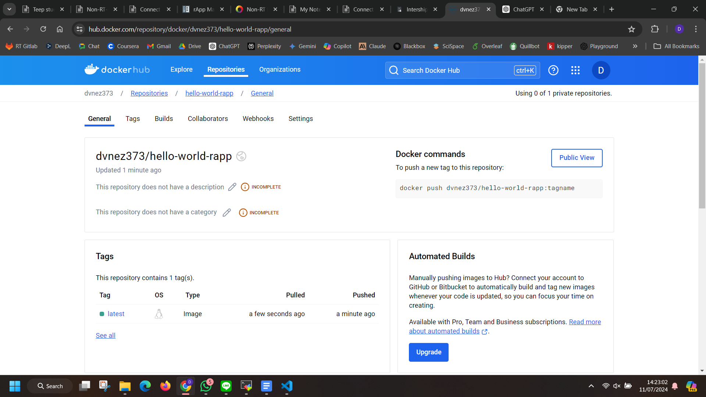
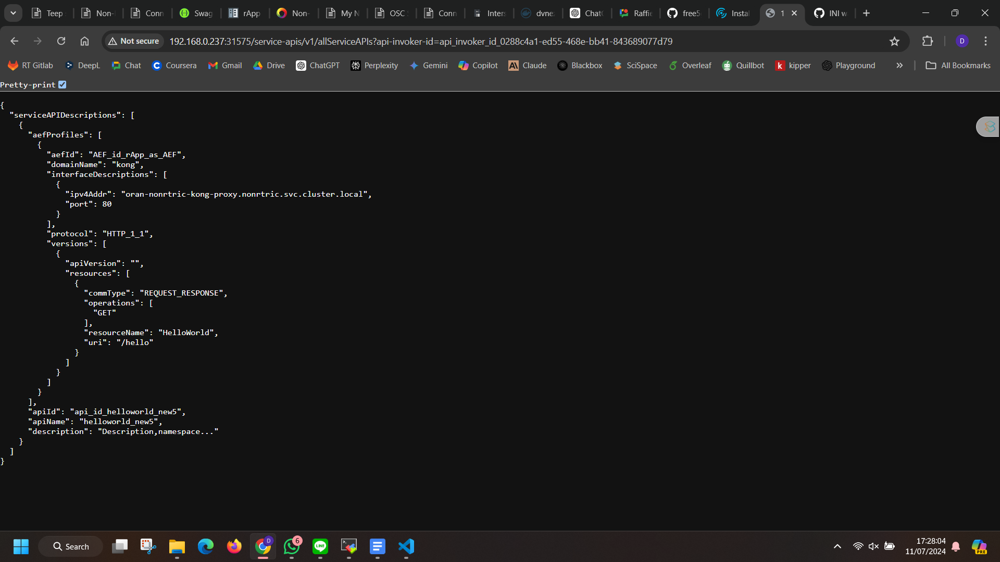
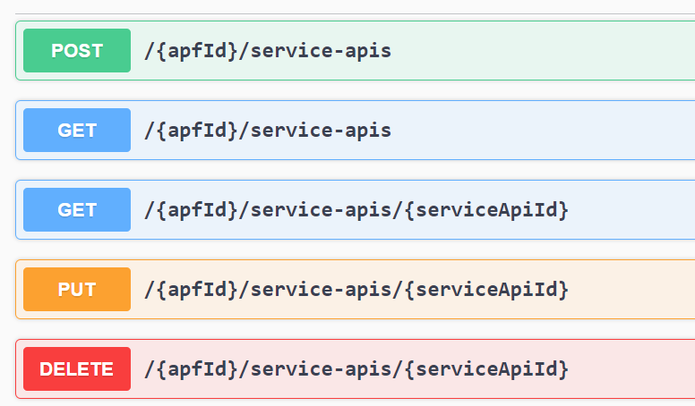
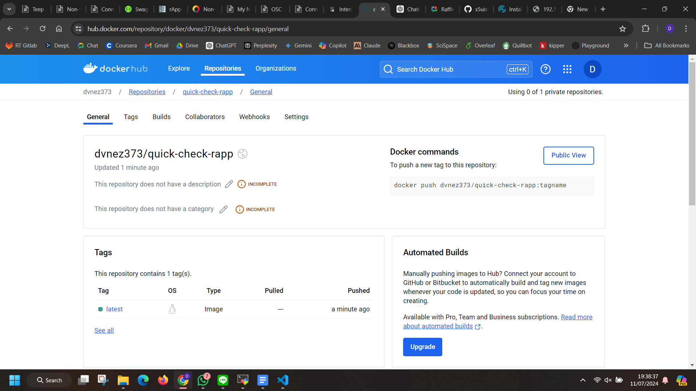
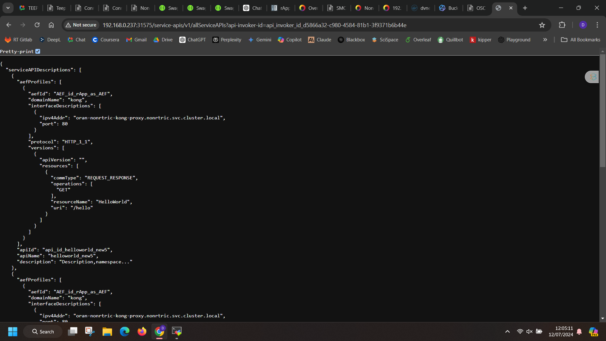

# Connect OSC SMO to rApp - R1

## rApps
### Modify the NonRT RIC Document
change the proxy type : LoadBalancer -> NodePort
```bash
nano ~/dep/smo-install/oran_oom/kong/values.yaml
```
result:
```bash
  # Specify Kong proxy service configuration
  proxy:
    # Enable creating a Kubernetes service for the proxy
    enabled: true
    type: NodePort
    loadBalancerClass:
    nameOverride: ""
    annotations: {}
    labels:
      enable-metrics: "true"
```
If the re-installation is finished, you will see the following:
```bash
oran-nonrtric-kong-proxy                NodePort    10.233.57.230   <none>        80:32080/TCP                    45h
```
full output:
```bash
root@node1:~# kubectl get svc -n nonrtric
NAME                                    TYPE        CLUSTER-IP      EXTERNAL-IP   PORT(S)                         AGE
a1-sim-osc-0                            ClusterIP   10.233.16.212   <none>        8085/TCP,8185/TCP               45h
a1-sim-osc-1                            ClusterIP   10.233.43.164   <none>        8085/TCP,8185/TCP               45h
a1-sim-std-0                            ClusterIP   10.233.5.158    <none>        8085/TCP,8185/TCP               45h
a1-sim-std-1                            ClusterIP   10.233.28.74    <none>        8085/TCP,8185/TCP               45h
a1-sim-std2-0                           ClusterIP   10.233.8.233    <none>        8085/TCP,8185/TCP               45h
a1-sim-std2-1                           ClusterIP   10.233.28.214   <none>        8085/TCP,8185/TCP               45h
capifcore                               ClusterIP   10.233.51.163   <none>        8090/TCP                        45h
controlpanel                            NodePort    10.233.27.99    <none>        8182:30091/TCP,8082:30092/TCP   45h
dmaapadapterservice                     ClusterIP   10.233.36.156   <none>        9087/TCP,9088/TCP               45h
dmaapmediatorservice                    ClusterIP   10.233.6.140    <none>        8085/TCP,8185/TCP               45h
helmmanager                             ClusterIP   10.233.34.241   <none>        8112/TCP                        45h
informationservice                      ClusterIP   10.233.29.13    <none>        9082/TCP,9083/TCP               45h
nonrtricgateway                         NodePort    10.233.60.12    <none>        9090:30093/TCP                  45h
odu-app                                 ClusterIP   10.233.23.184   <none>        80/TCP                          45h
odu-app-ics-version                     ClusterIP   10.233.4.234    <none>        8095/TCP                        45h
oran-nonrtric-kong-admin                NodePort    10.233.42.42    <none>        8001:32081/TCP                  45h
oran-nonrtric-kong-manager              NodePort    10.233.37.240   <none>        8002:31773/TCP,8445:31205/TCP   45h
oran-nonrtric-kong-proxy                NodePort    10.233.57.230   <none>        80:32080/TCP                    45h
oran-nonrtric-kong-validation-webhook   ClusterIP   10.233.19.22    <none>        443/TCP                         45h
oran-nonrtric-postgresql                ClusterIP   10.233.13.138   <none>        5432/TCP                        45h
oran-nonrtric-postgresql-hl             ClusterIP   None            <none>        5432/TCP                        45h
oru-app                                 NodePort    10.233.41.183   <none>        830:30835/TCP                   45h
policymanagementservice                 NodePort    10.233.40.4     <none>        8081:30094/TCP,8433:30095/TCP   45h
rappcatalogueservice                    ClusterIP   10.233.29.159   <none>        9085/TCP,9086/TCP               45h
rappmanager                             ClusterIP   10.233.19.86    <none>        8080/TCP                        45h
servicemanager                          NodePort    10.233.33.160   <none>        8095:31575/TCP                  45h
topology                                NodePort    10.233.15.143   <none>        3001:32001/TCP                  45h
```

### rApp_app
#### Docker Login
```bash
docker login
```
output:
```bash
root@node1:~# docker login
Login with your Docker ID to push and pull images from Docker Hub. If you don't have a Docker ID, head over to https://hub.docker.com to create one.
Username: dvnez373
Password:
WARNING! Your password will be stored unencrypted in /root/snap/docker/2915/.docker/config.json.
Configure a credential helper to remove this warning. See
https://docs.docker.com/engine/reference/commandline/login/#credentials-store

Login Succeeded
```

#### Writing rApp code
This is the HelloWorld rApp example.

Step 1 : Create the `app.py` file
```python
from flask import Flask

app = Flask(__name__)

@app.route('/hello', methods=['GET'])
def hello():
    return "Hello, World!"

if __name__ == '__main__':
    app.run(host='0.0.0.0', port=8080)
```

Step 2 : Create a Docker image
```dockerfile
FROM python:3.9-slim

WORKDIR /app

COPY app.py .

RUN pip install Flask

EXPOSE 8080

CMD ["python", "app.py"]
```

Build and push a Docker image:
```bash
docker build -t dvnez373/hello-world-rapp:latest .
docker push dvnez373/hello-world-rapp:latest
```

```
root@node1:~# docker build -t dvnez373/hello-world-rapp:latest .
[+] Building 129.8s (9/9)                                                                                                                                                                      docker:default
 => [internal] load .dockerignore                                                                                                                                                                        0.6s
 => => transferring context: 2B                                                                                                                                                                          0.3s
 => [internal] load build definition from Dockerfile                                                                                                                                                     0.6s
 => => transferring dockerfile: 149B                                                                                                                                                                     0.3s
 => [internal] load metadata for docker.io/library/python:3.9-slim                                                                                                                                       2.9s
 => [auth] library/python:pull token for registry-1.docker.io                                                                                                                                            0.0s
 => [1/4] FROM docker.io/library/python:3.9-slim@sha256:a6c12ec09f13df9d4b8b4e4d08678c1b212d89885be14b6c72b633bee2a520f4                                                                                 5.3s
 => => resolve docker.io/library/python:3.9-slim@sha256:a6c12ec09f13df9d4b8b4e4d08678c1b212d89885be14b6c72b633bee2a520f4                                                                                 0.0s
 => => sha256:4719115deb9cc7a5479a7d3c57cfceac2be89fcaf0fed8c747e8dfb4b01a79a3 1.94kB / 1.94kB                                                                                                           0.0s
 => => sha256:b97320a8c1caf64deeebb911ff8eb75bf12f671408a85302dd33b5ede2d1cdc1 6.90kB / 6.90kB                                                                                                           0.0s
 => => sha256:f11c1adaa26e078479ccdd45312ea3b88476441b91be0ec898a7e07bfd05badc 29.13MB / 29.13MB                                                                                                         1.4s
 => => sha256:c1f67e58a3d2a9d9c5f38c8c3fc629ff3bfd6e0045b935c99e9ffc4182070fa1 3.51MB / 3.51MB                                                                                                           0.7s
 => => sha256:9370038d11852cad5a70691e76b0ddc8e669018bc770cad15c23a3def629b874 11.89MB / 11.89MB                                                                                                         0.7s
 => => sha256:a6c12ec09f13df9d4b8b4e4d08678c1b212d89885be14b6c72b633bee2a520f4 10.41kB / 10.41kB                                                                                                         0.0s
 => => sha256:174cb52e37e55d01d6ea95cdffa00d252ccd883946a96050ff4be1633a7f1712 231B / 231B                                                                                                               0.9s
 => => sha256:f259657f3656970a8d44c5a7a8250b746967f869516bb767767c6942eaa60e55 2.77MB / 2.77MB                                                                                                           1.0s
 => => extracting sha256:f11c1adaa26e078479ccdd45312ea3b88476441b91be0ec898a7e07bfd05badc                                                                                                                1.9s
 => => extracting sha256:c1f67e58a3d2a9d9c5f38c8c3fc629ff3bfd6e0045b935c99e9ffc4182070fa1                                                                                                                0.1s
 => => extracting sha256:9370038d11852cad5a70691e76b0ddc8e669018bc770cad15c23a3def629b874                                                                                                                0.7s
 => => extracting sha256:174cb52e37e55d01d6ea95cdffa00d252ccd883946a96050ff4be1633a7f1712                                                                                                                0.0s
 => => extracting sha256:f259657f3656970a8d44c5a7a8250b746967f869516bb767767c6942eaa60e55                                                                                                                0.2s
 => [internal] load build context                                                                                                                                                                        0.0s
 => => transferring context: 228B                                                                                                                                                                        0.0s
 => [2/4] WORKDIR /app                                                                                                                                                                                   0.2s
 => [3/4] COPY app.py .                                                                                                                                                                                  0.0s
 => [4/4] RUN pip install Flask  
.
.
.
root@node1:~# docker build -t dvnez373/hello-world-rapp:latest .
docker push dvnez373/hello-world-rapp:latest
[+] Building 1.6s (10/10) FINISHED                                                                                                                                                             docker:default
 => [internal] load .dockerignore                                                                                                                                                                        0.0s
 => => transferring context: 2B                                                                                                                                                                          0.0s
 => [internal] load build definition from Dockerfile                                                                                                                                                     0.0s
 => => transferring dockerfile: 149B                                                                                                                                                                     0.0s
 => [internal] load metadata for docker.io/library/python:3.9-slim                                                                                                                                       1.6s
 => [auth] library/python:pull token for registry-1.docker.io                                                                                                                                            0.0s
 => [1/4] FROM docker.io/library/python:3.9-slim@sha256:a6c12ec09f13df9d4b8b4e4d08678c1b212d89885be14b6c72b633bee2a520f4                                                                                 0.0s
 => [internal] load build context                                                                                                                                                                        0.0s
 => => transferring context: 28B                                                                                                                                                                         0.0s
 => CACHED [2/4] WORKDIR /app                                                                                                                                                                            0.0s
 => CACHED [3/4] COPY app.py .                                                                                                                                                                           0.0s
 => CACHED [4/4] RUN pip install Flask                                                                                                                                                                   0.0s
 => exporting to image                                                                                                                                                                                   0.0s
 => => exporting layers                                                                                                                                                                                  0.0s
 => => writing image sha256:7626c2ad27e194d01015c1529da4b77e8b5cc7f048cd724160260a0f023349c9                                                                                                             0.0s
 => => naming to docker.io/dvnez373/hello-world-rapp:latest                                                                                                                                              0.0s
The push refers to repository [docker.io/dvnez373/hello-world-rapp]
d939c5a81a07: Pushed
66f4bfc48042: Pushed
9a405bc1632d: Pushed
a58d16c447ed: Mounted from library/python
b88d8bda5e53: Mounted from library/python
8cddf1d30fbd: Mounted from library/python
b9fc95825e61: Mounted from library/python
32148f9f6c5a: Mounted from library/python
latest: digest: sha256:bcbf439c95f9e0614b34e74a0b4788e475439f264dbbe6f8f6a0a905d6b94518 size: 1994
```

If the Docker image is pushed, you can see it on the DockerHub website:


Step 3 : Write Kubernetes deployment files

deployment.yaml file:
```yaml
apiVersion: apps/v1
kind: Deployment
metadata:
  name: hello-world-rapp
spec:
  replicas: 1
  selector:
    matchLabels:
      app: hello-world-rapp
  template:
    metadata:
      labels:
        app: hello-world-rapp
    spec:
      containers:
      - name: hello-world-rapp-container
        image: hsukevin121/hello-world-rapp:latest
        ports:
        - containerPort: 8080
---
apiVersion: v1
kind: Service
metadata:
  name: hello-world-rapp-service
spec:
  selector:
    app: hello-world-rapp
  ports:
    - protocol: TCP
      port: 80
      targetPort: 8080
```

Step 4 : Deploy the rApp to Kubernetes
```bash
kubectl apply -f deployment.yaml
```
output:
```bash
root@node1:~# kubectl apply -f deployment.yaml
deployment.apps/hello-world-rapp created
service/hello-world-rapp-service created
```
pods:
```bash
root@node1:~# kubectl get pods -A
NAMESPACE        NAME                                                READY   STATUS      RESTARTS         AGE
default          hello-world-rapp-58f767549d-7dd62                   1/1     Running     0                31s
```

### rApps_R1
After the rApp deployment is complete, we need to expose the rApp API path through the SME API, allowing external personnel to communicate with the rApp via the R1 interface.

The following are the steps required to expose the rApp:
* Provider Management
* Publish Service
* Invoker Management
* Discover Service

Check if the SME service is up:
```bash
servicemanager                          NodePort    10.233.33.160   <none>        8095:31575/TCP                  46h
```

```bash
curl -X GET -v "http://192.168.0.237:31575"
```
output:
```bash
root@node1:~# curl -X GET -v "http://192.168.0.237:31575"
Note: Unnecessary use of -X or --request, GET is already inferred.
*   Trying 192.168.0.237:31575...
* Connected to 192.168.0.237 (192.168.0.237) port 31575 (#0)
> GET / HTTP/1.1
> Host: 192.168.0.237:31575
> User-Agent: curl/7.81.0
> Accept: */*
>
* Mark bundle as not supporting multiuse
< HTTP/1.1 200 OK
< Content-Type: text/plain; charset=UTF-8
< Date: Thu, 11 Jul 2024 06:28:56 GMT
< Content-Length: 13
<
* Connection #0 to host 192.168.0.237 left intact
Hello, World!
```

Step 1 : rApp register
Request URL :
```bash
http://192.168.0.237:31575/api-provider-management/v1/registrations
```
body:
```bash
{
    "apiProvDomId": "domain_id_Kong",
    "apiProvDomInfo": "Kong",
    "apiProvFuncs": [
        {
            "apiProvFuncId": "APF_id_rApp_as_APF",
            "apiProvFuncInfo": "rApp as APF",
            "apiProvFuncRole": "APF",
            "regInfo": {
                "apiProvPubKey": "APF-PublicKey"
            }
        },
        {
            "apiProvFuncId": "AEF_id_rApp_as_AEF",
            "apiProvFuncInfo": "rApp as AEF",
            "apiProvFuncRole": "AEF",
            "regInfo": {
                "apiProvPubKey": "AEF-PublicKey"
            }
        }
    ],
    "regSec": "PSK7"
}
```
https://petstore.swagger.io/?url=https://raw.githubusercontent.com/jdegre/5GC_APIs/master/TS29222_CAPIF_API_Provider_Management_API.yaml#/
curl:
```bash
curl -X 'POST' \
  'http://192.168.0.237:31575/api-provider-management/v1/registrations' \
  -H 'accept: application/json' \
  -H 'Content-Type: application/json' \
  -d '{
    "apiProvDomId": "domain_id_Kong",
    "apiProvDomInfo": "Kong",
    "apiProvFuncs": [
        {
            "apiProvFuncId": "APF_id_rApp_as_APF",
            "apiProvFuncInfo": "rApp as APF",
            "apiProvFuncRole": "APF",
            "regInfo": {
                "apiProvPubKey": "APF-PublicKey"
            }
        },
        {
            "apiProvFuncId": "AEF_id_rApp_as_AEF",
            "apiProvFuncInfo": "rApp as AEF",
            "apiProvFuncRole": "AEF",
            "regInfo": {
                "apiProvPubKey": "AEF-PublicKey"
            }
        }
    ],
    "regSec": "PSK7"
}'
```
output:
```bash
{"apiProvDomId":"domain_id_Kong","apiProvDomInfo":"Kong","apiProvFuncs":[{"apiProvFuncId":"APF_id_rApp_as_APF","apiProvFuncInfo":"rApp as APF","apiProvFuncRole":"APF","regInfo":{"apiProvPubKey":"APF-PublicKey"}},{"apiProvFuncId":"AEF_id_rApp_as_AEF","apiProvFuncInfo":"rApp as AEF","apiProvFuncRole":"AEF","regInfo":{"apiProvPubKey":"AEF-PublicKey"}}],"regSec":"PSK7"}
```

Step 2 : rApp publish
Request URL:

```bash
http://192.168.0.237:31575/published-apis/v1/APF_id_rApp_as_APF/service-apis
```
body:
```bash
{
  "aefProfiles": [
    {
      "aefId": "AEF_id_rApp_as_AEF",
      "interfaceDescriptions": [
        {
          "ipv4Addr": "10.233.8.235",
          "port": 80,
          "securityMethods": ["PKI"]
        }
      ]
    }
  ]
}
```
ipv4Addr : rApp IP
port : rApp port
```bash
{
    "aefProfiles": [
        {
            "aefId": "AEF_id_rApp_as_AEF",
            "interfaceDescriptions": [
                {
                    "ipv4Addr": "10.233.8.235",
                    "port": 80,
                    "securityMethods": ["PKI"]
                }
            ],
            "DomainName": "Kong",
            "protocol": "HTTP_1_1",
            "versions": [
                {
                    "apiVersion": "",
                    "Resources": [
                        {
                            "resourceName": "HelloWorld",
                            "commType": "REQUEST_RESPONSE",
                            "uri": "/hello",
                            "operations": [
                                "GET"
                            ]
                        }
                    ]
                }
            ]
        }
    ],
    "ApiName": "helloworld_new5",
    "Description": "Description,namespace..."
}
```
https://petstore.swagger.io/?url=https://raw.githubusercontent.com/jdegre/5GC_APIs/master/TS29222_CAPIF_Publish_Service_API.yaml
curl:
```bash
curl -X 'POST' \
  'http://192.168.0.237:31575/published-apis/v1/APF_id_rApp_as_APF/service-apis' \
  -H 'accept: application/json' \
  -H 'Content-Type: application/json' \
  -d '{
    "aefProfiles": [
        {
            "aefId": "AEF_id_rApp_as_AEF",
            "interfaceDescriptions": [
                {
                    "ipv4Addr": "10.233.8.235",
                    "port": 80,
                    "securityMethods": ["PKI"]
                }
            ],
            "DomainName": "Kong",
            "protocol": "HTTP_1_1",
            "versions": [
                {
                    "apiVersion": "",
                    "Resources": [
                        {
                            "resourceName": "HelloWorld",
                            "commType": "REQUEST_RESPONSE",
                            "uri": "/hello",
                            "operations": [
                                "GET"
                            ]
                        }
                    ]
                }
            ]
        }
    ],
    "ApiName": "helloworld_new5",
    "Description": "Description,namespace..."
}'
```
result:
```bash
{"aefProfiles":[{"aefId":"AEF_id_rApp_as_AEF","domainName":"kong","interfaceDescriptions":[{"ipv4Addr":"oran-nonrtric-kong-proxy.nonrtric.svc.cluster.local","port":80}],"protocol":"HTTP_1_1","versions":[{"apiVersion":"","resources":[{"commType":"REQUEST_RESPONSE","operations":["GET"],"resourceName":"HelloWorld","uri":"/hello"}]}]}],"apiId":"api_id_helloworld_new5","apiName":"helloworld_new5","description":"Description,namespace..."}
```

Step3 : rApp onboarding
Request URL :
```bash
http://192.168.0.19:31575/api-invoker-management/v1/onboardedInvokers
```
body:
```bash
{
  "ipv4Addr": "10.233.49.53",
  "port": 80,
  "securityMethods": ["PKI"]
}

```
ipv4Addr : Kong Proxy IP
port : Kong Proxy port
```bash
{
    "apiInvokerId": "api_invoker_id_rAppKong_as_invoker_1",
    "apiInvokerCertificate": "apiInvokerCertificate",
    "apiInvokerPublicKey": "{PUBLIC_KEY_INVOKER_2}",
    "onboardingInformation": {
        "apiInvokerPublicKey": "{PUBLIC_KEY_INVOKER_2}"
    },
    "notificationDestination": "http://invoker-app:8086/callback",
    "requestTestNotification": true,
    "apiList": [
        {
            "apiId": "api_id_helloworld",
            "apiName": "helloworld",
            "aefProfiles": [
                {
                    "aefId": "AEF_id_rAppKong_as_AEF",
                    "versions": [
                        {
                            "apiVersion": "",
                            "resources": [
                                {
                                    "resourceName": "HelloWorld",
                                    "commType": "REQUEST_RESPONSE",
                                    "uri": "/hello",
                                    "operations": [
                                        "GET"
                                    ]
                                }
                            ]
                        }
                    ],
                    "protocol": "HTTP_1_1",
                    "securityMethods": ["PKI"],
                    "domainName": "Kong",
                    "interfaceDescriptions": [
                        {
                            "ipv4Addr": "10.233.49.53",
                            "port": 80,
                            "securityMethods": ["PKI"]
                        }
                    ]
                }
            ]
        }
    ]
}
```
https://petstore.swagger.io/?url=https://raw.githubusercontent.com/jdegre/5GC_APIs/master/TS29222_CAPIF_API_Invoker_Management_API.yaml
curl:
```bash
curl -X 'POST' \
  'http://192.168.0.237:31575/api-invoker-management/v1/onboardedInvokers' \
  -H 'accept: application/json' \
  -H 'Content-Type: application/json' \
  -d '{
    "apiInvokerId": "api_invoker_id_rAppKong_as_invoker_1",
    "apiInvokerCertificate": "apiInvokerCertificate",
    "apiInvokerPublicKey": "{PUBLIC_KEY_INVOKER_2}",
    "onboardingInformation": {
        "apiInvokerPublicKey": "{PUBLIC_KEY_INVOKER_2}"
    },
    "notificationDestination": "http://invoker-app:8086/callback",
    "requestTestNotification": true,
    "apiList": [
        {
            "apiId": "api_id_helloworld",
            "apiName": "helloworld",
            "aefProfiles": [
                {
                    "aefId": "AEF_id_rAppKong_as_AEF",
                    "versions": [
                        {
                            "apiVersion": "",
                            "resources": [
                                {
                                    "resourceName": "HelloWorld",
                                    "commType": "REQUEST_RESPONSE",
                                    "uri": "/hello",
                                    "operations": [
                                        "GET"
                                    ]
                                }
                            ]
                        }
                    ],
                    "protocol": "HTTP_1_1",
                    "securityMethods": ["PKI"],
                    "domainName": "Kong",
                    "interfaceDescriptions": [
                        {
                            "ipv4Addr": "10.233.49.53",
                            "port": 80,
                            "securityMethods": ["PKI"]
                        }
                    ]
                }
            ]
        }
    ]
}'
```
result:
```bash
{"apiInvokerId":"api_invoker_id_0288c4a1-ed55-468e-bb41-843689077d79","apiList":[{"aefProfiles":[{"aefId":"AEF_id_rApp_as_AEF","domainName":"kong","interfaceDescriptions":[{"ipv4Addr":"oran-nonrtric-kong-proxy.nonrtric.svc.cluster.local","port":80}],"protocol":"HTTP_1_1","versions":[{"apiVersion":"","resources":[{"commType":"REQUEST_RESPONSE","operations":["GET"],"resourceName":"HelloWorld","uri":"/hello"}]}]}],"apiId":"api_id_helloworld_new5","apiName":"helloworld_new5","description":"Description,namespace..."}],"notificationDestination":"http://invoker-app:8086/callback","onboardingInformation":{"apiInvokerPublicKey":"{PUBLIC_KEY_INVOKER_2}"},"requestTestNotification":true}
```
Check on rApp discovery
```bash
http://192.168.0.237:31575/service-apis/v1/allServiceAPIs?api-invoker-id=<api invoker id>
```
`api_invoker_id_0288c4a1-ed55-468e-bb41-843689077d79`
output:


```bash
{
  "serviceAPIDescriptions": [
    {
      "aefProfiles": [
        {
          "aefId": "AEF_id_rApp_as_AEF",
          "domainName": "kong",
          "interfaceDescriptions": [
            {
              "ipv4Addr": "oran-nonrtric-kong-proxy.nonrtric.svc.cluster.local",
              "port": 80
            }
          ],
          "protocol": "HTTP_1_1",
          "versions": [
            {
              "apiVersion": "",
              "resources": [
                {
                  "commType": "REQUEST_RESPONSE",
                  "operations": [
                    "GET"
                  ],
                  "resourceName": "HelloWorld",
                  "uri": "/hello"
                }
              ]
            }
          ]
        }
      ],
      "apiId": "api_id_helloworld_new5",
      "apiName": "helloworld_new5",
      "description": "Description,namespace..."
    }
  ]
}
```
## rApps Quick Checking and Review
### Related Information
Delete a deployment container
```bash
kubectl delete deployment <Name> -n <Namespace>
```
The following 4 folders are required:
* app.py: rApp related services 
* Dockerfile: push the rApp service to Docker Hub 
* requirements.txt: Install app.py using module 
* deployment.yaml: Deploy to K8s

See InfluxDB Token and Password:
```bash
kubectl get secret -n o1ves o1ves-influxdb2-auth -o json
```
output:
```bash
root@node1:~/dep# kubectl get secret -n o1ves o1ves-influxdb2-auth -o json
{
    "apiVersion": "v1",
    "data": {
        "admin-password": "WUw4N3hRM2VrS2w2RkU5Z1FtbTVzendkZXZDSlI5ZEs=",
        "admin-token": "WDlJZHE4cDlCN0NiRzhZTEE3NjlnalNhU0tvN2V2VkQ="
    },
    "kind": "Secret",
    "metadata": {
        "annotations": {
            "meta.helm.sh/release-name": "o1ves",
            "meta.helm.sh/release-namespace": "o1ves"
        },
        "creationTimestamp": "2024-07-11T11:21:45Z",
        "labels": {
            "app.kubernetes.io/instance": "o1ves",
            "app.kubernetes.io/managed-by": "Helm",
            "app.kubernetes.io/name": "influxdb2",
            "app.kubernetes.io/version": "2.3.0",
            "helm.sh/chart": "influxdb2-2.1.1"
        },
        "name": "o1ves-influxdb2-auth",
        "namespace": "o1ves",
        "resourceVersion": "2353761",
        "uid": "39215f1d-c263-4576-9c7a-0bced2090346"
    },
    "type": "Opaque"
}
```

**rApp Publish Open API**

* serviceApiID : apiID
`"apiId":"api_id_quick_check"`

rApp Onboarding Open API
* onboardingID : apiInvokerID
`"apiInvokerId":"api_invoker_id_d5866a32-c980-4584-81b1-3f9371b6b44e"`

Step 1 app.py
Check if it is possible: 
* Issue commands to BBU (Netconf Server) through Netconf 
* Return BBU data to SMO through VES 
* Send data to InfluxDB for storage through VES Collector

`app.py`:
```python=
from flask import Flask, jsonify
import xml.etree.ElementTree as ET
import json
import requests
from ncclient import manager
import config  # referencing configuration file

app = Flask(__name__)

# Function to execute NETCONF command and parse data
def get_bbu_info():
    try:
        with manager.connect(**config.device_params, hostkey_verify=False) as m:
            print("NETCONF Session Connected Successfully.")
            get_reply = m.get(filter=('subtree', config.filter_str))
            print("NETCONF GET Operation Result:")
            print(get_reply)

            # Parse the XML data
            root = ET.fromstring(str(get_reply))
            namespaces = {
                'base': 'urn:ietf:params:xml:ns:netconf:base:1.0',
                'multiran': 'urn:reign-altran-o1-cm-multiran:1.0'
            }

            # Find all ran-id elements and their corresponding data
            ran_data = {}
            for multiran_cm in root.findall('.//multiran:multiran-cm', namespaces):
                ran_id = multiran_cm.find('multiran:ran-id', namespaces).text
                PLMNID = multiran_cm.find('.//multiran:PLMNID', namespaces).text
                BBU_IP = multiran_cm.find('.//multiran:IP_info/multiran:BBU_IP', namespaces).text
                BBU_NETMASK = multiran_cm.find('.//multiran:IP_info/multiran:BBU_NETMASK', namespaces).text
                BBU_Gateway_IP = multiran_cm.find('.//multiran:IP_info/multiran:BBU_Gateway_IP', namespaces).text
                AMF_IP = multiran_cm.find('.//multiran:IP_info/multiran:AMF_IP', namespaces).text
                gNB_ID = multiran_cm.find('.//multiran:NCI/multiran:gNB_ID', namespaces).text

                ran_data[ran_id] = {
                    "PLMNID": PLMNID,
                    "BBU_IP": BBU_IP,
                    "BBU_NETMASK": BBU_NETMASK,
                    "BBU_Gateway_IP": BBU_Gateway_IP,
                    "AMF_IP": AMF_IP,
                    "gNB_ID": gNB_ID
                }

            return ran_data
    except Exception as e:
        print(f"Failed to retrieve BBU Info: {e}")
        return None

# Function to send data to VES Collector
def send_to_ves_collector(ran_id, ran_info):
    payload = {
        "event": {
            "commonEventHeader": {
                "domain": "other",
                "eventId": "node1.cluster.local_2024-04-19T08:51:36.801439+00:00Z",
                "eventName": "heartbeat_O_RAN_COMPONENT",
                "eventType": "O_RAN_COMPONENT",
                "lastEpochMicrosec": 1713516696801439,
                "nfNamingCode": "SDN-Controller",
                "nfVendorName": "O-RAN-SC OAM",
                "priority": "Low",
                "reportingEntityId": "",
                "reportingEntityName": "node1.cluster.local",
                "sequence": 357,
                "sourceId": "",
                "sourceName": "node1.cluster.local",
                "startEpochMicrosec": 1713516696801439,
                "timeZoneOffset": "+00:00",
                "version": "4.1",
                "vesEventListenerVersion": "7.2.1"
            },
            "otherFields": {
                "otherFieldsVersion": "3.0",
                "arrayOfNamedHashMap": [
                    {
                        "name": ran_id,
                        "hashMap": ran_info
                    }
                ]
            }
        }
    }

    payload_json = json.dumps(payload, indent=2)
    headers = {"Content-Type": "application/json"}

    try:
        print(f"Sending data to VES Collector: {payload_json}")
        response = requests.post(config.VES_COLLECTOR_URL, headers=headers, data=payload_json, auth=(config.VES_COLLECTOR_USERNAME, config.VES_COLLECTOR_PASSWORD), verify=False)
        print(f"VES Collector Response status code: {response.status_code}")
        print(f"VES Collector Response text: {response.text}")
        return response.status_code == 202
    except Exception as e:
        print(f"Failed to send data to VES Collector: {e}")
        return False

# Function to check if data exists in InfluxDB 2.0
def check_influxdb(ran_id):
    query = f'from(bucket: "{config.INFLUXDB_BUCKET}") |> range(start: -1h) |> filter(fn: (r) => r._measurement == "BBU_Info" and r.name == "{ran_id}")'
    headers = {
        "Authorization": f"Token {config.INFLUXDB_TOKEN}",
        "Content-Type": "application/vnd.flux"
    }
    url = f"{config.INFLUXDB_URL}/api/v2/query"
    params = {
        "org": config.INFLUXDB_ORG
    }

    try:
        print(f"Sending query to InfluxDB: {query}")
        response = requests.post(url, headers=headers, params=params, data=query)
        print(f"Response status code: {response.status_code}")
        print(f"Response text: {response.text}")

        if response.status_code == 200:
            if response.text.strip() == "":
                print("InfluxDB query response is empty")
                return False
            else:
                print(f"InfluxDB query response: {response.text}")
                return True
        return False
    except Exception as e:
        print(f"Failed to query InfluxDB: {e}")
        return False

@app.route('/quick_check', methods=['GET'])
def quick_check():
    ran_data = get_bbu_info()
    if not ran_data:
        return jsonify({"status": "error", "message": "Failed to retrieve BBU Info from NETCONF"}), 401

    for ran_id, ran_info in ran_data.items():
        if not send_to_ves_collector(ran_id, ran_info):
            return jsonify({"status": "error", "message": f"Failed to send data to VES Collector for {ran_id}"}), 402

        if not check_influxdb(ran_id):
            return jsonify({"status": "error", "message": f"Data not found in InfluxDB for {ran_id}"}), 403

    return jsonify({"status": "success", "message": "Quick check passed, all data correctly stored in InfluxDB"}), 200

if __name__ == '__main__':
    app.run(debug=True, host='0.0.0.0', port=8080)
```

`config.py`:
```python=
# config.py

# InfluxDB Configuration Information
INFLUXDB_TOKEN = "WDlJZHE4cDlCN0NiRzhZTEE3NjlnalNhU0tvN2V2VkQ="
INFLUXDB_ORG = "influxdata"
INFLUXDB_BUCKET = "BBU_Info"
INFLUXDB_URL = "http://192.168.0.237:30001"

# VES Collector URL
VES_COLLECTOR_URL = "http://192.168.0.237:30417/eventListener/v7"
VES_COLLECTOR_USERNAME = "sample1"
VES_COLLECTOR_PASSWORD = "sample1"

# Define device connection parameters
device_params = {
    "host": "192.168.135.102",
    "port": 830,
    "username": "netconf",
    "password": "Greigns-2022"
}

# NETCONF filter for retrieving configuration data
filter_str = """<multiran-cm xmlns="urn:reign-altran-o1-cm-multiran:1.0"/>"""
```

Step2 Dockerfile & requirements.txt
`Dockerfile`:
```dockerfile=
# Use the official Python base image
FROM python:3.10-slim

# Set the working directory
WORKDIR /app

# Copy the dependency file and install
COPY requirements.txt .

# Install the required dependencies for the project
RUN pip install --no-cache-dir -r requirements.txt

# Copy project files to the working directory
COPY . .

# Expose the application port
EXPOSE 8080

# Set environment variables
ENV FLASK_APP=app.py
ENV FLASK_RUN_HOST=0.0.0.0
ENV FLASK_RUN_PORT=8080

# Run the application
CMD ["flask", "run"]
```

`requirements.txt`:
```txt=
Flask
requests
ncclient
```

Upload to Docker Hub:
```bash
docker build -t dvnez373/quick-check-rapp:latest .
docker push dvnez373/quick-check-rapp:latest
```
output:
```bash
root@node1:~/dep# docker build -t dvnez373/quick-check-rapp:latest .
[+] Building 50.0s (11/11) FINISHED                                                                                                                                                            docker:default
 => [internal] load build definition from Dockerfile                                                                                                                                                     0.2s
 => => transferring dockerfile: 552B                                                                                                                                                                     0.0s
 => [internal] load .dockerignore                                                                                                                                                                        0.2s
 => => transferring context: 2B                                                                                                                                                                          0.0s
 => [internal] load metadata for docker.io/library/python:3.10-slim                                                                                                                                      2.7s
 => [auth] library/python:pull token for registry-1.docker.io                                                                                                                                            0.0s
 => [internal] load build context                                                                                                                                                                        9.4s
 => => transferring context: 411.39MB                                                                                                                                                                    9.2s
 => [1/5] FROM docker.io/library/python:3.10-slim@sha256:3be54aca807a43b5a1fa2133b1cbb4b58a018d6ebb1588cf1050b7cbebf15d55                                                                                2.2s
 => => resolve docker.io/library/python:3.10-slim@sha256:3be54aca807a43b5a1fa2133b1cbb4b58a018d6ebb1588cf1050b7cbebf15d55                                                                                0.1s
 => => sha256:455661270fd3aeac7e92f2eabcb2b9fd03c0f97dcc26aef6889555cb9ebc23a4 12.38MB / 12.38MB                                                                                                         0.6s
 => => sha256:8c0cd2ed72c6f636fe88f580adf3f0c5f5efd9254dc3feece396ac26fe3b8eaf 231B / 231B                                                                                                               0.5s
 => => sha256:3be54aca807a43b5a1fa2133b1cbb4b58a018d6ebb1588cf1050b7cbebf15d55 9.13kB / 9.13kB                                                                                                           0.0s
 => => sha256:8244f266195f442379acd0e7d8918b1ef3967050ebf49c40291e89d0a1ba8f94 1.94kB / 1.94kB                                                                                                           0.0s
 => => sha256:de7ad0443e19e374770dc29d7c7677a2f9e2162918003747266fd3b4f983cd85 6.92kB / 6.92kB                                                                                                           0.0s
 => => sha256:e9e504b3ee6224b21b006ddf334064b7764c2aadcc9d8be012cf44640f045483 3.51MB / 3.51MB                                                                                                           0.4s
 => => extracting sha256:e9e504b3ee6224b21b006ddf334064b7764c2aadcc9d8be012cf44640f045483                                                                                                                0.2s
 => => sha256:3d2f440aae987a194992068ec8c982c0295ac62537989c70aeccce6fa1548fd6 3.16MB / 3.16MB                                                                                                           0.8s
 => => extracting sha256:455661270fd3aeac7e92f2eabcb2b9fd03c0f97dcc26aef6889555cb9ebc23a4                                                                                                                0.7s
 => => extracting sha256:8c0cd2ed72c6f636fe88f580adf3f0c5f5efd9254dc3feece396ac26fe3b8eaf                                                                                                                0.0s
 => => extracting sha256:3d2f440aae987a194992068ec8c982c0295ac62537989c70aeccce6fa1548fd6                                                                                                                0.4s
 => [2/5] WORKDIR /app                                                                                                                                                                                   1.2s
 => [3/5] COPY requirements.txt .                                                                                                                                                                        0.3s
 => [4/5] RUN pip install --no-cache-dir -r requirements.txt                                                                                                                                            17.1s
 => [5/5] COPY . .                                                                                                                                                                                      14.1s
 => exporting to image                                                                                                                                                                                   5.7s
 => => exporting layers                                                                                                                                                                                  5.7s
 => => writing image sha256:11779475e911a9d12263fd742f43304f074c14212976680dbd05795433d51ff6                                                                                                             0.0s
 => => naming to docker.io/dvnez373/quick-check-rapp:latest                                                                                                                                              0.0s


root@node1:~/dep# docker push dvnez373/quick-check-rapp:latest
The push refers to repository [docker.io/dvnez373/quick-check-rapp]
d63990854ba7: Pushed
ff79e9f15037: Pushed
4fe56668ee43: Pushed
987723b11b04: Pushed
c3f9a6a5748b: Mounted from library/python
bb75f9b0e544: Mounted from library/python
b0fd3128dcdb: Mounted from library/python
1fe609a255a3: Mounted from library/python
32148f9f6c5a: Mounted from dvnez373/hello-world-rapp
latest: digest: sha256:86618708e65a6f2889016c94b1e01919e8e1fb710d75f86d8a7526c3e0f8dfe9 size: 2208
```
output:



Step 3 `deployment.yaml`
```yaml
apiVersion: apps/v1
kind: Deployment
metadata:
  name: quick-check-rapp
spec:
  replicas: 1
  selector:
    matchLabels:
      app: quick-check-rapp
  template:
    metadata:
      labels:
        app: quick-check-rapp
    spec:
      containers:
      - name: quick-check-rapp-container
        image: dvnez373/quick-check-rapp:latest
        ports:
        - containerPort: 8080
---
apiVersion: v1
kind: Service
metadata:
  name: quick-check-rapp-service
spec:
  selector:
    app: quick-check-rapp
  ports:
    - protocol: TCP
      port: 80
      targetPort: 8080
```

rApp Deployment:
```bash
kubectl apply -f deployment.yaml
```
result:
```bash
root@node1:~/dep# kubectl get pods -A
NAMESPACE        NAME                                                READY   STATUS      RESTARTS         AGE
default          hello-world-rapp-58f767549d-7dd62                   1/1     Running     0                5h14m
default          quick-check-rapp-587ff577c7-hptg8                   1/1     Running     0                20s
```

Step 4 Register
```bash
curl -X 'POST' \
  'http://192.168.0.237:31575/api-provider-management/v1/registrations' \
  -H 'accept: application/json' \
  -H 'Content-Type: application/json' \
  -d '{
    "apiProvDomId": "domain_id_Kong",
    "apiProvDomInfo": "Kong",
    "apiProvFuncs": [
        {
            "apiProvFuncId": "APF_id_rApp_as_APF",
            "apiProvFuncInfo": "rApp as APF",
            "apiProvFuncRole": "APF",
            "regInfo": {
                "apiProvPubKey": "APF-PublicKey"
            }
        },
        {
            "apiProvFuncId": "AEF_id_rApp_as_AEF",
            "apiProvFuncInfo": "rApp as AEF",
            "apiProvFuncRole": "AEF",
            "regInfo": {
                "apiProvPubKey": "AEF-PublicKey"
            }
        }
    ],
    "regSec": "PSK1"
}'
```
output:
```bash
{"apiProvDomId":"domain_id_Kong","apiProvDomInfo":"Kong","apiProvFuncs":[{"apiProvFuncId":"APF_id_rApp_as_APF","apiProvFuncInfo":"rApp as APF","apiProvFuncRole":"APF","regInfo":{"apiProvPubKey":"APF-PublicKey"}},{"apiProvFuncId":"AEF_id_rApp_as_AEF","apiProvFuncInfo":"rApp as AEF","apiProvFuncRole":"AEF","regInfo":{"apiProvPubKey":"AEF-PublicKey"}}],"regSec":"PSK1"}
```

output with `PSK2`:
```bash
root@node1:~/dep# curl -X 'POST'   'http://192.168.0.237:31575/api-provider-management/v1/registrations'   -H 'accept: application/json'   -H 'Content-Type: application/json'   -d '{
    "apiProvDomId": "domain_id_Kong",
    "apiProvDomInfo": "Kong",
    "apiProvFuncs": [
        {
            "apiProvFuncId": "APF_id_rApp_as_APF",
            "apiProvFuncInfo": "rApp as APF",
            "apiProvFuncRole": "APF",
            "regInfo": {
                "apiProvPubKey": "APF-PublicKey"
            }
        },
        {
            "apiProvFuncId": "AEF_id_rApp_as_AEF",
            "apiProvFuncInfo": "rApp as AEF",
            "apiProvFuncRole": "AEF",
            "regInfo": {
                "apiProvPubKey": "AEF-PublicKey"
            }
        }
    ],
    "regSec": "PSK2"
}'
{"apiProvDomId":"domain_id_Kong","apiProvDomInfo":"Kong","apiProvFuncs":[{"apiProvFuncId":"APF_id_rApp_as_APF","apiProvFuncInfo":"rApp as APF","apiProvFuncRole":"APF","regInfo":{"apiProvPubKey":"APF-PublicKey"}},{"apiProvFuncId":"AEF_id_rApp_as_AEF","apiProvFuncInfo":"rApp as AEF","apiProvFuncRole":"AEF","regInfo":{"apiProvPubKey":"AEF-PublicKey"}}],"regSec":"PSK2"}
```

Step 5 Publish
```bash
curl -X 'POST' \
  'http://192.168.0.237:31575/published-apis/v1/APF_id_rApp_as_APF/service-apis' \
  -H 'accept: application/json' \
  -H 'Content-Type: application/json' \
  -d '{
    "aefProfiles": [
        {
            "aefId": "AEF_id_rApp_as_AEF",
            "interfaceDescriptions": [
                {
                    "ipv4Addr": "10.233.49.110",
                    "port": 80,
                    "securityMethods": ["PKI"]
                }
            ],
            "DomainName": "Kong",
            "protocol": "HTTP_1_1",
            "versions": [
                {
                    "apiVersion": "",
                    "Resources": [
                        {
                            "resourceName": "QuickCheck",
                            "commType": "REQUEST_RESPONSE",
                            "uri": "/quick_check",
                            "operations": [
                                "GET"
                            ]
                        }
                    ]
                }
            ]
        }
    ],
    "ApiName": "quick_check",
    "Description": "Check O1 interface status"
}'
```
output:
```bash
{"aefProfiles":[{"aefId":"AEF_id_rApp_as_AEF","domainName":"kong","interfaceDescriptions":[{"ipv4Addr":"oran-nonrtric-kong-proxy.nonrtric.svc.cluster.local","port":80}],"protocol":"HTTP_1_1","versions":[{"apiVersion":"","resources":[{"commType":"REQUEST_RESPONSE","operations":["GET"],"resourceName":"QuickCheck","uri":"/quick_check"}]}]}],"apiId":"api_id_qucik_check","apiName":"qucik_check","description":"Check O1 interface status"}
```

output from register with regSec `PSK2`:
```bash
root@node1:~/dep# curl -X 'POST' \
  'http://192.168.0.237:31575/published-apis/v1/APF_id_rApp_as_APF/service-apis' \
  -H 'accept: application/json' \
  -H 'Content-Type: application/json' \
  -d '{
    "aefProfiles": [
        {
            "aefId": "AEF_id_rApp_as_AEF",
            "interfaceDescriptions": [
                {
                    "ipv4Addr": "10.233.49.110",
                    "port": 80,
                    "securityMethods": ["PKI"]
                }
            ],
            "DomainName": "Kong",
            "protocol": "HTTP_1_1",
            "versions": [
                {
                    "apiVersion": "",
                    "Resources": [
                        {
                            "resourceName": "QuickCheck",
                            "commType": "REQUEST_RESPONSE",
                            "uri": "/quick_check",
                            "operations": [
                                "GET"
                            ]
                        }
                    ]
                }
            ]
        }
    ],
    "ApiName": "quick_check",
    "Description": "Check O1 interface status"
}'
{"aefProfiles":[{"aefId":"AEF_id_rApp_as_AEF","domainName":"kong","interfaceDescriptions":[{"ipv4Addr":"oran-nonrtric-kong-proxy.nonrtric.svc.cluster.local","port":80}],"protocol":"HTTP_1_1","versions":[{"apiVersion":"","resources":[{"commType":"REQUEST_RESPONSE","operations":["GET"],"resourceName":"QuickCheck","uri":"/quick_check"}]}]}],"apiId":"api_id_quick_check","apiName":"quick_check","description":"Check O1 interface status"}
```

Step 6 Onboarding
```bash
curl -X 'POST' \
  'http://192.168.0.237:31575/api-invoker-management/v1/onboardedInvokers' \
  -H 'accept: application/json' \
  -H 'Content-Type: application/json' \
  -d '{
    "apiInvokerId": "api_invoker_id_rAppKong_as_invoker_1",
    "apiInvokerCertificate": "apiInvokerCertificate",
    "apiInvokerPublicKey": "{PUBLIC_KEY_INVOKER_1}",
    "onboardingInformation": {
        "apiInvokerPublicKey": "{PUBLIC_KEY_INVOKER_1}"
    },
    "notificationDestination": "http://invoker-app:8086/callback",
    "requestTestNotification": true,
    "apiList": [
        {
            "apiId": "api_id_quick_check",
            "apiName": "quick_check",
            "aefProfiles": [
                {
                    "aefId": "AEF_id_rAppKong_as_AEF",
                    "versions": [
                        {
                            "apiVersion": "",
                            "resources": [
                                {
                                    "resourceName": "QuickCheck",
                                    "commType": "REQUEST_RESPONSE",
                                    "uri": "/quick_check",
                                    "operations": [
                                        "GET"
                                    ]
                                }
                            ]
                        }
                    ],
                    "protocol": "HTTP_1_1",
                    "securityMethods": ["PKI"],
                    "domainName": "Kong",
                    "interfaceDescriptions": [
                        {
                            "ipv4Addr": "10.233.55.75",
                            "port": 80,
                            "securityMethods": ["PKI"]
                        }
                    ]
                }
            ]
        }
    ]
}'
```
output:
```bash
root@node1:~/dep# curl -X 'POST' \
  'http://192.168.0.237:31575/api-invoker-management/v1/onboardedInvokers' \
  -H 'accept: application/json' \
  -H 'Content-Type: application/json' \
  -d '{
    "apiInvokerId": "api_invoker_id_rAppKong_as_invoker_1",
    "apiInvokerCertificate": "apiInvokerCertificate",
    "apiInvokerPublicKey": "{PUBLIC_KEY_INVOKER_1}",
    "onboardingInformation": {
        "apiInvokerPublicKey": "{PUBLIC_KEY_INVOKER_1}"
    },
    "notificationDestination": "http://invoker-app:8086/callback",
    "requestTestNotification": true,
    "apiList": [
        {
            "apiId": "api_id_quick_check",
            "apiName": "quick_check",
            "aefProfiles": [
                {
                    "aefId": "AEF_id_rAppKong_as_AEF",
                    "versions": [
                        {
                            "apiVersion": "",
                            "resources": [
                                {
                                    "resourceName": "QuickCheck",
                                    "commType": "REQUEST_RESPONSE",
                                    "uri": "/quick_check",
                                    "operations": [
                                        "GET"
                                    ]
                                }
                            ]
                        }
                    ],
                    "protocol": "HTTP_1_1",
                    "securityMethods": ["PKI"],
                    "domainName": "Kong",
                    "interfaceDescriptions": [
                        {
                            "ipv4Addr": "10.233.55.75",
                            "port": 80,
                            "securityMethods": ["PKI"]
                        }
                    ]
                }
            ]
        }
    ]
}'
{"apiInvokerId":"api_invoker_id_d5866a32-c980-4584-81b1-3f9371b6b44e","apiList":[{"aefProfiles":[{"aefId":"AEF_id_rApp_as_AEF","domainName":"kong","interfaceDescriptions":[{"ipv4Addr":"oran-nonrtric-kong-proxy.nonrtric.svc.cluster.local","port":80}],"protocol":"HTTP_1_1","versions":[{"apiVersion":"","resources":[{"commType":"REQUEST_RESPONSE","operations":["GET"],"resourceName":"HelloWorld","uri":"/hello"}]}]}],"apiId":"api_id_helloworld_new5","apiName":"helloworld_new5","description":"Description,namespace..."},{"aefProfiles":[{"aefId":"AEF_id_rApp_as_AEF","domainName":"kong","interfaceDescriptions":[{"ipv4Addr":"oran-nonrtric-kong-proxy.nonrtric.svc.cluster.local","port":80}],"protocol":"HTTP_1_1","versions":[{"apiVersion":"","resources":[{"commType":"REQUEST_RESPONSE","operations":["GET"],"resourceName":"QuickCheck","uri":"/quick_check"}]}]}],"apiId":"api_id_qucik_check","apiName":"qucik_check","description":"Check O1 interface status"},{"aefProfiles":[{"aefId":"AEF_id_rApp_as_AEF","domainName":"kong","interfaceDescriptions":[{"ipv4Addr":"oran-nonrtric-kong-proxy.nonrtric.svc.cluster.local","port":80}],"protocol":"HTTP_1_1","versions":[{"apiVersion":"","resources":[{"commType":"REQUEST_RESPONSE","operations":["GET"],"resourceName":"QuickCheck","uri":"/quick_check"}]}]}],"apiId":"api_id_quick_check","apiName":"quick_check","description":"Check O1 interface status"}],"notificationDestination":"http://invoker-app:8086/callback","onboardingInformation":{"apiInvokerPublicKey":"{PUBLIC_KEY_INVOKER_1}"},"requestTestNotification":true}
```

apiInvokerID
```bash
"apiInvokerId":"api_invoker_id_d5866a32-c980-4584-81b1-3f9371b6b44e"
```

results:

```jsonld
{
  "serviceAPIDescriptions": [
    {
      "aefProfiles": [
        {
          "aefId": "AEF_id_rApp_as_AEF",
          "domainName": "kong",
          "interfaceDescriptions": [
            {
              "ipv4Addr": "oran-nonrtric-kong-proxy.nonrtric.svc.cluster.local",
              "port": 80
            }
          ],
          "protocol": "HTTP_1_1",
          "versions": [
            {
              "apiVersion": "",
              "resources": [
                {
                  "commType": "REQUEST_RESPONSE",
                  "operations": [
                    "GET"
                  ],
                  "resourceName": "HelloWorld",
                  "uri": "/hello"
                }
              ]
            }
          ]
        }
      ],
      "apiId": "api_id_helloworld_new5",
      "apiName": "helloworld_new5",
      "description": "Description,namespace..."
    },
    {
      "aefProfiles": [
        {
          "aefId": "AEF_id_rApp_as_AEF",
          "domainName": "kong",
          "interfaceDescriptions": [
            {
              "ipv4Addr": "oran-nonrtric-kong-proxy.nonrtric.svc.cluster.local",
              "port": 80
            }
          ],
          "protocol": "HTTP_1_1",
          "versions": [
            {
              "apiVersion": "",
              "resources": [
                {
                  "commType": "REQUEST_RESPONSE",
                  "operations": [
                    "GET"
                  ],
                  "resourceName": "QuickCheck",
                  "uri": "/quick_check"
                }
              ]
            }
          ]
        }
      ],
      "apiId": "api_id_qucik_check",
      "apiName": "qucik_check",
      "description": "Check O1 interface status"
    },
    {
      "aefProfiles": [
        {
          "aefId": "AEF_id_rApp_as_AEF",
          "domainName": "kong",
          "interfaceDescriptions": [
            {
              "ipv4Addr": "oran-nonrtric-kong-proxy.nonrtric.svc.cluster.local",
              "port": 80
            }
          ],
          "protocol": "HTTP_1_1",
          "versions": [
            {
              "apiVersion": "",
              "resources": [
                {
                  "commType": "REQUEST_RESPONSE",
                  "operations": [
                    "GET"
                  ],
                  "resourceName": "QuickCheck",
                  "uri": "/quick_check"
                }
              ]
            }
          ]
        }
      ],
      "apiId": "api_id_quick_check",
      "apiName": "quick_check",
      "description": "Check O1 interface status"
    }
  ]
}
```

## Results
rApp quick test results:

Display from Dmaap Log:

## RIC policy openapi
I have tried the following Open APIs, and I still need to know whether the Policy can control the RAN.
```bash
curl -X PUT -v -H "Content-Type: application/json" --data-binary @create1.json "http://192.168.0.61:32080/a1mediator/A1-P/v2/policytypes/20008"
curl -X PUT -v "http://10.233.23.58:8085/a1-p/policytypes/1234" -H "accept: application/json" \
 -H "Content-Type: application/json" --data-binary @create.json

curl -v -X PUT -H "Content-Type: application/json" -d '{"threshold": 5}' "http://192.168.0.61:32080/a1mediator/A1-P/v2/policytypes/20008/policies/tsapolicy145"

curl -v -X GET "http://192.168.0.61:32080/a1mediator/A1-P/v2/healthcheck"

curl -X GET "http://192.168.0.61:32080/a1mediator/A1-P/v2/policytypes/"

curl -s -X GET "http://192.168.0.61:32080/a1mediator/A1-P/v2/policytypes/20008" | jq .

curl -s -X GET -v "http://192.168.0.61:32080/a1mediator/A1-P/v2/policytypes/20008/policies/" | jq .

curl -s -X GET "http://192.168.0.61:32080/a1mediator/A1-P/v2/policytypes/20008/policies/tsapolicy145" | jq .

curl -X PUT -v "http://192.168.0.61:32080/a1mediator/A1-P/v2/policytypes/21003/" -H "Content-Type: application/json" -d @policy_schema_ratecontrol.json

curl -X PUT -v "http://192.168.0.61:32080/a1mediator/A1-P/v2/policytypes/21003/policies/1234" -H "Content-Type: application/json" -d @policy_instance_ratecontrol.json

curl -s -X GET "http://192.168.0.61:32080/a1mediator/A1-P/v2/policytypes/21003/policies/1234/status" | jq .

curl -X POST "http://192.168.0.61:32080/a1mediator/data-delivery" -H "Content-Type: application/json" -d @a1eidata.json

curl -X DELETE -v "http://192.168.0.61:32080/a1mediator/A1-P/v2/policytypes/20008"

curl -s -X -v DELETE "http://192.168.0.61:32080/a1mediator/A1-P/v2/policytypes/20008/policies/1234"

curl -s -X DELETE -v "http://192.168.0.61:32080/a1mediator/A1-P/v2/policytypes/20008" -H "Content-Type: application/json" \ -H "Accept: application/json"


curl -X DELETE -v "http://192.168.0.61:32080/a1mediator/A1-P/v2/policytypes/21003/policies/1234" \
     -H "Content-Type: application/json" \
     -H "Accept: application/json"
```